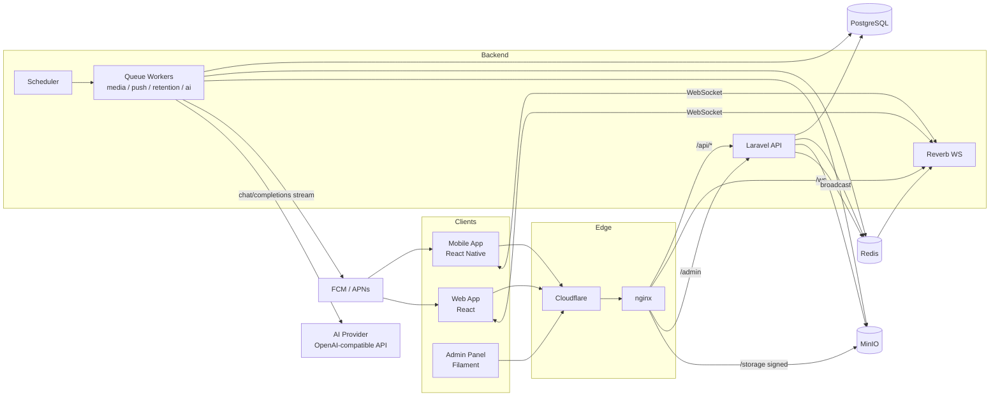
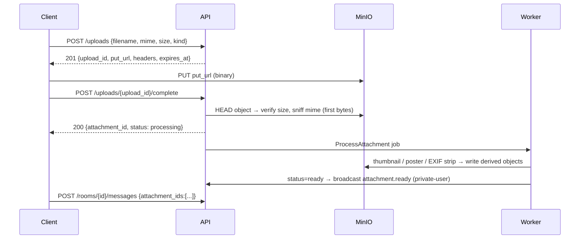
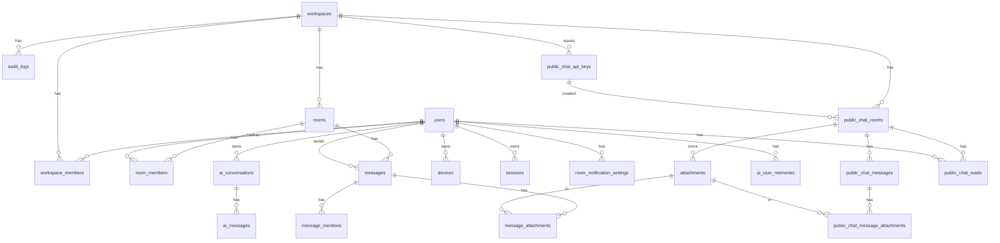

# PRODUCT_SPEC.md — Internal Workspace Chat (codename: `orgchat`)

| Field | Value |
|---|---|
| Version | 1.1.0-draft |
| Status | Draft → รอ PO approve |
| Date | 2026-09-06 |
| Owner | Tony (Tech Lead) |
| Audience | PO, Platform/Backend, Web, Mobile, DevOps, QA, AI coding agents |
| Source of truth | ไฟล์นี้ + `openapi.yaml` (สร้างจาก Section 8) |

## สารบัญ
0. วิธีใช้เอกสารนี้ (Human + AI) · 1. Problem/Goals/Non-Goals · 2. Personas & User Stories · 3. Architecture · 4. Data Model · 5. Functional Requirements (AUTH, WS, ROOM, PROF, MSG, MEDIA, READ, RT, NOTI, SRCH, ADM, OFF, I18N, **AI**) · 6. Permission Matrix · 7. API Conventions · 8. API Endpoints · 9. Realtime Events · 10. Push Payloads · 11. NFR · 12. Testing Strategy & Test Catalog · 13. Work Breakdown per Platform · 14. Phases & DoD · 15. Decision Log · 16. Changelog · 17. Open Questions & Risks · Appendix A Env · B AI Workflow · C Parking Lot

---

## 0. วิธีใช้เอกสารนี้ (Human + AI)

เอกสารนี้ออกแบบให้ **คนและ AI agent อ่านแล้วทำงานต่อกันได้** โดยไม่ต้องถามซ้ำ กติกา:

1. **ทุก requirement มี ID** และ ID นั้นต้องปรากฏใน code (commit message, PR title, test name) เพื่อ trace ได้
   - `FR-<MODULE>-<nnn>` = Functional Requirement (เช่น `FR-MSG-003`)
   - `NFR-<nnn>` = Non-functional Requirement
   - `API-<nnn>` = REST endpoint
   - `EVT-<nnn>` = Realtime event
   - `TC-<MODULE>-<nnn>` = Test case (map กลับไป FR)
   - `TASK-<PLATFORM>-<nnn>` = งานใน work breakdown (BE/WEB/MOB/ADM/INF/QA)
   - `DEC-<nnn>` = Decision record (Section 15)
   - `OQ-<nnn>` = Open question
2. **Priority**: `P0` = ไม่มีไม่ปล่อย, `P1` = fast-follow หลัง MVP, `P2` = ออกแบบเผื่อไว้ ยังไม่ทำ
3. **Phase**: `PH1` MVP (web + text), `PH2` media + edit/delete + push, `PH3` mobile, `PH4` search/quality-of-life
4. **Acceptance Criteria (AC)** เขียนแบบ Given/When/Then หรือ checklist — ทุกข้อต้องมี test อย่างน้อย 1 ตัว
5. **เมื่อ AI agent ได้รับงาน `TASK-BE-012`** ให้ทำตามลำดับ: อ่าน FR ที่อ้างถึง → อ่าน API/EVT ที่เกี่ยว → implement → เขียน TC ที่ระบุใน Section 12 → อัปเดต Section 16 (Changelog) → ถ้าต้องตัดสินใจนอกเหนือ spec ให้เพิ่ม `DEC-xxx` ห้ามเดาเงียบ ๆ
6. **ห้ามแก้พฤติกรรมที่ spec ระบุ** โดยไม่เพิ่ม DEC + แจ้ง PO; ถ้าพบ spec ขัดแย้งกันเอง ให้ยึด Section ที่เลขน้อยกว่า และเปิด OQ
7. คำที่ต้องใช้ให้ตรง: **workspace** (ไม่ใช่ team/org), **room** (ไม่ใช่ channel), **member**, **attachment**, **AI conversation** (บทสนทนากับ AI — คนละอย่างกับ room), **memory** (ข้อเท็จจริงที่ AI จำเกี่ยวกับผู้ใช้)
8. เอกสารนี้ใช้ร่วมกับ `PRODUCT_SPEC_RULES.md` (ไฟล์ rules ที่ Tony ใช้ใน repo อื่น) ได้ทันที — วางไฟล์นี้ที่ root repo และอ้างจาก `CLAUDE.md` / `AGENTS.md`

---

## 1. Problem Statement, Goals, Non-Goals

### 1.1 Problem
องค์กรต้องการระบบแชทภายในที่ **ควบคุมข้อมูลได้ 100%** (self-host), ผู้ใช้ถูกสร้างและกำกับโดยแอดมินเท่านั้น, แยกกลุ่มผู้ใช้เป็น workspace (เช่น แยกตามบริษัทในเครือ/แผนก/โครงการ) และใช้ได้ทั้ง web, Android, iOS การใช้ Slack/LINE/Teams มีปัญหาเรื่องข้อมูลอยู่บน cloud ภายนอก, ค่าใช้จ่ายต่อหัว และควบคุมบัญชีไม่ได้

### 1.2 Goals (วัดผลได้)
| # | Goal | Metric | Target (90 วันหลัง launch) |
|---|---|---|---|
| G1 | ทดแทนเครื่องมือแชทภายนอกสำหรับงานภายใน | % ผู้ใช้ที่ login ≥ 3 วัน/สัปดาห์ | ≥ 70% ของบัญชีที่ active |
| G2 | ข้อความถึงเร็วเหมือน chat ทั่วไป | p95 latency ส่ง→ผู้รับเห็น (online) | ≤ 500 ms |
| G3 | ไม่มีข้อความหาย | อัตราข้อความที่ส่งสำเร็จแต่ไม่ถูกบันทึก | 0 |
| G4 | แอดมินจัดการบัญชีได้เอง | เวลาสร้างบัญชี + assign workspace | ≤ 1 นาที/คน |
| G5 | ระบบเสถียร | Uptime (ไม่นับ maintenance window) | ≥ 99.5% |
| G6 | AI Assistant ถูกใช้เป็นเครื่องมือทำงานจริง | % ผู้ใช้ active ที่ใช้ AI ≥ 1 ครั้ง/สัปดาห์ | ≥ 40% |

### 1.3 Non-Goals (ไม่ทำใน v1 — และเหตุผล)
| # | ไม่ทำ | เหตุผล |
|---|---|---|
| NG1 | Superseded by DEC-052 | User requested room voice/video calls; FR-CALL below defines the new scope. |
| NG2 | End-to-end encryption | ขัดกับ requirement ให้แอดมินกำกับ/ค้นหา/retention; ใช้ encryption at rest + TLS แทน |
| NG3 | Public sign-up / SSO / OAuth | requirement ระบุ username+password ที่แอดมินสร้างเท่านั้น (ออกแบบ `auth_provider` เผื่อ SSO ใน P2) |
| NG4 | Threads (reply แบบซ้อนเป็นกระทู้) | ใช้ reply/quote แบบ inline แทน ลดความซับซ้อน UI |
| NG5 | Guest / external user ข้าม workspace — **ยกเว้น public chat visitor ของ FR-PCHAT (DEC-060)** | ทุกคนต้องเป็น member ของ workspace เท่านั้น; ข้อยกเว้นเดียวคือ visitor ของ public support chat ที่ถือ capability link 1 ใบ เข้าถึงได้ **หนึ่ง support conversation เท่านั้น** — ไม่มี workspace identity, ไม่เป็น member, ไม่ได้ access/refresh token ของแอป, และมองห้อง/ข้อความ/สมาชิก/directory อื่นไม่ได้เลย (§5.18) |
| NG6 | Bot / Webhook / Integration API ทั่วไป — **ยกเว้น partner API ของ FR-PCHAT (DEC-061)** | P2 — ออกแบบ token type `bot` เผื่อไว้; ข้อยกเว้นเดียวคือ partner API แบบ HMAC ของ public support chat ที่ทำได้เพียง สร้าง / อ่านสถานะ (ไม่มีเนื้อหาข้อความ) / ปิด / หมุนลิงก์ ห้อง support ที่ตัวเองสร้างใน workspace ของตัวเอง — **ส่งข้อความไม่ได้ อ่าน transcript ไม่ได้ และทำแทน user คนใดไม่ได้** (§5.18) |
| NG7 | Video transcoding หลาย bitrate | v1 เก็บไฟล์ต้นฉบับ + poster frame; ถ้าไฟล์ใหญ่ให้ client บีบอัดก่อนอัปโหลด |
| NG8 | AI แปล/สรุปข้อความในห้องแชท (room) | AI Assistant v1 คุยแยกใน conversation ของตัวเอง ไม่อ่านข้อมูลห้องแชท (ไม่มี RAG/ @ai ในห้อง) — P2 |
| NG9 | Self-host LLM / fine-tuning | v1 ใช้ provider ภายนอกผ่าน OpenAI-compatible API; รองรับ self-host ที่มี API เดียวกันได้โดยไม่ต้องแก้โค้ด (DEC-021) |

### 1.4 Assumptions
- ผู้ใช้ทั้งหมด ≤ 2,000 บัญชี, concurrent ≤ 500 ในปีแรก (ออกแบบให้ scale แนวนอนได้แต่ไม่ optimize เกินจำเป็น)
- มี infra ที่ Tony ดูแลอยู่แล้ว (Docker, Coolify, nginx, Cloudflare) ใช้ต่อได้
- ทีมถนัด Laravel + React/TypeScript
- ภาษา UI: ไทย + อังกฤษ (i18n ตั้งแต่แรก, default ตาม device)

### 1.5 Glossary
| คำ | ความหมาย |
|---|---|
| **System Admin** | ผู้ดูแลระบบระดับสูงสุด เข้า Admin Panel ได้ สร้าง user/workspace ได้ทั้งหมด |
| **Workspace** | กลุ่มผู้ใช้ที่มองเห็นกันและแชทกันได้ ข้อมูลแยกขาดจาก workspace อื่น |
| **Workspace Owner / Admin / Member** | role ภายใน workspace (ดู Section 6) |
| **Room** | ห้องแชท มี 2 ชนิด: `dm` (1-1) และ `group` |
| **Room Owner / Admin / Member** | role ภายในห้อง group |
| **Message** | ข้อความ 1 รายการ อาจมี text และ/หรือ attachments |
| **Attachment** | ไฟล์ที่แนบ (image/video/file) เก็บใน object storage |
| **seq** | เลขลำดับข้อความภายในห้อง (monotonic เพิ่มทีละ 1) ใช้เรียงและ sync |
| **Device** | อุปกรณ์/browser ที่ login อยู่ 1 session = 1 device record |
| **AI Provider** | การตั้งค่าเชื่อมต่อ LLM แบบ OpenAI-compatible (base URL, key, model, window size) ที่ SA จัดการ |
| **AI Conversation** | บทสนทนาส่วนตัวระหว่างผู้ใช้กับ AI (ไม่ใช่ room, ไม่ผูก workspace) |
| **User memory** | ข้อเท็จจริงเกี่ยวกับผู้ใช้ที่ AI สกัดและเก็บถาวรเพื่อใช้ในบทสนทนาถัดไป |
| **Compaction** | การสรุปข้อความเก่าใน conversation ให้สั้นลงเพื่อไม่เกิน context window |

---

## 2. Personas & User Stories

### 2.1 Personas
| Persona | ใครบ้าง | ใช้ผ่าน |
|---|---|---|
| **System Admin (SA)** | IT/DevOps 1–3 คน | Admin Panel (web) |
| **Workspace Admin (WA)** | หัวหน้าทีม/HR ที่ SA มอบหมาย | Web/Mobile (เมนูจัดการ workspace) |
| **Member** | พนักงานทั่วไป | Web + Mobile |
| **Multi-workspace Member** | คนที่อยู่ ≥ 2 workspace (เช่น ผู้บริหาร, IT) | Web + Mobile |

### 2.2 User Stories (เรียงตามความสำคัญ)
| ID | Story | FR ที่รองรับ |
|---|---|---|
| US-01 | ในฐานะ Member ฉันต้องการ login ด้วย username/password ที่แอดมินให้ เพื่อเข้าใช้งานได้โดยไม่ต้องสมัครเอง | FR-AUTH-001..006 |
| US-02 | ในฐานะ Member ฉันต้องการเปิดห้องคุยกับเพื่อนร่วมงาน 1 คนได้ทันที เพื่อคุยงานส่วนตัว | FR-ROOM-001 |
| US-03 | ในฐานะ Member ฉันต้องการสร้างกลุ่ม ตั้งชื่อ และดึงคนเข้าได้ เพื่อประสานงานเป็นทีม | FR-ROOM-002..006 |
| US-04 | ในฐานะ Member ฉันต้องการส่งข้อความ รูป วิดีโอ ไฟล์ และเห็นว่าส่งถึงแล้ว เพื่อทำงานได้ครบวงจร | FR-MSG-001..004, FR-MEDIA-* |
| US-05 | ในฐานะ Member ฉันต้องการแก้ไข/ลบข้อความที่ส่งผิด เพื่อไม่ให้ข้อมูลผิดค้างอยู่ | FR-MSG-005..006 |
| US-06 | ในฐานะ Member ฉันต้องการได้รับแจ้งเตือนบนมือถือ/เบราว์เซอร์เมื่อมีข้อความใหม่ แต่ปิดเสียงห้องที่ไม่สำคัญได้ | FR-NOTI-* |
| US-07 | ในฐานะ Multi-workspace Member ฉันต้องการสลับ workspace ได้ในคลิกเดียว และเห็น badge ว่า workspace ไหนมีข้อความใหม่ | FR-WS-001..004 |
| US-08 | ในฐานะ Room Owner ฉันต้องการลบห้องที่ไม่ใช้แล้ว เพื่อไม่ให้รก | FR-ROOM-008 |
| US-09 | ในฐานะ SA ฉันต้องการสร้าง/ระงับบัญชี รีเซ็ตรหัสผ่าน และ assign คนเข้า workspace เพื่อควบคุมการเข้าถึง | FR-ADM-* |
| US-10 | ในฐานะ SA ฉันต้องการเห็น audit log ว่าใครทำอะไร เพื่อตรวจสอบย้อนหลังได้ | FR-ADM-008 |
| US-11 | ในฐานะ Member ฉันต้องการเปิดแอปแล้วเห็นข้อความล่าสุดทันทีแม้เน็ตช้า และข้อความที่พิมพ์ตอนออฟไลน์ถูกส่งเมื่อกลับมาออนไลน์ | FR-OFF-* |
| US-12 | ในฐานะ Member ฉันต้องการค้นหาข้อความ/ไฟล์เก่า เพื่อไม่ต้องเลื่อนหา | FR-SRCH-* |
| US-13 | ในฐานะ Member ฉันต้องการเห็นว่าใครออนไลน์และกำลังพิมพ์ เพื่อรู้ว่าจะได้รับคำตอบเร็วแค่ไหน | FR-RT-003..004 |
| US-14 | ในฐานะ Member ฉันต้องการคุย/ปรึกษา AI ได้ทุกเรื่องจากในแอปเดียวกัน โดย AI จำบริบทที่คุยไว้นาน ๆ และจำเรื่องเกี่ยวกับฉันได้ เพื่อไม่ต้องอธิบายซ้ำ | FR-AI-001..010, 017, 018 |
| US-15 | ในฐานะ Member ฉันต้องการเห็นและลบสิ่งที่ AI จำเกี่ยวกับฉันได้ เพื่อควบคุมข้อมูลส่วนตัว | FR-AI-007, 013 |
| US-16 | ในฐานะ SA ฉันต้องการตั้งค่า provider/โมเดล/คีย์ของ AI ได้เองใน admin ทดสอบการเชื่อมต่อ และเห็นการใช้งาน/ต้นทุน เพื่อควบคุมค่าใช้จ่าย | FR-AI-011, 012, 014 |

---

## 3. Architecture

### 3.1 Stack (ตัดสินใจแล้ว — ดู DEC-001..DEC-006)
| Layer | Technology | หมายเหตุ |
|---|---|---|
| API | **Laravel 12 / PHP 8.3** | REST + JSON, Sanctum-style bearer token |
| Realtime | **Laravel Reverb** (WebSocket, Pusher protocol) | client ใช้ `laravel-echo` + `pusher-js` |
| Queue / Cache / Presence | **Redis 7** | queue driver = redis, Horizon สำหรับ monitor |
| Database | **PostgreSQL 16** | ULID primary keys, FTS |
| Object Storage | **MinIO** (S3-compatible) | presigned URL, bucket versioning ปิด, lifecycle rule สำหรับ temp |
| Media processing | **ffmpeg + libvips** (ใน worker container) | thumbnail, poster frame, EXIF strip |
| Push | **FCM** (Android, Web) + **APNs** (iOS ผ่าน FCM) | ส่งจาก queue job |
| Web | **React 19 + TypeScript + Vite** | TanStack Query, Zustand, react-router, i18next |
| Mobile | **React Native (Expo SDK 52+) + TypeScript** | expo-router, expo-notifications, expo-sqlite, expo-file-system |
| Admin Panel | **Filament 3** (ใน Laravel เดียวกัน path `/admin`) | แยก guard `admin` |
| Shared code | pnpm workspace `packages/*` | api-client (gen จาก OpenAPI), types, validation (zod), i18n keys |
| Deploy | Docker Compose → **Coolify**, nginx reverse proxy, Cloudflare | ดู Section 13.6 (INF) |
| Observability | Sentry (API/Web/Mobile), Laravel Telescope (dev), Horizon, structured JSON logs, `/health` | |
| AI | **OpenAI-compatible HTTP API** (`/chat/completions` stream, `/models`) ผ่าน Laravel Http client จาก queue `ai` | provider/model/key ตั้งใน Admin (FR-AI-011); streaming ส่งต่อให้ client ผ่าน Reverb |

### 3.2 System Diagram


### 3.3 Request Flows (สำคัญ)

**Send message (text)**
```mermaid
sequenceDiagram
  participant C as Client
  participant A as API
  participant DB as Postgres
  participant R as Redis/Reverb
  participant W as Worker
  C->>A: POST /rooms/{id}/messages {client_message_id, body}
  A->>DB: BEGIN; SELECT room FOR UPDATE; seq = last_seq+1; INSERT message; UPDATE room.last_seq; COMMIT
  A-->>C: 201 {message}
  A->>R: broadcast message.created → private-room.{id}
  R-->>C: (all online members) message.created
  A->>W: dispatch NotifyMessage job
  W->>W: for each member: skip sender / muted / focused-on-room → FCM push
```

**Upload attachment (presigned)**


### 3.4 Repository Layout (monorepo)
```
orgchat/
├── PRODUCT_SPEC.md              ← ไฟล์นี้
├── PRODUCT_SPEC_RULES.md        ← กติกาอัปเดต spec (ของ Tony)
├── CLAUDE.md / AGENTS.md        ← ชี้ให้ AI อ่าน 2 ไฟล์บน
├── openapi.yaml                 ← contract, generate client
├── apps/
│   ├── api/                     ← Laravel (API + Reverb + Filament admin + workers)
│   │   ├── app/Domain/{Auth,Workspace,Room,Message,Media,Notification,Search,Ai}/
│   │   │   └── (Actions, Services, Policies, Events, DTOs)
│   │   ├── app/Http/{Controllers,Requests,Resources,Middleware}/
│   │   ├── app/Filament/
│   │   ├── database/migrations
│   │   └── tests/{Unit,Feature}
│   ├── web/                     ← React
│   └── mobile/                  ← React Native (Expo)
├── packages/
│   ├── api-client/              ← generated from openapi.yaml (openapi-typescript + fetch wrapper)
│   ├── shared/                  ← types, zod schemas, constants (limits), i18n resources
│   └── chat-core/               ← platform-agnostic logic: message store, sync engine, outbox, unread calc, AI stream store
├── infra/
│   ├── docker-compose.yml, docker-compose.prod.yml
│   ├── nginx/
│   └── scripts/deploy-*.sh
└── .github/workflows/           ← CI
```

**กฎ**: logic ที่ไม่แตะ DOM/Native ต้องอยู่ใน `packages/chat-core` และมี unit test ที่นั่น (รันด้วย Vitest) เพื่อให้ web และ mobile ใช้ร่วมกัน

---

## 4. Data Model

กติการวม:
- Primary key ทุกตาราง = `id` ULID (`char(26)`) ยกเว้นตาราง pivot ระบุไว้
- ทุกตารางมี `created_at`, `updated_at` (timestamptz) ; ตารางที่ soft delete มี `deleted_at`
- ทุกตารางที่เป็นข้อมูล workspace-scoped **ต้องมี `workspace_id`** และ query ผ่าน global scope เสมอ (NFR-SEC-004)
- `bigint seq` ต่อห้อง เริ่มที่ 1
- ห้ามเก็บ URL ของไฟล์ใน DB เก็บ `storage_key` แล้ว sign ตอนอ่าน

### 4.1 ER Diagram

> `public_chat_*` เป็น bounded context แยก (DEC-064): **ไม่มี** ความสัมพันธ์ใด ๆ กับ `rooms` / `room_members` / `messages` — ตารางเดียวที่ใช้ร่วมกับฝั่งภายในคือ `attachments` (DEC-068)

### 4.2 Tables

#### `users`
| column | type | notes |
|---|---|---|
| id | ulid PK | |
| username | citext UNIQUE | 3–32 ตัว `[a-z0-9._-]` lowercase เท่านั้น |
| password_hash | text | argon2id |
| display_name | varchar(80) | |
| avatar_attachment_id | ulid FK→attachments NULL | |
| status | enum `active`,`suspended`,`deactivated` | suspended = ชั่วคราว, deactivated = ถาวร |
| must_change_password | bool default true | บังคับเปลี่ยนตอน login ครั้งแรก/หลัง reset |
| password_changed_at | timestamptz | |
| failed_login_count | int default 0 | |
| locked_until | timestamptz NULL | |
| last_seen_at | timestamptz NULL | flush จาก Redis ทุก 60s |
| locale | varchar(5) default `th` | |
| timezone | varchar(64) default `Asia/Bangkok` | |
| is_system_admin | bool default false | เข้า Admin Panel |
| auth_provider | enum `local` default | เผื่อ SSO (P2) |
| created_by | ulid FK→users NULL | admin ที่สร้าง |
| ai_memory_enabled | bool default true | FR-AI-007 |
| ai_consented_at | timestamptz NULL | ยอมรับการเปิดเผยครั้งแรก (FR-AI-013) |

Index: `username`, `status`

#### `workspaces`
| column | type | notes |
|---|---|---|
| id | ulid PK | |
| slug | citext UNIQUE | `[a-z0-9-]` 3–40 |
| name | varchar(100) | |
| avatar_attachment_id | ulid NULL | |
| status | enum `active`,`archived` | archived = ห้าม login เข้า ws นี้ อ่านอย่างเดียวผ่าน admin |
| settings | jsonb | ดู Section 4.4 |
| message_retention_days | int NULL | NULL = เก็บตลอด |
| attachment_retention_days | int NULL | |

#### `workspace_members`
| column | type | notes |
|---|---|---|
| id | ulid PK | |
| workspace_id | FK | |
| user_id | FK | |
| role | enum `owner`,`admin`,`member` | |
| status | enum `active`,`removed` | removed = เคยอยู่ เก็บประวัติ |
| joined_at | timestamptz | |
| removed_at | timestamptz NULL | |
| invited_by | FK users NULL | |

Unique: `(workspace_id, user_id)`; Index: `(user_id, status)`

#### `rooms`
| column | type | notes |
|---|---|---|
| id | ulid PK | |
| workspace_id | FK | |
| type | enum `dm`,`group` | |
| name | varchar(100) NULL | NULL สำหรับ dm |
| description | varchar(500) NULL | |
| avatar_attachment_id | ulid NULL | |
| dm_key | varchar(64) NULL UNIQUE | `sha256(min(userA,userB)+':'+max(...))` กันสร้าง DM ซ้ำ |
| created_by | FK users | |
| owner_id | FK users NULL | NULL สำหรับ dm |
| last_seq | bigint default 0 | seq ล่าสุดรวม system |
| last_user_seq | bigint default 0 | seq ล่าสุดที่ไม่ใช่ system (ใช้คำนวณ unread — FR-MSG-007) |
| last_message_id | ulid NULL | |
| last_message_at | timestamptz NULL | เรียง room list |
| member_count | int default 0 | denormalized |
| settings | jsonb | `{who_can_add_members: 'everyone'|'admins', who_can_edit_info: 'everyone'|'admins'}` |
| deleted_at | timestamptz NULL | soft delete |
| purge_after | timestamptz NULL | = deleted_at + 30d |
| is_secret | boolean default false | FR-ROOM-012 — ห้องลับ (หมดอายุตามที่ผู้สร้างกำหนด) |
| secret_expires_at | timestamptz NULL | จุดหมดอายุ = created + expiry_days (1..30); NULL สำหรับห้องปกติ |

Index: `(workspace_id, last_message_at desc)`, `(workspace_id, type)`

#### `room_members`
| column | type | notes |
|---|---|---|
| id | ulid PK | |
| room_id | FK | |
| user_id | FK | |
| workspace_id | FK | denormalized เพื่อ scope |
| role | enum `owner`,`admin`,`member` | dm = member ทั้งคู่ |
| last_read_seq | bigint default 0 | |
| last_read_at | timestamptz NULL | |
| joined_at | timestamptz | |
| left_at | timestamptz NULL | NULL = ยังอยู่ |
| hidden_at | timestamptz NULL | dm/group ที่ user ซ่อน (archive) จะโผล่เมื่อมีข้อความใหม่ |
| pinned_at | timestamptz NULL | P1 ปักหมุดห้อง |
| added_by | FK users NULL | |

Unique: `(room_id, user_id)`; Index: `(user_id, workspace_id, left_at)`

#### `messages`
| column | type | notes |
|---|---|---|
| id | ulid PK | |
| room_id | FK | |
| workspace_id | FK | |
| sender_id | FK users NULL | NULL = system |
| seq | bigint | monotonic ต่อห้อง |
| type | enum `text`,`image`,`video`,`file`,`system` | derived ตอนสร้าง |
| body | text NULL | ≤ 4000 chars, plain text (markdown-lite render ที่ client) |
| body_search | tsvector | generated column `to_tsvector('simple', body)` |
| client_message_id | uuid | idempotency |
| reply_to_message_id | ulid NULL FK messages | |
| system_event | jsonb NULL | `{kind:'member_added', actor_id, target_ids:[...]}` |
| metadata | jsonb NULL | link preview (P2), forward source (P2) |
| edited_at | timestamptz NULL | |
| edit_count | int default 0 | |
| deleted_at | timestamptz NULL | |
| deleted_by | FK users NULL | |
| delete_reason | enum `sender`,`moderator`,`retention` NULL | |

Unique: `(room_id, seq)`, `(room_id, sender_id, client_message_id)`; Index: `(room_id, seq desc)`, GIN `body_search`, `(workspace_id, created_at)`

> เมื่อลบ: `body` → NULL, attachments ถูก unlink + queue ลบไฟล์, แถวยังอยู่เพื่อรักษา seq และแสดง placeholder

#### `message_edits` (ประวัติแก้ไข — admin เห็น, user ไม่เห็น)
| column | type |
|---|---|
| id | ulid PK |
| message_id | FK |
| previous_body | text |
| edited_by | FK users |
| edited_at | timestamptz |

#### `attachments`
| column | type | notes |
|---|---|---|
| id | ulid PK | |
| workspace_id | FK | |
| uploader_id | FK users **NULL** | NULL เฉพาะไฟล์ที่ visitor ของ public chat อัปโหลด (FR-PCHAT-020, DEC-068) — เดิม NOT NULL |
| public_chat_room_id | FK public_chat_rooms NULL | ตั้งค่าเฉพาะไฟล์ของ public chat; internal claim ต้อง `whereNull('public_chat_room_id')` เสมอ |
| kind | enum `image`,`video`,`file`,`avatar` | visitor ใช้ได้เฉพาะ `image`/`video`/`file` |
| status | enum `pending`,`uploaded`,`processing`,`ready`,`failed`,`deleted` | |
| original_name | varchar(255) | sanitized |
| mime_type | varchar(127) | จาก sniff ไม่ใช่ที่ client บอก |
| size_bytes | bigint | |
| storage_key | varchar(512) | `ws/{workspace_id}/att/{id}/original` |
| checksum_sha256 | char(64) NULL | |
| width / height | int NULL | image/video |
| duration_ms | int NULL | video |
| derived | jsonb | `{thumb_sm: key, thumb_md: key, poster: key}` |
| expires_at | timestamptz NULL | pending upload หมดอายุใน 1 ชม. |
| deleted_at | timestamptz NULL | |

Index: `(status, expires_at)`, `(workspace_id, kind)`, `(public_chat_room_id)`
Constraint: `attachments_owner_chk CHECK (uploader_id IS NOT NULL OR public_chat_room_id IS NOT NULL)` — ไฟล์ที่ไม่มีเจ้าของทั้งสองฝั่งต้องเป็นไปไม่ได้ในระดับ DB (FR-PCHAT-020, TC-PCHAT-043)

#### `message_attachments` (pivot)
`message_id`, `attachment_id`, `position smallint` — PK `(message_id, attachment_id)`

#### `message_mentions` (PH2)
`message_id`, `user_id`, `workspace_id` — PK `(message_id, user_id)`; index `(user_id, workspace_id)`

#### `message_reactions` (P2 — สร้างตารางไว้ได้ ไม่ต้องทำ UI)
`message_id`, `user_id`, `emoji varchar(32)` — PK `(message_id, user_id, emoji)`

#### `sessions` (login session / refresh token)
| column | type | notes |
|---|---|---|
| id | ulid PK | |
| user_id | FK | |
| refresh_token_hash | char(64) UNIQUE | sha256 |
| device_id | FK devices NULL | |
| ip | inet | |
| user_agent | text | |
| last_used_at | timestamptz | |
| expires_at | timestamptz | 30 วัน rolling |
| revoked_at | timestamptz NULL | |
| revoked_reason | enum `logout`,`admin`,`password_change`,`rotation`,`expired` NULL | |

#### `devices` (สำหรับ push)
| column | type | notes |
|---|---|---|
| id | ulid PK | |
| user_id | FK | |
| platform | enum `ios`,`android`,`web` | |
| push_token | text NULL | FCM token |
| push_provider | enum `fcm`,`apns` NULL | |
| app_version | varchar(20) | |
| device_name | varchar(100) | |
| locale | varchar(5) | |
| last_active_at | timestamptz | |
| push_failed_count | int default 0 | ≥5 → ปิด token |
| push_disabled_at | timestamptz NULL | |

Unique: `(user_id, push_token)` where push_token not null

#### `room_notification_settings`
| column | type | notes |
|---|---|---|
| user_id, room_id | PK composite | |
| mode | enum `all`,`mentions`,`none` default `all` | `mentions` = PH2 |
| muted_until | timestamptz NULL | NULL = ไม่ mute, `infinity` = ตลอด |

#### `user_notification_settings`
`user_id PK`, `dnd_start time NULL`, `dnd_end time NULL`, `dnd_days int[]`, `sound bool`, `preview_in_push bool default true`

#### `audit_logs` (append-only)
| column | type | notes |
|---|---|---|
| id | ulid PK | |
| workspace_id | FK NULL | NULL = ระดับระบบ |
| actor_id | FK users NULL | NULL = system |
| actor_type | enum `user`,`admin`,`system` | |
| action | varchar(64) | เช่น `user.created`, `room.deleted`, `message.deleted_by_moderator` |
| target_type | varchar(32) | |
| target_id | ulid NULL | |
| context | jsonb | diff/ข้อมูลประกอบ ไม่เก็บ password |
| ip | inet NULL | |
| created_at | timestamptz | |

Index: `(workspace_id, created_at desc)`, `(actor_id, created_at desc)`, `(action)`

#### `app_settings` (key-value, แก้จาก admin)
`key varchar PK`, `value jsonb`, `updated_by`, `updated_at` — เก็บ limits ใน Section 4.4

#### `ai_providers` (System Admin เท่านั้น)
| column | type | notes |
|---|---|---|
| id | ulid PK | |
| name | varchar(60) | ชื่อแสดงใน admin เช่น "Z.AI GLM" |
| provider_type | enum `openai_compatible` | เผื่อ `anthropic`,`openai`,`azure_openai` (P2) |
| base_url | varchar(255) | https, ไม่มี `/` ท้าย |
| api_key_encrypted | text | `Crypt::encryptString`; ไม่เคยคืนออก API |
| api_key_last4 | char(4) | สำหรับแสดง `****abcd` |
| model | varchar(100) | เช่น `glm-5.2` |
| model_source | enum `list`,`custom` | |
| window_size | int | context tokens (glm-5.2 = 1,000,000; อื่น 200,000) |
| max_output_tokens | int default 4096 | |
| temperature | numeric(3,2) default 0.7 | |
| system_prompt | text | org-wide |
| memory_model | varchar(100) NULL | ใช้กับ extraction/compaction/title |
| timeout_seconds | int default 60 | first-token timeout |
| extra_headers | jsonb NULL | P1 |
| capabilities | jsonb | `{vision:false, include_usage:true}` เรียนรู้จาก test/response |
| is_enabled | bool default true | |
| is_default | bool default false | มีได้ 1 แถว (partial unique index) |
| allowed_workspace_ids | jsonb NULL | NULL = ทุก ws |
| daily_message_limit_per_user | int NULL | override `ai.daily_message_limit_per_user` |
| price_per_1k_in / price_per_1k_out | numeric NULL | P1 สำหรับประมาณต้นทุน |
| last_tested_at | timestamptz NULL | |
| last_test_status | jsonb NULL | `{ok, latency_ms, error}` |
| created_by / updated_by | FK users | |

#### `ai_conversations` (ของผู้ใช้ ไม่ผูก workspace)
| column | type | notes |
|---|---|---|
| id | ulid PK | |
| user_id | FK | เจ้าของ |
| title | varchar(100) NULL | auto หรือผู้ใช้ตั้ง |
| title_source | enum `auto`,`user` NULL | |
| summary | text NULL | rolling summary ของช่วงเก่า (FR-AI-005) |
| summary_up_to_seq | bigint default 0 | ข้อความ ≤ seq นี้ถูกสรุปแล้ว |
| summary_tokens | int default 0 | |
| token_ratio | numeric(6,3) NULL | EMA actual/estimate สำหรับ TokenEstimator |
| last_seq | bigint default 0 | |
| message_count | int default 0 | |
| total_tokens_in / total_tokens_out | bigint default 0 | |
| last_message_at | timestamptz NULL | เรียง list |
| archived_at | timestamptz NULL | |
| deleted_at | timestamptz NULL | soft delete |
| purge_after | timestamptz NULL | +30d |

Index: `(user_id, deleted_at, last_message_at desc)`

#### `ai_messages`
| column | type | notes |
|---|---|---|
| id | ulid PK | |
| conversation_id | FK | |
| user_id | FK | denormalized (เจ้าของ) |
| workspace_id | FK NULL | ws ที่ active ตอนส่ง (เพื่อ usage) |
| seq | bigint | ต่อ conversation |
| role | enum `user`,`assistant` | system prompt ไม่เก็บเป็นข้อความ |
| content | text NULL | NULL ขณะ pending/streaming (อ่านจาก Redis) |
| content_search | tsvector / trgm index | FR-AI-020 |
| status | enum `pending`,`streaming`,`completed`,`failed`,`cancelled` | user msg = completed เสมอ |
| error_code | varchar(40) NULL | |
| error_detail | text NULL | ข้อความจาก provider ตัด 500 ตัว (admin เห็น) |
| client_message_id | uuid NULL | user msg เท่านั้น |
| parent_message_id | ulid NULL | assistant → user msg ที่ตอบ (FR-AI-009) |
| superseded_at | timestamptz NULL | ถูก regenerate/แก้แล้ว |
| model | varchar(100) NULL | ที่ใช้จริง |
| finish_reason | varchar(20) NULL | stop / length / cancelled |
| tokens_prompt / tokens_completion | int NULL | จาก usage หรือ estimate |
| tokens_source | enum `provider`,`estimated` NULL | |
| latency_first_token_ms / latency_total_ms | int NULL | |
| attachments | jsonb NULL | P2 (FR-AI-016) |
| started_at / completed_at | timestamptz NULL | |

Unique: `(conversation_id, seq)`, `(conversation_id, client_message_id)` where not null; Index: `(conversation_id, seq desc)`, GIN trgm `content`

#### `ai_user_memories`
| column | type | notes |
|---|---|---|
| id | ulid PK | |
| user_id | FK | ข้าม workspace (DEC-016) |
| content | varchar(300) | |
| category | enum `profile`,`preference`,`project`,`other` | |
| importance | smallint 1–5 | |
| source | enum `extracted`,`user` | |
| source_conversation_id / source_message_id | ulid NULL | |
| last_used_at | timestamptz NULL | อัปเดตเมื่อถูก inject |
| deleted_at | timestamptz NULL | ผู้ใช้ลบ = hard delete ทันที (ไม่ soft) — column ไว้สำหรับ evict |

Index: `(user_id, importance desc, last_used_at desc)`, GIN trgm `content`

#### `ai_usage_daily`
`user_id`, `workspace_id NULL`, `date`, `messages int`, `tokens_in bigint`, `tokens_out bigint`, `tokens_memory bigint` (extraction/compaction/title), `failed int` — PK `(user_id, workspace_id, date)`

เพิ่มใน `users`: `ai_memory_enabled bool default true`, `ai_consented_at timestamptz NULL`

#### `public_chat_api_keys` (FR-PCHAT-030/032)
| column | type | notes |
|---|---|---|
| id | ulid PK | |
| workspace_id | FK workspaces cascade | ห้องทุกห้องที่ key นี้สร้างอยู่ใน workspace นี้ |
| name | varchar(80) | ชื่อที่แอดมินตั้งให้ integration |
| key_id | char(32) UNIQUE | `pck_` + hex 28 ตัว — ตัวระบุสาธารณะ ใส่ log ได้ |
| secret_ciphertext | text | `Crypt::encryptString(secret)` ด้วย APP_KEY (DEC-062); model `$hidden` — ไม่มี endpoint/ฟิลด์ Filament ใดอ่านคืน |
| secret_last4 | char(4) | แสดงผลอย่างเดียว `****abcd` (คู่ขนานกับ `ai_providers.api_key_last4`) |
| created_by_admin_id | FK users nullOnDelete | System Admin ที่กดออก key |
| last_used_at | timestamptz NULL | เขียนอย่างมาก 1 ครั้ง/นาที/key (TC-PCHAT-037) |
| revoked_at | timestamptz NULL | เพิกถอนแล้ว — ห้องเดิมยังใช้งานต่อได้ (FR-PCHAT-032) |

Index: `(workspace_id, revoked_at)` · secret ปรากฏเป็น plaintext เพียงครั้งเดียวใน Filament notification ตอนออก key

#### `public_chat_rooms` (FR-PCHAT-001)
| column | type | notes |
|---|---|---|
| id | ulid PK | partner อ้างถึงห้องด้วย id นี้เท่านั้น ไม่ใช่ `code` (FR-PCHAT-030) |
| workspace_id | FK workspaces cascade | |
| api_key_id | FK public_chat_api_keys nullOnDelete | provenance อย่างเดียว ไม่ใช่เจ้าของห้อง |
| code | char(64) UNIQUE | `bin2hex(random_bytes(32))` — credential เดียวของ visitor (DEC-063); หมุนได้ด้วย API-203 |
| customer_name | varchar(120) | ingest ผ่าน `visitorDisplayName` (trim, ตัด control chars) |
| provider_name | varchar(120) | ชื่อฝั่งลูกค้าที่ใช้ประกอบป้ายภายนอก |
| status | varchar(12) default `new` | `new`,`in_progress`,`done`,`problem` |
| assigned_to | FK users nullOnDelete | active workspace member เท่านั้น |
| claimed_at | timestamptz NULL | เวลา auto-claim (FR-PCHAT-009) |
| first_response_at | timestamptz NULL | เขียนโดย UPDATE เดียวกับ auto-claim ห้ามเขียนทับ — ใช้วัด first-response time |
| external_ref | varchar(120) NULL | เลข ticket ฝั่งลูกค้า |
| meta | jsonb NULL | payload อิสระของลูกค้า **ไม่เคย** ถูก serialize ให้ visitor |
| locale | char(2) default `th` | FR-I18N-001 |
| last_seq / last_visitor_seq / last_agent_seq | int default 0 | `needsReply` = last_visitor_seq > last_agent_seq |
| last_message_at | timestamptz NULL | |
| expires_at | timestamptz | created_at + `publicchat.link_ttl_days` |
| closed_at | timestamptz NULL | ตั้งพร้อม status `done` |
| deleted_at | timestamptz NULL | soft delete |

Index: `(workspace_id, status, last_message_at desc)`, `(workspace_id, assigned_to)` · Unique บางส่วน `(workspace_id, external_ref) WHERE external_ref IS NOT NULL` (idempotency ของ API-200 — **ไม่รวม** `api_key_id` เพื่อให้ retry หลัง rotate key ไม่สร้างห้องซ้ำ)

#### `public_chat_messages` (FR-PCHAT-002)
| column | type | notes |
|---|---|---|
| id | ulid PK | |
| room_id | FK public_chat_rooms cascade | |
| workspace_id | FK workspaces cascade | denormalise ไว้กัน cross-tenant: ทุก query กรอง `workspace_id` ซ้ำอีกชั้น (DEC-070) |
| seq | int | ต่อห้อง เริ่ม 1 เพิ่มทีละ 1 ภายใต้ `lockForUpdate` เดียวกับ auto-claim |
| sender_kind | varchar(8) | `visitor`,`agent`,`system` — server กำหนดจาก tier เสมอ ไม่เคยรับจาก payload |
| sender_user_id | FK users nullOnDelete | NULL สำหรับ visitor/system |
| agent_username_snapshot | varchar(64) NULL | snapshot ตอนเขียน — serializer ฝั่ง public **ไม่ join `users`** |
| provider_name_snapshot | varchar(120) NULL | เช่นเดียวกัน |
| type | varchar(8) | `text`,`image`,`video`,`file`,`system` — ไม่มีชนิด call/meet ในบริบทนี้ |
| body | text NULL | ยาวไม่เกิน `publicchat.max_message_length` |
| reply_to_message_id | ulid NULL FK public_chat_messages | inline reply/quote ภายในห้องเดียวกันเท่านั้น (NG4); payload ฝั่ง public ส่งเฉพาะ snippet |
| system_event | varchar(24) NULL | `claimed`,`reassigned`,`status_changed`,`closed_by_customer`,`link_rotated` |
| system_meta | jsonb NULL | `{from,to,actor_username}`; แถว system มี `body` NULL เพื่อให้แต่ละ serializer render ตาม locale ของผู้อ่าน |
| client_message_id | varchar(64) NOT NULL | visitor ต้องส่งเป็น UUID; agent ใช้ `crypto.randomUUID()`; แถว system server สร้าง ULID ให้เอง (DEC-066) |
| deleted_at | timestamptz NULL | soft delete |
| deleted_by | FK users nullOnDelete | |

Unique: `(room_id, seq)`, `(room_id, sender_kind, client_message_id)` — ทุกคอลัมน์ NOT NULL จึงไม่ตกหลุม NULL-distinct ของ Postgres และ visitor จอง client id ทับ agent ไม่ได้ · Index: `(room_id, seq desc)`

#### `public_chat_message_attachments` (pivot)
`message_id` FK public_chat_messages cascade, `attachment_id` FK attachments cascade, `position smallint default 0` — PK `(message_id, attachment_id)`
แยกจาก `message_attachments` เพราะ pivot นั้น FK ไปที่ `messages` การใช้ซ้ำต้องทำ FK เป็น nullable/polymorphic ซึ่งคือการปนเปื้อนที่ DEC-064 ตั้งใจกัน

#### `public_chat_reads` (FR-PCHAT-010)
`room_id` FK public_chat_rooms cascade, `user_id` FK users cascade, `workspace_id` FK workspaces cascade, `last_read_seq int default 0`, `updated_at` — PK `(room_id, user_id)`
read pointer ต่อ agent (ไม่ใช่ต่อห้อง) ใช้คำนวณ `unread_count` ใน API-220/221; `needs_reply` ระดับคิวยังคำนวณจาก `last_visitor_seq`/`last_agent_seq` ของห้องเพื่อให้ลำดับคิวเหมือนกันทุกคน

### 4.3 Retention / Purge Jobs
| Job | ความถี่ | ทำอะไร |
|---|---|---|
| `PurgeExpiredUploads` | ทุก 15 นาที (โค้ดปัจจุบันลงตาราง `hourly` — `routes/console.php`; ความถี่ไม่ใช่ตัวกำหนดอายุ orphan, grace period เป็นตัวกำหนด) | ลบ attachments `pending` ที่ `expires_at < now()` ทั้งใน DB และ MinIO; **และกวาดรอบที่สอง (DEC-073)** — attachment ของ public chat (`public_chat_room_id` ไม่เป็น NULL) ที่อัปโหลดเสร็จแล้ว (`uploaded`/`processing`/`ready`/`failed` — `finish()` ตั้ง `expires_at = NULL` จึงไม่เคยเข้าเงื่อนไขแรก) แต่ไม่มี pivot ใดใน 4 ตารางอ้างถึง และ `created_at` เก่ากว่า 24 ชม. → hard delete แถว + original + derived (แถวที่ถูก claim ระหว่างกวาด รอด เพราะ DELETE ยืนยัน NOT EXISTS ซ้ำ); attachment ภายใน (`public_chat_room_id` NULL) ไม่ถูกแตะเลย |
| `ExpireSecretRooms` | ทุกนาที | FR-ROOM-012 — ห้องลับที่ `secret_expires_at <= now()` (รวมห้องที่ถูก soft delete ไปก่อนหน้า) → จบ call ที่ค้าง, broadcast EVT-003, mark attachments ลบ + queue ลบไฟล์ทันที, hard delete room/messages/members/notes (access ถูกปฏิเสธตั้งแต่จุดหมดอายุแล้ว — job นี้ยกเลิกพื้นที่จัดเก็บเท่านั้น) |
| `PurgeDeletedRooms` | ทุกวัน 03:00 | ห้องที่ `purge_after < now()` → hard delete messages, attachments, members |
| `ApplyRetentionPolicy` | ทุกวัน 03:30 | ตาม `workspaces.message_retention_days` → soft delete `delete_reason=retention`; **ครอบคลุม `public_chat_messages` ด้วยค่า retention เดียวกัน** (soft delete ผ่าน `deleted_at` โดย `deleted_by` เป็น NULL — ตารางนี้ไม่มีคอลัมน์ `delete_reason` และไม่ต้องเพิ่ม) ส่วนแถว `public_chat_rooms` ไม่ถูกแตะ เพื่อให้ Admin ยังเห็นว่ามี conversation นั้นอยู่ |
| `PurgeOrphanAttachments` | ทุกวัน 04:00 | attachments ที่ไม่มี message/avatar อ้างถึง > 24 ชม. — **การอ้างถึงนับรวม `public_chat_message_attachments` ด้วย** (FR-PCHAT-020): ไฟล์ที่ visitor ส่งสำเร็จแล้วมี `uploader_id` NULL แต่ไม่ใช่ orphan และต้องไม่ถูกลบ; ticket ของ public chat ที่ค้างไม่ถูก claim ยังถูกเก็บกวาดตามปกติ |
| `FlushPresence` | ทุก 60 วิ | Redis `last_seen` → `users.last_seen_at` |
| `CleanupSessions` | ทุกวัน | ลบ sessions หมดอายุ/revoked > 90 วัน |
| `PruneAuditLogs` | ทุกเดือน | > 2 ปี → archive เป็นไฟล์ใน MinIO แล้วลบ |
| `PurgeDeletedAiConversations` | ทุกวัน 03:15 | `ai_conversations.purge_after < now()` → hard delete messages; memories คงอยู่ |
| `CompactConversation` | on-demand (unique ต่อ conversation) | FR-AI-005 |
| `ExtractMemories` | on-demand (unique + delay 60s) | FR-AI-006 |
| `PruneAiRedisBuffers` | ทุก 1 ชม. | ลบ `ai:gen:*` ของ message ที่ completed/failed > 1 ชม. (กัน TTL หลุด) |
| `RollupAiUsage` | ทุกวัน 00:10 | สรุป `ai_usage_daily` → monthly + ตรวจ ws token budget (FR-AI-010) |

### 4.4 Configurable Limits (default — แก้ได้ที่ Admin → Settings)
| key | default | ใช้ที่ |
|---|---|---|
| `message.max_length` | 4000 | FR-MSG-001 |
| `message.edit_window_minutes` | 1440 (24 ชม.) ; 0 = ไม่จำกัด | FR-MSG-005 |
| `message.max_attachments` | 10 | FR-MSG-002 |
| `upload.image.max_bytes` | 20 MB | FR-MEDIA-002 |
| `upload.video.max_bytes` | 200 MB | |
| `upload.file.max_bytes` | 100 MB | |
| `upload.image.allowed_mimes` | jpeg, png, gif, webp, heic | |
| `upload.video.allowed_mimes` | mp4, quicktime, webm | |
| `upload.file.blocked_extensions` | exe, bat, cmd, sh, ps1, msi, scr, js, jar, com, vbs | ป้องกัน malware |
| `room.group.max_members` | 500 | FR-ROOM-002 |
| `room.deleted_purge_days` | 30 | FR-ROOM-008 |
| `call.max_participants` | 8 (แก้ได้ 2–50) | FR-CALL-006 — snapshot ตอนสร้าง call/meeting ใหม่เท่านั้น; dm คงที่ 2 |
| `auth.password.min_length` | 10 | FR-AUTH-005 |
| `auth.lockout.threshold` | 10 ครั้ง/15 นาที | FR-AUTH-006 |
| `auth.lockout.minutes` | 15 | |
| `auth.access_token_ttl_minutes` | 60 | FR-AUTH-002 |
| `auth.refresh_token_ttl_days` | 30 | |
| `auth.max_sessions_per_user` | 10 | เกิน → revoke เก่าสุด |
| `presence.offline_after_seconds` | 60 | FR-RT-004 |
| `typing.ttl_seconds` | 5 | FR-RT-003 |
| `push.suppress_if_focused_seconds` | 30 | FR-NOTI-004 |
| `storage.quota_per_workspace_gb` | NULL (ไม่จำกัด) | FR-ADM-010 |
| `ai.enabled` | true | FR-AI-001 |
| `ai.memory.enabled` | true | FR-AI-006 |
| `ai.memory.max_per_user` | 200 | FR-AI-006 |
| `ai.memory.inject_max` | 30 รายการ | FR-AI-006 |
| `ai.memory.inject_max_tokens` | 1500 | FR-AI-006 |
| `ai.daily_message_limit_per_user` | 200 | FR-AI-010 |
| `ai.max_message_chars` | 32000 | FR-AI-003 |
| `ai.max_concurrent_per_user` | 2 | FR-AI-003 |
| `ai.compaction.trigger_ratio` | 0.6 | FR-AI-005 |
| `ai.stream.flush_interval_ms` | 100 | FR-AI-003 |
| `ai.deleted_purge_days` | 30 | FR-AI-002 |
| `ai.admin_review_enabled` | false | FR-AI-013 |
| `ai.push_suppress_if_focused_seconds` | 30 | FR-AI-003 |
| `publicchat.enabled` | **false** | FR-PCHAT-034 — ฟีเจอร์ออกสู่ production ในสถานะปิด (DEC-071) |
| `publicchat.link_ttl_days` | 30 (แก้ได้ 1–365) | FR-PCHAT-012 — ต้องมีแถวใน `Settings::ranges()` คู่กันเสมอ |
| `publicchat.max_message_length` | 4000 (แก้ได้ 1–32000) | FR-PCHAT-002 — ต้องมีแถวใน `Settings::ranges()` คู่กันเสมอ |

---

## 5. Functional Requirements

รูปแบบแต่ละข้อ: **ID · ชื่อ · Priority · Phase** → Behavior → Acceptance Criteria (AC) → Edge cases → Refs (API/EVT/TC)

### 5.1 AUTH — Authentication & Session

#### FR-AUTH-001 Login ด้วย username/password — P0 · PH1
- **Behavior**: `POST /auth/login` รับ `username`, `password`, `device` (platform, name, app_version) → คืน `access_token` (TTL 60 นาที), `refresh_token` (TTL 30 วัน, rotating), `user`, `workspaces[]`, `must_change_password`
- **AC**
  - [ ] username ไม่สน case (`Tony` = `tony`)
  - [ ] password ผิด → `401 AUTH_INVALID_CREDENTIALS` ข้อความเดียวกันไม่ว่า username จะมีหรือไม่ (กัน enumeration)
  - [ ] user `suspended`/`deactivated` → `403 AUTH_ACCOUNT_DISABLED` (ไม่ระบุว่าแบบไหน)
  - [ ] login สำเร็จ → `failed_login_count` reset, สร้าง `sessions` + `devices` row, audit `auth.login`
  - [ ] ถ้า `must_change_password=true` → token ที่ได้ใช้ได้เฉพาะ `POST /auth/change-password` และ `GET /me` (middleware `password.fresh`)
  - [ ] ไม่มี workspace ที่ active เลย → login ได้ แต่ client แสดงหน้า "ยังไม่ได้ถูกเพิ่มเข้า workspace ติดต่อแอดมิน"
- **Edge**: username ที่มี whitespace → trim; login พร้อมกัน 2 device → ได้ 2 session; เกิน `max_sessions_per_user` → revoke session ที่ `last_used_at` เก่าสุด แล้ว broadcast `session.revoked` ไปหา device นั้น
- **Refs**: API-001, TC-AUTH-001..008

#### FR-AUTH-002 Access / Refresh token — P0 · PH1
- **Behavior**: access token เป็น opaque token (hash เก็บใน `personal_access_tokens` แบบ Sanctum) หมดอายุ 60 นาที; `POST /auth/refresh` ด้วย refresh token → ออก access ใหม่ + refresh ใหม่ (rotation), refresh เก่าถูก revoke ทันที (`rotation`)
- **AC**
  - [ ] ใช้ refresh token ที่ถูก rotate ไปแล้วซ้ำ → `401 AUTH_REFRESH_REUSED` และ **revoke ทั้ง session** (token theft detection) + audit `auth.refresh_reuse_detected`
  - [ ] refresh token หมดอายุ → `401 AUTH_REFRESH_EXPIRED`
  - [ ] refresh ต่ออายุ `sessions.expires_at` = now + 30 วัน (rolling)
  - [ ] access token ส่งใน header `Authorization: Bearer` เท่านั้น ไม่รับผ่าน query string (ยกเว้น WebSocket auth ที่ใช้ POST `/broadcasting/auth`)
- **Refs**: API-002, TC-AUTH-009..012

#### FR-AUTH-003 Logout & จัดการ session/device — P0 · PH1
- **Behavior**: `POST /auth/logout` revoke session ปัจจุบัน + ลบ push token ของ device นั้น; `GET /me/sessions` เห็นทุก session (device name, platform, ip, last_used_at, is_current); `DELETE /me/sessions/{id}` revoke อันอื่น; `POST /auth/logout-all`
- **AC**
  - [ ] หลัง logout access token เดิมใช้ไม่ได้ทันที (ตรวจ revoked ทุก request, cache ผล 60s ได้)
  - [ ] revoke session อื่น → device นั้นได้รับ `EVT session.revoked` ผ่าน `private-user.{id}` และ push แจ้ง "ออกจากระบบจากอุปกรณ์อื่น"
- **Refs**: API-003..006, TC-AUTH-013..016

#### FR-AUTH-004 เปลี่ยนรหัสผ่าน — P0 · PH1
- **Behavior**: `POST /auth/change-password {current_password, new_password}` → ตรวจ policy, อัปเดต hash, `must_change_password=false`, revoke session อื่นทั้งหมด (`password_change`) ยกเว้นปัจจุบัน
- **AC**
  - [ ] new_password เท่ากับ current → `422 AUTH_PASSWORD_REUSED`
  - [ ] ผ่านแล้ว audit `auth.password_changed`
- **Refs**: API-007, TC-AUTH-017..019

#### FR-AUTH-005 Password policy — P0 · PH1
- ≥ `auth.password.min_length` (10), มีทั้งตัวอักษรและตัวเลข, ไม่เท่ากับ username, ไม่อยู่ใน top-10k common list, ≤ 128 ตัว, รองรับ unicode
- hash ด้วย argon2id (memory 64MB, time 4) ; rehash อัตโนมัติถ้า params เปลี่ยน
- **Refs**: TC-AUTH-020..024 (unit: `PasswordPolicy`)

#### FR-AUTH-006 Brute-force protection — P0 · PH1
- rate limit `/auth/login` = 5 req/นาที ต่อ `(ip)` และ 10 req/15 นาที ต่อ `(username)`
- ล้มเหลวครบ `auth.lockout.threshold` → `locked_until = now + 15m` ตอบ `423 AUTH_LOCKED` พร้อม `retry_after_seconds`
- ปลดล็อกได้โดย admin (`FR-ADM-004`) หรือรอหมดเวลา
- **Refs**: TC-AUTH-025..028

#### FR-AUTH-007 ตรวจสอบสิทธิ์ทุก request — P0 · PH1
- middleware ลำดับ: `auth:api` → `account.active` → `password.fresh` → `workspace.context` (ถ้า route ต้องการ)
- ทุก workspace-scoped route ต้องมี header `X-Workspace-Id`; ไม่มี → `400 WS_HEADER_REQUIRED`; ไม่ใช่ member active → `403 WS_FORBIDDEN`
- **Refs**: TC-AUTH-029..032

### 5.2 WS — Workspace

#### FR-WS-001 รายการ workspace ของฉัน — P0 · PH1
- `GET /me/workspaces` คืน workspace ที่ status=active และฉันเป็น member active พร้อม `role`, `unread_rooms_count`, `has_mentions` (PH2)
- **Refs**: API-010, TC-WS-001..003

#### FR-WS-002 สลับ workspace — P0 · PH1
- Client เก็บ `current_workspace_id` (local); เปลี่ยนแล้ว: unsubscribe channel เดิม, subscribe ใหม่, โหลด room list ใหม่, ส่ง header ใหม่ทุก request; **ไม่ต้อง login ใหม่**
- **AC**
  - [ ] สลับแล้ว draft/scroll position ของ workspace เดิมยังอยู่ (client-side cache แยกตาม ws)
  - [ ] ถ้าถูกถอดจาก workspace ระหว่างใช้งาน → ได้รับ `EVT workspace.member_removed` → client เด้งออกไป workspace อื่นหรือหน้า "ไม่มี workspace"
  - [ ] Badge unread ของ workspace อื่นอัปเดต realtime ผ่าน `private-user.{id}` (`EVT workspace.unread_changed`)
- **Refs**: EVT-020, EVT-021, TC-WS-004..007

#### FR-WS-003 Workspace isolation — P0 · PH1
- ผู้ใช้เห็น users/rooms/messages/attachments เฉพาะ workspace ที่ header ระบุและตนเป็น member
- **AC**
  - [ ] เรียก `GET /rooms/{id}` ของห้องใน workspace อื่น (แม้ตนเป็น member ของ ws นั้น แต่ header ระบุ ws ปัจจุบัน) → `404 NOT_FOUND` (ไม่ใช่ 403 เพื่อไม่ leak existence)
  - [ ] presigned URL ของ attachment ผูก `workspace_id`; เรียกจาก ws อื่น → 404
  - [ ] Search ไม่ข้าม workspace
- **Refs**: NFR-SEC-004, TC-WS-008..012

#### FR-WS-004 Workspace Admin จัดการ member (ระดับ workspace) — P1 · PH2
- WA ทำได้: ดู member list, ตั้ง role admin/member (ไม่แตะ owner), ถอด member (ผลเหมือน FR-ADM-006 แต่จำกัดใน ws ตน), แก้ชื่อ/รูป workspace
- SA ผ่าน Admin Panel ทำได้ทั้งหมดรวม assign user เข้า ws (FR-ADM-005)
- **Refs**: API-012..015, TC-WS-013..018

#### FR-WS-005 ไดเรกทอรีสมาชิก — P0 · PH1
- `GET /members?q=` ค้นด้วย display_name/username, คืน `id, username, display_name, avatar, role, presence, last_seen_at`; paginate 50; user `deactivated` ถูกซ่อน (ยกเว้นยังอยู่ในห้อง แสดงเป็น "บัญชีถูกปิด")
- **Refs**: API-011, TC-WS-019..021

### 5.3 ROOM — ห้องแชท

#### FR-ROOM-001 สร้าง/เปิด DM — P0 · PH1
- `POST /rooms {type:'dm', user_id}` → ถ้ามี DM ระหว่างสองคนนี้ใน ws นี้อยู่แล้ว (ตรวจจาก `dm_key`) คืนห้องเดิม `200`; ไม่มี → สร้าง `201`
- **AC**
  - [ ] สร้าง DM กับตัวเอง → `422 ROOM_DM_SELF` (ไม่รองรับ "note to self" ใน v1 → OQ-003)
  - [ ] target ไม่ใช่ member active ของ ws → `404`
  - [ ] DM ไม่มี owner, ลบไม่ได้ ซ่อนได้ (FR-ROOM-009)
  - [ ] race condition: สองคนกดสร้างพร้อมกัน → ได้ห้องเดียว (unique `dm_key` + retry)
  - [ ] อีกฝ่ายได้รับ `EVT room.created` ผ่าน `private-user`
- **Refs**: API-020, EVT-001, TC-ROOM-001..006

#### FR-ROOM-002 สร้าง group — P0 · PH1
- `POST /rooms {type:'group', name, description?, member_ids[]}` → ผู้สร้าง = owner; member_ids ต้องเป็น member ws; ≤ `room.group.max_members`
- **AC**
  - [ ] name 1–100 ตัว trim, ห้ามว่าง
  - [ ] member_ids ว่างได้ (กลุ่มมีคนเดียว)
  - [ ] มี system message `member_added` เป็น seq แรก
  - [ ] ทุก member ได้รับ `EVT room.created`; ผู้ที่ถูกเพิ่มได้ push "คุณถูกเพิ่มเข้ากลุ่ม X"
- **Refs**: API-020, TC-ROOM-007..012

#### FR-ROOM-003 รายการห้อง — P0 · PH1
- `GET /rooms?cursor&limit=50&filter=all|unread|hidden` เรียง `last_message_at desc` (pinned ก่อน — P1) คืน `room, last_message (preview), unread_count, my_role, muted, other_user (dm)`
- unread_count = `room.last_seq - room_members.last_read_seq` (ไม่นับข้อความตัวเอง เพราะส่งเองจะ advance last_read_seq)
- **Refs**: API-021, TC-ROOM-013..016

#### FR-ROOM-004 จัดการสมาชิก group — P0 · PH1
- `POST /rooms/{id}/members {user_ids[]}`, `DELETE /rooms/{id}/members/{user_id}`
- สิทธิ์ตาม `settings.who_can_add_members` (default `everyone`); ถอดคนได้เฉพาะ owner/admin; owner ถูกถอดไม่ได้
- **AC**
  - [ ] เพิ่มคนที่อยู่แล้ว → idempotent 200 ไม่ซ้ำ ไม่มี system message
  - [ ] เพิ่มคนที่เคยออก → `left_at=NULL`, `last_read_seq` = `room.last_seq` ณ ตอนเข้า (ไม่เห็น unread เก่า แต่เลื่อนดูประวัติได้ตาม DEC-007)
  - [ ] ถอดคน → system message `member_removed`, คนนั้นได้รับ `EVT room.member_removed` และ client เอาห้องออก
  - [ ] เกิน max_members → `422 ROOM_FULL`
- **Refs**: API-023..024, EVT-004..005, TC-ROOM-017..025

#### FR-ROOM-005 ออกจาก group — P0 · PH1
- `POST /rooms/{id}/leave`; owner ออกได้ก็ต่อเมื่อโอน owner ก่อน (FR-ROOM-006) หรือเป็นคนสุดท้าย (ห้องจะถูก soft delete อัตโนมัติ)
- **Refs**: API-025, TC-ROOM-026..029

#### FR-ROOM-006 โอนความเป็น owner / ตั้ง admin — P0 · PH1
- `PATCH /rooms/{id}/members/{user_id} {role}`; owner เท่านั้นที่ตั้ง owner ใหม่ (ตนเองกลายเป็น admin); owner/admin ตั้ง/ถอด admin ได้; admin ถอด admin คนอื่นไม่ได้
- **Refs**: API-026, TC-ROOM-030..034

#### FR-ROOM-007 แก้ไขข้อมูล group — P0 · PH1
- `PATCH /rooms/{id} {name, description, avatar_attachment_id, settings}`; สิทธิ์ตาม `who_can_edit_info` (default `everyone`), `settings` แก้ได้เฉพาะ owner/admin
- system message `room_renamed` / `room_avatar_changed`; broadcast `EVT room.updated`
- **Refs**: API-022, EVT-002, TC-ROOM-035..039

#### FR-ROOM-008 ลบห้อง (owner) — P0 · PH1
- `DELETE /rooms/{id}` — group เท่านั้น; owner หรือ Workspace Admin/Owner หรือ SA
- **Behavior**: soft delete (`deleted_at`, `purge_after = +30d`), broadcast `EVT room.deleted` ทุก member, ห้องหายจากทุก client ทันที, ข้อความ/ไฟล์ยังอยู่จน purge (admin กู้คืนได้ใน 30 วัน — FR-ADM-011)
- **AC**
  - [ ] member ธรรมดา → `403 ROOM_FORBIDDEN`
  - [ ] ลบแล้วเรียก API ใด ๆ ของห้อง → `404`
  - [ ] มี confirm dialog ที่ client ต้องพิมพ์ชื่อห้องถ้า member_count > 10
  - [ ] audit `room.deleted`
- **Refs**: API-027, EVT-003, TC-ROOM-040..045

#### FR-ROOM-009 ซ่อน/เลิกซ่อนห้อง (archive ส่วนตัว) — P1 · PH2
- `POST /rooms/{id}/hide`, `POST /rooms/{id}/unhide`; ห้องที่ซ่อนไม่แสดงใน list default; มีข้อความใหม่ → unhide อัตโนมัติ
- **Refs**: API-028, TC-ROOM-046..049

#### FR-ROOM-010 ปักหมุดห้อง — P1 · PH2
- `POST /rooms/{id}/pin` / `unpin`; ≤ 10 ห้อง; เรียงบนสุด
- **Refs**: API-029, TC-ROOM-050..052

#### FR-ROOM-011 ข้อมูลห้อง & สมาชิก — P0 · PH1
- `GET /rooms/{id}` (รวม settings, my_role, member_count), `GET /rooms/{id}/members?cursor` (role, presence, joined_at)
- **Refs**: API-030..031, TC-ROOM-053..055

#### FR-ROOM-012 ห้องลับ (secret room — หมดอายุอัตโนมัติ) — P0 — DEC-056
- ผู้สร้างห้องเลือก secret ได้ทั้ง DM และ group พร้อม `expiry_days` จำนวนเต็ม 1..30 นับจากจุดสร้าง (`secret_expires_at = created + expiry_days` คงที่ แก้ไม่ได้)
- `POST /rooms {type, ..., secret: true, expiry_days}` — `secret=false`/ไม่ส่ง → ห้องปกติทุกประการ; `expiry_days` ห้ามส่งเมื่อไม่มี `secret:true`
- **Secret DM แยกจาก DM ปกติ**: `dm_key` ของ secret อยู่ namespace ของตัวเอง (`secret:` prefix) — DM ปกติคู่เดียวกันยัง dedupe ตามเดิม, secret DM dedupe ใน namespace ตัวเองขณะยังไม่หมดอายุ; หมดอายุแล้วสร้างใหม่ได้ (job ไปตัด row เก่าที่ครอง unique key ก่อน insert ซ้ำ)
- **ที่จุดหมดอายุ (`secret_expires_at <= now()`) เซิร์ฟเวอร์ปฏิเสธทันทีทุกช่องทาง** ก่อน scheduler ขึ้นทำงาน: room detail/members/messages/read/read-status/notes/pins/typing/edit/delete/leave/patch → `410 ROOM_EXPIRED`; call start/join + media auth + `private-room.{rid}` channel → deny; room list / unread badge / mentions / search ไม่แสดงผล; attachment metadata refresh (`GET /attachments/{id}`) → `410`, direct signed URL (`GET /attachments/{id}/file/{variant}`) → `404`; admin ก็ถูกปฏิเสธเช่นกัน (expiry สูงกว่า role)
- **Presigned URL capping**: S3/local presigned GET ของ attachment ที่ผูกกับห้องลับถูกหรี่อายุไม่เกิน `secret_expires_at` ณ ตอนออก URL — URL ที่ออกหลัง bind ไม่มีชีวิตเกินห้อง; URL ที่ออกก่อน bind (ช่วง composer รอ `attachment.ready`) คงอายุปกติ ≤60 นาที — ข้อจำกัดแบบ bounded ตาม DEC-056
- **Cleanup (`ExpireSecretRooms` ทุกนาที)**: จบ call ค้าง (persist ก่อนแตะ SFU — SFU ล่มไม่บล็อก purge), broadcast `EVT room.deleted` (scalar snapshot — ไม่พึ่ง model rehydration หลัง hard delete; ห้องที่ถูก soft delete ไปแล้วไม่ broadcast ซ้ำ), mark attachments `deleted_at` + dispatch `PurgeAttachmentFiles` ทันที (ไม่รอหน้าต่าง 24 ชม. ของ moderator), hard delete room/messages/members/notes ผ่าน FK cascade, audit `room.secret_expired`; รวมห้องลับที่ถูก soft delete ไว้ด้วย (expiry สูงกว่าหน้าต่างกู้คืน 30 วัน)
- **Client**: room creator มี toggle + เลือก 1..30 วัน พร้อมคำอธิบายชัดเจนว่า "secret = หมดอายุ ไม่ใช่ E2EE" และข้อจำกัด backup ปกติ; หัวห้อง/list แสดง 🔒 + วันหมดอายุ; ได้รับ `EVT room.deleted` หรือเจอ `410 ROOM_EXPIRED` → เอาห้องออก + ลบ message cache ในเครื่อง (offline cache) + ออกจากห้องที่เปิดอยู่; outbox entry ของห้อง fail ทันที (4xx)
- **AC**
  - [ ] `expiry_days` 0/31/ไม่ใช่จำนวนเต็ม/ส่งโดยไม่มี `secret` → `422`; ขอบ 1 และ 30 ผ่าน
  - [ ] วินาทีสุดท้ายก่อน expiry ใช้ได้ปกติ; ณ จุดหมดอายุทุก endpoint → `410 ROOM_EXPIRED`
  - [ ] secret DM กับ DM ปกติคนเดียวกันเป็นคนละห้อง อยู่ร่วมกันได้; DM ปกติ dedupe ไม่กระทบ
  - [ ] หลัง expiry: room row หาย, messages/members/notes หาย, attachment ถูก mark + queue ลบไฟล์, audit มีแถว, ห้องปกติไม่ถูกแตะ
  - [ ] ห้องปกติ (ไม่ secret) พฤติกรรมไม่เปลี่ยนทุกอย่าง รวมถึงหลัง travel ข้ามปี
- **Refs**: API-020, EVT-003, TC-ROOM-070..082

### 5.4 PROFILE — โปรไฟล์ผู้ใช้

#### FR-PROF-001 ดู/แก้โปรไฟล์ตนเอง — P0 · PH1
- `GET /me`, `PATCH /me {display_name, locale, timezone}`; avatar ผ่าน upload flow `kind=avatar` แล้ว `PATCH /me {avatar_attachment_id}`
- display_name 1–80 ตัว; เปลี่ยนแล้ว broadcast `EVT user.updated` ไปทุก workspace channel ที่ตนอยู่
- username แก้ไม่ได้ (admin เท่านั้น)
- **Refs**: API-008..009, EVT-022, TC-PROF-001..005

#### FR-PROF-002 สถานะข้อความ (status text) — P2
- ออกแบบ column `status_text`, `status_emoji`, `status_expires_at` ไว้ ยังไม่ทำ UI

### 5.5 MSG — ข้อความ

#### FR-MSG-001 ส่งข้อความ text — P0 · PH1
- `POST /rooms/{id}/messages {client_message_id (uuid v4), body?, attachment_ids?[], reply_to_message_id?}` ต้องมี body หรือ attachment อย่างน้อยหนึ่ง
- **Behavior**: ใน transaction: lock room row → `seq = last_seq + 1` → insert → update `rooms.last_seq/last_message_id/last_message_at` → sender `last_read_seq = seq` → unhide ห้องให้ทุก member ที่ซ่อนไว้ → commit → broadcast `EVT message.created` → dispatch `NotifyMessage`
- **AC**
  - [ ] body > `message.max_length` → `422 MSG_TOO_LONG`
  - [ ] body ว่างและไม่มี attachment → `422 MSG_EMPTY`
  - [ ] body ถูกเก็บเป็น plain text; client render markdown-lite (bold/italic/code/link) และ escape HTML เสมอ
  - [ ] ส่ง `client_message_id` ซ้ำ (จาก sender เดิม ห้องเดิม) → คืนข้อความเดิม `200` ไม่สร้างใหม่ (idempotent)
  - [ ] ผู้ส่งไม่ใช่ member ของห้อง (left/removed) → `403 ROOM_NOT_MEMBER`
  - [ ] ห้องถูกลบ → `404`
  - [ ] seq ต่อห้องไม่ซ้ำและไม่ข้าม แม้ส่งพร้อมกัน 50 request (load test)
  - [ ] response ≤ 300 ms p95 (NFR-PERF-001)
- **Edge**: user `suspended` ระหว่างพิมพ์ → 403 และ client แสดง "บัญชีถูกระงับ"; ข้อความมีแต่ whitespace → ถือว่าว่าง
- **Refs**: API-040, EVT-010, TC-MSG-001..012

#### FR-MSG-002 ส่งภาพ / วิดีโอ / ไฟล์ — P0 · PH2
- ใช้ `attachment_ids[]` ที่ status=`ready` (หรือ `processing` — ยอมให้ส่งได้ทันที และ client โชว์ spinner จนกว่า `attachment.ready`); ≤ `message.max_attachments`
- `type` ของ message: ทุกตัวเป็น image → `image`; ทุกตัวเป็น video → `video`; อื่น ๆ/ผสม → `file`
- **AC**
  - [ ] attachment ที่ uploader ไม่ใช่ตัวเอง หรือ workspace ไม่ตรง หรือถูกใช้ในข้อความอื่นแล้ว → `422 MSG_ATTACHMENT_INVALID`
  - [ ] attachment `failed` → 422
  - [ ] preview ใน room list: `📷 รูปภาพ`, `🎬 วิดีโอ`, `📎 ชื่อไฟล์`
- **Refs**: API-040, TC-MSG-013..018

#### FR-MSG-003 อ่านประวัติข้อความ (pagination) — P0 · PH1
- `GET /rooms/{id}/messages?before_seq=&after_seq=&limit=50` (max 100) — cursor by seq; default ล่าสุด 50 รายการ; คืน `messages[]` เรียง seq asc + `has_more_before/after`
- รวม sender (id, display_name, avatar), attachments (พร้อม signed URLs), reply_to (snippet), edited_at, deleted placeholder
- **AC**
  - [ ] member ที่เข้าห้องภายหลังเห็นประวัติทั้งหมด (DEC-007) แต่ `unread` เริ่มนับจากตอนเข้า
  - [ ] ข้อความที่ถูกลบยังถูกคืนมาใน list (เพื่อรักษาลำดับ seq) ในรูป object เดิมแต่ `body=null, attachments=[], deleted_at` มีค่า → client render placeholder
  - [ ] ตอบภายใน 200 ms p95 สำหรับห้อง 100k ข้อความ (index `(room_id, seq)`)
- **Refs**: API-041, TC-MSG-019..024

#### FR-MSG-004 Reply / Quote — P1 · PH2
- `reply_to_message_id` ต้องเป็นข้อความในห้องเดียวกัน; แสดง quote (sender + 100 ตัวอักษรแรก หรือ "รูปภาพ"); กด quote → scroll ไปข้อความต้นทาง; ต้นทางถูกลบ → แสดง "ข้อความถูกลบ"
- **Refs**: TC-MSG-025..028

#### FR-MSG-005 แก้ไขข้อความ — P0 · PH2
- `PATCH /messages/{id} {body}` — sender เท่านั้น; ภายใน `message.edit_window_minutes`; แก้ได้เฉพาะ body (attachment แก้ไม่ได้); ข้อความ system/deleted แก้ไม่ได้
- **Behavior**: เก็บ body เดิมลง `message_edits`, `edited_at=now, edit_count++`, broadcast `EVT message.updated`, re-parse mentions (PH2)
- **AC**
  - [ ] คนอื่นแก้ → `403`; เกินเวลา → `422 MSG_EDIT_WINDOW_EXPIRED`; body ว่างและไม่มี attachment → 422
  - [ ] client แสดง "(แก้ไขแล้ว)" ; กดดูเวลาแก้ไขล่าสุด
  - [ ] แก้แล้ว **ไม่ส่ง push ใหม่** และไม่เปลี่ยน unread
  - [ ] ถ้าเป็น last_message ของห้อง → preview ใน room list เปลี่ยนตาม
- **Refs**: API-042, EVT-011, TC-MSG-029..036

#### FR-MSG-006 ลบข้อความ — P0 · PH2
- `DELETE /messages/{id}` — sender (`delete_reason=sender`, ไม่จำกัดเวลา) หรือ room owner/admin หรือ WA/SA (`moderator`)
- **Behavior**: soft delete, `body=NULL`, unlink attachments → queue ลบไฟล์ใน 24 ชม. (กู้ได้ใน 24 ชม. โดย admin), broadcast `EVT message.deleted`; ทุก client แทนด้วย placeholder "ข้อความถูกลบ" (แสดง "ลบโดยผู้ดูแล" ถ้า moderator)
- **AC**
  - [ ] ลบซ้ำ → 200 idempotent
  - [ ] ข้อความที่ถูกลบยังคง seq (ไม่ทำให้ pagination พัง)
  - [ ] ลบ last_message → room preview เปลี่ยนเป็นข้อความก่อนหน้าที่ไม่ถูกลบ (query ใหม่)
  - [ ] unread ของคนอื่นไม่ลด (เพื่อความง่าย — DEC-008) แต่ client ไม่นับ placeholder เป็น "ใหม่" ถ้า seq ≤ ที่เห็นแล้ว
  - [ ] audit เฉพาะกรณี moderator
- **Refs**: API-043, EVT-012, TC-MSG-037..044

#### FR-MSG-007 System messages — P0 · PH1
- ประเภท: `room_created`, `member_added`, `member_removed`, `member_left`, `owner_transferred`, `room_renamed`, `room_avatar_changed`, `member_deactivated`
- sender_id=NULL, `system_event` เก็บ actor/targets; client render จาก template i18n; ไม่ push, นับ unread? → **ไม่นับ** (client กรอง type=system ออกจาก unread badge; server คำนวณ unread จาก seq ที่ไม่ใช่ system ผ่าน `rooms.last_user_seq` — เพิ่ม column นี้)
- **Refs**: TC-MSG-045..048

#### FR-MSG-008 Mention @user — P1 · PH2
- client ส่ง body มี `@username`; server parse → `message_mentions`; `@all` (owner/admin เท่านั้นในห้อง > 20 คน); คนที่ถูก mention ได้ push แม้ห้อง mode=`mentions`; `GET /me/mentions?cursor`
- **Refs**: API-044, TC-MSG-049..054

#### FR-MSG-009 Message ordering & sync — P0 · PH1
- client เรียงด้วย `seq` เสมอ (ไม่ใช่ `created_at`); เมื่อ reconnect: ต่อห้องที่เปิดอยู่ยิง `after_seq=<max seq ที่มี>`; ต่อ workspace ยิง `GET /sync?since=<iso timestamp>` (API-050) เพื่อรับ rooms ที่เปลี่ยน (last_message, deleted, membership) แล้วค่อยโหลดข้อความห้องที่ unread
- **AC**
  - [ ] ข้อความที่ได้จาก WS มี seq กระโดด (เช่นมี 10 แล้วได้ 12) → client ต้องยิง `after_seq=10` มาเติมช่องว่างก่อน render 12 (gap detection ใน `chat-core`)
  - [ ] ข้อความซ้ำ (WS + REST) → dedupe ด้วย `id`
- **Refs**: API-050, TC-CORE-001..008

#### FR-MSG-010 Forward / Pin message / Reactions / Link preview — P2
- สร้าง schema ไว้ (Section 4) ; ไม่ทำใน v1

### 5.6 MEDIA — ไฟล์แนบ

#### FR-MEDIA-001 Upload flow (presigned) — P0 · PH2
- ตาม Section 3.3; `POST /uploads {kind, filename, mime_type, size_bytes, sha256?}` → ตรวจ limits ก่อนออก URL; `put_url` หมดอายุ 15 นาที; attachment `pending` หมดอายุ 1 ชม.
- `POST /uploads/{id}/complete` → HEAD object (size ต้องตรง ± 0), อ่าน 8KB แรก sniff mime (`finfo`), ไม่ตรง kind → ลบ object, `422 MEDIA_MIME_MISMATCH`; ผ่าน → `status=uploaded` → job → `ready`
- multipart สำหรับไฟล์ > 50MB (`POST /uploads` คืน `multipart: {upload_id, part_urls[]}` — P1, v1 ใช้ single PUT ได้ถึง 200MB)
- **AC**
  - [ ] เกิน size → `422 MEDIA_TOO_LARGE {max_bytes}` ก่อน upload
  - [ ] extension อยู่ใน blocked list → `422 MEDIA_TYPE_BLOCKED`
  - [ ] complete ซ้ำ → 200 idempotent
  - [ ] upload ค้าง 1 ชม. → purge
- **Refs**: API-060..061, EVT-030, TC-MEDIA-001..012

#### FR-MEDIA-002 ประมวลผลภาพ — P0 · PH2
- worker: strip EXIF (ยกเว้น orientation → apply แล้ว strip), gen `thumb_sm` (400px longest side, webp q80), `thumb_md` (1280px, webp q85), อ่าน width/height; HEIC → แปลง original เป็น JPEG เพื่อให้ web เปิดได้ (เก็บ HEIC ต้นฉบับด้วย)
- GIF: ไม่ resize (เก็บ animation), thumb เป็น frame แรก
- **Refs**: TC-MEDIA-013..018 (unit: `ImageProcessor`)

#### FR-MEDIA-003 ประมวลผลวิดีโอ — P0 · PH2
- worker: ffprobe → duration/width/height; poster frame ที่ 1 วินาที (webp 1280px); ถ้า codec ไม่ใช่ H.264/AAC ใน mp4 → flag `metadata.playable_web=false` และ client บอกให้ดาวน์โหลด (ไม่ transcode — NG7); mobile client บีบอัด (1080p, H.264) ก่อนอัปโหลดถ้าไฟล์ > 50MB
- **Refs**: TC-MEDIA-019..023

#### FR-MEDIA-004 ดาวน์โหลด/แสดงผล — P0 · PH2
- ทุก URL ที่ส่งให้ client เป็น presigned GET หมดอายุ 1 ชม. (ผ่าน nginx path `/storage/...` ที่ proxy ไป MinIO); `Content-Disposition: attachment; filename*=UTF-8''...` สำหรับ kind=file; inline สำหรับ image/video; header `Content-Type` จาก DB (sniffed) ไม่ใช่จาก object
- **disposition/Content-Type ตัดสินด้วย allowlist ที่ `InlineSafety` (DEC-072)**: inline เฉพาะ raster image / video / audio ที่ระบุไว้ นอกนั้น `attachment` + `application/octet-stream` เสมอ — บังคับทั้งบน presigned GET (เซ็นอยู่ใน query string จึงถอดไม่ได้) และบน local disk route; SVG/XML ยัง **อัปโหลดได้ตามสเปกในฝั่ง internal** และปลอดภัยด้วยชั้นนี้ ส่วนฝั่ง public chat ถูกปฏิเสธตั้งแต่ตอนอัปโหลด (FR-PCHAT-020)
- **AC**
  - [ ] URL หมดอายุ → client refetch message เพื่อรับ URL ใหม่ (api-client มี interceptor)
  - [ ] video เล่นแบบ range request ได้ (206)
  - [ ] SVG ห้ามแสดง inline (treat เป็น file) — กัน XSS
- **Refs**: TC-MEDIA-024..028

#### FR-MEDIA-005 ลบไฟล์ — P0 · PH2
- ตาม FR-MSG-006 / FR-ROOM-008 / retention; job ลบ original + derived; ถ้า MinIO ลบไม่สำเร็จ retry 5 ครั้ง backoff แล้ว log `media.delete_failed` เพื่อ admin ตามลบ
- **Refs**: TC-MEDIA-029..032

#### FR-MEDIA-006 Virus scan — P1 · PH3
- ClamAV container; scan ไฟล์ kind=file หลัง upload; พบ → `status=failed`, ลบ object, audit `media.malware_detected`, แจ้ง uploader
- **Refs**: TC-MEDIA-033..035

### 5.7 READ — Read receipts & Unread

#### FR-READ-001 Mark as read — P0 · PH1
- `POST /rooms/{id}/read {seq}` → `last_read_seq = max(current, seq)`; broadcast `EVT room.read` (ผู้อ่าน, seq) ไปห้อง; อัปเดต unread ของ user ทุก device ผ่าน `private-user` (`EVT workspace.unread_changed`)
- client ยิงเมื่อ: เปิดห้องและ viewport ถึงข้อความล่าสุด, มีข้อความใหม่เข้ามาขณะ focus; throttle 1 วิ
- **AC**
  - [ ] seq ถอยหลัง → ไม่เปลี่ยน, 200
  - [ ] seq > room.last_seq → clamp
- **Refs**: API-045, EVT-013, TC-READ-001..006

#### FR-READ-002 แสดงสถานะอ่าน — P0 · PH1 (dm) / P1 · PH2 (group)
- DM: ใต้ข้อความล่าสุดที่ตนส่ง แสดง "อ่านแล้ว" ถ้า `other.last_read_seq >= seq`
- Group: แสดง "อ่านแล้ว N" ; กดดูรายชื่อ (`GET /rooms/{id}/read-status?seq=`)
- **Refs**: API-046, TC-READ-007..010

#### FR-READ-003 Unread badge — P0 · PH1
- ระดับห้อง (ตัวเลข), ระดับ workspace (จำนวนห้องที่ unread>0), ระดับ app (icon badge = รวมทุก ws); ห้อง muted ไม่นับใน workspace/app badge แต่แสดงตัวเลขจาง ๆ ที่ห้อง
- **Refs**: TC-READ-011..014, TC-CORE-009..012

### 5.8 RT — Realtime

#### FR-RT-001 WebSocket connection & auth — P0 · PH1
- Reverb ที่ `/ws`; auth ผ่าน `POST /broadcasting/auth` ด้วย bearer; channels:
  - `private-user.{user_id}` — เหตุการณ์ส่วนตัวข้าม workspace
  - `private-workspace.{ws_id}` — เหตุการณ์ระดับ ws (user.updated, member changes)
  - `private-room.{room_id}` — ข้อความ/typing/read
  - `presence-workspace.{ws_id}` — online list
- client subscribe: user + current ws + presence ws + **ทุกห้องที่อยู่ใน list ที่โหลดแล้ว** (≤ 200 ห้อง; ถ้ามากกว่า subscribe เฉพาะ 200 ล่าสุดและพึ่ง `private-user` `room.activity` สำหรับที่เหลือ — DEC-009)
- **AC**
  - [ ] subscribe ห้องที่ไม่ใช่ member → 403 จาก auth endpoint
  - [ ] access token หมดอายุ → client refresh แล้ว reconnect; ไม่ spam reconnect (exponential backoff 1s→30s)
  - [ ] ถูกถอดจากห้อง/ws → server ส่ง event แล้ว client unsubscribe
- **Refs**: TC-RT-001..006

#### FR-RT-002 Reconnect & catch-up — P0 · PH1
- เมื่อ connection state กลับเป็น `connected` หลังหลุด > 2 วิ → รัน sync ตาม FR-MSG-009; แสดง banner "กำลังเชื่อมต่อใหม่…" ถ้าหลุด > 5 วิ
- **Refs**: TC-CORE-013..016, TC-WEB-020..022

#### FR-RT-003 Typing indicator — P1 · PH2
- client whisper `typing` บน `private-room` (ไม่ผ่าน server) ทุก 3 วิขณะพิมพ์; ผู้รับแสดง "X กำลังพิมพ์…" หมดอายุ 5 วิ; รวมชื่อ ≤ 3 คน + "และอีก N"
- **Refs**: TC-CORE-017..019

#### FR-RT-004 Presence (online/offline/last seen) — P1 · PH2
- presence channel → online set; heartbeat ทุก 30 วิ ลง Redis `presence:{ws}:{user}` TTL 60 วิ; ออฟไลน์ = ไม่มี key; `last_seen_at` แสดง "ออนไลน์ล่าสุด 5 นาทีที่แล้ว" (ปัดตามช่วง: เมื่อสักครู่/N นาที/N ชั่วโมง/วันที่)
- user ตั้งค่า "ซ่อนสถานะออนไลน์" ได้ (P2)
- **Refs**: TC-RT-007..010

### 5.9 NOTI — Notifications

#### FR-NOTI-001 ลงทะเบียน push token — P0 · PH2 (web) / PH3 (mobile)
- `PUT /me/devices/{device_id} {push_token, push_provider, platform, app_version, locale}`; token เดิมของ user อื่นบน device เดียวกัน → ย้าย owner; logout → ลบ token
- **Refs**: API-070, TC-NOTI-001..004

#### FR-NOTI-002 กติกาการส่ง push — P0 · PH2
- ส่งเมื่อมี `message.created` (type ≠ system) ให้ทุก member ยกเว้น: sender; ห้อง `mode=none` หรือ `muted_until > now`; ห้อง `mode=mentions` และไม่ถูก mention; user อยู่ใน DND; user มี device ใดที่ `focused_room_id == room` ภายใน `push.suppress_if_focused_seconds` (client รายงาน focus ผ่าน whisper `focus` บน `private-user` หรือ `POST /me/focus` ทุก 20 วิ)
- payload: `title` = ชื่อห้อง (group) หรือชื่อผู้ส่ง (dm), `body` = "ผู้ส่ง: ข้อความ" (group) / ข้อความ (dm) ตัดที่ 120 ตัว; `preview_in_push=false` → body="ข้อความใหม่"; data: `{room_id, workspace_id, message_id, seq}`; `collapse_key=room_id`; `badge` = app unread
- **AC**
  - [ ] มี unit test ครอบทุก branch ของ `PushDecisionService`
  - [ ] ส่งล้มเหลวเพราะ token invalid (FCM `UNREGISTERED`) → ลบ token; error อื่น → `push_failed_count++`
  - [ ] job ทน retry (idempotent ด้วย `message_id+device_id` ใน Redis set TTL 1 วัน)
- **Refs**: TC-NOTI-005..018

#### FR-NOTI-003 Web push — P0 · PH2
- Service worker + FCM web; ขอ permission หลัง user login แล้วกดปุ่ม (ไม่เด้งทันที); คลิก notification → focus tab + เปิดห้อง; ถ้า tab กำลัง focus ที่ห้องนั้น → ไม่แสดง (in-app highlight แทน)
- **Refs**: TC-WEB-030..033

#### FR-NOTI-004 Mobile push — P0 · PH3
- expo-notifications; foreground: แสดง in-app banner เฉพาะห้องอื่น; background/killed: system notification; tap → deep link `orgchat://ws/{ws_id}/room/{room_id}`; grouped ตามห้อง (Android channel `messages`, iOS thread-id=room_id); badge count sync กับ server ทุกครั้งที่ app foreground
- **Refs**: TC-MOB-030..036

#### FR-NOTI-005 ตั้งค่าแจ้งเตือน — P0 · PH2
- ต่อห้อง: `PUT /rooms/{id}/notifications {mode, muted_until}` (ตัวเลือก: 1 ชม., 8 ชม., 1 วัน, ตลอด)
- ทั่วไป: `PUT /me/notification-settings {dnd_start, dnd_end, dnd_days, sound, preview_in_push}`
- **Refs**: API-071..072, TC-NOTI-019..024

#### FR-NOTI-006 In-app notification center — P1 · PH4
- `GET /me/notifications` รายการ mention, added to room, session revoked; mark read; ไม่ใช่ที่เก็บข้อความ
- **Refs**: API-073

#### FR-NOTI-007 Browser attention — P0
- Play a short sound on eligible new messages, room invitations and session revocations while the app is running, after a trusted browser gesture unlocks audio. Respect sound=false, mute/mention-only and DND; suppress message sound in the focused visible room, deduplicate event IDs and limit bursts to one sound/second. Never replay blocked alerts. Sound toggle in notification center persists via API-072.
- EVT-063 `notification.alert` on private-user.{uid}: envelope data `{id, room_id, kind}` (message/added_to_room/session_revoked), no message content; dispatch after commit. Browser title `(N) Banana Chat` sums API-008 total_unread across workspaces; zero/logout resets title.
- FR-WEB-UI: initial `/` route exposes conversations on mobile; entering a room closes the drawer. Failed room fetch shows Retry and performs bounded automatic retries.
- Tests: TC-NOTI-025..028, TC-READ-013, TC-WEB-043.

### 5.9a KAN — shared workspace Kanban (TASK-BE/WEB/ADM/QA-041)

| ID | Requirement / acceptance criteria | Tests |
|---|---|---|
| FR-KAN-001 | Exactly one board per workspace, initialized with To do / In progress / Done. All active members read/create/edit/move/comment; IDs, lanes, assignees, queries and realtime are workspace scoped; foreign resource IDs return 404 and invalid lane/assignee 422. | TC-KAN-001,005 |
| FR-KAN-002 | Workspace owner/admin configures lanes in board settings; system admin configures each workspace via /admin/kanban. Add/rename/color/reorder/completed flag, max 30 lanes, retain at least one lane. Reject deleting occupied lanes; no implicit ticket deletion. Audit lane writes. | TC-KAN-002,007 |
| FR-KAN-003 | Tickets have per-workspace sequential number, title (200), Markdown description (20k), type task/bug/story, priority low/medium/high/urgent, optional active-member assignee, reporter, labels (10×30), deadline datetime, version, timestamps. Drag across lanes or accessible status select. Version conflict returns 409; no silent overwrite. Comments (10k) cursor-paginated 50/page, immutable history retained (latest 100 displayed). Search title/number, filter mine/priority, 100 tickets/page with Load more. | TC-KAN-003,006,008 |
| FR-KAN-004 | Every minute scheduler persists ticket_due notification to the current active assignee when due_at <= now and lane not completed, workspace active. One reminder per assignment/deadline cycle, reset on deadline/assignee change or reopening. Skip unassigned/inactive/removed users and completed tickets; catch up overdue after downtime. Durable feed available offline; realtime sound respects sound/DND. Clicking opens the ticket. Ticket notifications only shown in their active workspace. No email/closed-browser push guarantee. | TC-KAN-004,005,009 |
| FR-KAN-005 | EVT-064 board.changed contains no ticket content, private-workspace channel. Web refreshes lanes/tickets/details; 30s polling and refocus recover missed events. Switch workspace clears local drafts and shows only that board. | TC-KAN-001,008 |
| FR-KAN-006 | Tickets support up to 20 ordered image attachments through existing upload APIs (JPEG/PNG/GIF/WebP; existing upload size limits). Create/edit accepts attachment_ids; omitted preserves images, [] removes all. New images must be owned by the actor, in this workspace, completed and unused by any message/note/ticket. All active workspace members may preserve/remove existing images; removals are soft-deleted and purged after 24h. Version checks make body/images atomic. Web supports multi-select upload, status/errors, removal, gallery/viewer, Markdown toolbar, keyboard bold/italic and safe Preview. | TC-KAN-010..015 |

Data: kanban_boards(workspace_id PK,next_number); kanban_lanes(workspace_id FK,name,color,position,is_done); kanban_tickets(workspace_id FK,number unique per workspace,lane_id composite workspace FK,fields above,due_notified_at); kanban_comments(ticket_id FK,author,body); kanban_history(ticket_id FK,actor,changes). All records cascade with workspace/ticket removal; lanes with tickets cannot be deleted. Existing API-073 gains ticket_due event type; chat unread title remains message-only.

API-140 GET /board; API-141 POST /board/lanes; API-142 PATCH /board/lanes/{id}; API-143 DELETE /board/lanes/{id}; API-144 GET /board/tickets?q&assignee&priority&cursor; API-145 POST /board/tickets; API-146 GET /board/tickets/{id}?before; API-147 PATCH /board/tickets/{id} (version required); API-148 POST /board/tickets/{id}/comments. All require auth + active workspace membership and X-Workspace-Id. Lane mutations additionally require workspace owner/admin. Shared client wrappers in api-client and pure ticket/deadline helpers in chat-core.

### 5.9b CALL — room calls (TASK-BE/WEB/CORE/INF/QA-042)

| ID | Acceptance criteria | Tests |
|---|---|---|
| FR-CALL-001 | Active room members start/join one shared video call in a dm/group; voice-only calls in dm. Maximum 8 participants (default only — admin-adjustable per FR-CALL-006/DEC-057; dm stays 2). Concurrent starts return the existing call. | TC-CALL-001,002 |
| FR-CALL-002 | Incoming call banner with caller/room, accept/decline; unanswered dm expires after 60 seconds. Leaving dm ends it; group continues until last participant leaves. Starter may end for everyone. | TC-CALL-003,004 |
| FR-CALL-003 | Camera/microphone controls, participant names/grid, screen sharing for video, browser audio playback recovery, explicit device errors. Calls survive navigation; logout/leave releases devices. | TC-CALL-008,009 |
| FR-CALL-004 | Server-issued room-specific grants; voice grants microphone-only. Current user, login session, workspace and room membership required at signaling admission. Reconcile every 10 seconds to evict revoked members/sessions; end on deleted/archived room/workspace. Private room calls allow no guests; public meetings use FR-MEET below. No recording or AI participation. | TC-CALL-005,006,007 |
| FR-CALL-005 | Self-hosted LiveKit SFU; trusted HTTPS signaling and TURN/TLS relay. Feature remains disabled until configured. Test actual two-way media and three-way video; synthetic QA is not physical-device or network capacity certification. | TC-CALL-010,011 |
| FR-CALL-006 | System admins adjust group-call/public-meeting capacity at Admin → Settings (`call.max_participants`, 2–50, default 8, DEC-057). The value is a creation-time snapshot stored on each room call and meeting link: admission (under the existing admission locks) and SFU `CreateRoom` `max_participants` share the same stored snapshot. Direct rooms stay capped at 2. Admin changes apply to new calls and meeting links only — active ones keep their snapshot (no disconnects; LiveKit `CreateRoom` never updates an existing room's `max_participants`). Capacity is an admission bound, not a promise that the SFU/network sustains it. Supersedes the fixed 8 in FR-CALL-001/FR-MEET-001. | TC-CALL-020..024 |

API-150 GET /calls (active calls in member rooms); API-151 POST /rooms/{id}/calls {kind:voice|video}; API-152 POST /calls/{id}/join returns short-lived media token + url; API-153 POST /calls/{id}/leave; API-154 POST /calls/{id}/end (starter only); API-155 POST /calls/{id}/decline; API-156 GET /calls/authorize-media (JWT-only signaling authorization, 204/401/403). EVT-070 call.changed private user channels (metadata only, never media tokens). All ordinary calls use existing auth/workspace middleware. Store room_calls and call_participants; session-bound opaque participant IDs. No browser-closed push ringing in this release.

#### Meeting presentation and playback — TASK-WEB/CORE/QA-045

| ID | Acceptance criteria | Tests |
|---|---|---|
| FR-CALL-007 | All private calls and public meetings join with camera off; only the participant enables it. Concurrent screen sharing by multiple participants is allowed. First available screen fills the main stage automatically; viewer can select any participant/guest or screen, request browser fullscreen, and return to automatic focus. A removed selection falls back to another share or grid. Browser fullscreen requires a user gesture; automatic focus expands inside the meeting. | TC-CALL-030,032 |
| FR-CALL-008 | Playback uses 150% default gain with a 0–300% session volume control and compressor for loud peaks. Browser microphone processing explicitly requests echo cancellation, noise suppression and automatic gain. Audio-unlock and standard playback fallback remain available; disconnect releases the AudioContext. Synthetic transport/signal tests do not certify physical speaker loudness. | TC-CALL-031 |

### 5.9c MEET — public meeting links (TASK-BE/WEB/CORE/QA-043)

| ID | Acceptance criteria | Tests |
|---|---|---|
| FR-MEET-001 | Active workspace members create named public video meetings and copy an unguessable link. Creator lists/manages only own links within the workspace, with explicit expiry (1–168 hours, default 168), capacity snapshotted from `call.max_participants` at link creation (FR-CALL-006, default 8). No room/message access is granted by a meeting link. | TC-MEET-001,002 |
| FR-MEET-002 | Public lobby works without login. Active signed-in accounts use their server-owned display name, never a supplied name; anonymous visitors must enter a trimmed 1–80 character name. Guests are labeled Guest in media. Invalid supplied credentials do not silently become anonymous. | TC-MEET-003,004 |
| FR-MEET-003 | Participants join audio/video and screen share using room-scoped media credentials. A private browser participant token permits rejoin/leave only for that participant; member participation also binds the login session. Capacity checks serialize; absent reservations expire after 30 seconds. | TC-MEET-005,006 |
| FR-MEET-004 | Creator can end/revoke a link. Expired/ended meetings, archived workspaces and revoked creator membership deny new joins and evict active participants within 10 seconds. Member logout/suspension revokes that participant. Empty media rooms can sleep and are recreated on the next valid join; a link never grants chat membership. | TC-MEET-007,008,009 |
| FR-MEET-005 | Public meeting UI includes lobby identity, guest name validation, copy link, errors/full/expired state, media controls, leave and creator-only end. Reuse call media renderer; cleanup on navigation/logout releases tracks. Existing private-call regression and forced TURN TLS member/guest media pass. | TC-MEET-010 |

API-160 GET/POST /meetings (authenticated workspace creator list/create); API-161 POST /meetings/{id}/end (creator, workspace); API-162 GET /public-meetings/{code} (optional valid account identity); API-163 POST /public-meetings/{code}/join (optional account, name and optional participant_token); API-164 POST /public-meetings/{code}/leave (participant_token). API-156 also validates meeting-scoped media grants against meeting_participants. Public endpoints are rate-limited; guest credentials never authorize app APIs. No email collection, waiting room, recording or public directory in this release.

### 5.10 SRCH — ค้นหา

#### FR-SRCH-001 ค้นหาข้อความ — P1 · PH4
- `GET /search/messages?q&room_id?&sender_id?&from&to&type&cursor` ภายใน ws; ผลลัพธ์ = ข้อความ + ห้อง + highlight; กดไปที่ข้อความ (`?around_seq=`)
- **ภาษาไทย**: Postgres FTS แบ่งคำไทยไม่ได้ → v1 ใช้ `pg_trgm` + `ILIKE` บน body (index GIN trgm) + FTS `simple` สำหรับอังกฤษ; P2 ย้ายไป Meilisearch (มี Thai segmenter) — DEC-010
- ค้นเฉพาะห้องที่ตนเป็น member และไม่ถูกลบ; ข้อความที่ถูกลบไม่ขึ้น
- **Refs**: API-080, TC-SRCH-001..008

#### FR-SRCH-002 ค้นหาไฟล์ — P1 · PH4
- `GET /search/files?q&kind&room_id` ค้นจาก `original_name`; แสดง grid รูป / list ไฟล์; ใน room info มีแท็บ "สื่อ/ไฟล์/ลิงก์"
- **Refs**: API-081, TC-SRCH-009..012

#### FR-SRCH-003 ค้นหาห้อง/คน (client-side + server) — P0 · PH1
- ช่องค้นหาบน sidebar: กรอง room list ใน memory ทันที + ค้น members ผ่าน FR-WS-005 เพื่อเริ่ม DM ใหม่

### 5.11 ADM — Admin Panel (System Admin)

#### FR-ADM-001 Admin auth — P0 · PH1
- Filament ที่ `/admin`; login ด้วย user ที่ `is_system_admin=true`; guard แยก `admin` (session cookie); บังคับ 2FA (TOTP) — P1; IP allowlist ตั้งได้ผ่าน env — P1
- **Refs**: TC-ADM-001..004

#### FR-ADM-002 สร้างผู้ใช้ — P0 · PH1
- ฟอร์ม: username, display_name, รหัสผ่านชั่วคราว (gen อัตโนมัติ + copy), workspaces + role, locale; **bulk import CSV** (`username,display_name,workspace_slug,role`) — P1
- สร้างแล้ว `must_change_password=true`; audit `user.created`
- **AC**: username ซ้ำ → error; รหัสชั่วคราวแสดงครั้งเดียว ไม่เก็บ plaintext
- **Refs**: TC-ADM-005..010

#### FR-ADM-003 แก้ไข/ระงับ/ปิดผู้ใช้ — P0 · PH1
- แก้ display_name, username (audit), is_system_admin; `suspend` (revoke ทุก session ทันที, กัน login) / `unsuspend`; `deactivate` (ถาวร: revoke sessions, ลบ push tokens, ถอดจากทุก ws เป็น status=removed, ใส่ system message `member_deactivated` ในทุกห้อง, ข้อความเก่ายังอยู่แสดงชื่อ + "(บัญชีถูกปิด)")
- **AC**: deactivate แล้ว reactivate ได้ (P1) แต่ต้อง assign ws ใหม่
- **Refs**: EVT-023, TC-ADM-011..018

#### FR-ADM-004 Reset password / ปลดล็อก — P0 · PH1
- ปุ่ม "Reset password" → gen ชั่วคราว, `must_change_password=true`, revoke ทุก session; ปุ่ม "Unlock" → `locked_until=NULL, failed_login_count=0`
- **Refs**: TC-ADM-019..022

#### FR-ADM-005 Workspace CRUD & assign member — P0 · PH1
- สร้าง ws (slug, name), archive/unarchive, ตั้ง retention; assign user เข้า ws พร้อม role; ถอดออก; เปลี่ยน role; ดู member count, storage used, message count
- assign แล้ว user ได้ `EVT workspace.member_added` ผ่าน `private-user` และ push
- **Refs**: EVT-020, TC-ADM-023..030

#### FR-ADM-006 ถอดผู้ใช้จาก workspace — P0 · PH1
- `workspace_members.status=removed`; ถอดจากทุกห้องใน ws (system message `member_removed` actor=system); ถ้าเป็น owner ของห้องใด → โอน owner ให้ admin ที่เก่าสุด หรือ member ที่เก่าสุด; ถ้าห้องเหลือ 0 คน → soft delete; DM ยังอยู่ให้อีกฝ่ายอ่าน (read-only)
- **Refs**: TC-ADM-031..036

#### FR-ADM-007 ดู/จัดการห้องและข้อความ (moderation) — P1 · PH2
- ค้นหาห้องใน ws, ดูสมาชิก, ลบห้อง, กู้คืนห้องที่ลบใน 30 วัน (FR-ADM-011), ดูข้อความ (read-only) พร้อม edit history, ลบข้อความ (`moderator`), export ห้องเป็น JSON/CSV — ทุก action audit
- **Refs**: TC-ADM-037..042

#### FR-ADM-008 Audit log viewer — P0 · PH1
- ตาราง filter ตาม actor/action/target/date/ws; export CSV; append-only (ไม่มี delete ใน UI)
- **Refs**: TC-ADM-043..046

#### FR-ADM-009 System settings — P0 · PH1
- แก้ค่าใน Section 4.4 ผ่าน UI (validation range); เปลี่ยนแล้วมีผลทันที (cache 60s); audit `settings.updated` เก็บ old/new
- **Refs**: TC-ADM-047..050

#### FR-ADM-010 Storage dashboard — P1 · PH2
- ใช้ไปเท่าไรต่อ ws, ต่อ kind, ไฟล์ใหญ่สุด 100 อันดับ, ปุ่ม re-run purge jobs, quota เตือนที่ 80%
- **Refs**: TC-ADM-051..053

#### FR-ADM-011 กู้คืนห้องที่ลบ — P1 · PH2
- ภายใน `purge_after`; `deleted_at=NULL`, broadcast `room.created` ให้ member เดิม; audit
- **Refs**: TC-ADM-054..056

#### FR-ADM-012 Sessions & devices ของผู้ใช้ — P1 · PH2
- ดูและ revoke session/device ของ user ใด ๆ; เห็น push token status

#### FR-ADM-013 Health & queue dashboard — P0 · PH1
- ลิงก์ Horizon, `/health` summary, failed jobs list + retry

#### FR-ADM-014 API feature directory — TASK-ADM-015
- Admin navigation covers API domains through moderation, settings, operations and an inventory derived from registered routes. User-owned send/typing/search/profile/notification preferences/AI consent-memory-generation actions remain in the member application under normal permissions; no admin impersonation or consent bypass.
- Room Notes may be inspected and removed by system admins (audited); shared pins may be removed; failed attachment processing may be retried. AI content review remains gated by `ai.admin_review_enabled` and audited.
- TC-ADM-070..079: populated resources and actions, settings coverage/types, moderation guard, mobile layout, device revoke, membership ownership transfer, and AI privacy.

### 5.12 OFF — Offline & Cache (Mobile เป็นหลัก, Web บางส่วน)

#### FR-OFF-001 Local cache — P0 · PH3
- Mobile: SQLite (expo-sqlite) เก็บ rooms, members, ล่าสุด 200 ข้อความ/ห้อง, attachments metadata; เปิดแอปแสดงจาก cache ก่อน (< 300 ms) แล้ว sync
- Web: IndexedDB (Dexie) เก็บ rooms + ล่าสุด 50 ข้อความ/ห้อง — P1
- cache แยกตาม `user_id + workspace_id`; logout → ลบ cache
- **Refs**: TC-MOB-001..008, TC-CORE-020..024

#### FR-OFF-002 Outbox (ส่งตอนออฟไลน์) — P0 · PH3
- ข้อความที่ส่งขณะ offline → บันทึกใน outbox (status `pending`) แสดงในห้องพร้อมไอคอนนาฬิกา; กลับมาออนไลน์ → ส่งตามลำดับ (ต่อห้อง FIFO) ใช้ `client_message_id` เดิม; ล้มเหลว 3 ครั้ง → status `failed` แสดงปุ่ม retry/ลบ
- attachment ใน outbox: เก็บ path ไฟล์ local, upload เมื่อออนไลน์
- **AC**: ปิดแอปแล้วเปิดใหม่ outbox ยังอยู่; ข้อความ pending ไม่มี seq → เรียงท้ายสุดตาม `created_local_at`
- **Refs**: TC-CORE-025..032, TC-MOB-009..014

#### FR-OFF-003 Background upload (mobile) — P1 · PH3
- ใช้ `expo-file-system` uploadAsync แบบ background session (iOS `NSURLSession`), progress ใน UI, ยกเลิกได้

### 5.13 I18N — ภาษา

#### FR-I18N-001 — P0 · PH1
- ไทย/อังกฤษ; key อยู่ใน `packages/shared/i18n/{th,en}.json` ใช้ร่วม web/mobile; server error message ส่งเป็น `code` + `message_en` client แปลจาก code; system messages แปลฝั่ง client; วันที่/เวลาแสดงตาม `users.timezone` และ locale (dayjs)
- **Refs**: TC-WEB-040..042

### 5.14 AI — AI Assistant (OpenAI-compatible)

**ภาพรวม**: ผู้ใช้ทุกคนคุยกับ "AI Assistant" ได้จากปุ่มที่ปักบนสุดของ sidebar ในทุก workspace; conversation เป็น **ของผู้ใช้** (ไม่ผูก workspace, เห็นชุดเดียวกันไม่ว่าจะสลับ ws ไหน — DEC-015) แต่ทุก request ยังส่ง `X-Workspace-Id` เพื่อคิด usage และตรวจว่า ws นั้นได้รับอนุญาตให้ใช้ AI; ข้อความถูกส่งไป **provider ภายนอกแบบ OpenAI-compatible** (`POST {base_url}/chat/completions`) ที่ System Admin ตั้งค่า; มี memory 2 ชั้น: (1) **conversation memory** = rolling summary ให้คุยยาวเกิน context window ได้ (FR-AI-005) และ (2) **user memory** = ข้อเท็จจริงถาวรเกี่ยวกับผู้ใช้ที่ AI สกัดเก็บและถูกใส่กลับทุกครั้ง (FR-AI-006)

**Flow หลัก (ส่งข้อความ → streaming)**
```mermaid
sequenceDiagram
  participant C as Client
  participant A as API
  participant Q as Queue (ai)
  participant R as Redis/Reverb
  participant P as AI Provider (OpenAI-compatible)
  C->>A: POST /ai/conversations/{id}/messages {client_message_id, content}
  A->>A: quota + concurrency check; insert user msg (seq n) + assistant msg (seq n+1, pending)
  A-->>C: 202 {user_message, assistant_message}
  A->>Q: GenerateAiReply(assistant_msg_id)
  Q->>Q: ContextBuilder: system prompt + user memories + summary + recent msgs ≤ budget
  Q->>P: POST /chat/completions stream=true
  loop each SSE delta
    P-->>Q: delta
    Q->>R: append buffer ai:gen:{id}; every 100ms/40 chars → broadcast ai.message.delta (private-user)
    R-->>C: ai.message.delta {index, delta}
    Q->>Q: check ai:cancel:{id}
  end
  Q->>A: save content/usage → status completed → broadcast ai.message.completed
  Q->>Q: dispatch ExtractMemories, CompactConversation?, GenerateTitle? , push if not focused
```

#### FR-AI-001 จุดเข้าใช้ & รายการ conversation — P0 · PH2
- **Behavior**: sidebar มีรายการ "AI Assistant" ปักบนสุด (ไม่ใช่ room, ไม่นับ unread รวม); คลิกเปิดหน้า AI ที่มี list conversation ของตน (เรียง `last_message_at desc`, แสดง title + วันที่) และปุ่ม "แชทใหม่"; `GET /ai/status` บอก `enabled`, `provider: {name, model}` (ไม่มี key), `limits`, `usage_today`, `memory_enabled`
- **AC**
  - [ ] AI ปิด (`ai.enabled=false`) หรือ ws ปัจจุบันไม่อยู่ใน `allowed_workspace_ids` → ปุ่มไม่แสดง; เรียก API → `403 AI_DISABLED` / `403 AI_WORKSPACE_NOT_ALLOWED`
  - [ ] ยังไม่มี provider ที่ `is_enabled && is_default` → ปุ่มแสดงแต่เปิดแล้วเห็น "ผู้ดูแลยังไม่ได้ตั้งค่า AI" (`503 AI_PROVIDER_NOT_CONFIGURED`)
  - [ ] list paginate 30, filter `archived`
- **Refs**: API-100..101, TC-AI-001..006

#### FR-AI-002 จัดการ conversation — P0 · PH2
- `POST /ai/conversations {title?}` → 201; `PATCH {title, archived}`; `DELETE` → soft delete + `purge_after=+30d` (ลบ ai_messages ตอน purge; memories ที่สกัดจากมันยังอยู่ — DEC-017); title ≤ 100 ตัว; conversation ของคนอื่น → 404 เสมอ
- **Refs**: API-102..105, EVT-055..056, TC-AI-007..013

#### FR-AI-003 ส่งข้อความและรับคำตอบแบบ streaming — P0 · PH2
- **Behavior**: `POST /ai/conversations/{id}/messages {client_message_id, content}` → ตรวจ `content` 1..`ai.max_message_chars`, quota (FR-AI-010), ไม่มี generation ค้างใน conversation นี้ (`409 AI_GENERATION_IN_PROGRESS`), concurrent ทั้งหมดของ user ≤ `ai.max_concurrent_per_user`; สร้าง `ai_messages` 2 แถวใน transaction (user: `completed`, assistant: `pending`) → `202`; job `GenerateAiReply` บน queue `ai` (timeout 660s):
  1. `status=streaming`, broadcast `EVT ai.message.started`
  2. `ContextBuilder` (FR-AI-005) → `AiProvider::chatStream()`
  3. ทุก delta: append Redis list `ai:gen:{msg_id}` (TTL 1h); ทุก `ai.stream.flush_interval_ms` หรือสะสม ≥ 40 ตัวอักษร → `EVT ai.message.delta {message_id, index, delta}` (index เพิ่มทีละ 1 ต่อ event)
  4. ตรวจ `ai:cancel:{msg_id}` ทุก delta → หยุด (FR-AI-004)
  5. จบ: บันทึก `content`, `tokens_prompt/completion` (จาก `usage` ของ provider ถ้ามี ไม่มีก็จาก `TokenEstimator`), `finish_reason`, `model`, `status=completed`, `completed_at`; broadcast `EVT ai.message.completed {message}`; อัปเดต `ai_conversations.last_message_at/message_count/total_tokens_*`; บันทึก `ai_usage_daily`
  6. dispatch `ExtractMemories` (FR-AI-006), `CompactConversation` ถ้าเข้าเกณฑ์ (FR-AI-005), `GenerateTitle` ถ้าเป็น turn แรก (FR-AI-008); push `ai_completed` ถ้าไม่มี device ใด focus conversation นี้ใน 30s
- **AC**
  - [ ] `client_message_id` ซ้ำ → 200 คืน pair เดิม
  - [ ] delta ที่ client ได้รับเรียงตาม `index`; ถ้า index กระโดด → client เรียก `GET /ai/messages/{id}` ซึ่งคืน `content` ที่สะสมใน Redis + `last_index` แล้วต่อจากตรงนั้น (TC-CORE-041)
  - [ ] client หลุด/ปิด tab ระหว่าง stream → server ยังทำจนจบ; เปิดใหม่เห็นคำตอบเต็ม
  - [ ] provider ล้มเหลว → `status=failed`, `error_code` (AI_PROVIDER_ERROR/TIMEOUT/CONTEXT_OVERFLOW), `EVT ai.message.failed`; user message ยังอยู่ กด "ลองใหม่" ได้ (สร้าง assistant msg ใหม่แทน อันเก่า `status=failed` ซ่อน)
  - [ ] timeout: first token 60s, idle ระหว่าง chunk 60s, รวม 10 นาที
  - [ ] ไม่ log `content` ของผู้ใช้/AI ใน application log (NFR-OPS-005)
  - [ ] `finish_reason=length` → client แสดงปุ่ม "ตอบต่อ" ซึ่งส่ง user message ว่างพิเศษ `{"continue": true}` (server ใส่ "Continue." ให้ model) — P1
- **Refs**: API-106..108, EVT-050..053, TC-AI-014..032, TC-CORE-040..046

#### FR-AI-004 หยุดการสร้างคำตอบ — P0 · PH2
- `POST /ai/messages/{id}/cancel` (เจ้าของเท่านั้น) → set `ai:cancel:{id}` TTL 10 นาที → job หยุดที่ delta ถัดไป → `status=cancelled`, เก็บ content บางส่วน, `EVT ai.message.completed` (status cancelled); cancel ข้อความที่จบแล้ว → `409 AI_NOT_GENERATING`
- **Refs**: API-108, TC-AI-033..036

#### FR-AI-005 Context window management (conversation memory) — P0 · PH2
- **`ContextBuilder`** (unit-testable, ไม่แตะ network):
  ```
  budget_in   = window_size − max_output_tokens − ceil(window_size × 0.02)
  system_block = org_system_prompt
               + memory_block (≤ ai.memory.inject_max_tokens, ดู FR-AI-006)
               + summary_block (ai_conversations.summary, ≤ 20% budget_in)
  recent      = ai_messages ที่ seq > summary_up_to_seq และ status ∈ {completed, cancelled}
                เดินจากใหม่→เก่า ใส่จนกว่า tokens(system_block + recent) > budget_in
  messages    = [system] + recent (เรียงเก่า→ใหม่)
  ```
  - `TokenEstimator::estimate(text)`: อักษรไทย/CJK นับ 1 token ต่อ 1.2 ตัว, อื่น ๆ 1 token ต่อ 3.5 ตัว, ×1.1 margin; ปรับด้วย `ai_conversations.token_ratio` (EMA ของ `usage.prompt_tokens / estimate` ของ turn ก่อน ๆ) — DEC-018
  - ข้อความผู้ใช้ล่าสุดอันเดียวเกิน 50% ของ `budget_in` → `422 AI_MESSAGE_TOO_LONG` ก่อนสร้าง job
- **Compaction (`CompactConversation` job, queue `ai`)**: trigger เมื่อหลัง completed พบ `tokens(recent) > ai.compaction.trigger_ratio × budget_in` → เอา recent ครึ่งแรก (เก่าสุด 50%) + summary เดิม ส่งให้ `memory_model` (หรือ model หลัก) ด้วย prompt "สรุปให้เก็บข้อเท็จจริง การตัดสินใจ สิ่งที่ค้าง และบริบทที่จำเป็นต่อการคุยต่อ" → เขียน `summary` ใหม่ (≤ 20% budget_in), `summary_up_to_seq`, `summary_tokens`; job เป็น `ShouldBeUnique` ต่อ conversation
- provider ตอบ context-length error (HTTP 400 + message มี `context_length`/`maximum context`) → ทำ compaction แบบ synchronous แล้ว retry 1 ครั้ง; ยังพลาด → `failed AI_CONTEXT_OVERFLOW`
- **AC**
  - [ ] ห้อง 500 turns ยังส่งได้ และ prompt ที่ส่งจริง ≤ window_size เสมอ (assert ใน test ด้วย `Http::fake` จับ request)
  - [ ] ข้อความเก่ายังอ่านได้เต็มใน UI (compaction ไม่ลบข้อมูล)
  - [ ] UI แสดงจุดคั่น "AI สรุปบทสนทนาก่อนหน้านี้แล้ว" ที่ `summary_up_to_seq` (P1)
- **Refs**: TC-AI-037..050

#### FR-AI-006 Long-term memory ต่อผู้ใช้ — P0 · PH2
- **สกัด (`ExtractMemories` job)**: หลัง assistant turn `completed`, ถ้า `users.ai_memory_enabled && ai.memory.enabled`; job `ShouldBeUnique` ต่อ conversation + delay 60s (turn ติดกันหลายอันรวมเป็นครั้งเดียว); input = 6 ข้อความล่าสุด + memories ปัจจุบัน (id, content); prompt ให้ตอบ JSON เท่านั้น `{add:[{content, category, importance}], update:[{id, content}], delete:[id]}` โดยกติกาใน prompt:
  - เก็บเฉพาะข้อเท็จจริง/ความชอบ/บริบทงานที่ผู้ใช้บอกเองและมีประโยชน์ระยะยาว (ชื่อเล่น, บทบาท, โปรเจกต์, สไตล์คำตอบที่ชอบ, ภาษา)
  - **ห้ามเก็บ** รหัสผ่าน/คีย์/เลขบัตร/ข้อมูลการเงิน/สุขภาพ/ศาสนา/การเมือง/ข้อมูลของบุคคลที่สาม เว้นแต่ผู้ใช้สั่ง "จำไว้ว่า…" ชัดเจน
  - แต่ละ memory ≤ 300 ตัวอักษร, ภาษาเดียวกับผู้ใช้, category ∈ `profile|preference|project|other`, importance 1–5
- **Post-process**: parse JSON (ล้มเหลว → retry 1 ครั้งด้วย prompt ย้ำ → ทิ้ง); dedupe: ถ้า `similarity(content, existing) ≥ 0.85` (pg_trgm) → update แทน add; cap `ai.memory.max_per_user` (200) → evict importance ต่ำสุดแล้ว `last_used_at` เก่าสุด
- **ใส่กลับ (inject)**: `ContextBuilder` เลือก top `ai.memory.inject_max` (30) เรียง `importance desc, last_used_at desc` ภายใน `ai.memory.inject_max_tokens` (1500) → block:
  ```
  ## สิ่งที่รู้เกี่ยวกับผู้ใช้ (อาจล้าสมัย ให้ผู้ใช้แก้ได้)
  - [profile] ชื่อเล่น โทนี่ ทำงานทีม Platform
  - [preference] ชอบคำตอบสั้น มี code ตัวอย่าง
  ```
  และอัปเดต `last_used_at` ของที่ถูกใส่
- memory เป็นของ user **ข้าม workspace** (DEC-016) เพราะเป็นข้อมูลเกี่ยวกับตัวบุคคล ไม่ใช่ข้อมูลของ ws
- **AC**
  - [ ] unit test `MemoryExtractionParser` กับ JSON ถูก/ผิด/มี markdown fence
  - [ ] user ปิด memory → ไม่ inject, ไม่ extract, memories เดิมคงอยู่ (ไม่ลบ) จนกว่าจะกดล้าง
  - [ ] extraction ใช้ `memory_model` ถ้าตั้ง (ถูกกว่า) ไม่งั้นใช้ model หลัก; token ที่ใช้นับเข้า usage ของ user ประเภท `memory`
  - [ ] ข้อความ user ที่ขึ้นต้น "จำไว้ว่า" / "remember that" → extraction บังคับเก็บ (`force=true` ใน prompt) และ AI ตอบยืนยัน
- **Refs**: API-110..113, TC-AI-051..066

#### FR-AI-007 ความโปร่งใสของ memory — P0 · PH2
- หน้า "ความจำของ AI": `GET /ai/memories` (list + category + created_at + source conversation link), `DELETE /ai/memories/{id}`, `POST /ai/memories/clear`, `PATCH /me {ai_memory_enabled}`, `POST /ai/memories {content, category}` เพิ่มเองด้วยมือ (P1)
- ครั้งแรกที่เปิด AI: dialog อธิบายว่า (1) ข้อความถูกส่งไปผู้ให้บริการ AI ภายนอกที่องค์กรกำหนด (2) AI จะจำข้อมูลเกี่ยวกับคุณเพื่อคุยต่อได้ ปิด/ลบได้ที่ใด — ต้องกด "เข้าใจแล้ว" (บันทึก `users.ai_consented_at`) ก่อนส่งข้อความแรก (FR-AI-013)
- **Refs**: TC-AI-067..072, TC-WEB-064..066

#### FR-AI-008 ตั้งชื่อ conversation อัตโนมัติ — P1 · PH2
- หลัง turn แรก completed และ `title` ยัง null → `GenerateTitle` job (memory_model): ≤ 6 คำ ภาษาเดียวกับผู้ใช้ ไม่มีเครื่องหมายคำพูด → `EVT ai.conversation.updated`; ผู้ใช้แก้เองได้ (แก้แล้วไม่ auto อีก)
- **Refs**: TC-AI-073..075

#### FR-AI-009 Regenerate / แก้ข้อความแล้วส่งใหม่ — P1 · PH4
- `POST /ai/messages/{id}/regenerate` (assistant msg ล่าสุดเท่านั้น) → assistant msg ใหม่ `parent_message_id` = user msg เดิม; อันเก่า `superseded_at` (ซ่อน แต่ดูสลับได้ "1/2"); แก้ user message ล่าสุด → `PATCH /ai/messages/{id} {content}` → ตัดทุก msg หลังจากนั้นเป็น superseded และ generate ใหม่
- **Refs**: API-114..115, TC-AI-076..080

#### FR-AI-010 Quota & rate limit — P0 · PH2
- ต่อ user ต่อวัน (timezone ผู้ใช้): `ai.daily_message_limit_per_user` (200; provider override ได้) → เกิน `429 AI_QUOTA_EXCEEDED {resets_at}`; ต่อ user: ≤ `ai.max_concurrent_per_user` (2) generation พร้อมกัน; rate limit endpoint 20 req/นาที; ws-level monthly token budget (P1, `workspaces.settings.ai_monthly_token_budget`) เตือน 80% ใน admin, เกิน → 429
- `ai_usage_daily` เก็บ `messages, tokens_in, tokens_out, tokens_memory` ต่อ (user, workspace, date)
- **Refs**: TC-AI-081..088

#### FR-AI-011 ตั้งค่า Provider (System Admin) — P0 · PH2
- Filament resource `AI Providers` (หลายรายการได้, 1 default); ฟอร์ม **ตรงตามที่ PO กำหนด**:
  | Field | UI | Validation / หมายเหตุ |
  |---|---|---|
  | API Provider | Select — ตัวเลือกเดียวใน v1: **OpenAI Compatible** | enum `openai_compatible`; เผื่อ `anthropic`, `openai`, `azure_openai` ใน P2 |
  | Base URL | Text — เช่น `https://api.z.ai/api/coding/paas/v4` | https เท่านั้น; ตัด `/` ท้าย; ถ้าวางมาพร้อม `/chat/completions` ให้ตัดออกอัตโนมัติและแจ้ง; ระบบจะเรียก `{base}/chat/completions` และ `{base}/models` |
  | API Key | Password (write-only) | เก็บเข้ารหัสด้วย Laravel `Crypt` (APP_KEY); UI แสดงเฉพาะ `****` + 4 ตัวท้าย; ไม่เคยส่งกลับผ่าน API/Livewire; เปลี่ยน key → audit `ai.provider.key_rotated` (ไม่เก็บค่า) |
  | Model | Select: รายการจาก `GET {base}/models` (ปุ่ม "โหลดรายการ") **หรือ** ตัวเลือก "Use custom" → ช่อง text ใส่รหัสโมเดลเอง เช่น `glm-5.2` | `model_source ∈ list|custom`; 1–100 ตัว |
  | Window Size | Number (tokens) — default `200000`; hint: "glm-5.2 = 1,000,000; โมเดลอื่น 200,000" | 4,096 – 10,000,000; ใช้เป็น `window_size` ใน ContextBuilder |
  | Max output tokens | Number default 4096 | 256 – 131072 และ < window_size/2 |
  | Temperature | Number default 0.7 | 0 – 2 |
  | System prompt | Textarea (มี default ให้) | ≤ 4000 ตัว; แนะนำระบุชื่อองค์กร ภาษา และข้อห้าม |
  | Memory/Summary model | Text optional | ใช้กับ extraction/compaction/title; ว่าง = model หลัก |
  | Timeout (s) | Number default 60 (first token) | 10–300 |
  | Enabled / Default | Toggle | มี default ได้ 1 รายการ (เปลี่ยน default อันเดิมถูกปลด) |
  | Allowed workspaces | Multi-select หรือ "ทั้งหมด" | `allowed_workspace_ids` NULL = ทั้งหมด |
  | Daily message limit / user | Number optional | override `ai.daily_message_limit_per_user` |
  | Extra headers | Key-value (P1) | บาง provider ต้องการ header เพิ่ม |
- เปลี่ยน config → cache invalidate ทันที; conversation ที่มีอยู่ใช้ provider default ปัจจุบันเสมอ (ไม่ pin per conversation ยกเว้น `summary` ที่คำนวณไว้แล้ว — ถ้า `window_size` ใหม่เล็กกว่า → compaction จะเกิดใน turn ถัดไป)
- ทุกการแก้ audit `ai.provider.updated` (old/new ยกเว้น key)
- **Refs**: TC-ADM-057..066

#### FR-AI-012 ทดสอบการเชื่อมต่อ & โหลดรายการโมเดล — P0 · PH2
- ปุ่ม "Test connection": เรียก `GET {base}/models` (ถ้า 404/405 → fallback ยิง `chat/completions` ด้วย `max_tokens=1`, ข้อความ "ping") → แสดงผล ✓/✗ + latency + ข้อความ error จาก provider (ตัด 300 ตัว) → บันทึก `last_tested_at`, `last_test_status`; ปุ่ม "โหลดรายการโมเดล" เติม dropdown
- **AC**: key ผิด → แสดง "401 จาก provider" ไม่ crash; base URL ผิด DNS → แสดง "เชื่อมต่อไม่ได้"; ไม่ทำ request ไป host ที่ไม่ใช่ https
- **Refs**: TC-AI-089..094, TC-ADM-061..063

#### FR-AI-013 ความเป็นส่วนตัว & การเปิดเผย — P0 · PH2
- conversation/memories เป็นส่วนตัวของ user; **SA เห็นเฉพาะ usage/metadata** (จำนวน, tokens, ชื่อ conversation) ไม่เห็นเนื้อหา เว้นแต่ `ai.admin_review_enabled=true` (default false) ซึ่งทุกการเปิดอ่านต้อง audit `admin.ai_conversation_viewed` และผู้ใช้เห็นข้อความแจ้งในหน้า AI ว่า "ผู้ดูแลระบบสามารถตรวจสอบบทสนทนา AI ได้" — DEC-019
- ผู้ใช้ต้องกดยอมรับการเปิดเผยครั้งแรก (FR-AI-007); เนื้อหาถูกส่งไป provider ภายนอกเท่านั้น ไม่ส่งไปที่อื่น; ไม่ส่งข้อมูลจาก room/messages ของ chat ไปให้ AI (ไม่มี RAG ใน v1 — NG9)
- deactivate user → conversations soft delete ตาม retention เดิม; PDPA export รวม AI conversations + memories (JSON)
- **Refs**: TC-AI-095..100

#### FR-AI-014 Usage dashboard (Admin) — P1 · PH2
- ต่อวัน/เดือน: messages, tokens in/out/memory, ต่อ ws, ต่อ user (top 20), ต้นทุนประมาณการถ้าตั้ง `price_per_1k_in/out` ใน provider (P1), error rate ต่อ provider, latency first-token p50/p95
- **Refs**: TC-ADM-064..066

#### FR-AI-015 ส่งคำตอบ AI ไปยังห้องแชท — P1 · PH4
- ปุ่ม "ส่งไปห้อง…" บน assistant message → เลือกห้องใน ws ปัจจุบัน → สร้าง message ปกติ (FR-MSG-001) body = เนื้อหา (ตัดที่ `message.max_length`, ถ้าเกินแนบเป็นไฟล์ .md) พร้อม `metadata.source = {type:'ai', conversation_id}`
- **Refs**: TC-AI-101..103

#### FR-AI-016 แนบไฟล์/รูปให้ AI (vision, ไฟล์ข้อความ) — P2
- ออกแบบ `ai_messages.attachments jsonb` ไว้; รูป → `image_url` base64 ถ้า model รองรับ (`provider.capabilities.vision`), ไฟล์ .txt/.md/.csv ≤ 200KB → แทรกเป็น text; ไม่ทำใน v1

#### FR-AI-017 Multi-device & Mobile — P0 · PH3 (mobile) / PH2 (multi-device web)
- ทุก event ผ่าน `private-user` → เปิด 2 device เห็น stream พร้อมกัน; mobile ใช้ Echo เดิม (ไม่ต้อง SSE); เปิด conversation จาก push `ai_completed` deep link `orgchat://ai/{conversation_id}`; offline → composer disabled + ข้อความ "AI ต้องการการเชื่อมต่อ" (ไม่มี outbox สำหรับ AI — DEC-020); cache list + 100 ข้อความล่าสุด/conversation ใน SQLite
- **Refs**: TC-MOB-050..056

#### FR-AI-018 การแสดงผลคำตอบ — P0 · PH2
- assistant message render **markdown เต็ม** (GFM: heading, list, table, code block พร้อมปุ่ม copy + ชื่อภาษา, blockquote, link) ผ่าน sanitizer (ไม่มี raw HTML/script/iframe); user message render plain text; streaming แสดง cursor กระพริบ; ปุ่ม copy ทั้งข้อความ; แสดง model + เวลา + tokens (hover)
- **Refs**: TC-WEB-060..063, TC-CORE-047

#### FR-AI-019 Provider client — P0 · PH2
- `AiProvider` interface: `chatStream(ChatRequest): Generator<StreamDelta|StreamUsage|StreamDone>`, `chat()`, `listModels()`, `testConnection()`; impl `OpenAiCompatibleProvider` (Guzzle stream, SSE parser รองรับ `data:` หลายบรรทัด, chunk ที่ตัดกลางบรรทัด, `\r\n`, `[DONE]`, `usage` ใน chunk สุดท้ายเมื่อส่ง `stream_options: {include_usage: true}` — ถ้า provider ตอบ 400 เพราะไม่รู้จัก field นี้ให้ retry โดยไม่ส่ง)
- request body: `{model, messages, stream:true, temperature, max_tokens}` ; header `Authorization: Bearer`, `Content-Type: application/json`, `User-Agent: orgchat/<ver>`, extra headers
- error mapping: 401/403 → `AI_PROVIDER_ERROR` + alert admin (key ผิด); 429 → retry 3 ครั้ง backoff 2/4/8s แล้ว `AI_PROVIDER_ERROR`; 5xx → retry 2; network timeout → `AI_PROVIDER_TIMEOUT`; 400 context → FR-AI-005
- ห้ามส่ง request ไป host ที่ไม่ใช่ `base_url` ที่ตั้งไว้ (กัน SSRF จาก config); DNS ต้องไม่ resolve เป็น private IP (10/8, 172.16/12, 192.168/16, 127/8, 169.254/16) เว้นแต่ env `AI_ALLOW_PRIVATE_HOSTS=true` (สำหรับ self-host LLM ภายใน — DEC-021)
- **Refs**: TC-AI-104..118

#### FR-AI-020 ค้นหาใน AI conversation — P1 · PH4
- `GET /ai/search?q` ค้น title + content (trgm) เฉพาะของตน; ผลลัพธ์กระโดดไปข้อความ
- **Refs**: API-116, TC-AI-119..121

### 5.15 First-Run Setup (DEC-043)

WordPress-style ตัวติดตั้งครั้งแรก — operator เปิด instance ใหม่แล้วเดิน wizard กรอกข้อมูลการเชื่อมต่อ ระบบรวบรวมแล้วเขียน `.env` เอง

#### FR-SETUP-001 First-run gate — P0 · PH3
- "ยังไม่ติดตั้ง" = ไม่มี marker (`storage/app/setup-complete`) **และ** (ไม่มี `.env` หรือ `APP_KEY` ว่าง)
- ตั้ง `SETUP_COMPLETED=false` ใน `.env` เพื่อบังคับเปิด wizard อีกครั้ง
- middleware ทุก request: หน้าเว็บ redirect ไป `/setup`, API ตอบ `503 SETUP_REQUIRED`; ยกเว้น `/setup`, `api/v1/setup/*`, `api/v1/health`, `/up`
- **Refs**: API-120..123, TC-SETUP-001

#### FR-SETUP-002 Wizard UI ที่ `/setup` — P0 · PH3
- server-rendered blade ธรรมดา ไม่มี build step (ใช้ได้ทันทีแม้ asset ยังไม่ build), vanilla JS เรียก setup API
- 5 ขั้น: ① ตรวจ requirement (PHP ≥8.2, extensions, storage/.env writable) ② PostgreSQL ③ Redis + SMTP ④ ผู้ดูแล + workspace + ห้องแรก ⑤ ติดตั้ง + แสดงข้อมูลเข้าสู่ระบบ
- ปุ่ม "ถัดไป" ขั้น DB/Redis ถูกล็อกจนกว่า probe ผ่าน
- **Refs**: TC-SETUP-001..002

#### FR-SETUP-003 Test connection probes — P0 · PH3
- `POST /setup/test-database`: เปิด PDO ใหม่ตรงๆ (ไม่แตะ connection ของ app) ถาม `SELECT version()`
- `POST /setup/test-redis`: RESP `AUTH` (ถ้ามีรหัส) + `PING` ผ่าน raw socket — ไม่ต้องพึ่ง ext-redis
- error ที่ส่งกลับต้อง strip รหัสผ่านออกก่อนเสมอ; อนุญาต private host ได้ (ฟอร์ม operator-only ต่างจาก FR-AI-019)
- **Refs**: API-121/122, TC-SETUP-003..004

#### FR-SETUP-004 เขียน `.env` แบบ merge — P0 · PH3
- install ผ่าน probe ทั้งคู่ก่อน แล้วค่อยเขียน `.env` (merge — คอมเมนต์/key อื่นที่มีอยู่คงเดิม)
- key ที่เขียน: `APP_URL` (จาก request), `APP_KEY` (สุ่ม), `DB_*`, `REDIS_*`, `SESSION_DRIVER/QUEUE_CONNECTION/CACHE_STORE=redis`, `BROADCAST_CONNECTION=reverb` + `REVERB_APP_KEY` (สุ่ม), `MAIL_*`, `SETUP_COMPLETED=true`; รหัสผ่านว่างเขียนเป็น `null`
- probe ไม่ผ่าน = ห้ามเขียน `.env` (ตอบ `422 SETUP_DB_UNREACHABLE` / `SETUP_REDIS_UNREACHABLE`)
- **Refs**: API-123, TC-SETUP-005..006

#### FR-SETUP-005 ติดตั้ง + สร้างข้อมูลเริ่มต้น — P0 · PH3
- หลังเขียน `.env`: reload config ใน process, `artisan migrate --force`
- สร้าง system admin แรก + workspace (owner membership) + ห้องแรก (system message `room_created`) ตามแบบ seeder; audit `setup.completed`
- ตอบ 201 `{ok, admin_username, workspace_slug, redirect:/admin/login}`
- **Refs**: API-123, TC-SETUP-005

#### FR-SETUP-006 ล็อกหลังติดตั้งเสร็จ — P0 · PH3
- ตอนจบเขียน marker `storage/app/setup-complete`
- หลังนั้น: `GET /setup` redirect กลับ `/`, setup API ทุกตัวตอบ `403 SETUP_ALREADY_COMPLETED`
- **Refs**: TC-SETUP-005

---

## 5.16 Room collaboration expansion — DEC-048 (2026-09-11)

User-authorized scope supersedes NG6/NG8 for the built-in room AI only, Appendix C Pin Message and @ai deferrals, markdown-lite restriction for web message rendering, and FR-RT-003 whisper transport. External integrations, room-history RAG and threaded discussions remain out of scope.

| ID | Requirement and acceptance criteria | Tests |
|---|---|---|
| FR-WS-005 | Web workspace directory lists all active memberships through stable cursor pagination; search by name/username; click another member starts/reuses the existing DM. Conversations navigation works from every route on desktop/mobile. | TC-WEB-040, TC-WS-005 |
| FR-NOTE-001 | Unlimited number of durable notes per DM/group, separate from message history; 30 notes/page, stable ULID cursor. Text/Markdown/HTTP(S) links and up to 10 image/video/file attachments per note; body max 20,000 characters; existing upload size limits. All current room members read/create; author or room/workspace admin edits text/deletes. Attachment claims are exclusive, uploader/workspace checked. Realtime invalidation and polling fallback. | TC-NOTE-001/002/003 |
| FR-PIN-001 | Any current room member may pin/unpin existing nondeleted messages in that room; idempotent. Shared pinned strip links to exact seq via existing around_seq history. Deleted messages disappear from pins. | TC-PIN-001/002 |
| FR-MSG-010 | Inline reply can carry text and/or image/video attachments; reply target persists in outbox and retry. Quote shows original snippet/deleted state and jumps to original seq. No nested threads. | TC-MSG-060 |
| FR-MEDIA-005 | Image modal with zoom/fit, native video controls/fullscreen, Markdown text-file preview (up to 1 MB; larger files download). Native dialog Escape/focus behavior. Message bubbles use escaped GFM-subset parser: headings, lists, tables, code, quotes and HTTP(S) links. No raw HTML. | TC-MEDIA-020, TC-CORE-047 |
| FR-AI-021 | Built-in virtual AI participant is present in every group (not DM), visible in header and @ai autocomplete; no manual bot invitation/removal. Only explicit standalone @ai tokens on newly created messages queue a reply; normal messages and message edits never trigger it. AI receives only the addressed text, no room history, attachments or private memories. Existing provider/workspace/consent gate and daily quota apply; requesting member must remain active. Reply is attributed to a non-login bot account, quotes the source and is idempotent. Errors are visible as bot replies, never provider credentials/details. Provider must be configured; consent through existing AI Assistant. Tokens for this nonstreaming path are estimated. | TC-AI-100/101 |
| FR-RT-003 | Web sends authenticated typing updates via API-137, server supplies name/user ID. At most one true broadcast/2s, client pulse 2.5s, idle stop 3s, receiver expiry 6s; stop on send/unmount, ignore self. No persistent typing records. | TC-RT-020 |

TASK-BE-040: room Notes/Pin/typing endpoints and AI mention job. TASK-CORE-040: persisted reply target and typing state/publisher. TASK-WEB-040: directory, room tools, compact layout and viewers. No native app UI changes in this increment.

API-130 GET /rooms/{roomId}/notes; API-131 POST same; API-132 PATCH /rooms/{roomId}/notes/{noteId}; API-133 DELETE same; API-134 GET /rooms/{roomId}/pins; API-135 PUT /rooms/{roomId}/pins/{messageId}; API-136 DELETE same; API-137 POST /rooms/{roomId}/typing; API-138 GET /directory. All require authenticated, active workspace and room membership (directory requires workspace membership).

EVT-060 room.notes_changed; EVT-061 room.pins_changed; EVT-062 room.typing {room_id,user_id,display_name,typing}; each uses existing event envelope on private-room.{rid}. EVT-014 is superseded on web by server-attributed EVT-062.

---

## 5.17 Mobile browser input ergonomics — DEC-058 (2026-09-16)

Web shell only; no API, event or native app change. Accessibility zoom stays a hard constraint (NFR-A11Y-001).

| ID | Requirement and acceptance criteria | Tests |
|---|---|---|
| FR-WEB-001 | Focusing an editable control on a touch device must never auto-zoom the page. Mobile browsers (notably iOS Safari) zoom when the focused control's *computed* font-size is under 16px, so `@media (pointer: coarse)` forces a 16px floor on `input` (excluding button/submit/reset/checkbox/radio/range/file/color/image/hidden), `select`, `textarea` and `[contenteditable="true"]` — one scoped rule covering composer, login, tickets, notes and meeting lobby; desktop typography is unchanged. Pinch zoom remains fully available: the viewport meta never sets `user-scalable=no` or `maximum-scale`. The viewport meta declares `interactive-widget=resizes-content` so the Android on-screen keyboard resizes the layout instead of covering the composer. | TC-WEB-071 |

---

## 5.18 PCHAT — public support chat (TASK-BE/WEB/CORE/ADM/INF/QA-046)

DEC-060/061 amend NG5/NG6 and the Appendix C parking lot exactly far enough to allow this feature and no further. A **visitor** is an external party scoped to ONE support conversation through ONE capability link: never a workspace member, never issued an app token, never able to see another room, message, member or directory. The **partner API** is a narrow HMAC-signed integration that may create, read the status of, close and rotate the link of rooms it created in its own workspace; it can never send a message, read a transcript, or act as any user.

Public chat is an isolated bounded context (DEC-064): it owns `public_chat_*` tables and **never creates a `rooms`, `room_members` or `messages` row**, adds no `RoomType` case, and touches no room or message read path. Calls, meetings, room search, workspace unread, the room AI bot, `MessageEditor` moderation and `Jobs/NotifyMessage` are therefore structurally out of reach rather than gated — the only surface shared with internal chat is the media pipeline (`attachments` + `UploadService`), partitioned by `attachments.public_chat_room_id` (DEC-068). The feature ships **disabled** (`publicchat.enabled=false`, DEC-071). Filament is **3.3**, not v4.

| ID | Acceptance criteria | Tests |
|---|---|---|
| FR-PCHAT-001 | A support conversation is a `public_chat_rooms` row owned by one workspace and is strictly 1-1: one external visitor (whoever holds the link) and the workspace's support agents, no member list, no invitations, no third party. Statuses are `new`/`in_progress`/`done`/`problem`. `code` is 64 lowercase hex from 32 random bytes and is the visitor's only credential (DEC-063); `expires_at` = creation + `publicchat.link_ttl_days`. The room carries `customer_name`, `provider_name`, optional `external_ref`, `meta` jsonb, `locale` (default `th`, FR-I18N-001), assignment, `claimed_at`, `first_response_at` and denormalised seq counters. Creation emits EVT-082. The room is never a `rooms` row and never appears in `GET /rooms`, search or workspace unread. | TC-PCHAT-001,006,025 |
| FR-PCHAT-002 | Messages are `public_chat_messages` rows with a per-room gapless `seq` assigned under `lockForUpdate`. `sender_kind` (`visitor`/`agent`/`system`) is set server-side from the authenticated tier and is never read from the payload. Supported types are text, image, video and file only — no call, meeting or AI message type exists in this context. Bodies are capped by `publicchat.max_message_length` and rendered with the existing escaped GFM-subset parser; inline reply/quote is supported via `reply_to_message_id` within the same room (no threads, NG4) and the public payload carries snippet + deleted-state only, never a sender id. Agent rows store `agent_username_snapshot` and `provider_name_snapshot` at write time. System rows have `body` NULL and carry `system_event` + `system_meta` so each serializer renders the sentence in the reader's locale. Any active workspace member may soft-delete any message in the room (API-226, audited `public_chat.message_deleted`); deletion emits EVT-083. | TC-PCHAT-013,015,035,039 |
| FR-PCHAT-003 | The web rail gains a Public Chat entry after Board, active only on `/public-chat*` (the Conversations entry's active test must exclude that prefix so two rail items never light at once). The badge counts `new` + `problem` from API-227, polled every 30 s and invalidated by EVT-081/082 on `private-workspace.{wid}`. When the feature is off the entry stays visible with a "paused" chip. | TC-PCHAT-026, TC-WEB-072 |
| FR-PCHAT-004 | The Public Chat list shows every support conversation in the workspace to every active member — no per-room membership. Every filter is **server-side**: `status` (multi-select of the four), `assigned` (Anyone / Me / Unassigned / any active member), free-text `q` and a `needs_reply` toggle, all serialised into API-220's query string and into the client query key; the client never filters a fetched page. `q` matches `customer_name`, `provider_name`, `external_ref` **and message bodies** (EXISTS over `public_chat_messages`), so an agent can find a conversation by what the customer actually said. Each row shows customer name, provider name, a status pill, assignee avatar + display name or "Unassigned", relative `last_message_at`, an unread count and a needs-reply dot. | TC-PCHAT-033,042, TC-WEB-073 |
| FR-PCHAT-005 | Default queue order is triage order, one formula for every viewer: `status='problem'` first, then `needs_reply` (`last_visitor_seq > last_agent_seq`), then `last_message_at DESC NULLS LAST, id DESC`. Cursor pagination follows §7. API-227 returns `{new, in_progress, problem, mine}` for the rail badge. | TC-PCHAT-046 |
| FR-PCHAT-006 | Agents answer in a dedicated conversation page: header with customer name, status select, assignee select and a "Claimed by X at HH:mm" line; composer with text and attach (image/video/file) only. There is **no call button, no meeting button and no call/meeting endpoint that resolves a public chat room id** — a call attempt against such an id is a 404, not a permission error, because the id is not in `rooms`. Sends carry a `client_message_id` UUID and retry on failure. The page subscribes to `private-public-chat-staff.{rid}`. | TC-PCHAT-024, TC-WEB-074 |
| FR-PCHAT-007 | `/support/:code` is a standalone visitor page mounted at the top level, outside both the Echo and Call providers, so no call or meeting UI can mount even by mistake. It requires no login: the code in the path is the credential. The visitor sees the transcript, may send text and attach image/video/file, and sees agents as `provider name (admin username)` only. Visitor surfaces expose `status_public` (`open` for new/in_progress/problem, `closed` for done) and **never** the raw status — a customer must not learn that support flagged the conversation `problem`. Because the mere existence of a system row, timed to the agent's click, leaks the flag as surely as the word would, a transition invisible to that projection emits no visitor-visible `status_changed` row and no visitor EVT-081 frame at all (DEC-074). Copy is rendered through the shared i18n translator driven by `room.locale` (default `th`), not hardcoded English. Realtime is a page-owned Echo instance authorised by API-215, with `?after_seq=` polling every 5 s as fallback. Responses are `Cache-Control: no-store`; the code never appears in a query string. | TC-PCHAT-027,032, TC-WEB-075,076 |
| FR-PCHAT-008 | Platform-agnostic logic lives in `packages/chat-core` (never in apps): `PUBLIC_CHAT_STATUSES`, `publicChatStatusLabel/Tone`, `publicChatStatusPublic`, `needsReply`, `filterPublicChatRooms`, the queue sort comparator, `agentExternalName(provider, username) => "provider (username)"` — one definition shared by server test fixtures and both clients so the external label cannot drift, `isPublicChatCode`, `visitorDisplayName` and `publicChatLinkPath`. Shared types and zod schemas live in `packages/shared`. The existing `RoomType` union is not touched — this feature adds no room type. | TC-CORE-061..068 |
| FR-PCHAT-009 | The first agent message auto-claims: inside the same `lockForUpdate` transaction that assigns `seq`, an unassigned room gets `assigned_to` = that agent, `status` `new` → `in_progress`, `claimed_at` and `first_response_at` (stamped once, never overwritten), plus one `claimed` system row. Concurrent replies therefore produce exactly one claim by database guarantee. API-224 changes status and/or assignee, writes a system row in the same transaction, and validates that `assigned_to` is an active member of the same workspace (else 422). The only transition guard is `PCHAT_INVALID_TRANSITION` 422: a room cannot leave `new` with a null assignee and cannot be unassigned while `in_progress`. All changes emit EVT-081 to staff; the visitor receives it — and a visitor-visible `status_changed` row — only when the projected payload actually moves, so a transition whose two sides project to the same `status_public` (`in_progress` → `problem`) produces no visitor frame and no visitor row at all (DEC-074). | TC-PCHAT-010,011,012,047 |
| FR-PCHAT-010 | `public_chat_reads(room_id, user_id, last_read_seq)` gives each agent a personal read pointer advanced by API-228 (monotonic; a lower seq is a no-op) and surfaced as `unread_count` / `my_last_read_seq` in API-220/221. One agent's pointer never affects another's, and it never changes queue order — `needs_reply` remains the shared queue-level signal. | TC-PCHAT-042 |
| FR-PCHAT-011 | `client_message_id` is **required** on the visitor send endpoint (unlike the member endpoint where it is optional) and must be a UUID, else 422. Uniqueness is `(room_id, sender_kind, client_message_id)` — every column NOT NULL, so Postgres NULL-distinct cannot make the index inert, and a visitor cannot squat a value that would replay an agent's message back to the agent. A repeat send returns 200 with the identical message; a first send returns 201. System rows are given a server-generated ULID as their client id so the first status change cannot violate the constraint. | TC-PCHAT-009,039,041 |
| FR-PCHAT-012 | Link lifecycle. **Opened** — GET returns the room, transcript and `can_send` = feature enabled AND not expired AND `status_public` = open AND the viewer is not a signed-in member. **Shared / opened twice** — both copies work, both may send, both see full history; there is no device binding and no "link already in use" error (the meeting feature sets the precedent). **Expired** (`expires_at`) or soft-deleted — every Tier-2 route including broadcasting/auth returns 410 `PCHAT_LINK_EXPIRED`, so an open socket cannot outlive the link. **Closed** (`done`) — GET still returns 200 read-only with the full transcript (the customer keeps their receipt) while sends return 409 `PCHAT_ROOM_CLOSED`; any agent may move the room back to `in_progress`, which re-enables sending immediately via EVT-081. A visitor message never auto-reopens a closed room (DEC-069). **Rotated** (API-203) — a new `code` is minted, the old code returns 404 `PCHAT_ROOM_NOT_FOUND` on every Tier-2 route immediately and the conversation, assignment and messages are untouched; the partner must re-deliver the new URL. Rotation does not forcibly disconnect an already-connected socket (the channel is keyed by room id, not by code) — it stops every future request, reload and re-auth. | TC-PCHAT-028,029,036 |
| FR-PCHAT-013 | An agent who opens the customer link is served reads as the visitor but **must not write as one**. API-210 returns `viewer: null` or `{kind:'member', display_name}` when a valid active-member bearer is presented; in that case the visitor page replaces the composer with "You are signed in as X — open this in Public Chat" and every Tier-2 write (message, upload, complete, typing) returns 403 `PCHAT_SIGNED_IN`. Broadcasting auth still succeeds so the agent sees live updates. An invalid or expired bearer is a 401 and never silently becomes an anonymous visitor (FR-MEET-002 precedent). | TC-PCHAT-044,045, TC-WEB-077 |
| FR-PCHAT-014 | The customer-facing identity of an agent is `provider name (admin username)`, assembled server-side from the write-time snapshots and rendered as a plain text node on every surface. A later username or provider rename does not rewrite an existing transcript. The public payload contains no user ULID, no assignee, no mentions, no read receipts, no `meta`, and no attachment field beyond an explicit whitelist — internal identity is kept off the customer surface at the wire level, not only in the serializer: `private-public-chat.{rid}` carries the public payload and `private-public-chat-staff.{rid}` the internal one (DEC-065). Customer-supplied `customer_name`, `provider_name`, `external_ref` and `meta` are attacker-controlled: capped and stripped of C0/C1 and U+200B–U+200F / U+202A–U+202E at ingest, never passed to the Markdown renderer, never emitted through `{!! !!}` or an `->html()` column, and prefixed with the existing `=+@-\t\r` guard in every CSV export column. | TC-PCHAT-013,014,015,030 |
| FR-PCHAT-015 | A visitor message pushes to the room's `assigned_to` agent and, when the room is unassigned, deliberately to **nobody** — the queue badge is the signal, not waking every workspace member. Delivery uses a new job that reuses the existing push decision/preferences path; it must never reuse `Jobs/NotifyMessage`, whose first act is a silent early-return on a null sender. The push display name is `customer_name`; type `public_chat_message`, collapse key the room id, no message body when `preview_in_push=false`. Agent-to-visitor messages produce no push at all — the visitor has no device record. | TC-PCHAT-034 |
| FR-PCHAT-016 | Two channels per room: `private-public-chat.{room_id}` (visitor + agents, public payload) and `private-public-chat-staff.{room_id}` (agents only, internal payload), both keyed by the room ULID so the capability code never appears in a channel name, a subscribe frame, devtools or a failed job. Agent authorisation reuses the existing active-workspace-member check. Visitor authorisation is API-215, which asserts `channel_name === 'private-public-chat.' . $room->id` by **literal string equality** — never a prefix, regex or `str_contains` match — and delegates the signature to the framework broadcaster so `socket_id` is validated by the vendor's anchored pattern; a presence channel is never used, since that would hand the visitor the agent roster. Events are dispatched after commit and carry the standard §9 envelope. Reconnect catch-up is `?after_seq=`, the same discipline as the existing message gap-fill. The visitor page owning its own Echo instance is an explicit, documented exemption from the §9 "components never subscribe directly" rule (PublicMeetingPage precedent), because the shared provider is hardwired to an account token. | TC-PCHAT-016,017,018,019,023,027 |
| FR-PCHAT-020 | Visitor and agent uploads reuse `UploadService`, the mime sniffing, blocked-extension list and per-kind size caps unchanged — forking the media pipeline would guarantee drift in exactly the security checks that matter (DEC-068). This surface adds exactly one refusal on top: a browser-executable type (the markup family plus scripts, PHP, Flash and page-archive containers) is rejected on the declared mime at ticket time and on the sniffed mime at complete time, on both the visitor and the agent ticket, because it is unauthenticated and nobody was ever promised SVG sharing here — internal uploads keep the specced FR-MEDIA-004/005 behaviour and rely on the read-time disposition control instead (DEC-072). A completed public chat attachment that no message ever claims is reclaimed with its objects after 24 h by `PurgeExpiredUploads`, which is what stops an anonymous visitor orphaning storage permanently (DEC-073). Sibling methods `createForPublicChat` / `completeForPublicChat` assert room ownership instead of uploader identity; the existing `create(User …)` / `complete(… User …)` signatures are not widened. Visitor tickets accept `image`/`video`/`file` only — `avatar` is rejected 422 before the service is reached — and the attachment row gets `uploader_id` NULL with `public_chat_room_id` set. The partition is enforced on both sides: internal claims add `whereNull('public_chat_room_id')` and public claims require the attachment's `public_chat_room_id` to equal the room, backed by the `attachments_owner_chk` CHECK. `attachment.ready`/`failed` for these rows broadcasts on the two room channels (EVT-084) instead of the uploader's user channel, which for a NULL uploader would be dead — otherwise the visitor watches their own image never finish. A public chat attachment that a message has claimed is **not** an orphan: `PurgeOrphanAttachments` counts `public_chat_message_attachments` as a reference, or every visitor upload would be hard-deleted 24 h after it was sent. | TC-PCHAT-020,021,022,023,043,051 |
| FR-PCHAT-021 | Admin (Filament **3.3**) gets a browse-only Public Chat Rooms resource under Content: workspace, customer, provider, status badge, assignee (placeholder "Unassigned"), last message and created columns, with status / workspace / assigned / date-range filters and a cross-workspace query. A row action opens a read-only transcript modal showing `sender_kind`, the external display name, body and attachment names — audited as `public_chat.transcript_viewed` **before** the modal renders, all customer strings escaped. A second row action streams a CSV/JSON export whose columns include `sender_kind`, the external display name, `agent_username_snapshot` and `customer_name`, so a NULL-sender transcript never exports with the participant missing. No create, edit, delete or bulk action. The panel is unaffected by the kill switch — an admin must be able to read what happened precisely when the feature is switched off. | TC-PCHAT-026,030 |
| FR-PCHAT-030 | The partner integrates over four HMAC-signed server-to-server routes (API-200..203) that address rooms **by ULID**, never by `code`, so the visitor's credential never travels in a partner request path, proxy log or nginx access log. Create takes `{customer_name, provider_name, external_ref?, locale?, meta?}` and returns the room plus `https://<APP_URL>/support/<code>`; a repeat with the same `external_ref` returns 200 with the same room and code rather than an error or a duplicate. Status read returns counts and the external display name only — never message bodies — and answers even while the feature is off. Close sets `done`; rotate-link mints a new code. Routes live outside every auth group and never issue, accept or imply a user session. Customer-facing integration docs must state prominently that the link is bearer authority and that signing must happen server-side only, never from browser JavaScript. | TC-PCHAT-001,005,006,036,040 |
| FR-PCHAT-031 | Requests carry `X-PChat-Key` (public `pck_…` id, safe to log), `X-PChat-Timestamp`, `X-PChat-Nonce` (16–64 chars) and `X-PChat-Signature` (`v1=` + lowercase hex HMAC-SHA256). The signed canonical string is exactly six `\n`-joined lines: `v1`, uppercase method, request path including `/api/v1` and without query string, timestamp, nonce, and the lowercase sha256 of the **raw request body bytes** — never re-serialised JSON, since re-serialising changes key order and whitespace and produces intermittent unreproducible failures. Verification is fail-closed, cheapest first, and deliberately in this order: headers present → clock skew ≤ 300 s → key lookup (not revoked, workspace active) → constant-time signature compare → nonce not already cached (TTL 600 s, more than twice the skew window) → workspace context and a `last_used_at` write at most once per minute → **only then** the feature gate. Order matters twice: an unauthenticated prober must not learn whether the feature is on, and a legitimate partner must get a clean retriable 503 rather than a misleading 401. A secret that cannot be decrypted (for example after an APP_KEY rotation) is a 401 `API_KEY_INVALID` plus a critical log entry, never a 500. Rate limits are **named** limiters, never stacked numeric throttles: partner create keyed by `X-PChat-Key` (60/min — the partner calls from one server IP, so IP keying is wrong), visitor read 120/min, visitor write 20/min and visitor upload 10/min all keyed by `code`, agent write 60/min keyed by user. | TC-PCHAT-002,003,004,007,008,037,038,049,050 |
| FR-PCHAT-032 | The API-key admin resource is a plain Filament **Resource** (not the browse-only base, whose documented contract is "browse and explicit actions only" — this resource exists to issue and revoke), and issuance is a **table header `CreateAction` using `->using()`**, following the proven in-repo user-creation shape. (The header action does render: only the list page's own create button authorises against `canCreate()`.) Issuance shows `key_id` and the plaintext secret (`pcs_` + 64 hex — a shape secret scanners can pattern-match) exactly once in a persistent notification that also carries the "sign server-side only, never from browser JavaScript" warning; the response is `Cache-Control: no-store`, the audit row records neither the secret nor any digest of it, and no endpoint, export, log or Filament field ever reads `secret_ciphertext` back out. Row actions revoke (confirmation required, `revoked_at` set, audited) and rotate (revoke + issue, one new secret). After revocation every subsequent signed call gets 401 `API_KEY_INVALID`, but **rooms the key already created stay open and their links keep working** — a key is an integration credential, not the owner of customer conversations, and killing live customer chats because an ops key rotated would be the worse failure. | TC-PCHAT-005,048 |
| FR-PCHAT-033 | Admin → Settings gains `publicchat.enabled` (bool), `publicchat.link_ttl_days` (int, 1–365) and `publicchat.max_message_length` (int, 1–32000). Every numeric key **must** ship with a matching `Settings::ranges()` entry in the same change: the settings form destructures `ranges()[$key]` with no guard, so a missing entry throws for every admin on the very page that turns the feature off. Saving flushes the shared settings cache, so a change propagates cluster-wide immediately. | TC-PCHAT-026 |
| FR-PCHAT-034 | The kill switch stops writes and preserves everything else. Partner create/close/rotate → 503 `PCHAT_DISABLED` with `Retry-After: 60`, **after** signature verification so the partner can tell "your key is bad" from "the service is paused"; partner status read still answers. Visitor GET → 200 with `feature_enabled:false`, `can_send:false` and `closed_reason:'disabled'` so the page shows a calm "support is temporarily unavailable" banner over a still-readable transcript, deliberately not an error page; visitor sends → 503. Agent writes (send, status, assignment, upload, delete, read pointer) → 503; agent reads and the rail entry are unaffected. Filament is fully unaffected. Open conversations are **not** closed, expired, reassigned or deleted: status, assignee, read pointers and every message are preserved exactly, and re-enabling resumes mid-conversation with no migration. A write already past the gate completes normally — the gate is checked once, before a short transaction, so there is no mid-transaction abort or partial write. Public chat has no calls or meetings of its own, and this switch never affects FR-CALL / FR-MEET calls, which are a different feature with a different gate. Open sockets are not force-disconnected; they simply receive nothing, because nothing is written. | TC-PCHAT-008,026 |

TASK-BE-046: `public_chat_*` migrations, the HMAC middleware, the three controller tiers, the second message writer, both serializers and the agent push job. TASK-CORE-046: `packages/chat-core/src/public-chat.ts` + shared types/zod. TASK-WEB-046: rail entry, list page, agent conversation page and the standalone visitor page with i18n. TASK-ADM-046: the two Filament 3.3 resources, the transcript blade, the export and the three settings keys with their `ranges()` entries. TASK-INF-046: `/support/` and `/api/v1/public-chat/` nginx location blocks with `Referrer-Policy: no-referrer`, `Cache-Control: no-store` and `access_log off` — the URL is the credential and must not leak through a referrer header, a proxy cache or an access log. TASK-QA-046: TC-PCHAT-001..051. No native app UI in this increment.

API-200..203 (partner, HMAC); API-210..216 (visitor, unauthenticated, code-scoped); API-220..228 (agent, existing auth + workspace middleware). EVT-080..085 on the two room channels plus `private-workspace.{wid}` for list liveness. Details in §8.10 and §9.

---

## 6. Permission Matrix

สัญลักษณ์: ✅ ทำได้ · ❌ ไม่ได้ · 🔒 ทำได้ตาม `room.settings` · Ⓢ = System Admin (ผ่าน Admin Panel เท่านั้น ไม่ผ่าน client API)

### 6.1 ระดับ Workspace
| Action | Member | WS Admin | WS Owner | Ⓢ |
|---|---|---|---|---|
| ดู member directory | ✅ | ✅ | ✅ | ✅ |
| แก้ชื่อ/รูป workspace | ❌ | ✅ | ✅ | ✅ |
| ตั้ง member → admin | ❌ | ✅ | ✅ | ✅ |
| ตั้ง → owner | ❌ | ❌ | ✅ | ✅ |
| ถอด member ออกจาก ws | ❌ | ✅ (ไม่ใช่ owner/admin) | ✅ | ✅ |
| assign user เข้า ws | ❌ | ❌ | ❌ | ✅ |
| ตั้ง retention policy | ❌ | ❌ | ❌ | ✅ |
| ลบห้อง group ใด ๆ ใน ws | ❌ | ✅ | ✅ | ✅ |
| ลบข้อความใครก็ได้ (moderator) | ❌ | ✅ | ✅ | ✅ |
| ดูข้อความห้องที่ตนไม่ได้อยู่ | ❌ | ❌ | ❌ | ✅ (audit) |
| ดู audit log ของ ws | ❌ | ✅ (P1) | ✅ (P1) | ✅ |

### 6.2 ระดับ Room (group)
| Action | Member | Room Admin | Room Owner |
|---|---|---|---|
| ส่ง/อ่านข้อความ | ✅ | ✅ | ✅ |
| แก้ข้อความตัวเอง (ใน window) | ✅ | ✅ | ✅ |
| ลบข้อความตัวเอง | ✅ | ✅ | ✅ |
| ลบข้อความคนอื่น | ❌ | ✅ | ✅ |
| เพิ่มสมาชิก | 🔒 `who_can_add_members` | ✅ | ✅ |
| ถอดสมาชิก (member) | ❌ | ✅ | ✅ |
| ถอด admin | ❌ | ❌ | ✅ |
| ตั้ง/ถอด admin | ❌ | ✅ (ตั้งได้ ถอดไม่ได้) | ✅ |
| โอน owner | ❌ | ❌ | ✅ |
| แก้ชื่อ/รูป/คำอธิบาย | 🔒 `who_can_edit_info` | ✅ | ✅ |
| แก้ settings ห้อง | ❌ | ✅ | ✅ |
| ออกจากห้อง | ✅ | ✅ | ✅ (ต้องโอน owner ก่อน หรือเป็นคนสุดท้าย) |
| ลบห้อง | ❌ | ❌ | ✅ |
| ปิดเสียง/ซ่อน/ปักหมุด (ส่วนตัว) | ✅ | ✅ | ✅ |

### 6.3 ระดับ Room (dm)
ทั้งสองฝ่ายเท่าเทียม: ส่ง/แก้/ลบของตัวเอง, ซ่อน, ปิดเสียง; **ลบห้องไม่ได้, เพิ่มคนไม่ได้** (ถ้าต้องการคนที่ 3 → สร้าง group)

### 6.4 AI Assistant
| Action | Member (เจ้าของ) | คนอื่น | WS Admin/Owner | Ⓢ |
|---|---|---|---|---|
| สร้าง/อ่าน/แก้/ลบ conversation ของตน | ✅ | ❌ (404) | ❌ (404) | metadata เท่านั้น; เนื้อหาเมื่อ `ai.admin_review_enabled` + audit |
| ดู/ลบ memories ของตน | ✅ | ❌ | ❌ | ❌ (ลบทั้งหมดได้เมื่อ purge user data) |
| ตั้งค่า provider / limits | ❌ | ❌ | ❌ | ✅ |
| ดู usage รวม | ❌ | ❌ | ✅ ของ ws ตน (P1) | ✅ |

### 6.5 ระดับ Public Chat (FR-PCHAT — NG5/NG6 ที่ถูกแก้โดย DEC-060/061)
Ⓥ = visitor ที่ถือ capability link (ไม่ใช่ member, ไม่มี token ของแอป) · Ⓟ = partner API key (HMAC, ห้องที่ตัวเองสร้างใน ws ตัวเองเท่านั้น)

| Action | Ⓥ | Ⓟ | Member | WS Admin/Owner | Ⓢ |
|---|---|---|---|---|---|
| สร้างห้อง support | ❌ | ✅ | ❌ | ❌ | ❌ |
| อ่านสถานะห้อง (ไม่มีเนื้อหาข้อความ) | ✅ (ห้องตน) | ✅ | ✅ | ✅ | ✅ |
| อ่าน transcript | ✅ (ห้องตน) | ❌ | ✅ (ทุกห้องใน ws) | ✅ | ✅ (audit `public_chat.transcript_viewed`) |
| ค้นหาห้อง/เนื้อหาข้อความในคิว | ❌ | ❌ | ✅ | ✅ | ✅ |
| ส่งข้อความในฐานะ visitor | ✅ | ❌ | ❌ (403 `PCHAT_SIGNED_IN` — FR-PCHAT-013) | ❌ | ❌ |
| ส่งข้อความในฐานะ agent | ❌ | ❌ | ✅ (auto-claim) | ✅ | ❌ |
| แนบไฟล์ image/video/file | ✅ | ❌ | ✅ | ✅ | ❌ |
| เปลี่ยน status / assignee | ❌ | ❌ | ✅ | ✅ | ❌ |
| ปิดห้อง (`done`) | ❌ | ✅ | ✅ | ✅ | ❌ |
| หมุนลิงก์ (rotate code) | ❌ | ✅ | ❌ | ❌ | ❌ |
| ลบข้อความ (soft, audited) | ❌ | ❌ | ✅ (ทุกข้อความในห้อง) | ✅ | ❌ |
| เห็น `meta` / `external_ref` / ชื่อผู้รับผิดชอบ | ❌ | ✅ (ของตน) | ✅ | ✅ | ✅ |
| เห็น raw `status` (`problem`) | ❌ (เห็นเฉพาะ `status_public`) | ✅ | ✅ | ✅ | ✅ |
| ตั้ง read pointer ของตน | ❌ | ❌ | ✅ | ✅ | ❌ |
| ออก / เพิกถอน / หมุน API key | ❌ | ❌ | ❌ | ❌ | ✅ |
| เปิด-ปิดฟีเจอร์ (`publicchat.enabled`) | ❌ | ❌ | ❌ | ❌ | ✅ |
| เริ่ม call / meeting ในห้อง support | ❌ | ❌ | ❌ | ❌ | ❌ (ไม่มี surface — 404 เชิงโครงสร้าง) |
| เข้าถึงห้อง/ข้อความ/สมาชิกอื่นของ workspace | ❌ | ❌ | ✅ ตามตาราง 6.1–6.3 | ✅ | ✅ |

> Implementation: Laravel Policies `WorkspacePolicy`, `RoomPolicy`, `MessagePolicy`, `AttachmentPolicy`, `AiConversationPolicy`, `AiMemoryPolicy` — ทุกเซลล์ในตารางนี้ต้องมี unit test (TC-PERM-001..070) แบบ table-driven

---

## 7. API Conventions

| หัวข้อ | กติกา |
|---|---|
| Base URL | `https://<host>/api/v1` |
| Auth | `Authorization: Bearer <access_token>` |
| Workspace scope | `X-Workspace-Id: <ulid>` บังคับสำหรับ route ที่มี tag `[ws]` |
| Content type | JSON เท่านั้น (`application/json`); upload ไปที่ MinIO โดยตรง |
| IDs | ULID string 26 ตัว |
| Timestamps | ISO 8601 UTC (`2026-09-06T10:00:00.000Z`) |
| Pagination | cursor-based: request `?cursor=&limit=`; response `{data:[], meta:{next_cursor, has_more}}`; messages ใช้ `before_seq/after_seq` |
| Success envelope | `{ "data": ... , "meta": {...}? }` |
| Error envelope | `{ "error": { "code": "MSG_TOO_LONG", "message": "...", "details": {...}?, "request_id": "..." } }` |
| HTTP codes | 200 OK, 201 Created, 204 No Content, 400 bad header, 401 unauth, 403 forbidden, 404 not found (รวม cross-ws), 409 conflict, 422 validation/business rule, 423 locked, 429 rate limit, 5xx |
| Validation error | 422 `code=VALIDATION_FAILED`, `details.fields: {field: [messages]}` |
| Rate limit headers | `X-RateLimit-Limit`, `X-RateLimit-Remaining`, `Retry-After` |
| Idempotency | message create ผ่าน `client_message_id`; DELETE/hide/pin เป็น idempotent ตามธรรมชาติ |
| Versioning | path `/v1`; breaking change → `/v2` และรันคู่ ≥ 6 เดือน; mobile ส่ง `X-App-Version` server ตอบ `426 APP_UPDATE_REQUIRED` ถ้าต่ำกว่า `min_supported_version` |
| Request ID | ทุก response มี `X-Request-Id` และอยู่ใน log |
| OpenAPI | `openapi.yaml` เป็น contract; CI ตรวจว่า routes ใน Laravel ตรงกับ spec (`TASK-QA-004`) และ generate `packages/api-client` |

### 7.1 Error Codes (รวม)
```
AUTH_INVALID_CREDENTIALS, AUTH_ACCOUNT_DISABLED, AUTH_LOCKED, AUTH_TOKEN_EXPIRED, AUTH_TOKEN_INVALID,
AUTH_REFRESH_EXPIRED, AUTH_REFRESH_REUSED, AUTH_PASSWORD_CHANGE_REQUIRED, AUTH_PASSWORD_WEAK,
AUTH_PASSWORD_REUSED, AUTH_CURRENT_PASSWORD_WRONG,
WS_HEADER_REQUIRED, WS_FORBIDDEN, WS_ARCHIVED,
ROOM_DM_SELF, ROOM_FULL, ROOM_FORBIDDEN, ROOM_NOT_MEMBER, ROOM_OWNER_CANNOT_LEAVE, ROOM_DM_IMMUTABLE,
ROOM_PIN_LIMIT, ROOM_EXPIRED (410 — ห้องลับหมดอายุ, FR-ROOM-012),
MSG_EMPTY, MSG_TOO_LONG, MSG_EDIT_WINDOW_EXPIRED, MSG_NOT_EDITABLE, MSG_ATTACHMENT_INVALID,
MSG_REPLY_INVALID, MSG_TOO_MANY_ATTACHMENTS,
MEDIA_TOO_LARGE, MEDIA_TYPE_BLOCKED, MEDIA_MIME_MISMATCH, MEDIA_SIZE_MISMATCH, MEDIA_NOT_READY,
MEDIA_UPLOAD_EXPIRED, MEDIA_QUOTA_EXCEEDED,
AI_DISABLED, AI_WORKSPACE_NOT_ALLOWED, AI_PROVIDER_NOT_CONFIGURED, AI_CONSENT_REQUIRED, AI_PROVIDER_ERROR,
AI_PROVIDER_TIMEOUT, AI_CONTEXT_OVERFLOW, AI_MESSAGE_TOO_LONG, AI_QUOTA_EXCEEDED, AI_GENERATION_IN_PROGRESS,
AI_NOT_GENERATING, AI_MEMORY_DISABLED,
PCHAT_DISABLED (503), PCHAT_ROOM_NOT_FOUND (404), PCHAT_ROOM_CLOSED (409), PCHAT_LINK_EXPIRED (410),
PCHAT_INVALID_TRANSITION (422), PCHAT_SIGNED_IN (403 — member bearer บน visitor route, FR-PCHAT-013),
API_KEY_INVALID (401), API_SIGNATURE_INVALID (401), API_TIMESTAMP_SKEW (401), API_NONCE_REPLAYED (409),
NOT_FOUND, VALIDATION_FAILED, RATE_LIMITED, APP_UPDATE_REQUIRED, INTERNAL_ERROR
```

---

## 8. API Endpoints

`[ws]` = ต้องมี `X-Workspace-Id` · `[auth]` = ต้อง login · `[fresh]` = ผ่านได้แม้ต้องเปลี่ยนรหัส

### 8.1 Auth & Me
| ID | Method | Path | Guard | Body / Query | Response | FR |
|---|---|---|---|---|---|---|
| API-001 | POST | `/auth/login` | public, rate-limited | `{username, password, device:{platform, name, app_version}}` | `{access_token, expires_in, refresh_token, user, workspaces[], must_change_password}` | AUTH-001 |
| API-002 | POST | `/auth/refresh` | public | `{refresh_token}` | เหมือน login (ไม่มี user) | AUTH-002 |
| API-003 | POST | `/auth/logout` | auth fresh | — | 204 | AUTH-003 |
| API-004 | POST | `/auth/logout-all` | auth | — | 204 | AUTH-003 |
| API-005 | GET | `/me/sessions` | auth | — | `{data:[session]}` | AUTH-003 |
| API-006 | DELETE | `/me/sessions/{id}` | auth | — | 204 | AUTH-003 |
| API-007 | POST | `/auth/change-password` | auth fresh | `{current_password, new_password}` | 204 | AUTH-004 |
| API-008 | GET | `/me` | auth fresh | — | `{user, settings}` | PROF-001 |
| API-009 | PATCH | `/me` | auth | `{display_name?, locale?, timezone?, avatar_attachment_id?}` | `{user}` | PROF-001 |
| API-010 | GET | `/me/workspaces` | auth | — | `{data:[{workspace, role, unread_rooms_count}]}` | WS-001 |
| API-070 | PUT | `/me/devices/{device_id}` | auth | `{push_token?, push_provider?, platform, app_version, device_name, locale}` | `{device}` | NOTI-001 |
| API-072 | PUT | `/me/notification-settings` | auth | `{dnd_start?, dnd_end?, dnd_days?, sound?, preview_in_push?}` | `{settings}` | NOTI-005 |
| API-073 | GET | `/me/notifications` | auth ws | `?cursor` | `{data:[notification]}` | NOTI-006 (P1) |
| API-074 | POST | `/me/focus` | auth ws | `{room_id|null}` | 204 | NOTI-002 |

### 8.2 Workspace
| ID | Method | Path | Guard | Body / Query | Response | FR |
|---|---|---|---|---|---|---|
| API-011 | GET | `/members` | auth ws | `?q&cursor&limit` | `{data:[member]}` | WS-005 |
| API-012 | GET | `/workspace` | auth ws | — | `{workspace, my_role, stats}` | WS-004 |
| API-013 | PATCH | `/workspace` | ws admin | `{name?, avatar_attachment_id?}` | `{workspace}` | WS-004 |
| API-014 | PATCH | `/members/{user_id}` | ws admin | `{role}` | `{member}` | WS-004 |
| API-015 | DELETE | `/members/{user_id}` | ws admin | — | 204 | WS-004 |
| API-050 | GET | `/sync` | auth ws | `?since=<iso>` | `{rooms_changed:[room_summary], rooms_removed:[id], members_changed:[member], server_time}` | MSG-009 |

### 8.3 Rooms
| ID | Method | Path | Guard | Body / Query | Response | FR |
|---|---|---|---|---|---|---|
| API-020 | POST | `/rooms` | auth ws | `{type:'dm', user_id}` หรือ `{type:'group', name, description?, member_ids[]}` · เพิ่ม `{secret?: true, expiry_days?: 1..30}` (ต้องมาคู่กัน — FR-ROOM-012) | 200/201 `{room}` | ROOM-001/002/012 |
| API-021 | GET | `/rooms` | auth ws | `?cursor&limit&filter=all,unread,hidden` | `{data:[room_summary]}` | ROOM-003 |
| API-030 | GET | `/rooms/{id}` | member | — | `{room, my_membership}` | ROOM-011 |
| API-022 | PATCH | `/rooms/{id}` | 🔒 | `{name?, description?, avatar_attachment_id?, settings?}` | `{room}` | ROOM-007 |
| API-027 | DELETE | `/rooms/{id}` | owner/ws admin | — | 204 | ROOM-008 |
| API-031 | GET | `/rooms/{id}/members` | member | `?cursor` | `{data:[room_member]}` | ROOM-011 |
| API-023 | POST | `/rooms/{id}/members` | 🔒 | `{user_ids[]}` | `{added:[...], already:[...]}` | ROOM-004 |
| API-024 | DELETE | `/rooms/{id}/members/{user_id}` | admin/owner | — | 204 | ROOM-004 |
| API-026 | PATCH | `/rooms/{id}/members/{user_id}` | admin/owner | `{role}` | `{room_member}` | ROOM-006 |
| API-025 | POST | `/rooms/{id}/leave` | member | — | 204 | ROOM-005 |
| API-028 | POST | `/rooms/{id}/hide` · `/unhide` | member | — | 204 | ROOM-009 |
| API-029 | POST | `/rooms/{id}/pin` · `/unpin` | member | — | 204 | ROOM-010 |
| API-071 | PUT | `/rooms/{id}/notifications` | member | `{mode, muted_until?}` | `{settings}` | NOTI-005 |
| API-045 | POST | `/rooms/{id}/read` | member | `{seq}` | `{last_read_seq, unread_count}` | READ-001 |
| API-046 | GET | `/rooms/{id}/read-status` | member | `?seq` | `{read_by:[{user_id, read_at}], count}` | READ-002 |

### 8.4 Messages
| ID | Method | Path | Guard | Body / Query | Response | FR |
|---|---|---|---|---|---|---|
| API-040 | POST | `/rooms/{id}/messages` | member | `{client_message_id, body?, attachment_ids?[], reply_to_message_id?}` | 200/201 `{message}` | MSG-001/002 |
| API-041 | GET | `/rooms/{id}/messages` | member | `?before_seq&after_seq&around_seq&limit` | `{data:[message], meta:{has_more_before, has_more_after}}` | MSG-003 |
| API-042 | PATCH | `/messages/{id}` | sender | `{body}` | `{message}` | MSG-005 |
| API-043 | DELETE | `/messages/{id}` | sender/moderator | — | 204 | MSG-006 |
| API-044 | GET | `/me/mentions` | auth ws | `?cursor` | `{data:[message]}` | MSG-008 |

### 8.5 Uploads
| ID | Method | Path | Guard | Body / Query | Response | FR |
|---|---|---|---|---|---|---|
| API-060 | POST | `/uploads` | auth ws | `{kind, filename, mime_type, size_bytes, sha256?}` | 201 `{attachment_id, put_url, headers, expires_at}` | MEDIA-001 |
| API-061 | POST | `/uploads/{id}/complete` | uploader | — | `{attachment}` (status uploaded/processing) | MEDIA-001 |
| API-062 | GET | `/attachments/{id}` | member of a room containing it, or uploader | — | `{attachment}` (fresh signed URLs) | MEDIA-004 |

### 8.6 Search
| ID | Method | Path | Guard | Body / Query | Response | FR |
|---|---|---|---|---|---|---|
| API-080 | GET | `/search/messages` | auth ws | `?q&room_id&sender_id&from&to&type&cursor` | `{data:[{message, room, highlight}]}` | SRCH-001 |
| API-081 | GET | `/search/files` | auth ws | `?q&kind&room_id&cursor` | `{data:[{attachment, message, room}]}` | SRCH-002 |

### 8.7 Realtime auth & health
| ID | Method | Path | หมายเหตุ |
|---|---|---|---|
| API-090 | POST | `/broadcasting/auth` | Laravel Echo standard; body `{socket_id, channel_name}` |
| API-091 | GET | `/health` | `{status, checks:{db, redis, storage, reverb, queue_lag_seconds}}` public แต่ไม่เปิดรายละเอียดถ้าไม่ผ่าน internal IP |

### 8.8 Resource Shapes (สรุป — รายละเอียดใน openapi.yaml)
```jsonc
// user (public)
{ "id": "01J...", "username": "tony", "display_name": "Tony", "avatar": {"sm": "https://…"}|null,
  "status": "active", "presence": "online"|"offline"|null, "last_seen_at": "…"|null }

// room_summary
{ "id": "…", "type": "group", "name": "Platform", "avatar": {...}|null, "member_count": 12,
  "other_user": user|null, "last_message": message_preview|null, "last_seq": 1200,
  "unread_count": 3, "my_role": "member", "notification": {"mode":"all","muted_until":null},
  "hidden": false, "pinned_at": null, "updated_at": "…",
  // FR-ROOM-012 — ห้องลับเท่านั้นที่ is_secret=true (room detail ส่งสองฟิลด์นี้เหมือนกัน)
  "is_secret": false, "secret_expires_at": null|"…" }

// message
{ "id": "…", "room_id": "…", "seq": 1200, "type": "text", "sender": user|null,
  "body": "hello", "attachments": [attachment], "reply_to": {"id","seq","sender","snippet","type"}|null,
  "system_event": null, "mentions": ["user_id"], "edited_at": null, "edit_count": 0,
  "deleted_at": null, "delete_reason": null, "created_at": "…", "client_message_id": "uuid" }

// attachment
{ "id": "…", "kind": "image", "status": "ready", "original_name": "a.jpg", "mime_type": "image/jpeg",
  "size_bytes": 12345, "width": 4000, "height": 3000, "duration_ms": null,
  "urls": { "original": "https://…(signed)", "thumb_sm": "…", "thumb_md": "…", "poster": null },
  "urls_expire_at": "…", "metadata": {"playable_web": true} }
```

### 8.9 AI Assistant
`[ai]` = ต้องผ่าน `ai.enabled`, provider default มี, ws ใน allowed list, `ai_consented_at` ไม่ null (ยกเว้น API-100/109)

| ID | Method | Path | Guard | Body / Query | Response | FR |
|---|---|---|---|---|---|---|
| API-100 | GET | `/ai/status` | auth ws | — | `{enabled, configured, allowed_in_workspace, provider:{name, model, window_size}, limits:{daily_messages, max_message_chars}, usage_today:{messages, tokens}, memory_enabled, consented}` | AI-001 |
| API-109 | POST | `/ai/consent` | auth | — | 204 (set `ai_consented_at`) | AI-007/013 |
| API-101 | GET | `/ai/conversations` | auth ws ai | `?cursor&limit=30&archived=false` | `{data:{conversations,next_cursor}}` (DEC-039) | AI-001 |
| API-102 | POST | `/ai/conversations` | auth ws ai | `{title?}` | 201 `{conversation}` | AI-002 |
| API-103 | GET | `/ai/conversations/{id}` | owner | — | `{conversation}` (รวม summary_up_to_seq, ไม่รวม summary text) | AI-002 |
| API-104 | PATCH | `/ai/conversations/{id}` | owner | `{title?, archived?}` | `{conversation}` | AI-002/008 |
| API-105 | DELETE | `/ai/conversations/{id}` | owner | — | 204 | AI-002 |
| API-106 | GET | `/ai/conversations/{id}/messages` | owner | `?before_seq&limit=50` | `{data:{messages,has_more_before,oldest_seq,summary_up_to_seq}}` (DEC-039; ซ่อน superseded ยกเว้น `?include_superseded=1`) | AI-003 |
| API-107 | POST | `/ai/conversations/{id}/messages` | owner ai | `{client_message_id, content}` | 202 `{user_message, assistant_message}` | AI-003 |
| API-108 | POST | `/ai/messages/{id}/cancel` | owner | — | `{message}` | AI-004 |
| API-117 | GET | `/ai/messages/{id}` | owner | — | `{message, partial_content?, last_index?}` (ขณะ streaming อ่านจาก Redis) | AI-003 |
| API-110 | GET | `/ai/memories` | auth | `?category` | `{data:[memory]}` | AI-007 |
| API-111 | DELETE | `/ai/memories/{id}` | owner | — | 204 | AI-007 |
| API-112 | POST | `/ai/memories/clear` | auth | — | 204 | AI-007 |
| API-113 | POST | `/ai/memories` | auth ai | `{content, category}` | 201 `{memory}` | AI-007 (P1) |
| API-114 | POST | `/ai/messages/{id}/regenerate` | owner ai | — | 202 `{assistant_message}` | AI-009 (P1) |
| API-115 | PATCH | `/ai/messages/{id}` | owner ai | `{content}` (user msg ล่าสุด) | 202 `{user_message, assistant_message}` | AI-009 (P1) |
| API-116 | GET | `/ai/search` | auth ai | `?q&cursor` | `{data:[{message, conversation}]}` | AI-020 (P1) |
| API-118 | POST | `/ai/conversations/{id}/focus` | owner | `{focused: bool}` | 204 (Redis TTL 30s สำหรับ push suppression) | AI-003 |
| API-119 | POST | `/ai/messages/{id}/share` | owner ws | `{room_id}` | 201 `{message}` (room message) | AI-015 (P1) |
| API-120 | GET | `/setup/status` | public* | — | `{completed, requirements, defaults}` | SETUP (P0) |
| API-121 | POST | `/setup/test-database` | public* | `{host, port, database, username, password}` | `{ok, server_version?}` | SETUP-003 (P0) |
| API-122 | POST | `/setup/test-redis` | public* | `{host, port, password?}` | `{ok}` | SETUP-003 (P0) |
| API-123 | POST | `/setup/install` | public* | `{database, redis, mail, admin, workspace, room_name}` | 201 `{ok, admin_username, workspace_slug, redirect}` | SETUP-004/005 (P0) |

\* public เฉพาะก่อนติดตั้งเสร็จ (throttle `setup` 10/min, `setup-install` 3/min) — หลัง marker วางแล้วตอบ 403 `SETUP_ALREADY_COMPLETED` (FR-SETUP-006)

```jsonc
// ai_conversation_summary
{ "id": "…", "title": "แผน deploy Reverb", "title_source": "auto", "message_count": 14,
  "last_message_at": "…", "archived_at": null, "generating": false }

// ai_message
{ "id": "…", "conversation_id": "…", "seq": 7, "role": "assistant", "status": "completed",
  "content": "…markdown…", "model": "glm-5.2", "finish_reason": "stop",
  "tokens": {"prompt": 3120, "completion": 410, "source": "provider"},
  "error_code": null, "parent_message_id": "…", "client_message_id": null,
  "created_at": "…", "completed_at": "…" }
```

---

### 8.10 Public Chat (FR-PCHAT — §5.18)

`[hmac]` = ลงลายมือชื่อตาม FR-PCHAT-031 (`X-PChat-Key` / `-Timestamp` / `-Nonce` / `-Signature`) ไม่มี bearer ไม่มี session · `[code]` = ไม่ต้อง login, `{code}` ในพาธคือ credential (route constraint `[a-f0-9]{64}`, ทุก response มี `Cache-Control: no-store` — API-215 ตั้งแค่ header นี้ตัวเดียว ส่วน `Referrer-Policy: no-referrer` ที่ controller ตั้งไว้ถูก middleware `SecurityHeaders` (prepend จึงทำงานชั้นนอกสุด) เขียนทับด้วย `strict-origin-when-cross-origin` — ตัวบังคับ `no-referrer` จริงคือ nginx ที่ edge บน `/support/` และ `/api/v1/public-chat/`) · ทุก error ใช้ envelope §7

**Envelope — ต่างจาก §7 success envelope และนี่คือของจริงที่ code คืน.** ไม่มี endpoint ใดใน §8.10 ห่อด้วย `{data}`/`{meta}` เลย ทุก response เป็น object ระดับบนสุดที่มีคีย์ตรง ๆ (`room`, `rooms`, `message`, `messages`, `summary`, `attachment`, `auth`, `ok`) ตามที่ระบุในคอลัมน์ Response ของแต่ละแถว — client ที่ generate จาก `openapi.yaml` ต้องอ่านคีย์เหล่านี้โดยตรง

**ย่อชื่อ payload (นิยามครั้งเดียว ใช้ทั้งสามตาราง):**
- `partner_room` = `{id, code, status, customer_name, provider_name, external_ref, locale, assigned_display_name, created_at, last_message_at, closed_at, expires_at}` — คีย์ครบทุกตัวเสมอ (ค่าที่ไม่มีคือ `null`); `code` อยู่ **ข้างใน** `room` ไม่เคยเป็นคีย์ระดับบนสุด; `status` เป็นค่าดิบรวม `problem` (partner เป็นเจ้าของ ticket — visitor ไม่เห็น); `message_count` **มีเฉพาะ API-201**
- `visitor_room` = `{id, customer_name, provider_name, status_public, locale, created_at, expires_at, last_seq}` — **ไม่มี `code`** (visitor ถือมันอยู่ใน URL แล้ว serializer จงใจไม่ส่งคืน) และ **มี `id`** เพราะหน้าเว็บต้องใช้ room ULID subscribe `private-public-chat.{id}`
- `staff_room` = `{id, customer_name, provider_name, external_ref, status, status_public, locale, assigned_to:{id,username,display_name}\|null, claimed_at, first_response_at, needs_reply, last_seq, last_visitor_seq, last_agent_seq, my_last_read_seq, unread_count, last_message_at, created_at, expires_at, closed_at, meta}` — **ไม่มี `workspace_id`** และ **ไม่มี `code`** (code คือ credential ของ visitor, agent ไม่มีเหตุต้องถือ); `my_last_read_seq`/`unread_count` มีค่าจริงเฉพาะ API-220/221 ส่วน API-223/224 serialize โดยไม่ใส่ pointer จึงคิดจาก 0
- `visitor_message` = `{id, seq, sender_kind, display_name, type, body, system_event, system_meta, reply_to:{id,seq,snippet}\|null, attachments[], deleted, created_at}` — ฟิลด์ชื่อ `display_name` (ไม่ใช่ `external_display_name`), มี `deleted` แบบ boolean และ **ไม่มี `deleted_at`**; `system_meta` ของแถว `claimed`/`reassigned` เป็น **array ว่าง `[]` ไม่ใช่ `{}`** (PHP `json_encode([])`) และแถว `status_changed` ที่ทั้งสองฝั่ง project ไม่ได้ก็เป็น `[]` เช่นกัน — client ที่ strict ต้องรับ `[]` ได้; แถวที่ถูกลบคืนเป็น tombstone (`body`/`display_name`/`system_event`/`system_meta`/`reply_to` = null, `attachments` = [])
- `staff_message` = `{id, room_id, seq, sender_kind, sender:{id,username,display_name}\|null, external_display_name, visitor_display_name, type, body, system_event, system_meta (ดิบ), reply_to:{id,seq,sender_kind,snippet}\|null, attachments[], client_message_id, deleted, deleted_at, deleted_by, created_at}` — **ไม่มี `reply_to_message_id`** ใน response (parent ถูก expand เป็น `reply_to`)
- `upload_ticket` = `{attachment:{id,status}}` **บวกอย่างใดอย่างหนึ่ง** `upload_url` หรือ `multipart:{upload_id,part_size,part_urls}` — `attachment` มีแค่ id กับ status ไม่ใช่ attachment เต็มก้อน และตัวที่เป็น null ถูกตัดทิ้งไม่ได้ส่งมาเป็น null
- `system_event` มีสี่ค่าเท่านั้น: `claimed`, `reassigned`, `status_changed`, `closed_by_customer` (rotate-link **ไม่** เขียน system row)

**Feature gate (DEC-067) ไม่สม่ำเสมอ และต้องดูเป็นราย endpoint.** เขียน → 503 `PCHAT_DISABLED` + `Retry-After: 60`; อ่านและข้อมูลเดิมยังอยู่. มี gate: API-200, 202, 203, 212, 213, 214, 216, 223, 224, 225, 226 และ typing ฝั่ง agent · **ไม่มี** gate: API-201, 210, 211, 215, 220, 221, 222, 227, 228 — โดยเฉพาะ **API-201 ตอบ 200 ตามปกติแม้ปิดฟีเจอร์** เพราะ partner ที่ poll สถานะ ticket ต้องไม่พังเพราะแอดมินกดหยุดรับห้องใหม่. บน Tier 1 และ Tier 3 gate ถูกเรียก **ก่อน** validation ดังนั้น body ผิดรูปขณะปิดฟีเจอร์ได้ 503 ไม่ใช่ 422

**404 มีสองแบบ และ client ที่ branch ด้วย `error.code` ต้องรู้.** request ที่ไม่เคยถึง controller — `{code}` ที่ไม่ใช่ 64 hex ตัวเล็ก, ค่า 64 hex ในพาธ partner ที่ต้องการ ULID, หรือ ULID ในพาธ visitor ที่ต้องการ code — ถูก route constraint ปัดตกและ render เป็น `NOT_FOUND` ทั่วไป · `PCHAT_ROOM_NOT_FOUND` เกิดจาก controller ที่ทำงานแล้วหาแถวไม่เจอเท่านั้น (รวมห้องของ workspace อื่น, code ที่ถูก rotate ทิ้ง และ `channel_name` ที่ถูกปฏิเสธใน API-215)

**429 / request id.** ทุก endpoint ในหมวดนี้เมื่อชน limiter จะ render เป็น `RATE_LIMITED` พร้อม `details.retry_after_seconds` และ header `Retry-After` · `error.request_id` ถูกส่งเป็น header `X-Request-Id` ของทุก response ทั้งสำเร็จและล้มเหลว

**Tier 1 — partner (server→server, อ้างห้องด้วย ULID ไม่ใช่ code)**

`X-PChat-Nonce` ไม่ได้แค่ "ไม่ซ้ำ": ต้องตรง `\A[A-Za-z0-9_-]{16,64}\z` พอดี — ผิด charset หรือผิดความยาว = **401 `API_KEY_INVALID`** (ไม่มี error code เฉพาะของ nonce สำหรับรูปแบบผิด) ส่วน nonce รูปแบบถูกที่ถูกใช้ซ้ำภายใน 600 s = 409 `API_NONCE_REPLAYED` และเช็คนี้ทำงาน **หลัง** ตรวจลายเซ็นเสมอ · `X-PChat-Timestamp` ที่ไม่ใช่จำนวนเต็มล้วนก็เป็น 401 `API_KEY_INVALID` เช่นกัน มีเพียงค่าที่รูปแบบถูกแต่เกิน ±300 s เท่านั้นที่เป็น `API_TIMESTAMP_SKEW` · ห้องที่ถูก soft-delete ตอบ 410 `PCHAT_LINK_EXPIRED` บน API-201/202/203 เพื่อให้ partner รู้ว่าบทสนทนาจบแล้ว ไม่ใช่ว่า id ผิด

| ID | Method | Path | Guard | Body / Query | Response | FR |
|---|---|---|---|---|---|---|
| API-200 | POST | `/partner/public-chat/rooms` | hmac | `{customer_name*, provider_name*, external_ref?, locale?:'th'\|'en', meta?}` — `locale` รับเฉพาะ `th`/`en`, ไม่ส่งหรือ null = `th`, ค่าอื่น = 422 ไม่ใช่ fallback เงียบ ๆ · `meta` cap 8192 ไบต์วัดจากผลลัพธ์ `json_encode` ซึ่ง escape non-ASCII เป็น `\uXXXX` ภาษาไทยจึงกินราว 6 ไบต์/ตัวอักษร (≈1,300 ตัวอักษร ไม่ใช่ 8,192) | 201 `{room: partner_room, url}` · 200 เนื้อหาเดียวกันเมื่อ `external_ref` ซ้ำ (idempotent replay ไม่ใช่ error) — **ไม่มี `code` ระดับบนสุด**, `url` = `<APP_URL>/support/<room.code>` · 401 · 409 `API_NONCE_REPLAYED` · 422 · 429 (`pchat-create` 60/min ต่อ `X-PChat-Key`) · 503 (gate ทำงานก่อน validation) | PCHAT-030 |
| API-201 | GET | `/partner/public-chat/rooms/{id}` | hmac | — | 200 `{room: partner_room + message_count}` — ไม่มีเนื้อหาข้อความ, **เป็น endpoint เดียวของ Tier 1 ที่ไม่มี feature gate จึงตอบแม้ปิดฟีเจอร์** และเป็นที่เดียวที่มี `message_count` · 404 `PCHAT_ROOM_NOT_FOUND` · 410 · 429 (`pchat-partner` 120/min) | PCHAT-030 |
| API-202 | POST | `/partner/public-chat/rooms/{id}/close` | hmac | — | 200 `{room: partner_room}` — คืน room เต็มก้อน ไม่ใช่ `{status, closed_at}` และ **ไม่มี** `message_count` · 409 `PCHAT_ROOM_CLOSED` · 404 · 410 · 503 | PCHAT-012/030 |
| API-203 | POST | `/partner/public-chat/rooms/{id}/rotate-link` | hmac | — | 200 `{room: partner_room, url}` — **code ใหม่อยู่ใน `room.code`** ไม่ใช่คีย์ระดับบนสุด, `expires_at` ถูกต่ออายุด้วย; code เดิม 404 ทันทีทุก route; บทสนทนา/การมอบหมาย/ข้อความไม่เปลี่ยน · 409 `PCHAT_ROOM_CLOSED` เมื่อห้องปิดแล้ว · 404 · 410 · 503 | PCHAT-012/030 |

**Tier 2 — visitor (ไม่ต้อง login; bearer ของ member ทำให้ "เขียน" ถูกปฏิเสธ ไม่ใช่กลายเป็น visitor)**

bearer ที่ใช้ไม่ได้/หมดอายุ = 401 `AUTH_TOKEN_INVALID` ทุก route รวม read · `viewer` ไม่ตรวจ membership เลย — "login อยู่" คือเงื่อนไขตัดสิทธิ์เขียนโดยตัวมันเอง

| ID | Method | Path | Guard | Body / Query | Response | FR |
|---|---|---|---|---|---|---|
| API-210 | GET | `/public-chat/{code}` | code | — | 200 `{room: visitor_room, viewer:null\|{kind:'member',display_name}, feature_enabled, can_send, closed_reason:null\|'done'\|'disabled'}` — ห้าคีย์ระดับบนสุด, `room` **ไม่มี `code`** แต่ **มี `id`, `expires_at`, `last_seq`** · 401 · 410 · 404 | PCHAT-007/012/013/034 |
| API-211 | GET | `/public-chat/{code}/messages` | code | `?after_seq&limit(≤100, default 100)` | 200 `{messages:[visitor_message], last_seq}` — แถว `status_changed` ที่ projection ไม่ขยับถูกตัดทิ้งทั้งแถว (DEC-074) ลำดับ seq ที่ visitor เห็นจึงมีช่องว่างถาวรได้ ให้เลื่อน cursor จาก seq สูงสุดที่ **ได้รับ** ห้ามเทียบกับ `last_seq` · 401 · 410 · 422 | PCHAT-007/016 |
| API-212 | POST | `/public-chat/{code}/messages` | code | `{client_message_id* (uuid), body?, reply_to_message_id? (ULID — รับจริง), attachment_ids?[≤10]}` | 201 `{message: visitor_message}` · 200 เมื่อ replay · 409 · 503 · 403 `PCHAT_SIGNED_IN` · 422 (`VALIDATION_FAILED` หรือ `MSG_EMPTY`/`MSG_TOO_LONG`/`MSG_REPLY_INVALID`/`MSG_ATTACHMENT_INVALID`) · 429 (`pchat-visitor-write` 20/min ต่อ code) | PCHAT-011/013 |
| API-213 | POST | `/public-chat/{code}/uploads` | code | `{kind:'image'\|'video'\|'file', filename, mime_type, size_bytes, sha256?}` | 201 `upload_ticket` (`uploader_id` NULL, `public_chat_room_id` = ห้อง) · 422 เมื่อ `kind='avatar'` · 422 `MEDIA_MIME_MISMATCH` เมื่อ `mime_type` เป็น browser-executable (รวม svg/xml — DEC-072) และซ้ำอีกครั้งบน mime ที่ sniff ได้ตอน API-214 · 429 (`pchat-visitor-upload` 10/min) | PCHAT-020 |
| API-214 | POST | `/public-chat/{code}/uploads/{attachment_id}/complete` | code | `{parts?:[{part_number,etag}]}` | 200 `{attachment:{id,status}}` — **แค่ id กับ status ไม่ใช่ attachment เต็มก้อน** · 422 `MSG_ATTACHMENT_INVALID` เมื่อ attachment ไม่ใช่ของห้องนี้ · 410 | PCHAT-020 |
| API-215 | POST | `/public-chat/{code}/broadcasting/auth` | code | `{socket_id, channel_name}` | 200 `{auth}` — payload ดิบของ broadcaster ระดับบนสุด ไม่ห่อ `data` · **404 `PCHAT_ROOM_NOT_FOUND` (ไม่ใช่ 403)** ถ้า `channel_name` ≠ `private-public-chat.{room.id}` เทียบสตริงตรง ๆ ห้าม prefix/regex — รวมถึง channel ของห้องอื่นและ `private-public-chat-staff.{room.id}` ของตัวเอง · 422 เมื่อ `socket_id` ไม่ใช่ `<digits>.<digits>` · 410 · ไม่มี feature gate | PCHAT-016 |
| API-216 | POST | `/public-chat/{code}/typing` | code | — (body ถูกมองข้ามทั้งก้อน ไม่มีฟิลด์ `typing` ไม่ validate อะไรเลย) | **202 `{ok:true}` ไม่ใช่ 204** · 403 · 409 · 410 · 503 | PCHAT-016 |

**Tier 3 — support agent (auth + `X-Workspace-Id` + active member เดิม; ไม่มี role ระดับห้อง)**

| ID | Method | Path | Guard | Body / Query | Response | FR |
|---|---|---|---|---|---|---|
| API-220 | GET | `/public-chat/rooms` | auth ws | `?status(csv)&assigned=ULID\|me\|none\|all&q&needs_reply&cursor&limit(≤100, default 30)` | 200 `{rooms:[staff_room], next_cursor:string\|null}` — **ไม่ใช่ `{data, meta}`**, ไม่มี object `meta` · เรียง problem → needs_reply → `last_message_at` desc nulls last, id desc · `cursor` เป็น opaque (v1 = offset) | PCHAT-004/005/010 |
| API-221 | GET | `/public-chat/rooms/{id}` | auth ws | — | 200 `{room: staff_room}` (รวม `meta`, `external_ref`, `my_last_read_seq`, `unread_count`; ไม่มี `workspace_id`, ไม่มี `code`) · 404 ถ้าเป็นของ ws อื่น | PCHAT-004/010 |
| API-222 | GET | `/public-chat/rooms/{id}/messages` | auth ws | `?before_seq&after_seq&limit(≤100, default 50)` | 200 `{messages:[staff_message], last_seq}` — **ไม่มี `meta` และไม่มี `has_more_before`/`has_more_after`** ให้เทียบช่วง seq ที่ได้กับ `last_seq` เอง; `after_seq` ชนะ `before_seq` เมื่อส่งมาทั้งคู่ และผลลัพธ์เรียง seq ขึ้นเสมอทั้งสองสาขา | PCHAT-002 |
| API-223 | POST | `/public-chat/rooms/{id}/messages` | auth ws | `{client_message_id* (uuid), body?, attachment_ids?[≤10], reply_to_message_id?}` | 201/200 `{message: staff_message, room: staff_room}` — **คืน `room` มาด้วย** เพื่อให้เห็นผล auto-claim โดยไม่ต้อง refetch · 409 · 422 (`MSG_*`) · 429 (`pchat-agent-write` 60/min ต่อ user) · 503 | PCHAT-009 |
| API-224 | PATCH | `/public-chat/rooms/{id}` | auth ws | `{status?, assigned_to?:ULID\|null}` — การมีอยู่ของ **คีย์** คือสิ่งที่สั่งเปลี่ยน, `{"assigned_to":null}` = ถอนผู้รับผิดชอบอย่างชัดแจ้ง | 200 `{room: staff_room}` · 422 `PCHAT_INVALID_TRANSITION` เฉพาะกฎ "ห้ามอยู่สถานะอื่นนอกจาก `new` โดยไม่มีผู้รับผิดชอบ" ส่วน `status` นอก enum และ assignee ที่ไม่ใช่ active member = `VALIDATION_FAILED` · 503 (ก่อน validation) · EVT-081 ฝั่ง staff เสมอ ส่วนฝั่ง visitor ส่งเฉพาะเมื่อ projection ขยับจริง (DEC-074) | PCHAT-009 |
| API-225 | POST | `/public-chat/rooms/{id}/uploads` | auth ws | `{kind, filename, mime_type, size_bytes, sha256?}` | 201 `upload_ticket` (`uploader_id` = agent **และ** `public_chat_room_id` = ห้อง) · deny list เดียวกับ API-213: ticket ของ public chat ปฏิเสธ browser-executable รวม svg/xml (DEC-072) · 503 | PCHAT-020 |
| API-226 | DELETE | `/public-chat/messages/{id}` | auth ws | — | **200 `{message: staff_message}` ไม่ใช่ 204** — คืน tombstone (`deleted:true`, `body:null`, `attachments:[]`) เพราะแถวยังอยู่ในทุก query result; ลบซ้ำเป็น no-op ที่ยังตอบ 200 · soft delete, audit `public_chat.message_deleted`, EVT-083 · 404 `PCHAT_ROOM_NOT_FOUND` · 503 | PCHAT-002 |
| API-227 | GET | `/public-chat/summary` | auth ws | — | 200 `{summary:{new, in_progress, problem, done, mine, needs_reply}, feature_enabled}` — **หกตัวนับ ไม่ใช่สี่ และห่ออยู่ใต้ `summary`** · ไม่มี feature gate | PCHAT-003/005 |
| API-228 | POST | `/public-chat/rooms/{id}/read` | auth ws | `{seq}` | 200 `{room_id, last_read_seq, unread_count}` — **มี `room_id` ด้วย** · monotonic ระดับฐานข้อมูล (upsert `GREATEST`) seq ต่ำกว่าเดิมเป็น no-op และค่าที่คืนคือ pointer ที่มีผลจริง · **ไม่มี feature gate** จึงใช้ได้แม้ปิดฟีเจอร์ | PCHAT-010 |
| (EVT-085) | POST | `/public-chat/rooms/{id}/typing` | auth ws | — (body ถูกมองข้ามทั้งก้อน) | **202 `{ok:true}`** · route ที่ ship จริงแต่หายไปจากเอกสารฉบับก่อน · ส่งทั้ง frame ฝั่ง visitor (`sender_kind` อย่างเดียว) และฝั่ง staff (`sender_kind` + ตัวตน agent) · 429 (`pchat-agent-typing` 60/min แยก budget จากการส่งข้อความ) · 503 | PCHAT-016 |

---

## 9. Realtime Events

ทุก event payload = `{ "event": "<name>", "workspace_id": "...", "data": {...}, "emitted_at": "<iso>" }`

| ID | Channel | Event | data | ทริกเกอร์ |
|---|---|---|---|---|
| EVT-001 | private-user.{uid} | `room.created` | `{room_summary}` | ถูกเพิ่มเข้าห้องใหม่ / DM ใหม่ |
| EVT-002 | private-room.{rid} | `room.updated` | `{room: {id, name, description, avatar, settings, member_count}}` | FR-ROOM-007 |
| EVT-003 | private-room.{rid} + private-user (ทุก member) | `room.deleted` | `{room_id}` | FR-ROOM-008 |
| EVT-004 | private-room.{rid} | `room.member_added` | `{room_id, members:[room_member], actor_id}` | FR-ROOM-004 |
| EVT-005 | private-room.{rid} + private-user.{removed} | `room.member_removed` | `{room_id, user_id, actor_id, reason: removed|left}` | FR-ROOM-004/005 |
| EVT-006 | private-room.{rid} | `room.member_role_changed` | `{room_id, user_id, role}` | FR-ROOM-006 |
| EVT-010 | private-room.{rid} | `message.created` | `{message}` | FR-MSG-001 |
| EVT-011 | private-room.{rid} | `message.updated` | `{message}` | FR-MSG-005 |
| EVT-012 | private-room.{rid} | `message.deleted` | `{message_id, room_id, seq, delete_reason}` | FR-MSG-006 |
| EVT-013 | private-room.{rid} | `room.read` | `{room_id, user_id, last_read_seq}` | FR-READ-001 |
| EVT-014 | private-room.{rid} (client whisper) | `typing` | `{user_id, display_name}` | FR-RT-003 |
| EVT-015 | private-user.{uid} | `room.activity` | `{room_id, last_seq, last_message_preview, unread_count}` | ทุก message ในห้องที่ user ไม่ได้ subscribe (DEC-009) |
| EVT-020 | private-user.{uid} | `workspace.member_added` | `{workspace, role}` | FR-ADM-005 |
| EVT-021 | private-user.{uid} | `workspace.member_removed` | `{workspace_id}` | FR-ADM-006 |
| EVT-022 | private-workspace.{wid} | `user.updated` | `{user}` | FR-PROF-001 |
| EVT-023 | private-workspace.{wid} | `user.status_changed` | `{user_id, status}` | FR-ADM-003 |
| EVT-024 | private-user.{uid} | `workspace.unread_changed` | `{workspace_id, unread_rooms_count, total_unread}` | ทุกครั้งที่ unread ของ user เปลี่ยน (debounce 500ms) |
| EVT-025 | private-user.{uid} | `session.revoked` | `{session_id, reason}` | FR-AUTH-003 |
| EVT-030 | private-user.{uid} | `attachment.ready` / `attachment.failed` | `{attachment}` | FR-MEDIA-001 |
| EVT-040 | presence-workspace.{wid} | (Pusher `member_added/removed`) | `{user_id}` | FR-RT-004 |
| EVT-050 | private-user.{uid} | `ai.message.started` | `{conversation_id, message_id}` | FR-AI-003 |
| EVT-051 | private-user.{uid} | `ai.message.delta` | `{conversation_id, message_id, index, delta}` | ทุก flush (FR-AI-003) |
| EVT-052 | private-user.{uid} | `ai.message.completed` | `{message}` (status completed/cancelled) | FR-AI-003/004 |
| EVT-053 | private-user.{uid} | `ai.message.failed` | `{conversation_id, message_id, error_code}` | FR-AI-003 |
| EVT-054 | private-user.{uid} | `ai.conversation.compacted` | `{conversation_id, summary_up_to_seq}` | FR-AI-005 (P1 UI marker) |
| EVT-055 | private-user.{uid} | `ai.conversation.updated` | `{conversation_summary}` | title/archive เปลี่ยน |
| EVT-056 | private-user.{uid} | `ai.conversation.deleted` | `{conversation_id}` | FR-AI-002 |
| EVT-057 | private-user.{uid} | `ai.memories.changed` | `{added:int, updated:int, deleted:int}` | หลัง ExtractMemories (client refresh หน้าความจำถ้าเปิดอยู่) |
| EVT-080 | private-public-chat.{rid} (public payload) **+** private-public-chat-staff.{rid} (internal payload) | `public_chat.message.created` | public: `{message}` ไม่มี user ULID/mentions/meta, `reply_to` เป็น snippet เท่านั้น · staff: `{message}` เต็ม | FR-PCHAT-002/016 |
| EVT-081 | ทั้งสอง room channel **+** private-workspace.{wid} (staff) | `public_chat.room.changed` | visitor: `{status_public, can_send}` เท่านั้น — และ **งดส่งทั้ง frame** เมื่อ transition นั้นไม่ขยับค่าที่ visitor เห็น (DEC-074) · staff: `{status, assigned_to:{id,username,display_name}\|null, claimed_at, first_response_at}` ส่งทุกครั้งเสมอ | FR-PCHAT-009/034 |
| EVT-082 | private-workspace.{wid} | `public_chat.room.created` | `{staff_room}` (list liveness + badge) | FR-PCHAT-001/005 |
| EVT-083 | ทั้งสอง room channel | `public_chat.message.deleted` | `{message_id, room_id, seq}` | FR-PCHAT-002 |
| EVT-084 | ทั้งสอง room channel | `public_chat.attachment.ready` / `.failed` | `{attachment}` — แทน `private-user.{uploader_id}` ซึ่งเป็น channel ตายเมื่อ `uploader_id` NULL | FR-PCHAT-020 |
| EVT-085 | ทั้งสอง room channel | `public_chat.typing` | visitor: `{sender_kind}` เท่านั้น (ไม่มี username) · staff: `{sender_kind, user_id?, display_name?}` | FR-PCHAT-016 |

กติกา client (`packages/chat-core`):
- ทุก event ผ่าน `EventRouter` → reducer ของ store; **ห้าม** component subscribe echo โดยตรง
- `message.created` ที่ seq ไม่ต่อเนื่อง → trigger gap-fill ก่อน apply
- event ที่มาถึงก่อน REST response ของตัวเอง (เช่นส่งข้อความแล้ว WS มาก่อน 201) → dedupe ด้วย `client_message_id`
- `ai.message.delta` ต้อง apply ตาม `index` ต่อเนื่อง; กระโดด → refetch `GET /ai/messages/{id}` (TC-CORE-041); `ai.message.completed` เป็น authoritative แทน content ทั้งก้อน
- **ข้อยกเว้นที่บันทึกไว้ (FR-PCHAT-016)**: หน้า `/support/:code` สร้าง Echo instance ของตัวเองและ subscribe โดยตรง เพราะ provider ที่ใช้ร่วมผูกกับ access token ของบัญชีและ visitor ไม่มีบัญชี — แบบเดียวกับหน้า public meeting; ทุก surface ภายในยังห้าม subscribe ตรงตามเดิม

---

## 10. Push Notification Payloads

```jsonc
// FCM (Android/Web) — data-only + notification สำหรับ web
{
  "collapse_key": "<room_id>",
  "notification": { "title": "Platform", "body": "Tony: deploy เสร็จแล้ว", "icon": "..." },   // web เท่านั้น
  "data": { "type": "message", "workspace_id": "…", "room_id": "…", "message_id": "…", "seq": "1200",
            "title": "Platform", "body": "Tony: deploy เสร็จแล้ว", "badge": "7", "sender_avatar": "…" },
  "android": { "priority": "high", "notification": { "channel_id": "messages", "tag": "<room_id>" } },
  "apns": { "headers": { "apns-collapse-id": "<room_id>", "apns-priority": "10" },
            "payload": { "aps": { "alert": {"title":"…","body":"…"}, "badge": 7, "sound": "default",
                                  "thread-id": "<room_id>", "mutable-content": 1 } } }
}
// types อื่น: "room_added" {workspace_id, room_id}, "workspace_added" {workspace_id}, "session_revoked" {}, "mention" (เหมือน message + mention:true),
// "public_chat_message" {workspace_id, public_chat_room_id, message_id, seq} title=customer_name, collapse_key=public_chat_room_id, channel `messages` — ส่งเฉพาะ assigned_to; ห้องที่ยังไม่มีผู้รับผิดชอบ "ไม่ส่งหาใครเลย" โดยตั้งใจ (FR-PCHAT-015),
// "ai_completed" {conversation_id, message_id} title="AI Assistant" body=title ของ conversation หรือ "ตอบเสร็จแล้ว" (ไม่ใส่เนื้อหาคำตอบใน push), collapse_key=conversation_id, channel `ai`
```
- Android channels: `messages` (default), `mentions` (high), `system`, `ai` (default, ไม่มีเสียงถ้า sound=false)
- `preview_in_push=false` → body = "ข้อความใหม่" และไม่ส่ง sender_avatar

---

## 11. Non-Functional Requirements

### 11.1 Performance
| ID | Requirement | Target | วัดอย่างไร |
|---|---|---|---|
| NFR-PERF-001 | API latency (write) | p95 ≤ 300 ms, p99 ≤ 800 ms | Sentry perf / k6 |
| NFR-PERF-002 | API latency (read list/messages) | p95 ≤ 200 ms | k6 กับห้อง 100k ข้อความ |
| NFR-PERF-003 | Realtime delivery (ส่ง → ผู้รับ online เห็น) | p95 ≤ 500 ms | client instrumentation ส่ง `emitted_at` เทียบ receive |
| NFR-PERF-004 | Concurrent WS connections | 2,000 ต่อ Reverb instance โดย CPU < 70% | k6 ws scenario |
| NFR-PERF-005 | Throughput | 1,000 msg/min sustained, burst 100 msg/s | k6 |
| NFR-PERF-006 | Cold start mobile → เห็นห้อง | ≤ 1.5 วิ (จาก cache) | manual + Sentry |
| NFR-PERF-007 | Room list initial load | ≤ 1 RTT: endpoint เดียวคืน 50 ห้องพร้อม preview | code review |
| NFR-PERF-008 | Image thumbnail ready | ≤ 5 วิ หลัง complete (p95) | job metrics |
| NFR-PERF-009 | AI: เวลาจาก 202 → delta แรกถึง client | ≤ provider first-token + 300 ms (overhead ฝั่งเรา p95 ≤ 300 ms) | `latency_first_token_ms` |
| NFR-PERF-010 | AI: queue `ai` มี worker เพียงพอให้ไม่รอคิว > 2 วิ ที่ 50 generation พร้อมกัน | p95 ≤ 2 วิ | Horizon wait time |

### 11.2 Security
| ID | Requirement |
|---|---|
| NFR-SEC-001 | HTTPS เท่านั้น, HSTS, TLS 1.2+; WebSocket ผ่าน wss |
| NFR-SEC-002 | Password argon2id; token เก็บเป็น hash; refresh rotation + reuse detection |
| NFR-SEC-003 | Token บน client: web = memory + refresh ใน `httpOnly` cookie? → **DEC-011: ใช้ localStorage สำหรับ refresh, memory สำหรับ access** (เพราะ mobile/web ใช้ flow เดียวกัน) ; mobile = SecureStore/Keychain |
| NFR-SEC-004 | Workspace isolation ผ่าน global scope + policy + test ทุก endpoint (TC-WS-008..012, TC-PERM-*) |
| NFR-SEC-005 | ไม่ render HTML จาก user input; markdown-lite ผ่าน whitelist; link เปิด `rel="noopener noreferrer"` |
| NFR-SEC-006 | ไฟล์: sniff mime, block executable, strip EXIF, SVG เป็น attachment เท่านั้น, `Content-Disposition` ถูกต้อง, ไม่ serve จาก origin เดียวกับ app (subdomain `files.`) |
| NFR-SEC-007 | Rate limit ทุก endpoint (default 120/min/user; login/upload มีค่าเฉพาะ) |
| NFR-SEC-008 | Security headers: CSP (script-src self + hashes), X-Frame-Options DENY, Referrer-Policy strict-origin |
| NFR-SEC-009 | Audit log ครอบ: auth events, admin actions, moderation, settings, ทุก delete |
| NFR-SEC-010 | Secrets ใน env/Coolify secrets ไม่ commit; `.env.example` ครบ |
| NFR-SEC-011 | Dependency audit ใน CI (composer audit, pnpm audit) — fail on high/critical |
| NFR-SEC-012 | Admin Panel: IP allowlist (env), 2FA (P1), session timeout 30 นาที idle |
| NFR-SEC-013 | Encryption at rest: MinIO SSE-S3 เปิด, Postgres volume encrypted ระดับ disk |
| NFR-SEC-014 | PDPA (พ.ร.บ.คุ้มครองข้อมูลส่วนบุคคล): มีขั้นตอน export ข้อมูลผู้ใช้ (admin), ลบ/ปิดบัญชี, retention ตั้งได้, log การเข้าถึงข้อมูลโดย admin |
| NFR-SEC-015 | Mobile: certificate pinning (P1), ไม่ log token, ปิด screenshot ในหน้า login (Android FLAG_SECURE — P2) |
| NFR-SEC-016 | AI provider key: เข้ารหัสด้วย APP_KEY ใน DB, ไม่ปรากฏใน log/response/Livewire state, แสดงแค่ 4 ตัวท้าย, rotation ผ่าน admin เท่านั้น + audit |
| NFR-SEC-017 | AI egress: request ออกได้เฉพาะ `base_url` ที่ตั้ง; กัน SSRF (ห้าม private IP เว้น env), https เท่านั้น; nginx/firewall allowlist host ของ provider (TASK-INF-014) |
| NFR-SEC-018 | AI data: เนื้อหาบทสนทนา AI และ memories ไม่ถูก log, ไม่ถูกส่งไป Sentry (scrub), ไม่ถูกใช้ train (ตรวจ ToS ของ provider — OQ-013), ผู้ใช้ต้องยอมรับการเปิดเผยก่อนใช้ (FR-AI-013) |

### 11.3 Reliability & Operations
| ID | Requirement |
|---|---|
| NFR-OPS-001 | Uptime ≥ 99.5%/เดือน; maintenance window ประกาศล่วงหน้า 24 ชม. |
| NFR-OPS-002 | Backup: Postgres `pg_dump` ทุก 6 ชม. เก็บ 30 วัน + WAL archiving (P1); MinIO mirror ไป bucket สำรอง ทุกวัน; ทดสอบ restore ทุกไตรมาส (runbook) |
| NFR-OPS-003 | RPO ≤ 6 ชม., RTO ≤ 4 ชม. |
| NFR-OPS-004 | `/health` ตรวจ db, redis, storage, reverb, queue lag; Coolify/uptime monitor ยิงทุก 1 นาที |
| NFR-OPS-005 | Structured JSON logs (request_id, user_id, workspace_id) → เก็บ 30 วัน; ห้าม log body ข้อความ/password/token |
| NFR-OPS-006 | Sentry: API, web, mobile (with source maps); alert เมื่อ error rate > 1% หรือ queue lag > 60 วิ |
| NFR-OPS-007 | Zero-downtime deploy: migrate ก่อน (backward compatible), rolling restart worker/reverb; Reverb restart → client reconnect + catch-up (FR-RT-002) |
| NFR-OPS-008 | Feature flags (`app_settings.flags`) สำหรับ typing, presence, search, mentions, ai, ai_memory เพื่อเปิดทีละส่วน |
| NFR-OPS-011 | AI: queue `ai` แยก worker (timeout 660s, concurrency ตั้งได้); alert เมื่อ provider error rate > 10%/5 นาที หรือ first-token p95 > 15 วิ; circuit breaker: error ติดกัน 20 ครั้ง → หยุดรับ 60 วิ ตอบ `503 AI_PROVIDER_ERROR` ทันที |
| NFR-OPS-009 | Migration ต้อง reversible; migration ที่ lock ตารางใหญ่ต้องระบุ `CONCURRENTLY` |
| NFR-OPS-010 | Runbooks: deploy, rollback, restore DB, rotate secrets, purge user data, scale Reverb |

### 11.4 Scalability (ออกแบบเผื่อ)
- API stateless → scale แนวนอนหลัง nginx; Reverb หลาย instance ผ่าน Redis pub/sub scaling; worker แยก queue `media`, `push`, `default`, `retention`, `ai` (long-running, แยก process) พร้อม priority
- Messages partition by `room_id` hash (P2) ถ้าเกิน 50M แถว; attachments แยก bucket ต่อ ws (P2)

### 11.5 Compatibility
- Web: Chrome/Edge/Firefox/Safari 2 เวอร์ชันล่าสุด; responsive ≥ 360px (mobile web ใช้ได้แต่ไม่ push บน iOS Safari)
- iOS 16+, Android 10+ (API 29)
- Accessibility: keyboard navigation ครบใน web, contrast AA, screen reader label บนปุ่มหลัก (NFR-A11Y-001)

---

## 12. Testing Strategy & Test Case Catalog

### 12.1 หลักการ
```
        E2E (Playwright web / Maestro mobile)   ~40 flows   — ทุก release
      Integration / Feature (Pest HTTP + DB)     ~400 cases  — ทุก PR
    Unit (Pest domain / Vitest chat-core / RTL)   ~800 cases  — ทุก commit
  Contract (OpenAPI ↔ routes ↔ generated client)             — ทุก PR
```
- **ทุก FR ต้องมี TC อย่างน้อย 1 ตัว และทุก AC ต้องมี assertion** — reviewer ใช้ตาราง traceability (12.9) ตรวจ
- **ชื่อ test ต้องมี TC ID**: Pest `it('TC-MSG-001 creates message with next seq', ...)`, Vitest `test('TC-CORE-001 …')`
- Test ที่ fail = block merge; ไม่มี `skip` โดยไม่มี OQ อ้างอิง
- ห้าม mock DB ใน feature test (ใช้ Postgres จริงใน CI service container) เพราะ citext/tsvector/trgm
- ใช้ `Carbon::setTestNow()` / `vi.useFakeTimers()` สำหรับทุกอย่างที่ขึ้นกับเวลา (edit window, lockout, expiry)

### 12.2 Tooling ต่อ platform
| Platform | Unit | Integration | E2E | Coverage gate |
|---|---|---|---|---|
| Backend (Laravel) | Pest 3 — `tests/Unit/Domain/**` ไม่แตะ DB | Pest Feature — `tests/Feature/Api/**` Postgres + Redis จริง, `Storage::fake`, `Http::fake` (FCM), `Event::fake`/`Queue::fake` เฉพาะที่ระบุ | — | Domain ≥ 85%, รวม ≥ 75% |
| chat-core (TS) | Vitest, fake timers, in-memory adapters | Vitest กับ mock transport (WS + REST) | — | ≥ 90% |
| Web | Vitest + React Testing Library + MSW | RTL หน้าเต็มกับ MSW + mock Echo | Playwright ต่อ API จริง (docker compose ci) | components ≥ 60% |
| Mobile | Jest + RN Testing Library | Jest กับ SQLite in-memory (better-sqlite3 adapter) | Maestro บน emulator/simulator (CI nightly) | ≥ 60% |
| Admin (Filament) | — | Pest Livewire tests | Playwright smoke | รวมใน backend |
| Contract | `spectral lint openapi.yaml` | Pest: ทุก response ผ่าน `openapi-psr7-validator` middleware ใน test env | — | routes ↔ spec diff = 0 |
| Load | — | k6: `send-message.js`, `ws-fanout.js`, `room-list.js`, `ai-stream.js` (mock provider) | — | ตาม NFR-PERF |
| AI provider | `Http::fake()` ด้วย fixture SSE streams ใน `tests/Fixtures/ai/*.sse` (ปกติ, usage ท้าย, ตัดกลางบรรทัด, error 400/429/500, ช้า) | mock provider container (`infra/mock-ai`) สำหรับ E2E/load — ไม่เรียก provider จริงใน CI | — | — |
| Security | `composer audit`, `pnpm audit` | OWASP ZAP baseline (weekly) | — | 0 high/critical |

### 12.3 Backend test conventions
- Factories: `UserFactory` (states: `admin`, `suspended`, `mustChangePassword`, `aiConsented`), `WorkspaceFactory`, `RoomFactory` (`dm()`, `group()`, `withMembers(n)`), `MessageFactory` (`system()`, `deleted()`, `withAttachments()`), `AttachmentFactory` (`ready()`, `pending()`), `AiProviderFactory` (`default()`, `withWindow(n)`), `AiConversationFactory` (`withTurns(n)`, `withSummary()`), `AiUserMemoryFactory`
- AI helper: `fakeAiStream(chunks, usage?)` สร้าง `Http::fake` response แบบ streaming; `assertAiRequest(fn)` ตรวจ body ที่ส่งไป provider
- Helper: `actingAsMember(User $u, Workspace $ws)` set bearer + header; `assertErrorCode($response, 'MSG_TOO_LONG')`
- Seeder `TestScenario::twoWorkspacesSharedUser()` ใช้ใน isolation tests
- ทุก feature test ตรวจ: status, error code, DB state, events broadcast (`Event::assertDispatched`), jobs queued, audit row

### 12.4 Test Case Catalog — Backend

#### AUTH
| TC | ทดสอบ | ชนิด |
|---|---|---|
| TC-AUTH-001 | login สำเร็จ → 200, access/refresh, user, workspaces, session+device ถูกสร้าง, audit `auth.login` | Feature |
| TC-AUTH-002 | username case-insensitive | Feature |
| TC-AUTH-003 | password ผิด → 401 `AUTH_INVALID_CREDENTIALS`, `failed_login_count`+1 | Feature |
| TC-AUTH-004 | username ไม่มี → 401 code เดียวกัน, response time ใกล้เคียง (ไม่ leak) | Feature |
| TC-AUTH-005 | suspended/deactivated → 403 `AUTH_ACCOUNT_DISABLED` | Feature |
| TC-AUTH-006 | `must_change_password` → token เข้า `/rooms` ได้ 403 `AUTH_PASSWORD_CHANGE_REQUIRED`, เข้า `/me` ได้ | Feature |
| TC-AUTH-007 | login ไม่มี ws → 200 `workspaces=[]` | Feature |
| TC-AUTH-008 | เกิน max_sessions → session เก่าสุด revoked + `session.revoked` broadcast | Feature |
| TC-AUTH-009 | refresh สำเร็จ → token ใหม่ทั้งคู่, เก่า revoked reason=rotation, `expires_at` เลื่อน | Feature |
| TC-AUTH-010 | refresh ด้วย token ที่ rotate แล้ว → 401 `AUTH_REFRESH_REUSED` + session ทั้งชุด revoked + audit | Feature |
| TC-AUTH-011 | refresh หมดอายุ → 401 `AUTH_REFRESH_EXPIRED` | Feature |
| TC-AUTH-012 | access token หมดอายุ (time travel 61 นาที) → 401 `AUTH_TOKEN_EXPIRED` | Feature |
| TC-AUTH-013 | logout → 204, token ใช้ต่อ 401, push token ของ device ถูกลบ | Feature |
| TC-AUTH-014 | logout-all → ทุก session revoked | Feature |
| TC-AUTH-015 | GET sessions แสดง `is_current` ถูกต้อง | Feature |
| TC-AUTH-016 | DELETE session อื่น → device นั้นได้ `session.revoked` | Feature |
| TC-AUTH-017 | change-password สำเร็จ → hash เปลี่ยน, `must_change_password=false`, session อื่น revoked, ปัจจุบันยังใช้ได้ | Feature |
| TC-AUTH-018 | current password ผิด → 422 `AUTH_CURRENT_PASSWORD_WRONG` | Feature |
| TC-AUTH-019 | new = current → 422 `AUTH_PASSWORD_REUSED` | Feature |
| TC-AUTH-020 | `PasswordPolicy::validate` สั้นกว่า 10 → fail | Unit |
| TC-AUTH-021 | ไม่มีตัวเลข / ไม่มีตัวอักษร → fail | Unit |
| TC-AUTH-022 | เท่ากับ username (case-insens.) → fail | Unit |
| TC-AUTH-023 | อยู่ใน common list → fail; unicode ยาวพอ → pass | Unit |
| TC-AUTH-024 | hash เป็น argon2id และ `needsRehash` เมื่อ params เปลี่ยน | Unit |
| TC-AUTH-025 | 6 request/นาที จาก IP เดียว → 429 | Feature |
| TC-AUTH-026 | ผิด 10 ครั้ง → `locked_until` set, request ถัดไป 423 + `retry_after_seconds` | Feature |
| TC-AUTH-027 | หลัง 15 นาที login ได้ | Feature |
| TC-AUTH-028 | login สำเร็จ reset counter | Feature |
| TC-AUTH-029 | ws route ไม่มี header → 400 `WS_HEADER_REQUIRED` | Feature |
| TC-AUTH-030 | header ws ที่ไม่ใช่ member → 403 `WS_FORBIDDEN` | Feature |
| TC-AUTH-031 | ws archived → 403 `WS_ARCHIVED` | Feature |
| TC-AUTH-032 | middleware order: account suspended ระหว่าง session → 403 ทุก request | Feature |

#### WS (Workspace)
| TC | ทดสอบ | ชนิด |
|---|---|---|
| TC-WS-001 | `/me/workspaces` คืนเฉพาะ active + membership active พร้อม role | Feature |
| TC-WS-002 | `unread_rooms_count` ถูกต้อง (ไม่นับ muted) | Feature |
| TC-WS-003 | ws archived ไม่แสดง | Feature |
| TC-WS-004 | สลับ header ws → room list เปลี่ยนชุด | Feature |
| TC-WS-005 | ถอดจาก ws → `workspace.member_removed` broadcast ไป private-user | Feature |
| TC-WS-006 | `workspace.unread_changed` ถูก emit เมื่อ unread เปลี่ยน (debounce) | Feature |
| TC-WS-007 | assign เข้า ws → `workspace.member_added` | Feature |
| TC-WS-008 | user อยู่ 2 ws: GET room ของ ws B ด้วย header ws A → 404 | Feature |
| TC-WS-009 | POST message ไปห้อง ws B ด้วย header A → 404 | Feature |
| TC-WS-010 | attachment ของ ws B เรียกด้วย header A → 404 | Feature |
| TC-WS-011 | search ด้วย header A ไม่เจอข้อความ ws B | Feature |
| TC-WS-012 | members directory ไม่แสดง user ที่อยู่แค่ ws B | Feature |
| TC-WS-013 | WA แก้ชื่อ ws ได้; member → 403 | Feature |
| TC-WS-014 | WA ตั้ง member→admin ได้; ตั้ง owner → 403 | Feature |
| TC-WS-015 | WA ถอด member ได้; ถอด owner → 403 | Feature |
| TC-WS-016 | owner ตั้ง owner ใหม่ → ตนเป็น admin | Feature |
| TC-WS-017 | ถอด member → ถูกถอดจากทุกห้อง + system messages | Feature |
| TC-WS-018 | audit `workspace.member_role_changed` | Feature |
| TC-WS-019 | `/members?q=to` เจอทั้ง display_name/username, paginate | Feature |
| TC-WS-020 | deactivated user ไม่แสดง | Feature |
| TC-WS-021 | presence field มาจาก Redis | Feature |

#### ROOM
| TC | ทดสอบ | ชนิด |
|---|---|---|
| TC-ROOM-001 | สร้าง DM ใหม่ → 201, dm_key ถูกต้อง, 2 room_members role=member | Feature |
| TC-ROOM-002 | สร้าง DM ซ้ำ (ทั้งสองทิศทาง) → 200 ห้องเดิม | Feature |
| TC-ROOM-003 | DM กับตัวเอง → 422 `ROOM_DM_SELF` | Feature |
| TC-ROOM-004 | target ไม่อยู่ ws → 404 | Feature |
| TC-ROOM-005 | race: 20 parallel create DM → 1 ห้อง | Feature (concurrency) |
| TC-ROOM-006 | อีกฝ่ายได้ `room.created` | Feature |
| TC-ROOM-007 | สร้าง group → 201, creator=owner, system msg seq=1 | Feature |
| TC-ROOM-008 | name ว่าง/101 ตัว → 422 | Feature |
| TC-ROOM-009 | member_ids มีคนนอก ws → 404 | Feature |
| TC-ROOM-010 | member_ids ว่าง → ห้องคนเดียว | Feature |
| TC-ROOM-011 | เกิน max_members → 422 `ROOM_FULL` | Feature |
| TC-ROOM-012 | ทุก member ได้ `room.created` + push job ยกเว้น creator | Feature |
| TC-ROOM-013 | room list เรียง last_message_at desc, มี unread_count/my_role/other_user | Feature |
| TC-ROOM-014 | filter=unread คืนเฉพาะ unread>0 | Feature |
| TC-ROOM-015 | ห้องที่ hidden ไม่มาใน filter=all แต่มาใน hidden | Feature |
| TC-ROOM-016 | cursor pagination ไม่ซ้ำไม่ข้าม (100 ห้อง limit 30) | Feature |
| TC-ROOM-017 | member เพิ่มคนได้เมื่อ `who_can_add_members=everyone` | Feature |
| TC-ROOM-018 | `admins` → member 403 | Feature |
| TC-ROOM-019 | เพิ่มคนที่อยู่แล้ว → already[] ไม่มี system msg | Feature |
| TC-ROOM-020 | เพิ่มคนที่เคยออก → left_at NULL, last_read_seq=last_seq | Feature |
| TC-ROOM-021 | ถอดโดย member → 403; โดย admin → 204 + system msg + event ไปคนถูกถอด | Feature |
| TC-ROOM-022 | ถอด owner → 403 | Feature |
| TC-ROOM-023 | admin ถอด admin → 403; owner ถอด admin → 204 | Feature |
| TC-ROOM-024 | member_count อัปเดตถูกต้องหลังเพิ่ม/ถอด | Feature |
| TC-ROOM-025 | เพิ่มคนใน DM → 422 `ROOM_DM_IMMUTABLE` | Feature |
| TC-ROOM-026 | member leave → 204, system msg, event | Feature |
| TC-ROOM-027 | owner leave ขณะมีคนอื่น → 422 `ROOM_OWNER_CANNOT_LEAVE` | Feature |
| TC-ROOM-028 | owner leave คนสุดท้าย → ห้อง soft deleted | Feature |
| TC-ROOM-029 | leave DM → 422 | Feature |
| TC-ROOM-030 | owner โอน owner → target=owner, self=admin, system msg | Feature |
| TC-ROOM-031 | admin โอน owner → 403 | Feature |
| TC-ROOM-032 | owner/admin ตั้ง admin ได้ | Feature |
| TC-ROOM-033 | admin ถอด admin → 403 | Feature |
| TC-ROOM-034 | ตั้ง role คนที่ไม่ใช่ member → 404 | Feature |
| TC-ROOM-035 | แก้ชื่อ → system msg `room_renamed` + `room.updated` | Feature |
| TC-ROOM-036 | `who_can_edit_info=admins` member → 403 | Feature |
| TC-ROOM-037 | member แก้ settings → 403 | Feature |
| TC-ROOM-038 | avatar ต้องเป็น attachment kind=avatar ของ ws | Feature |
| TC-ROOM-039 | แก้ DM → 422 | Feature |
| TC-ROOM-040 | owner ลบ → 204, deleted_at, purge_after=+30d, `room.deleted` ทุก member, audit | Feature |
| TC-ROOM-041 | admin ห้อง ลบ → 403; WS admin ลบ → 204 | Feature |
| TC-ROOM-042 | ลบแล้ว GET/POST → 404 | Feature |
| TC-ROOM-043 | ลบ DM → 422 | Feature |
| TC-ROOM-044 | PurgeDeletedRooms ลบ messages/attachments/members + MinIO objects | Feature (job) |
| TC-ROOM-045 | ห้องที่ลบไม่อยู่ใน room list / search | Feature |
| TC-ROOM-046 | hide → หายจาก list | Feature |
| TC-ROOM-047 | ข้อความใหม่เข้า → unhide อัตโนมัติ + `room.created`/`room.activity` | Feature |
| TC-ROOM-048 | unhide manual | Feature |
| TC-ROOM-049 | hide ห้องที่ไม่ใช่ member → 404 | Feature |
| TC-ROOM-050 | pin → มาก่อนใน list | Feature |
| TC-ROOM-051 | pin เกิน 10 → 422 `ROOM_PIN_LIMIT` | Feature |
| TC-ROOM-052 | unpin idempotent | Feature |
| TC-ROOM-053 | GET room มี settings, my_role, member_count | Feature |
| TC-ROOM-054 | GET members paginate + presence | Feature |
| TC-ROOM-055 | non-member GET → 404 | Feature |
| TC-ROOM-070 | secret DM สร้างได้ แยกจาก DM ปกติคนเดียวกัน (namespace `dm_key` แยก); DM ปกติ dedupe ไม่กระทบ; secret DM dedupe ใน namespace ตัวเองขณะยังมีชีวิต | Feature |
| TC-ROOM-071 | secret group → 201; `secret_expires_at = created + expiry_days`; สมาชิกครบ; wire มี `is_secret`/`secret_expires_at` | Feature |
| TC-ROOM-072 | `expiry_days` 0/31/-1/ไม่ใช่ int → 422; มี `secret` ไม่มี `expiry_days` → 422; มี `expiry_days` ไม่มี `secret` → 422; ขอบ 1/30 ผ่าน (ทั้ง dm/group) | Feature |
| TC-ROOM-073 | วินาทีสุดท้ายก่อน expiry ใช้ได้; ณ จุดหมดอายุ — room detail/messages/send/read/read-status/members/notes/pins/typing/edit/delete → `410 ROOM_EXPIRED` | Feature |
| TC-ROOM-073b | ณ จุดหมดอายุ — group patch/leave/remove member/change role/delete room → `410` | Feature |
| TC-ROOM-073c | non-member ของห้องลับที่ยังมีชีวิต → `403 ROOM_NOT_MEMBER` เหมือนห้องปกติ (ห้องลับไม่รั่วผ่าน error code) | Feature |
| TC-ROOM-074 | ณ จุดหมดอายุ — `private-room.{rid}` auth 403; call start 404 (ก่อนหน้านั้นผ่าน) | Feature |
| TC-ROOM-075 | ณ จุดหมดอายุ — ห้องหายจาก room list, search ไม่เจอ, unread ไม่นับ; ห้องปกติใน ws เดียวกันยังอยู่ครบ | Feature |
| TC-ROOM-076 | attachment URL: ก่อนหมดอายุ GET ผ่าน; หลังหมดอายุ signed file URL → 404, `GET /attachments/{id}` → 410 | Feature |
| TC-ROOM-077 | presigned GET TTL ของ attachment ที่ผูกห้องลับ ≤ `secret_expires_at` ณ ตอนออก URL; ห้องปกติได้ 60 นาทีเต็ม | Feature |
| TC-ROOM-078 | scheduler: room/messages/members/notes หาย (cascade), attachment mark deleted + queue `PurgeAttachmentFiles` ทันที, audit `room.secret_expired`, EVT-003 ไปถึงทุก member (scalar snapshot), ห้องปกติไม่ถูกแตะ, รันซ้ำ idempotent | Feature |
| TC-ROOM-079 | ห้องลับที่ถูก soft delete (moderation) ก่อนกำหนด — scheduler ยังกวาดที่ deadline เดิม; ไม่ broadcast ซ้ำ | Feature |
| TC-ROOM-080 | call ค้างถูกจบตอน expiry แม้ SFU ตอบ 503 ทุกคำขอ (persist ก่อนแตะ SFU) | Feature |
| TC-ROOM-081 | สร้าง secret DM ใหม่คู่เดิมได้หลังอันเก่าหมดอายุ (reclaim `dm_key`) และใช้งานได้ทันที | Feature |
| TC-ROOM-082 | ห้องปกติ: ไม่มี `is_secret` ใน wire, พฤติกรรมไม่เปลี่ยนแม้ travel ข้ามปี (send/read ยังผ่าน) | Feature |
| TC-CORE-060 | (client) `deleteRoom` adapter — ลบ messages + แถวใน rooms list + outbox entries ของห้องนั้น โดยไม่กระทบห้องอื่น; outbox `removeRoom` ตัด entry ค้างใน memory/persist; hydrate จาก cache กรองห้องลับหมดอายุก่อนแสดง (offline) | Unit chat-core |

#### PROF
| TC | ทดสอบ | ชนิด |
|---|---|---|
| TC-PROF-001 | PATCH display_name → `user.updated` ทุก ws ที่อยู่ | Feature |
| TC-PROF-002 | display_name 81 ตัว → 422 | Feature |
| TC-PROF-003 | avatar ต้อง kind=avatar, uploader=self, ready | Feature |
| TC-PROF-004 | PATCH username → 422 (ไม่อนุญาต) | Feature |
| TC-PROF-005 | locale/timezone validated จาก list | Feature |

#### MSG
| TC | ทดสอบ | ชนิด |
|---|---|---|
| TC-MSG-001 | ส่ง text → 201, seq=last_seq+1, rooms.last_* อัปเดต, sender last_read_seq=seq | Feature |
| TC-MSG-002 | `message.created` broadcast ไป private-room + `room.activity` ไป private-user ของ member ที่ไม่ subscribe | Feature |
| TC-MSG-003 | NotifyMessage job dispatched 1 ครั้ง | Feature |
| TC-MSG-004 | body 4001 ตัว → 422 `MSG_TOO_LONG` | Feature |
| TC-MSG-005 | body ว่าง/whitespace ไม่มี attachment → 422 `MSG_EMPTY` | Feature |
| TC-MSG-006 | body มี `<script>` → เก็บ raw, response เป็น string เดิม (escape ที่ client — ทดสอบที่ WEB) | Feature |
| TC-MSG-007 | client_message_id ซ้ำ → 200 ข้อความเดิม, ไม่มี seq ใหม่, ไม่ broadcast ซ้ำ | Feature |
| TC-MSG-008 | client_message_id เดียวกันจากคนละ user → คนละข้อความ | Feature |
| TC-MSG-009 | left member ส่ง → 403 `ROOM_NOT_MEMBER` | Feature |
| TC-MSG-010 | ห้องถูกลบ → 404 | Feature |
| TC-MSG-011 | 50 parallel sends → seq 1..50 ไม่ซ้ำไม่ข้าม | Feature (concurrency) |
| TC-MSG-012 | ส่งเข้าห้องที่ member อื่น hidden → hidden_at NULL | Feature |
| TC-MSG-013 | ส่งพร้อม 2 image ready → type=image | Feature |
| TC-MSG-014 | image+file → type=file; video+video → video | Unit `MessageTypeResolver` |
| TC-MSG-015 | attachment ของ uploader อื่น → 422 `MSG_ATTACHMENT_INVALID` | Feature |
| TC-MSG-016 | attachment ใช้แล้วในข้อความอื่น → 422 | Feature |
| TC-MSG-017 | 11 attachments → 422 `MSG_TOO_MANY_ATTACHMENTS` | Feature |
| TC-MSG-018 | attachment status=processing ส่งได้; failed → 422 | Feature |
| TC-MSG-019 | GET messages default 50 ล่าสุด asc + has_more_before | Feature |
| TC-MSG-020 | `before_seq` / `after_seq` ถูกต้อง, limit clamp 100 | Feature |
| TC-MSG-021 | `around_seq` คืน 25 ก่อน/25 หลัง | Feature |
| TC-MSG-022 | ข้อความที่ลบ → body null, attachments [], deleted_at set, seq คงอยู่ | Feature |
| TC-MSG-023 | reply_to แนบ snippet และ null เมื่อต้นทางลบ | Feature |
| TC-MSG-024 | attachments มี signed URLs + urls_expire_at | Feature |
| TC-MSG-025 | reply_to ข้อความห้องอื่น → 422 `MSG_REPLY_INVALID` | Feature |
| TC-MSG-026 | reply_to ข้อความที่ลบแล้ว → อนุญาต snippet=null | Feature |
| TC-MSG-027 | snippet ตัดที่ 100 ตัว | Unit |
| TC-MSG-028 | reply_to system message → 422 | Feature |
| TC-MSG-029 | sender แก้ภายใน window → 200, edited_at, edit_count=1, message_edits row, `message.updated` | Feature |
| TC-MSG-030 | คนอื่นแก้ → 403 | Feature |
| TC-MSG-031 | เกิน window (time travel) → 422 `MSG_EDIT_WINDOW_EXPIRED` | Feature |
| TC-MSG-032 | window=0 → แก้ได้ตลอด | Feature |
| TC-MSG-033 | แก้ system/deleted → 422 `MSG_NOT_EDITABLE` | Feature |
| TC-MSG-034 | แก้ body เป็นว่างโดยไม่มี attachment → 422 | Feature |
| TC-MSG-035 | แก้ last_message → room preview เปลี่ยน | Feature |
| TC-MSG-036 | แก้ไม่ dispatch push job | Feature |
| TC-MSG-037 | sender ลบ → 204, body null, delete_reason=sender, `message.deleted`, attachment unlink + DeleteAttachment job delay 24h | Feature |
| TC-MSG-038 | room admin ลบของคนอื่น → reason=moderator + audit | Feature |
| TC-MSG-039 | member ลบของคนอื่น → 403 | Feature |
| TC-MSG-040 | WS admin ลบ → 204 | Feature |
| TC-MSG-041 | ลบซ้ำ → 204 | Feature |
| TC-MSG-042 | ลบ last_message → preview เป็นข้อความก่อนหน้าที่ไม่ลบ | Feature |
| TC-MSG-043 | DM: อีกฝ่ายลบ → 403 | Feature |
| TC-MSG-044 | ลบใน DM ที่อีกฝ่าย deactivated → ได้ | Feature |
| TC-MSG-045 | system message sender_id null, ไม่ dispatch push | Feature |
| TC-MSG-046 | unread ไม่นับ system (last_user_seq) | Feature |
| TC-MSG-047 | `system_event` payload ครบทุก kind | Unit |
| TC-MSG-048 | system message แก้/ลบไม่ได้ | Feature |
| TC-MSG-049 | `MentionParser` เจอ `@tony` `@a.b` ไม่เจอ email | Unit |
| TC-MSG-050 | mention คนนอกห้อง → ไม่บันทึก | Feature |
| TC-MSG-051 | `@all` โดย member ในห้อง >20 → ignore | Feature |
| TC-MSG-052 | mention → push แม้ mode=mentions | Feature |
| TC-MSG-053 | แก้ข้อความ re-parse mentions | Feature |
| TC-MSG-054 | `/me/mentions` เรียงใหม่→เก่า | Feature |

#### MEDIA
| TC | ทดสอบ | ชนิด |
|---|---|---|
| TC-MEDIA-001 | POST /uploads → 201 put_url, attachment pending, expires_at=+1h | Feature |
| TC-MEDIA-002 | size เกิน → 422 `MEDIA_TOO_LARGE` พร้อม max_bytes | Feature |
| TC-MEDIA-003 | `.exe` → 422 `MEDIA_TYPE_BLOCKED` (ตรวจ extension double `.pdf.exe`) | Feature |
| TC-MEDIA-004 | mime ไม่อยู่ใน allowed ของ kind → 422 | Feature |
| TC-MEDIA-005 | complete: size ไม่ตรง → 422 `MEDIA_SIZE_MISMATCH` + object ลบ | Feature |
| TC-MEDIA-006 | complete: sniff mime ≠ kind (png ที่จริงเป็น exe) → 422 `MEDIA_MIME_MISMATCH` | Feature |
| TC-MEDIA-007 | complete สำเร็จ → uploaded, ProcessAttachment queued | Feature |
| TC-MEDIA-008 | complete ซ้ำ → 200 | Feature |
| TC-MEDIA-009 | complete โดยคนอื่น → 404 | Feature |
| TC-MEDIA-010 | complete หลัง expires → 422 `MEDIA_UPLOAD_EXPIRED` | Feature |
| TC-MEDIA-011 | PurgeExpiredUploads ลบ pending เก่า | Feature (job) |
| TC-MEDIA-012 | quota ws เต็ม → 422 `MEDIA_QUOTA_EXCEEDED` | Feature |
| TC-MEDIA-013 | `ImageProcessor` ทำ thumb_sm ≤400px, thumb_md ≤1280px, webp | Unit (fixture images) |
| TC-MEDIA-014 | EXIF (GPS) ถูก strip, orientation applied | Unit |
| TC-MEDIA-015 | HEIC → jpeg ต้นฉบับเพิ่ม | Unit |
| TC-MEDIA-016 | GIF ไม่ resize original | Unit |
| TC-MEDIA-017 | ภาพเสีย → status=failed, `attachment.failed` | Feature |
| TC-MEDIA-018 | width/height บันทึก | Unit |
| TC-MEDIA-019 | `VideoProcessor` ffprobe duration/dimension | Unit (fixture mp4) |
| TC-MEDIA-020 | poster ที่ 1s, ถ้าวิดีโอ < 1s ใช้ frame 0 | Unit |
| TC-MEDIA-021 | codec ไม่ใช่ h264/aac → playable_web=false | Unit |
| TC-MEDIA-022 | ffmpeg fail → failed + retry 3 | Feature |
| TC-MEDIA-023 | ready → `attachment.ready` broadcast | Feature |
| TC-MEDIA-024 | signed URL หมดอายุ 1h, path ผูก ws | Unit |
| TC-MEDIA-025 | kind=file → Content-Disposition attachment + RFC 5987 filename ไทย | Feature |
| TC-MEDIA-026 | SVG → kind=file เสมอ | Feature |
| TC-MEDIA-027 | GET /attachments/{id} โดย non-member → 404 | Feature |
| TC-MEDIA-028 | Content-Type จาก DB ไม่ใช่ที่ client ส่ง | Feature |
| TC-MEDIA-029 | DeleteAttachment ลบ original+derived | Feature |
| TC-MEDIA-030 | MinIO error → retry 5 → log `media.delete_failed` | Feature |
| TC-MEDIA-031 | PurgeOrphanAttachments ไม่ลบ avatar ที่ใช้อยู่ | Feature |
| TC-MEDIA-032 | ลบข้อความ → ไฟล์ยังอยู่ 24h แล้วลบ | Feature |
| TC-MEDIA-033 | ClamAV พบ → failed + object ลบ + audit + แจ้ง uploader | Feature (mock clamd) |
| TC-MEDIA-034 | clamd down → attachment ready แต่ flag `scan=skipped` + alert | Feature |
| TC-MEDIA-035 | scan เฉพาะ kind=file | Feature |
| TC-MEDIA-036 | มี ffmpeg (full profile) → video ได้ duration/dimensions + webp poster (thumb_sm/thumb_md) | Feature |
| TC-MEDIA-037 | ไม่มี ffmpeg (lite) → video ready ทันที ไม่มี metadata/poster | Feature |
| TC-MEDIA-038 | ffmpeg probe ล้ม → video ยัง ready (best-effort ไม่ fail upload) | Feature |

#### READ
| TC | ทดสอบ | ชนิด |
|---|---|---|
| TC-READ-001 | POST read seq → last_read_seq, `room.read` broadcast, `workspace.unread_changed` | Feature |
| TC-READ-002 | seq ถอยหลัง → ไม่เปลี่ยน | Feature |
| TC-READ-003 | seq > last_seq → clamp | Feature |
| TC-READ-004 | non-member → 404 | Feature |
| TC-READ-005 | unread_count ใน response ถูกต้อง | Feature |
| TC-READ-006 | throttle: 20 req/วิ → ไม่ error แต่ broadcast รวม | Feature |
| TC-READ-007 | read-status group คืน count + รายชื่อ | Feature |
| TC-READ-008 | DM read-status คืนอีกฝ่ายเท่านั้น | Feature |
| TC-READ-009 | read-status ของ seq ที่ตัวเองไม่ได้ส่ง → อนุญาต | Feature |
| TC-READ-010 | คนที่ left ไม่นับ | Feature |
| TC-READ-011 | `UnreadCalculator` (unit): last_user_seq - last_read_seq, min 0 | Unit |
| TC-READ-012 | ห้อง muted ไม่นับใน workspace badge | Unit/Feature |
| TC-READ-013 | ส่งเองไม่เพิ่ม unread ตัวเอง | Feature |
| TC-READ-014 | member เข้าใหม่ unread=0 | Feature |

#### RT
| TC | ทดสอบ | ชนิด |
|---|---|---|
| TC-RT-001 | broadcasting/auth private-room member → 200 | Feature |
| TC-RT-002 | non-member → 403 | Feature |
| TC-RT-003 | private-user ของคนอื่น → 403 | Feature |
| TC-RT-004 | presence-workspace non-member → 403 | Feature |
| TC-RT-005 | token หมดอายุ → 401 | Feature |
| TC-RT-006 | ห้องที่ลบ → 403 | Feature |
| TC-RT-007 | heartbeat set Redis key TTL 60 | Feature |
| TC-RT-008 | FlushPresence เขียน last_seen_at | Feature (job) |
| TC-RT-009 | presence ใน `/members` = online เมื่อ key มี | Feature |
| TC-RT-010 | `POST /me/focus` set key TTL 30 | Feature |

#### NOTI
| TC | ทดสอบ | ชนิด |
|---|---|---|
| TC-NOTI-001 | PUT device สร้าง/อัปเดต token | Feature |
| TC-NOTI-002 | token เดิมของ user อื่น → ย้าย owner | Feature |
| TC-NOTI-003 | logout ลบ token ของ device | Feature |
| TC-NOTI-004 | platform ไม่ถูกต้อง → 422 | Feature |
| TC-NOTI-005 | `PushDecisionService`: sender → skip | Unit |
| TC-NOTI-006 | mode=none → skip | Unit |
| TC-NOTI-007 | muted_until อนาคต → skip; อดีต → ส่ง | Unit |
| TC-NOTI-008 | mode=mentions ไม่ถูก mention → skip; ถูก mention → ส่ง | Unit |
| TC-NOTI-009 | DND ในช่วง (รวมข้ามเที่ยงคืน, timezone ผู้ใช้) → skip | Unit |
| TC-NOTI-010 | focused_room ภายใน 30s → skip ทุก device ของ user; เกิน → ส่ง | Unit |
| TC-NOTI-011 | system message → ไม่มี job | Feature |
| TC-NOTI-012 | payload dm: title=sender, body=ข้อความ | Unit |
| TC-NOTI-013 | payload group: title=room, body="sender: ข้อความ" ตัด 120 | Unit |
| TC-NOTI-014 | preview_in_push=false → body="ข้อความใหม่" | Unit |
| TC-NOTI-015 | image message → body "📷 รูปภาพ" | Unit |
| TC-NOTI-016 | FCM UNREGISTERED → ลบ token | Feature (Http::fake) |
| TC-NOTI-017 | FCM 5xx → push_failed_count++ และ job retry; ครบ 5 → push_disabled_at | Feature |
| TC-NOTI-018 | job รันซ้ำ (message_id+device_id) → ไม่ส่งซ้ำ | Feature |
| TC-NOTI-019 | PUT room notifications mode/muted_until | Feature |
| TC-NOTI-020 | muted_until ต้องเป็นอนาคตหรือ null/`infinity` | Feature |
| TC-NOTI-021 | non-member → 404 | Feature |
| TC-NOTI-022 | PUT notification-settings validate เวลา | Feature |
| TC-NOTI-023 | badge = รวม unread ทุก ws ไม่นับ muted | Unit |
| TC-NOTI-024 | user deactivated → ไม่ส่ง | Unit |

#### CALL
| TC | ทดสอบ | ชนิด |
|---|---|---|
| TC-CALL-020 | `call.max_participants=2` → group call ใหม่เก็บ snapshot `capacity=2`, `CreateRoom` ส่ง `max_participants=2`, คนที่ 3 join → 409 | Feature |
| TC-CALL-021 | dm คงที่ 2 แม้ตั้งค่าเป็น 50 — snapshot=2, `CreateRoom` 2, คนที่ 3 join → 409 (admission เป็นตัวกั้น ไม่ใช่จำนวนสมาชิก) | Feature |
| TC-CALL-022 | เปลี่ยนค่าระหว่าง call ที่ active → snapshot เดิมไม่ขยับ, ไม่มี `CreateRoom` ด้วยค่าใหม่, ไม่มีใครหลุด; call ถัดไปในห้องเดิมได้ค่าใหม่ครบทั้ง snapshot/admission/SFU | Feature |
| TC-CALL-023 | meeting link snapshot capacity ตอนสร้าง — lobby คืนค่า snapshot, เปลี่ยนค่าทีหลังไม่ขยายลิงก์เดิม, ลิงก์ใหม่ได้ค่าใหม่ | Feature |
| TC-CALL-024 | Admin → Settings มี `call.max_participants` (default 8, range 2–50, helper ระบุว่ามีผลเฉพาะ call/link ใหม่); ค่าที่เล็ดลอด validation ถูก clamp เป็น 2/50 | Feature |

#### SRCH
| TC | ทดสอบ | ชนิด |
|---|---|---|
| TC-SRCH-001 | ค้นอังกฤษ FTS เจอ | Feature |
| TC-SRCH-002 | ค้นไทย (trgm) "ประชุม" เจอ "นัดประชุมพรุ่งนี้" | Feature |
| TC-SRCH-003 | ไม่เจอข้อความห้องที่ไม่ได้อยู่ / ห้องลบ / ข้อความลบ | Feature |
| TC-SRCH-004 | filter room_id/sender_id/from/to/type | Feature |
| TC-SRCH-005 | highlight ไม่ทำลาย escape | Feature |
| TC-SRCH-006 | q < 2 ตัว → 422 | Feature |
| TC-SRCH-007 | cursor pagination stable | Feature |
| TC-SRCH-008 | ไม่ข้าม ws | Feature |
| TC-SRCH-009 | files ค้น original_name ไทย/อังกฤษ | Feature |
| TC-SRCH-010 | kind filter | Feature |
| TC-SRCH-011 | ไฟล์ของข้อความที่ลบไม่ขึ้น | Feature |
| TC-SRCH-012 | room media tab = files?room_id | Feature |

#### ADM
| TC | ทดสอบ | ชนิด |
|---|---|---|
| TC-ADM-001 | non-system-admin เข้า /admin → 403 | Feature |
| TC-ADM-002 | IP นอก allowlist → 403 | Feature |
| TC-ADM-003 | idle 30 นาที → logout | Feature |
| TC-ADM-004 | admin session แยกจาก API token | Feature |
| TC-ADM-005 | สร้าง user → must_change_password, audit, temp password ไม่ถูกเก็บ | Feature (Livewire) |
| TC-ADM-006 | username ซ้ำ/format ผิด → validation | Feature |
| TC-ADM-007 | สร้างพร้อม assign 2 ws | Feature |
| TC-ADM-008 | CSV import 100 แถว valid + 3 invalid → report | Feature |
| TC-ADM-009 | temp password ผ่าน policy | Unit |
| TC-ADM-010 | user ใหม่ได้ `workspace.member_added` | Feature |
| TC-ADM-011 | suspend → sessions revoked ทันที, login 403 | Feature |
| TC-ADM-012 | unsuspend → login ได้ | Feature |
| TC-ADM-013 | deactivate → ถอดทุก ws, system msg ทุกห้อง, tokens ลบ, `user.status_changed` | Feature |
| TC-ADM-014 | deactivate owner ห้อง → owner โอนอัตโนมัติ | Feature |
| TC-ADM-015 | ข้อความเก่าของ deactivated ยังแสดง sender | Feature |
| TC-ADM-016 | แก้ username → audit old/new | Feature |
| TC-ADM-017 | ตั้ง is_system_admin → audit | Feature |
| TC-ADM-018 | reactivate (P1) → status active ไม่มี ws | Feature |
| TC-ADM-019 | reset password → temp, must_change, sessions revoked | Feature |
| TC-ADM-020 | unlock → locked_until null | Feature |
| TC-ADM-021 | reset ไม่เปิดเผยรหัสเก่า | Feature |
| TC-ADM-022 | audit `user.password_reset` | Feature |
| TC-ADM-023 | สร้าง ws slug unique | Feature |
| TC-ADM-024 | archive ws → member เข้า API 403 `WS_ARCHIVED` | Feature |
| TC-ADM-025 | assign role owner/admin/member | Feature |
| TC-ADM-026 | assign ซ้ำ → idempotent | Feature |
| TC-ADM-027 | assign คน removed กลับมา → status active, joined_at ใหม่ | Feature |
| TC-ADM-028 | retention days validate ≥ 1 หรือ null | Feature |
| TC-ADM-029 | stats member/message/storage ถูกต้อง | Feature |
| TC-ADM-030 | audit ทุก action | Feature |
| TC-ADM-031 | ถอดจาก ws → status removed, ถอดทุกห้อง | Feature |
| TC-ADM-032 | owner ห้อง → โอนให้ admin เก่าสุด | Feature |
| TC-ADM-033 | ไม่มี admin → member เก่าสุด | Feature |
| TC-ADM-034 | ห้องเหลือ 0 → soft delete | Feature |
| TC-ADM-035 | DM read-only สำหรับอีกฝ่าย (ส่ง → 403 `ROOM_NOT_MEMBER`) | Feature |
| TC-ADM-036 | sessions ของ user revoked | Feature |
| TC-ADM-037 | admin ดูข้อความห้อง → audit `admin.room_viewed` | Feature |
| TC-ADM-038 | admin ลบข้อความ → reason moderator | Feature |
| TC-ADM-039 | export ห้อง JSON ครบ + attachments list | Feature |
| TC-ADM-040 | edit history แสดง previous_body | Feature |
| TC-ADM-041 | admin ลบห้อง → เหมือน owner | Feature |
| TC-ADM-042 | ค้นหาห้องด้วยชื่อ/สมาชิก | Feature |
| TC-ADM-043 | audit viewer filter actor/action/date | Feature |
| TC-ADM-044 | export CSV | Feature |
| TC-ADM-045 | ไม่มีปุ่ม delete / DELETE route → 405 | Feature |
| TC-ADM-046 | audit row เก็บ ip, request_id | Feature |
| TC-ADM-047 | settings แก้ค่า → cache invalidate ภายใน 60s | Feature |
| TC-ADM-048 | ค่า out of range → validation | Feature |
| TC-ADM-049 | audit `settings.updated` old/new | Feature |
| TC-ADM-050 | `Settings::get()` fallback default | Unit |
| TC-ADM-051 | storage dashboard ตัวเลขตรง sum(size_bytes) | Feature |
| TC-ADM-052 | quota 80% → alert record | Feature |
| TC-ADM-053 | re-run purge job ปุ่ม dispatch | Feature |
| TC-ADM-054 | restore ห้องใน 30 วัน → deleted_at null, `room.created` | Feature |
| TC-ADM-055 | restore หลัง purge → error | Feature |
| TC-ADM-056 | restore audit | Feature |
| TC-ADM-057 | AI Provider resource: สร้างด้วยฟิลด์ตาม FR-AI-011, key ถูก encrypt, last4 | Feature (Livewire) |
| TC-ADM-058 | key ไม่ถูกส่งกลับใน form state/response | Feature |
| TC-ADM-059 | base_url validation: https, ตัด `/`, ตัด `/chat/completions` พร้อม notice | Unit |
| TC-ADM-060 | model_source=custom ต้องมี model text; =list ต้องเลือกจาก dropdown | Feature |
| TC-ADM-061 | ปุ่ม Test connection แสดง ok/latency/error และบันทึก last_test_* | Feature (Http::fake) |
| TC-ADM-062 | ปุ่มโหลดรายการโมเดลเติม options | Feature |
| TC-ADM-063 | window_size range + hint glm-5.2 | Feature |
| TC-ADM-064 | ตั้ง default → อันเดิมถูกปลด (มีได้ 1) | Feature |
| TC-ADM-065 | เปลี่ยน key → audit `ai.provider.key_rotated` ไม่มีค่า key ใน context | Feature |
| TC-ADM-066 | usage dashboard ตัวเลขตรง ai_usage_daily; conversation content ไม่แสดงเมื่อ review ปิด | Feature |

#### AI
| TC | ทดสอบ | ชนิด |
|---|---|---|
| TC-AI-001 | `/ai/status` คืน enabled/configured/limits/usage_today ถูกต้อง, ไม่มี api_key | Feature |
| TC-AI-002 | `ai.enabled=false` → 403 `AI_DISABLED` ทุก endpoint `[ai]` | Feature |
| TC-AI-003 | ws ไม่อยู่ใน allowed → 403 `AI_WORKSPACE_NOT_ALLOWED`; NULL = ทุก ws ผ่าน | Feature |
| TC-AI-004 | ไม่มี provider default → 503 `AI_PROVIDER_NOT_CONFIGURED` | Feature |
| TC-AI-005 | list conversations ของตนเท่านั้น เรียง last_message_at desc, archived filter | Feature |
| TC-AI-006 | ยังไม่ consent → 403 `AI_CONSENT_REQUIRED` ที่ POST message; status/consent ผ่าน | Feature |
| TC-AI-007 | สร้าง conversation → 201, title null | Feature |
| TC-AI-008 | PATCH title → title_source=user; 101 ตัว → 422 | Feature |
| TC-AI-009 | archive/unarchive | Feature |
| TC-AI-010 | DELETE → soft, purge_after +30d, `ai.conversation.deleted` | Feature |
| TC-AI-011 | conversation ของคนอื่น GET/PATCH/DELETE → 404 | Feature |
| TC-AI-012 | PurgeDeletedAiConversations ลบ messages; memories คงอยู่ | Feature (job) |
| TC-AI-013 | conversation เห็นชุดเดียวกันไม่ว่า header ws ใด (ที่ allowed) | Feature |
| TC-AI-014 | POST message → 202, user msg completed seq n, assistant pending seq n+1, job queued บน `ai` | Feature |
| TC-AI-015 | client_message_id ซ้ำ → 200 pair เดิม ไม่ queue ซ้ำ | Feature |
| TC-AI-016 | content ว่าง/เกิน max chars → 422 | Feature |
| TC-AI-017 | มี generation ค้าง → 409 `AI_GENERATION_IN_PROGRESS` | Feature |
| TC-AI-018 | concurrent > max_concurrent_per_user (คนละ conversation) → 429 | Feature |
| TC-AI-019 | job: status streaming + `ai.message.started` broadcast | Feature (Http::fake stream) |
| TC-AI-020 | job: SSE 3 chunks → delta events index 0,1,2 ตามลำดับ, Redis buffer ครบ | Feature |
| TC-AI-021 | job: flush ตาม interval/40 chars (fake clock) | Unit `DeltaBatcher` |
| TC-AI-022 | job: จบ → content, tokens จาก usage, finish_reason, `ai.message.completed`, conversation stats, usage_daily | Feature |
| TC-AI-023 | job: provider ไม่ส่ง usage → tokens_source=estimated | Feature |
| TC-AI-024 | job: provider 500 → retry 2 → failed `AI_PROVIDER_ERROR`, `ai.message.failed` | Feature |
| TC-AI-025 | job: provider 429 → backoff 2/4/8 แล้ว fail | Feature |
| TC-AI-026 | job: first token > timeout → `AI_PROVIDER_TIMEOUT` | Feature |
| TC-AI-027 | job: idle 60s กลาง stream → timeout, partial content เก็บ | Feature |
| TC-AI-028 | job: 401 จาก provider → failed + admin alert record | Feature |
| TC-AI-029 | GET /ai/messages/{id} ขณะ streaming → partial_content จาก Redis + last_index | Feature |
| TC-AI-030 | GET messages ซ่อน superseded, include_superseded=1 แสดง | Feature |
| TC-AI-031 | content ของ user/AI ไม่ปรากฏใน log (Log::spy) | Feature |
| TC-AI-032 | push `ai_completed` ส่งเมื่อไม่มี focus; focus ภายใน 30s → ไม่ส่ง | Feature |
| TC-AI-033 | cancel → flag set, job หยุดที่ delta ถัดไป, status cancelled, partial content, completed event | Feature |
| TC-AI-034 | cancel ข้อความที่จบแล้ว → 409 `AI_NOT_GENERATING` | Feature |
| TC-AI-035 | cancel ของคนอื่น → 404 | Feature |
| TC-AI-036 | หลัง cancel ส่งข้อความใหม่ได้ทันที | Feature |
| TC-AI-037 | `TokenEstimator` ไทยล้วน/อังกฤษล้วน/ผสม/โค้ด ค่าใกล้ fixture (±15%) | Unit |
| TC-AI-038 | `TokenEstimator` ใช้ token_ratio ปรับ | Unit |
| TC-AI-039 | `ContextBuilder` budget = window − max_out − 2% | Unit |
| TC-AI-040 | `ContextBuilder` ใส่ recent จากใหม่→เก่าจนเต็ม แล้วเรียงเก่า→ใหม่ | Unit |
| TC-AI-041 | `ContextBuilder` รวม summary block เมื่อมี summary และตัดที่ 20% | Unit |
| TC-AI-042 | `ContextBuilder` ข้าม messages failed/superseded, รวม cancelled | Unit |
| TC-AI-043 | `ContextBuilder` memory block ≤ inject_max_tokens และ ≤ inject_max รายการ | Unit |
| TC-AI-044 | user msg เดียว > 50% budget → 422 `AI_MESSAGE_TOO_LONG` | Feature |
| TC-AI-045 | หลัง completed tokens(recent) > trigger_ratio → CompactConversation queued (unique) | Feature |
| TC-AI-046 | CompactConversation: summary ใหม่รวมของเดิม, summary_up_to_seq = seq ของกึ่งกลาง, ใช้ memory_model | Feature |
| TC-AI-047 | หลัง compaction request ถัดไปไม่มีข้อความ ≤ summary_up_to_seq แต่มี summary | Feature |
| TC-AI-048 | provider 400 context_length → sync compaction → retry สำเร็จ | Feature |
| TC-AI-049 | retry แล้วยัง 400 → `AI_CONTEXT_OVERFLOW` | Feature |
| TC-AI-050 | 500 turns: ทุก request ที่จับได้ ≤ window_size (estimator) | Feature (loop) |
| TC-AI-051 | ExtractMemories queued หลัง completed เมื่อ enabled; unique+delay รวม 3 turns เป็น 1 job | Feature |
| TC-AI-052 | user.ai_memory_enabled=false → ไม่ queue, ไม่ inject | Feature |
| TC-AI-053 | `MemoryExtractionParser` JSON ถูก → add/update/delete | Unit |
| TC-AI-054 | parser: JSON ใน ``` fence → ผ่าน; JSON เสีย → retry 1 → ทิ้ง | Unit/Feature |
| TC-AI-055 | add content 301 ตัว → ตัด/ทิ้ง; category ไม่รู้จัก → other | Unit |
| TC-AI-056 | dedupe similarity ≥ 0.85 → update แทน add | Feature (pg_trgm) |
| TC-AI-057 | cap 200 → evict importance ต่ำสุด/เก่าสุด | Feature |
| TC-AI-058 | inject เลือก top 30 ตาม importance,last_used_at และอัปเดต last_used_at | Feature |
| TC-AI-059 | memory block format ถูกต้อง (th/en) | Unit |
| TC-AI-060 | prompt สกัดมีข้อห้าม (credentials/health/...) — snapshot test ของ prompt | Unit |
| TC-AI-061 | "จำไว้ว่า…" → force=true ใน prompt | Unit |
| TC-AI-062 | extraction tokens นับเข้า usage_daily.tokens_memory | Feature |
| TC-AI-063 | extraction ใช้ memory_model ถ้าตั้ง | Feature |
| TC-AI-064 | delete memory โดยผู้ใช้ → hard delete | Feature |
| TC-AI-065 | memory ของ user A ไม่ inject ให้ user B | Feature |
| TC-AI-066 | memory ข้าม ws: สร้างจาก ws A ถูก inject เมื่อคุยจาก ws B | Feature |
| TC-AI-067 | GET memories list + category filter | Feature |
| TC-AI-068 | POST memories (manual) source=user | Feature |
| TC-AI-069 | clear → ลบทั้งหมด | Feature |
| TC-AI-070 | PATCH /me ai_memory_enabled | Feature |
| TC-AI-071 | POST /ai/consent → ai_consented_at set, idempotent | Feature |
| TC-AI-072 | memory ของคนอื่น DELETE → 404 | Feature |
| TC-AI-073 | GenerateTitle หลัง turn แรก, title_source=auto, `ai.conversation.updated` | Feature |
| TC-AI-074 | title ที่ผู้ใช้ตั้ง → ไม่ auto อีก | Feature |
| TC-AI-075 | title trim quotes, ≤ 100 ตัว | Unit |
| TC-AI-076 | regenerate assistant ล่าสุด → ใหม่ parent เดิม, เก่า superseded | Feature |
| TC-AI-077 | regenerate ที่ไม่ใช่ล่าสุด → 422 | Feature |
| TC-AI-078 | PATCH user msg ล่าสุด → ทุกอย่างหลังนั้น superseded + generate ใหม่ | Feature |
| TC-AI-079 | PATCH user msg ที่ไม่ใช่ล่าสุด → 422 | Feature |
| TC-AI-080 | superseded ไม่ถูกใช้ใน ContextBuilder | Unit |
| TC-AI-081 | ครบ daily limit → 429 `AI_QUOTA_EXCEEDED` + resets_at (timezone ผู้ใช้) | Feature |
| TC-AI-082 | provider override limit | Feature |
| TC-AI-083 | ข้ามวัน (time travel) → reset | Feature |
| TC-AI-084 | failed generation ไม่นับ quota | Feature |
| TC-AI-085 | usage_daily แยกตาม ws ที่ active | Feature |
| TC-AI-086 | rate limit 20/min | Feature |
| TC-AI-087 | ws monthly token budget 80% → alert; เกิน → 429 (P1) | Feature |
| TC-AI-088 | `ai_usage_daily` upsert atomic ภายใต้ concurrency | Feature |
| TC-AI-089 | testConnection: `/models` 200 → ok + latency | Feature (Http::fake) |
| TC-AI-090 | `/models` 404 → fallback chat ping → ok | Feature |
| TC-AI-091 | 401 → error message มี "401", ไม่ throw | Feature |
| TC-AI-092 | DNS/connection error → "เชื่อมต่อไม่ได้" | Feature |
| TC-AI-093 | listModels parse `{data:[{id}]}` และเรียงชื่อ | Unit |
| TC-AI-094 | base_url http:// → validation error | Unit |
| TC-AI-095 | SA เรียก conversation ของ user ผ่าน admin โดย `admin_review_enabled=false` → 403 | Feature |
| TC-AI-096 | enabled=true → อ่านได้ + audit `admin.ai_conversation_viewed` | Feature |
| TC-AI-097 | `/ai/status` แจ้ง `admin_review_enabled` ให้ client แสดง banner | Feature |
| TC-AI-098 | deactivate user → conversations soft deleted | Feature |
| TC-AI-099 | PDPA export รวม AI conversations + memories | Feature |
| TC-AI-100 | ไม่มีข้อมูล room/messages ถูกใส่ใน AI request (assert request body) | Feature |
| TC-AI-101 | share → room message สร้าง, metadata.source.type=ai | Feature |
| TC-AI-102 | share เกิน max_length → แนบ .md | Feature |
| TC-AI-103 | share ไปห้องที่ไม่ใช่ member → 404 | Feature |
| TC-AI-104 | `SseParser` แยก event จาก stream ที่ตัดกลางบรรทัด | Unit |
| TC-AI-105 | `SseParser` รองรับ `\r\n`, comment lines, `[DONE]` | Unit |
| TC-AI-106 | `SseParser` chunk ที่ `choices[0].delta.content` ว่าง/ไม่มี → ข้าม | Unit |
| TC-AI-107 | `usage` ใน chunk สุดท้ายถูกอ่าน | Unit |
| TC-AI-108 | provider 400 เมื่อส่ง stream_options → retry โดยไม่ส่ง + บันทึก capabilities.include_usage=false | Feature |
| TC-AI-109 | request body ตรง schema (model, messages, stream, temperature, max_tokens) | Feature |
| TC-AI-110 | headers Authorization Bearer + extra_headers | Feature |
| TC-AI-111 | ห้าม request ไป host อื่นนอก base_url | Unit |
| TC-AI-112 | base_url resolve เป็น private IP → refuse เว้น env allow | Unit (mock resolver) |
| TC-AI-113 | api key decrypt ใช้ APP_KEY; เปลี่ยน APP_KEY → decrypt fail → error ชัดเจน | Unit |
| TC-AI-114 | 429 retry 3 ครั้ง backoff | Feature |
| TC-AI-115 | 5xx retry 2 ครั้ง | Feature |
| TC-AI-116 | non-stream `chat()` ใช้กับ compaction/extraction/title | Feature |
| TC-AI-117 | timeout config ใช้กับ first-token | Feature |
| TC-AI-118 | User-Agent header มี version | Feature |
| TC-AI-119 | search ค้น title/content ของตนเท่านั้น | Feature |
| TC-AI-120 | search ไม่เจอ conversation ที่ลบ | Feature |
| TC-AI-121 | search q < 2 → 422 | Feature |
| TC-AI-122 | `RollupAiUsage` รวม daily → monthly ต่อ (user, ws, month) | Feature |
| TC-AI-123 | rollup idempotent — รันซ้ำไม่ double count | Feature |
| TC-AI-124 | ws token budget ≥80% → audit `ai.token_budget_warning`, ≥100% → `ai.token_budget_exceeded` (dedup ต่อเดือน) | Feature |

#### SETUP (first-run installer)
| TC | ทดสอบ | ชนิด |
|---|---|---|
| TC-SETUP-001 | ยังไม่ติดตั้ง → ทุกหน้า redirect `/setup`, API 503 `SETUP_REQUIRED`; `/setup` + `/api/v1/health` ยังเข้าได้ | Feature |
| TC-SETUP-002 | `GET /setup/status` ตอบ requirements + defaults ครบ | Feature |
| TC-SETUP-003 | test-database: รหัสผิด → `ok:false`; ข้อมูลถูก → `ok:true` + server_version | Feature |
| TC-SETUP-004 | test-redis: port ไม่มีใครฟัง → `ok:false`; redis จริง → `ok:true` | Feature |
| TC-SETUP-005 | install happy path: เขียน `.env` (merge คอมเมนต์เดิม, APP_KEY/REVERB_APP_KEY สุ่ม, SETUP_COMPLETED=true), marker วาง, admin/workspace/room + owner membership, audit `setup.completed`; หลังจบ gate เปิด + wizard ล็อก (redirect / และ 403 `SETUP_ALREADY_COMPLETED`) | Feature |
| TC-SETUP-006 | install DB probe ไม่ผ่าน → 422 `SETUP_DB_UNREACHABLE` และไม่เขียน `.env`/marker | Feature |
| TC-SETUP-007 | install ขาด field / slug ไม่ผ่าน regex → 422 `VALIDATION_FAILED` (envelope §7) | Feature |
| TC-SETUP-008 | boot โดยไม่มี APP_KEY (container เปล่าจริง): `SetupState::applyPreInstallDefaults` ให้ key ชั่วคราว + cache/session ไฟล์ — `/setup` ต้อง 200 ไม่ใช่ 500 จาก `EncryptCookies`/limiter; key ที่มีอยู่แล้วไม่ถูกแทนที่ | Feature |

#### PCHAT (public support chat — §5.18)
ชนิด **Security** = เทสต์ความปลอดภัย ห้าม skip และห้ามรวบเป็น integration test เดียว

| TC | ทดสอบ | ชนิด |
|---|---|---|
| TC-PCHAT-001 | HMAC happy path: POST `/partner/public-chat/rooms` ที่ลงลายมือชื่อถูก → 201, `room.id` เป็น ULID, `url` = `<APP_URL>/support/<64 hex>`, แถวใน `public_chat_rooms` status `new`, `expires_at` = now + `publicchat.link_ttl_days` | Feature |
| TC-PCHAT-002 | แก้ body 1 ไบต์หลังลงลายมือชื่อ → 401 `API_SIGNATURE_INVALID` และไม่มีแถวถูกสร้าง | Security |
| TC-PCHAT-003 | timestamp เก่า 301 วินาที → 401 `API_TIMESTAMP_SKEW` พร้อม `details.skew_seconds` + `server_time`; 299 วินาที → ผ่าน | Feature |
| TC-PCHAT-004 | nonce เดิมซ้ำภายใน 300 วิ → 409 `API_NONCE_REPLAYED`; nonce ใหม่ key เดิม → ผ่าน | Security |
| TC-PCHAT-005 | key ที่ถูก revoke → 401 `API_KEY_INVALID`; ห้องที่ key นั้นสร้างไว้ยังเปิดอยู่และ visitor GET ได้ 200 | Feature |
| TC-PCHAT-006 | ส่ง `external_ref` เดิมซ้ำ → 200, `id`/`code` เดิม, มีแถวเดียวใน DB (ไม่ใช่ 409/422) | Feature |
| TC-PCHAT-007 | ลงลายมือชื่อบน JSON ที่ serialize ใหม่ (สลับลำดับคีย์) แล้วส่ง bytes เดิม → 401 — ยืนยันกติกา "เซ็น raw bytes" | Security |
| TC-PCHAT-008 | ลายมือชื่อถูกแต่ `publicchat.enabled=false` → 503 `PCHAT_DISABLED` + `Retry-After: 60` (ไม่ใช่ 401) และ API-201 ยังตอบ 200 | Feature |
| TC-PCHAT-009 | visitor POST ข้อความสอง ครั้งด้วย `client_message_id` เดียว → 1 แถว, ครั้งแรก 201 ครั้งที่สอง 200 พร้อม message เดิม | Feature |
| TC-PCHAT-010 | agent สองคนตอบพร้อมกัน → claim ครั้งเดียว, system row `claimed` แถวเดียว, `seq` ต่อเนื่องไม่มีช่องว่างและไม่ซ้ำ | Feature |
| TC-PCHAT-011 | auto-claim ตั้ง `assigned_to`, status `in_progress`, `claimed_at`, `first_response_at` และปล่อย EVT-081 ทั้งสอง room channel + `private-workspace` | Feature |
| TC-PCHAT-012 | API-224: เปลี่ยน assignee และครบทั้งสี่ status บันทึกจริง + เขียน system row + ปล่อย EVT-081; assignee ที่ไม่ใช่ active member ของ ws เดียวกัน → 422; ออกจาก `new` ทั้งที่ยังไม่มี assignee → 422 `PCHAT_INVALID_TRANSITION` | Feature |
| TC-PCHAT-013 | ข้อความของ agent แสดงภายนอกเป็น `Provider (username)` และภายในเป็นผู้ใช้จริง | Feature |
| TC-PCHAT-014 | payload ฝั่ง public ไม่มี user ULID, mentions, read receipt, `assigned_to` หรือ `room.meta` และ `reply_to` มีเฉพาะ `{seq, snippet, deleted}` ไม่มี sender id | Security |
| TC-PCHAT-015 | เปลี่ยน username / provider ภายหลัง → ข้อความเก่ายังแสดงตาม snapshot ตอนเขียน | Feature |
| TC-PCHAT-016 | API-215 ขอ auth ช่อง `private-public-chat.{room ของตน}` → 200 พร้อม auth ที่ถูกเซ็น | Feature |
| TC-PCHAT-017 | API-215 ขอ auth ช่องของห้องอื่น → 403 และไม่มีการเซ็นใด ๆ ถูกคืน | Security |
| TC-PCHAT-018 | API-215 ขอ auth `private-public-chat-staff.{room ของตน}` → 403 | Security |
| TC-PCHAT-019 | channel callback: active member ผ่านทั้งสองช่อง; member ที่ suspended และ member ของ ws อื่น → false | Security |
| TC-PCHAT-020 | visitor ขอ ticket `image`/`video`/`file` → 201 (`uploader_id` NULL, `public_chat_room_id` ตั้งค่า); `avatar` → 422 ก่อนเรียก `UploadService`; นามสกุลต้องห้าม/เกินขนาด → error เดิมไม่เปลี่ยน | Feature |
| TC-PCHAT-021 | attachment ที่มี `public_chat_room_id` ถูก claim โดยข้อความภายในไม่ได้ | Security |
| TC-PCHAT-022 | attachment ภายในถูก claim โดยข้อความ public chat ไม่ได้ | Security |
| TC-PCHAT-023 | ไฟล์ของ visitor เสร็จ → EVT-084 ออกที่สอง room channel ไม่ใช่ `private-user.` | Feature |
| TC-PCHAT-024 | POST `/rooms/{public_chat_room_id}/calls` → 404 และไม่มี endpoint call/meeting ใดคืนผลกับ id นี้ | Security |
| TC-PCHAT-025 | ห้อง public chat ไม่โผล่ใน GET `/rooms`, `/search/messages`, `/search/files` และไม่นับใน workspace unread | Feature |
| TC-PCHAT-026 | ปิดฟีเจอร์: agent/visitor write → 503; visitor GET → 200 `feature_enabled:false, can_send:false, closed_reason:'disabled'`; Filament transcript → 200; เปิดกลับมาแล้ว status/assignee/read pointer/ข้อความครบเท่าเดิม | Feature |
| TC-PCHAT-027 | เปิดลิงก์เดียวกันสอง browser: ส่งได้ทั้งคู่และเห็นข้อความของกันและกัน | Feature |
| TC-PCHAT-028 | หลัง `done`: visitor GET 200 อ่านได้เต็ม, POST 409 `PCHAT_ROOM_CLOSED`; agent PATCH กลับ `in_progress` → visitor POST 201 | Feature |
| TC-PCHAT-029 | หลัง `expires_at`: ทุก route Tier 2 รวม `broadcasting/auth` → 410 `PCHAT_LINK_EXPIRED` | Feature |
| TC-PCHAT-030 | `` เป็น `customer_name` แสดงเป็น text ทั้งหน้า visitor, หน้า agent และ transcript ใน Filament; `=cmd` ถูก prefix guard ใน CSV export | Security |
| TC-PCHAT-031 | cross-workspace: partner key ของ A อ่านห้องของ B ไม่ได้; ทุก endpoint Tier 3 คืน 404 กับ room id ของ ws อื่น; ไม่มี response Tier 2 ใดคืนแถวของ ws อื่น | Security |
| TC-PCHAT-032 | ห้องที่ถูกตั้งเป็น `problem` อ่านได้เป็น `status_public:'open'` ทั้งใน API-210 และ EVT-081 ฝั่ง visitor และไม่มีคีย์ `status` ดิบใน payload ใด; **zero-delta (`in_progress`→`problem`) ต้องไม่ให้ visitor เห็นอะไรเลย** — API-211 ไม่มีแถว `status_changed` (ไม่ใช่แถว `open`→`open`) และไม่มี frame ใดออกช่อง `private-public-chat.{rid}` ทั้ง EVT-080 ของแถวนั้นและ EVT-081; ส่วน transition ที่ขยับจริง (`in_progress`→`done`) ยังได้แถวเดียวที่บรรจุเฉพาะค่า projected (`open`→`closed`) + EVT-081 ฉบับ visitor หนึ่งใบ; ฝั่ง staff (API-221 และ `private-public-chat-staff.{rid}`) เห็น `from`/`to` จริงทุกครั้งทั้งสองกรณี (DEC-074) | Security |
| TC-PCHAT-033 | API-220 `q` เจอห้องจากคำที่ปรากฏเฉพาะใน body ของข้อความ (ไม่ใช่ชื่อลูกค้า/provider/external_ref) | Feature |
| TC-PCHAT-034 | ข้อความ visitor ในห้องที่มี assignee → push 1 ใบถึงคนนั้น title = `customer_name`; ห้องที่ยังไม่มี assignee → 0 push; `Jobs/NotifyMessage` ไม่เคยถูก dispatch | Feature |
| TC-PCHAT-035 | agent ตอบแบบ reply ข้อความ visitor → payload public มี `{seq, snippet, deleted}`; เมื่อข้อความต้นทางถูกลบ ยังแสดงสถานะลบแทน snippet | Feature |
| TC-PCHAT-036 | API-203 rotate-link: คืน `code` ใหม่, code เดิม 404 ทุก route Tier 2 ทันที, ข้อความ/สถานะ/assignee ไม่เปลี่ยน | Feature |
| TC-PCHAT-037 | เรียก partner API สองครั้งห่างกัน 5 วินาที → `last_used_at` ถูกเขียนครั้งเดียว (อย่างมาก 1 ครั้ง/นาที/key) | Feature |
| TC-PCHAT-038 | `secret_ciphertext` ที่ decrypt ไม่ได้ (เช่นหลังหมุน APP_KEY) → 401 `API_KEY_INVALID` + log ระดับ critical ไม่ใช่ 500 | Security |
| TC-PCHAT-039 | เปลี่ยน status เป็นอย่างแรกในห้องที่ยังไม่มีข้อความ → system row ถูกสร้างสำเร็จด้วย `client_message_id` เป็น ULID ที่ server สร้าง | Feature |
| TC-PCHAT-040 | route partner รับเฉพาะ ULID: ใส่ code 64 hex ในตำแหน่ง `{id}` → 404 และไม่มี request path ของ partner ที่มี code อยู่เลย | Security |
| TC-PCHAT-041 | visitor และ agent ส่ง `client_message_id` ค่าเดียวกัน → เกิดสองแถว (unique แยกตาม `sender_kind`) และ replay ของแต่ละฝั่งคืนแถวของตัวเอง; visitor ส่งค่าที่ไม่ใช่ UUID → 422 | Security |
| TC-PCHAT-042 | API-228: `last_read_seq` เดินหน้าอย่างเดียว (seq ต่ำกว่าเดิม = no-op), `unread_count` ใน API-220/221 ถูกต้องต่อ agent, pointer ของ agent อีกคนไม่เปลี่ยน | Feature |
| TC-PCHAT-043 | INSERT `attachments` ที่ `uploader_id` และ `public_chat_room_id` เป็น NULL ทั้งคู่ ถูกปฏิเสธโดย constraint ที่ระดับ DB | Security |
| TC-PCHAT-044 | bearer ของ active member บน Tier 2: GET 200 พร้อม `viewer.kind='member'`; POST message / uploads / complete / typing → 403 `PCHAT_SIGNED_IN`; API-215 ยัง 200 | Security |
| TC-PCHAT-045 | bearer ที่หมดอายุ/ไม่ถูกต้องบน Tier 2 → 401 ไม่ตกไปเป็น visitor เงียบ ๆ | Security |
| TC-PCHAT-046 | API-220 ลำดับ default: `problem` ก่อน → ห้องที่ needs_reply → `last_message_at` desc nulls last, id desc (ตรวจด้วยชุดข้อมูลที่จงใจให้ห้องคุยเยอะแต่ปิดแล้วอยู่ล่าง) | Feature |
| TC-PCHAT-047 | `first_response_at` ถูกประทับโดย UPDATE เดียวกับ auto-claim และไม่ถูกเขียนทับเมื่อ agent ตอบซ้ำ | Feature |
| TC-PCHAT-048 | ออก API key: response มี `Cache-Control: no-store`, แถว audit ไม่มี secret และไม่มี digest ของ secret, และไม่มี endpoint/ฟิลด์/export ใดคืน `secret_ciphertext` | Security |
| TC-PCHAT-049 | limiter แบบ named: visitor เขียน 21 ครั้ง/นาทีบน code หนึ่ง → 429 ขณะที่อีก code ไม่ถูกกระทบ; limiter ของ partner คีย์ด้วย `X-PChat-Key` ไม่ใช่ IP | Feature |
| TC-PCHAT-051 | `PurgeOrphanAttachments`: ไฟล์ของ visitor ที่ถูก claim โดยข้อความแล้วและมีอายุเกิน 24 ชม. **ไม่ถูกลบ**; ticket ของ public chat ที่ไม่มีข้อความอ้างถึงเกิน 24 ชม. ยังถูกลบตามปกติ | Feature |
| TC-PCHAT-050 | ลำดับตรวจสอบ: ไม่มี header → 401 ก่อนแตะ DB; key ไม่รู้จัก → 401 ก่อนถึง feature gate; feature gate ถูกเรียกหลังตรวจลายมือชื่อผ่านเท่านั้น (prober แยก "ฟีเจอร์เปิดอยู่ไหม" ไม่ได้) | Security |

#### PERM (table-driven policy tests)
| TC | ทดสอบ |
|---|---|
| TC-PERM-001..020 | `WorkspacePolicy` ทุกเซลล์ตาราง 6.1 × role (member/admin/owner/SA) |
| TC-PERM-021..050 | `RoomPolicy` ทุกเซลล์ตาราง 6.2 × role × settings (`everyone`/`admins`) |
| TC-PERM-051..056 | `RoomPolicy` DM ตาราง 6.3 |
| TC-PERM-057..060 | `MessagePolicy` edit/delete: sender/other/room-admin/ws-admin × window expired |
| TC-PERM-061..070 | `AiConversationPolicy` / `AiMemoryPolicy` ตาราง 6.4 × (owner/other/ws-admin/SA) × `admin_review_enabled` |

> Implementation: Pest `dataset()` จากตาราง markdown นี้ (parse ตอน test) เพื่อให้ spec ↔ test ตรงกันเสมอ (TASK-QA-005)

### 12.5 Test Case Catalog — chat-core (TypeScript, ใช้ร่วม web/mobile)
| TC | ทดสอบ |
|---|---|
| TC-CORE-001 | `MessageStore.apply(message.created)` แทรกเรียง seq |
| TC-CORE-002 | seq ซ้ำ (WS + REST) → dedupe by id |
| TC-CORE-003 | `client_message_id` ตรงกับ optimistic → replace ไม่ duplicate |
| TC-CORE-004 | gap detection: มี 10 ได้ 12 → emit `needsFill(after=10)` และ hold 12 จน fill เสร็จ |
| TC-CORE-005 | fill คืน 11 → render 11,12 ตามลำดับ |
| TC-CORE-006 | fill timeout 10s → render 12 พร้อม marker "อาจมีข้อความหาย" แล้ว retry background |
| TC-CORE-007 | `message.updated` แทน body/edited_at |
| TC-CORE-008 | `message.deleted` → placeholder, ไม่เปลี่ยน seq |
| TC-CORE-009 | `UnreadCalculator` ตรงกับ backend (shared fixtures JSON) |
| TC-CORE-010 | workspace badge ไม่นับ muted |
| TC-CORE-011 | app badge รวมทุก ws |
| TC-CORE-012 | mark-read throttle 1s, ส่ง max seq ที่เห็น |
| TC-CORE-013 | `SyncEngine.onReconnect()` เรียก `/sync?since` แล้วห้องเปิดอยู่เรียก `after_seq` |
| TC-CORE-014 | rooms_removed → ลบจาก store + unsubscribe |
| TC-CORE-015 | reconnect < 2s → ไม่ sync |
| TC-CORE-016 | backoff 1,2,4,…,30 วิ + jitter |
| TC-CORE-017 | typing: whisper ทุก 3s ขณะพิมพ์ต่อเนื่อง, หยุด → ไม่ส่ง |
| TC-CORE-018 | typing TTL 5s หมด → เอาชื่อออก |
| TC-CORE-019 | ≤3 ชื่อ + "และอีก N" |
| TC-CORE-020 | `CacheAdapter` interface: save/load rooms+messages ต่อ (user, ws) |
| TC-CORE-021 | logout → `clearAll()` |
| TC-CORE-022 | เก็บ 200 ข้อความล่าสุด/ห้อง (LRU) |
| TC-CORE-023 | โหลดจาก cache แล้ว sync ไม่ทำให้ scroll กระโดด (store แจ้ง `prependCount`) |
| TC-CORE-024 | cache schema version mismatch → wipe |
| TC-CORE-025 | Outbox enqueue → optimistic message status=pending, ไม่มี seq, เรียงท้าย |
| TC-CORE-026 | online → flush FIFO ต่อห้อง, ใช้ client_message_id เดิม |
| TC-CORE-027 | 201 → แทน optimistic ด้วยของจริง |
| TC-CORE-028 | 4xx (เช่น 403) → failed ทันที ไม่ retry |
| TC-CORE-029 | 5xx/network → retry 3 (backoff) → failed |
| TC-CORE-030 | retry manual จาก failed |
| TC-CORE-031 | ลบ pending ออกจาก outbox |
| TC-CORE-032 | outbox persist ผ่าน CacheAdapter (restart แล้วยังอยู่) |
| TC-CORE-033 | `TokenManager`: access หมดอายุ → refresh 1 ครั้งแม้มี 5 request พร้อมกัน (single-flight) |
| TC-CORE-034 | refresh fail 401 → emit `loggedOut` |
| TC-CORE-035 | `AttachmentUrlRefresher`: URL หมดอายุ → refetch `/attachments/{id}` |
| TC-CORE-036 | `MarkdownLite.render` escape HTML, รองรับ **bold** _italic_ `code` และ autolink; ไม่ render ``/raw HTML |
| TC-CORE-037 | `SystemMessageFormatter` ทุก kind ทั้ง th/en |
| TC-CORE-038 | `RelativeTime` ตาม timezone/locale |
| TC-CORE-040 | `AiStreamStore`: apply delta ตาม index ต่อกัน | 
| TC-CORE-041 | index กระโดด → hold, fetch `/ai/messages/{id}`, resume จาก last_index | 
| TC-CORE-042 | completed event แทน content ทั้งก้อน (authoritative) | 
| TC-CORE-043 | reconnect ระหว่าง streaming → refetch แล้วต่อ; status completed → แสดงเต็ม | 
| TC-CORE-044 | cancel → optimistic status cancelled, ไม่รับ delta หลังจากนั้น | 
| TC-CORE-045 | failed event → แสดง error + retry action | 
| TC-CORE-046 | 202 response → optimistic user msg + assistant placeholder (typing dots) | 
| TC-CORE-047 | `MarkdownFull.render` sanitize: ตัด script/iframe/raw html, คง table/code/link (noopener) | 
| TC-CORE-048 | delta throttle render ≤ 30 fps (batch state updates) | 
| TC-CORE-049 | conversation list update จาก `ai.conversation.updated` (title) | 
| TC-CORE-050 | AI cache adapter: list + 100 msgs/conversation, ล้างเมื่อ logout | 
| TC-CORE-061 | `needsReply` = true เมื่อ `last_visitor_seq > last_agent_seq` และ status ≠ `done` | 
| TC-CORE-062 | `filterPublicChatRooms` กรอง status + assignee (`me`/`none`/ULID) + q + needsReply พร้อมกัน | 
| TC-CORE-063 | `agentExternalName(provider, username)` = `provider (username)` — นิยามเดียวใช้ร่วม server fixture และทั้งสอง client | 
| TC-CORE-064 | `isPublicChatCode` รับเฉพาะ `^[a-f0-9]{64}$` (ปฏิเสธตัวพิมพ์ใหญ่ ความยาวผิด ช่องว่างท้าย) | 
| TC-CORE-065 | `visitorDisplayName` trim, cap 120, ตัด C0/C1 และ U+200B–U+200F / U+202A–U+202E, ว่างหลัง trim → invalid | 
| TC-CORE-066 | `publicChatStatusLabel`/`Tone` ครบทั้งสี่สถานะ × locale `th`/`en` | 
| TC-CORE-067 | `publicChatStatusPublic`: new/in_progress/problem → `open`, done → `closed` | 
| TC-CORE-068 | queue comparator เรียง problem → needsReply → `last_message_at` desc nulls last, id desc; `publicChatLinkPath(code)` = `/support/${code}` | 

### 12.6 Test Case Catalog — Web
| TC | ทดสอบ | ชนิด |
|---|---|---|
| TC-WEB-001 | Login form: validation, error code → i18n message, must_change → redirect | RTL+MSW |
| TC-WEB-002 | Workspace switcher แสดง badge และสลับแล้ว room list เปลี่ยน | RTL |
| TC-WEB-003 | Room list เรียง/filter/search local | RTL |
| TC-WEB-004 | Message list virtualized โหลดเพิ่มเมื่อ scroll ขึ้น | RTL |
| TC-WEB-005 | Composer: Enter ส่ง, Shift+Enter ขึ้นบรรทัด, ปุ่ม disabled เมื่อว่าง | RTL |
| TC-WEB-006 | Paste/drag ไฟล์ → preview + progress + ลบก่อนส่ง | RTL |
| TC-WEB-007 | ไฟล์เกิน limit → error inline ก่อน upload | RTL |
| TC-WEB-008 | Context menu: edit/delete เฉพาะที่มีสิทธิ์ (ตาม my_role, sender, window) | RTL |
| TC-WEB-009 | Edit inline → Esc ยกเลิก, Enter บันทึก, แสดง "(แก้ไขแล้ว)" | RTL |
| TC-WEB-010 | Delete confirm → placeholder | RTL |
| TC-WEB-011 | Lightbox รูป, video player, file download link มี filename | RTL |
| TC-WEB-012 | Reply: quote block, click → scroll to | RTL |
| TC-WEB-013 | Room info: members, role badges, actions ตาม permission | RTL |
| TC-WEB-014 | Create group dialog: validate name, member picker | RTL |
| TC-WEB-015 | Delete room ต้องพิมพ์ชื่อเมื่อ >10 คน | RTL |
| TC-WEB-016 | XSS: body `` render เป็น text | RTL |
| TC-WEB-017 | Unread divider "ข้อความใหม่" อยู่ถูกตำแหน่ง | RTL |
| TC-WEB-018 | Read receipt DM "อ่านแล้ว" | RTL |
| TC-WEB-019 | Typing indicator | RTL |
| TC-WEB-020 | Reconnect banner แสดงเมื่อหลุด >5s | RTL |
| TC-WEB-021 | หลัง reconnect ข้อความที่พลาดโผล่ | RTL+mock Echo |
| TC-WEB-022 | token refresh โปร่งใส (ไม่เด้ง login) | RTL+MSW |
| TC-WEB-030 | ขอ permission push หลังกดปุ่มเท่านั้น | RTL |
| TC-WEB-031 | Service worker รับ push → แสดงเมื่อ tab ไม่ focus ห้องนั้น | Unit (sw) |
| TC-WEB-032 | คลิก notification → เปิดห้อง | Unit (sw) |
| TC-WEB-033 | Mute menu ตัวเลือก 4 แบบ | RTL |
| TC-WEB-040 | สลับ th/en ทุกหน้าไม่มี key หาย (i18n lint) | Unit |
| TC-WEB-041 | วันที่ตาม timezone ผู้ใช้ | Unit |
| TC-WEB-042 | system messages แปลถูก | Unit |
| TC-WEB-050 | Keyboard: Tab ทั่วถึง, Esc ปิด dialog, aria-label | axe + RTL |
| TC-WEB-060 | หน้า AI: list conversation, แชทใหม่, rename inline, archive, delete confirm | RTL |
| TC-WEB-061 | Streaming: ตัวอักษรต่อกัน + cursor; ปุ่ม Stop ระหว่างสร้าง; Copy code block | RTL |
| TC-WEB-062 | Markdown เต็ม render table/code/heading; XSS payload ใน AI answer ไม่ execute | RTL |
| TC-WEB-063 | failed → error + ปุ่มลองใหม่; quota → แสดง resets_at | RTL |
| TC-WEB-064 | Consent dialog ครั้งแรก บล็อกการส่งจนกด "เข้าใจแล้ว" | RTL |
| TC-WEB-065 | หน้าความจำ: list/delete/clear/toggle | RTL |
| TC-WEB-066 | banner "ผู้ดูแลสามารถตรวจสอบ" แสดงเมื่อ admin_review_enabled | RTL |
| TC-WEB-067 | AI entry ซ่อนเมื่อ status.allowed_in_workspace=false | RTL |
| TC-WEB-068 | Enter ส่ง / Shift+Enter ขึ้นบรรทัด / disabled ขณะ generating | RTL |
| TC-WEB-069 | เปิด 2 tab: tab B เห็น stream ของ tab A | RTL+mock Echo |
| TC-WEB-070 | "ส่งไปห้อง…" dialog เลือกห้อง (P1) | RTL |
| TC-WEB-072 | Public Chat rail entry active เฉพาะ `/public-chat*` และ Conversations ไม่ติดพร้อมกัน; badge = summary.new + summary.problem | RTL |
| TC-WEB-073 | List page: ทุก filter ถูกส่งเป็น query string ไป server และอยู่ใน query key (ไม่มีการกรอง list ที่ fetch มาแล้วใน memory) | RTL+MSW |
| TC-WEB-074 | หน้าสนทนาฝั่ง agent ไม่มีปุ่ม call/meeting อยู่ใน tree เลย | RTL |
| TC-WEB-075 | หน้า `/support/:code` mount นอก CallProvider/EchoProvider, แสดงข้อความตาม `room.locale` (`th` default), socket ล้ม → polling `?after_seq=` ทุก 5 วินาที | RTL+MSW |
| TC-WEB-076 | หน้า visitor: ข้อความ agent แสดง `Provider (username)` เป็น text node; `customer_name` ที่มี HTML ไม่ถูก execute; ไม่มี raw `status` ปรากฏใน UI | RTL |
| TC-WEB-077 | หน้า visitor เมื่อ `viewer.kind='member'`: composer ถูกแทนด้วยข้อความ "คุณลงชื่อเข้าใช้เป็น X — เปิดใน Public Chat" และส่งข้อความไม่ได้ (FR-PCHAT-013) | RTL |
| TC-WEB-071 | Mobile (pointer:coarse): ตัวควบคุมกรอกข้อมูลทุกตัวที่มองเห็น (composer/login/ฯลฯ) computed font ≥16px, focus ไม่ zoom หน้า, viewport ไม่ปิด pinch zoom (DEC-058) | Playwright (mobile emulation) |

**E2E (Playwright) — `TC-E2E-WEB-*`**: login → change password → create DM → send text → other browser sees it → edit → delete → create group → add member → upload image → mute → switch workspace → logout (10 flows) + AI: consent → new conversation → ส่งข้อความ → เห็น streaming จาก mock provider → stop → rename → memory page → delete conversation (3 flows)

### 12.7 Test Case Catalog — Mobile
| TC | ทดสอบ | ชนิด |
|---|---|---|
| TC-MOB-001 | เปิดแอปมี cache → แสดงห้องทันที แล้ว sync | Jest |
| TC-MOB-002 | SQLite adapter ผ่าน contract test เดียวกับ web IndexedDB adapter | Jest |
| TC-MOB-003 | cache แยก user/ws | Jest |
| TC-MOB-004 | logout wipe SQLite + SecureStore | Jest |
| TC-MOB-005 | schema migration ของ SQLite | Jest |
| TC-MOB-006 | 200 msg/room LRU | Jest |
| TC-MOB-007 | cold start ≤1.5s (perf test on device — manual) | Manual |
| TC-MOB-008 | เปลี่ยน ws ไม่ล้าง cache ws เดิม | Jest |
| TC-MOB-009 | ส่งขณะ offline → pending icon | RNTL |
| TC-MOB-010 | กลับออนไลน์ → ส่งตามลำดับ | RNTL |
| TC-MOB-011 | ปิดแอปแล้วเปิด → outbox อยู่ | Jest |
| TC-MOB-012 | failed → retry/ลบ | RNTL |
| TC-MOB-013 | attachment offline: เก็บ local path, upload เมื่อออนไลน์ | Jest |
| TC-MOB-014 | ไฟล์ local หาย → failed พร้อมข้อความ | Jest |
| TC-MOB-020 | Image picker/camera → บีบอัด ≤1920px | Jest (mock) |
| TC-MOB-021 | Video >50MB → compress 1080p | Jest (mock) |
| TC-MOB-022 | Document picker blocked ext → error | RNTL |
| TC-MOB-023 | Upload progress + cancel | RNTL |
| TC-MOB-030 | Token register on login, remove on logout | Jest |
| TC-MOB-031 | Foreground push ห้องอื่น → banner; ห้องเดียวกัน → ไม่แสดง | Jest |
| TC-MOB-032 | Tap → deep link ถูกห้อง/ws (สลับ ws ถ้าจำเป็น) | Detox/Maestro |
| TC-MOB-033 | Badge sync เมื่อ foreground | Jest |
| TC-MOB-034 | Android channel ids | Jest |
| TC-MOB-035 | Permission denied → แสดงวิธีเปิด | RNTL |
| TC-MOB-036 | Notification grouped by room (iOS thread-id) | Manual |
| TC-MOB-040 | SecureStore เก็บ refresh token, ไม่ log | Jest |
| TC-MOB-041 | Keyboard avoid composer | Manual/Maestro |
| TC-MOB-042 | `426 APP_UPDATE_REQUIRED` → หน้าบังคับอัปเดต | RNTL |
| TC-MOB-050 | หน้า AI: list + chat + streaming ผ่าน Echo | RNTL |
| TC-MOB-051 | offline → composer disabled + ข้อความ | RNTL |
| TC-MOB-052 | background ระหว่าง stream → กลับมา refetch แล้วต่อ | Jest |
| TC-MOB-053 | push `ai_completed` tap → deep link ai/{id} | Maestro |
| TC-MOB-054 | consent dialog | RNTL |
| TC-MOB-055 | memory page | RNTL |
| TC-MOB-056 | cache AI conversations SQLite | Jest |

**E2E (Maestro) — `TC-E2E-MOB-*`**: login, send text, receive push (tap → open room), send photo from gallery, offline send → online flush, switch workspace, logout (7 flows, nightly)

### 12.8 CI Pipeline (GitHub Actions)
```
on: pull_request, push main
jobs:
  lint            → php-cs-fixer/pint, phpstan level 8, eslint, tsc --noEmit, spectral openapi
  test-api        → services: postgres:16, redis:7, minio ; pest --coverage --min=75 ; domain ≥85 (script) ; AI ใช้ Http::fake เท่านั้น (Http::preventStrayRequests)
                   ; reverb ต้องรันด้วย (artisan reverb:start :8088) — phpunit ใช้ BROADCAST_CONNECTION=reverb + queue sync → broadcast ยิง HTTP จริงระหว่าง test
  test-core       → vitest --coverage (≥90)
  test-web        → vitest ; build
  test-mobile     → jest
  contract        → php artisan openapi:diff (routes vs spec) ; pnpm gen:client && git diff --exit-code
  audit           → composer audit ; pnpm audit --audit-level=high
  e2e-web         → docker compose -f ci.yml up ; playwright (on main + nightly)
  e2e-mobile      → maestro cloud/emulator (nightly)
  build-images    → on main: docker build api, web ; push registry ; deploy via Coolify webhook (TASK-INF-006)
```

### 12.9 Traceability (FR → API/EVT → TC)
| FR | API | EVT | TC |
|---|---|---|---|
| FR-AUTH-001..007 | 001–007 | 025 | AUTH-001..032 |
| FR-WS-001..005 | 010–015, 050 | 020,021,024 | WS-001..021 |
| FR-ROOM-001..012 | 020–031 | 001–006 | ROOM-001..055, ROOM-070..082, CORE-060, PERM-021..056 |
| FR-PROF-001 | 008–009 | 022 | PROF-001..005 |
| FR-MSG-001..009 | 040–044 | 010–012,015 | MSG-001..054, CORE-001..008 |
| FR-MEDIA-001..006 | 060–062 | 030 | MEDIA-001..035 |
| FR-READ-001..003 | 045–046 | 013,024 | READ-001..014, CORE-009..012 |
| FR-RT-001..004 | 090, 074 | 014,040 | RT-001..010, CORE-013..019 |
| FR-NOTI-001..006 | 070–074 | — | NOTI-001..024, WEB-030..033, MOB-030..036 |
| FR-SRCH-001..003 | 080–081 | — | SRCH-001..012 |
| FR-ADM-001..013 | (Filament) | 020,021,023 | ADM-001..056 |
| FR-OFF-001..003 | — | — | CORE-020..032, MOB-001..014 |
| FR-I18N-001 | — | — | WEB-040..042, CORE-037..038 |
| FR-WEB-001 | — | — | WEB-071 |
| FR-PCHAT-001..034 | 200–203, 210–216, 220–228 | 080–085 | PCHAT-001..051, CORE-061..068, WEB-072..077 |
| FR-AI-001..020 | 100–119 | 050–057 | AI-001..121, CORE-040..050, WEB-060..070, MOB-050..056, ADM-057..066, PERM-061..070 |
| Section 6 | — | — | PERM-001..070 |

---

## 13. Work Breakdown ตาม Platform

Size: S ≤ 1 วัน · M 2–3 วัน · L 4–5 วัน · XL > 1 สัปดาห์ (แตกย่อยก่อนเริ่ม) — ประมาณการสำหรับ dev 1 คน + AI agent

### 13.1 Backend (BE)
| Task | งาน | Size | Phase | Depends | Refs |
|---|---|---|---|---|---|
| TASK-BE-001 | Bootstrap Laravel 12, Postgres, Redis, MinIO, Reverb, Horizon, Pest, phpstan, pint; Docker dev compose | M | PH1 | — | §3 |
| TASK-BE-002 | Migrations + models + factories ทั้งหมดใน §4 (รวมตาราง P2) | L | PH1 | 001 | §4 |
| TASK-BE-003 | Auth: login/refresh/logout/sessions/change-password, PasswordPolicy, lockout, middleware chain | L | PH1 | 002 | FR-AUTH-* |
| TASK-BE-004 | Workspace context middleware + global scopes + policies (Workspace/Room/Message/Attachment) + PERM tests | M | PH1 | 003 | FR-WS-003, §6 |
| TASK-BE-005 | Workspace endpoints: me/workspaces, members, workspace, sync | M | PH1 | 004 | FR-WS-001/005, MSG-009 |
| TASK-BE-006 | Rooms: create dm/group, list, get, update, members add/remove/role, leave, delete | L | PH1 | 004 | FR-ROOM-001..008, 011 |
| TASK-BE-007 | Messages text: create (seq lock, idempotency), list (cursor), system messages, last_user_seq | L | PH1 | 006 | FR-MSG-001/003/007/009 |
| TASK-BE-008 | Realtime: channel auth, events EVT-001..013,015,020..025, room.activity, unread_changed debounce | M | PH1 | 007 | FR-RT-001, §9 |
| TASK-BE-009 | Read receipts + unread calc + focus endpoint | M | PH1 | 007 | FR-READ-* |
| TASK-BE-010 | Audit log service + listeners | S | PH1 | 002 | NFR-SEC-009 |
| TASK-BE-011 | App settings (cached) + `/health` | S | PH1 | 002 | FR-ADM-009/013 |
| TASK-BE-012 | OpenAPI spec v1 + validator middleware in tests + client generation | M | PH1 | 005–009 | §7, §8 |
| TASK-BE-013 | Uploads: presigned, complete, sniff, limits, quota, purge job | L | PH2 | 007 | FR-MEDIA-001 |
| TASK-BE-014 | Media workers: ImageProcessor, VideoProcessor, DeleteAttachment, orphan purge | L | PH2 | 013 | FR-MEDIA-002/003/005 |
| TASK-BE-015 | Messages with attachments + type resolver + signed URLs + `/attachments/{id}` | M | PH2 | 013 | FR-MSG-002, MEDIA-004 |
| TASK-BE-016 | Edit / delete message + edit history + moderator path | M | PH2 | 007 | FR-MSG-005/006 |
| TASK-BE-017 | Reply/quote + mentions parser + `/me/mentions` | M | PH2 | 007 | FR-MSG-004/008 |
| TASK-BE-018 | Devices + PushDecisionService + FCM sender + notification settings + DND | L | PH2 | 009 | FR-NOTI-001/002/005 |
| TASK-BE-019 | Hide/pin rooms, room notification settings | S | PH2 | 006 | FR-ROOM-009/010 |
| TASK-BE-020 | Presence (Redis heartbeat, flush) + typing whisper allow | S | PH2 | 008 | FR-RT-003/004 |
| TASK-BE-021 | Retention jobs, PurgeDeletedRooms, restore room | M | PH2 | 006, 014 | §4.3, FR-ADM-011 |
| TASK-BE-022 | Search messages (FTS + trgm) + files | M | PH4 | 007, 015 | FR-SRCH-* |
| TASK-BE-023 | ClamAV integration | S | PH3 | 014 | FR-MEDIA-006 |
| TASK-BE-024 | Multipart upload (>50MB) | M | PH3 | 013 | FR-MEDIA-001 |
| TASK-BE-025 | `X-App-Version` gate + `426` | S | PH3 | 003 | §7 |
| TASK-BE-026 | Reverb horizontal scaling (Redis pubsub), load test scripts k6 | M | PH4 | 008 | NFR-PERF |
| TASK-BE-027 | In-app notification center | M | PH4 | 018 | FR-NOTI-006 |
| TASK-BE-030 | AI schema (§4 ai_*), factories, `ai_providers` model + encrypted key cast, settings keys, policies | M | PH2 | 002 | §4, FR-AI-011 |
| TASK-BE-031 | `AiProvider` interface + `OpenAiCompatibleProvider` (SSE parser, retries, timeouts, SSRF guard, listModels/testConnection) + fixtures | L | PH2 | 030 | FR-AI-012/019 |
| TASK-BE-032 | Conversations/messages endpoints, status, consent, quota/rate limit/concurrency, focus | M | PH2 | 030 | FR-AI-001..003, 010, 013 |
| TASK-BE-033 | `GenerateAiReply` job: Redis buffer, DeltaBatcher, events, cancel, usage, push | L | PH2 | 031, 032 | FR-AI-003/004 |
| TASK-BE-034 | `TokenEstimator` + `ContextBuilder` + `CompactConversation` + overflow retry | L | PH2 | 033 | FR-AI-005 |
| TASK-BE-035 | User memory: `ExtractMemories`, parser, dedupe/cap, inject, memories endpoints, `ai.memories.changed` | L | PH2 | 034 | FR-AI-006/007 |
| TASK-BE-036 | `GenerateTitle`, purge/prune jobs, usage rollup, circuit breaker + alerts | M | PH2 | 033 | FR-AI-008, §4.3, NFR-OPS-011 |
| TASK-BE-037 | Regenerate / edit-resend, share to room, AI search | M | PH4 | 033 | FR-AI-009/015/020 |
| TASK-BE-038 | PDPA export รวม AI, deactivate flow รวม AI | S | PH2 | 035 | FR-AI-013 |

### 13.2 Admin Panel (ADM — Filament, อยู่ใน apps/api)
| Task | งาน | Size | Phase | Depends |
|---|---|---|---|---|
| TASK-ADM-001 | Filament install, admin guard, IP allowlist, session timeout | S | PH1 | BE-003 |
| TASK-ADM-002 | User resource: create (temp password), edit, suspend/unsuspend/deactivate, reset password, unlock | M | PH1 | BE-003 |
| TASK-ADM-003 | Workspace resource + membership relation manager (assign/role/remove) + retention fields | M | PH1 | BE-005 |
| TASK-ADM-004 | Audit log resource (read-only, filters, CSV export) | S | PH1 | BE-010 |
| TASK-ADM-005 | Settings page (§4.4) with validation | S | PH1 | BE-011 |
| TASK-ADM-006 | Dashboard: health, Horizon link, failed jobs | S | PH1 | BE-011 |
| TASK-ADM-007 | Room moderation: list/search, members, view messages (audited), delete msg/room, restore, export | M | PH2 | BE-016, BE-021 |
| TASK-ADM-008 | Storage dashboard + quota alert | S | PH2 | BE-014 |
| TASK-ADM-009 | Sessions/devices per user | S | PH2 | BE-018 |
| TASK-ADM-010 | CSV bulk import users | S | PH2 | ADM-002 |
| TASK-ADM-011 | 2FA TOTP for admins | S | PH3 | ADM-001 |
| TASK-ADM-012 | AI Provider resource (ฟอร์มตาม FR-AI-011), key masking, default toggle, allowed workspaces, Test connection + Load models actions | M | PH2 | BE-031 |
| TASK-ADM-013 | AI settings keys ใน Settings page (§4.4 `ai.*`) + feature flags | S | PH2 | ADM-005 |
| TASK-ADM-014 | AI usage dashboard (per ws/user/day, cost estimate, error rate, latency) + conversation metadata list (content gated by review flag + audit) | M | PH2 | BE-036 |

### 13.3 Shared packages (CORE)
| Task | งาน | Size | Phase | Depends |
|---|---|---|---|---|
| TASK-CORE-001 | Monorepo (pnpm + turborepo), tsconfig, eslint, vitest, shared i18n JSON, zod schemas, constants from §4.4 | S | PH1 | — |
| TASK-CORE-002 | api-client: generated types + fetch wrapper (auth header, ws header, error envelope, request-id, 426 handler) + TokenManager single-flight refresh | M | PH1 | BE-012 |
| TASK-CORE-003 | chat-core: MessageStore, gap-fill, dedupe, UnreadCalculator, EventRouter | L | PH1 | 002 |
| TASK-CORE-004 | chat-core: SyncEngine (reconnect/backoff/sync), mark-read throttle | M | PH1 | 003 |
| TASK-CORE-005 | chat-core: MarkdownLite, SystemMessageFormatter, RelativeTime | S | PH1 | 001 |
| TASK-CORE-006 | chat-core: typing, presence stores | S | PH2 | 003 |
| TASK-CORE-007 | chat-core: CacheAdapter interface + contract tests; Outbox | L | PH3 | 003 |
| TASK-CORE-008 | chat-core: AttachmentUrlRefresher, upload orchestrator (presign→put→complete, progress, cancel) | M | PH2 | 002 |
| TASK-CORE-009 | chat-core: `AiStreamStore` (delta ordering, gap refetch, completed authoritative, cancel/failed), conversation list store, MarkdownFull sanitizer | M | PH2 | 003 |
| TASK-CORE-010 | chat-core: AI cache adapter (list + 100 msgs) + contract tests | S | PH3 | 007, 009 |

### 13.4 Web (WEB)
| Task | งาน | Size | Phase | Depends |
|---|---|---|---|---|
| TASK-WEB-001 | Vite + React + router + TanStack Query + Zustand + i18next + Tailwind + design tokens; auth guard, layout | M | PH1 | CORE-002 |
| TASK-WEB-002 | Login, must-change-password, no-workspace state | S | PH1 | 001 |
| TASK-WEB-003 | Workspace switcher + badges | S | PH1 | 001 |
| TASK-WEB-004 | Sidebar room list (virtualized, filter, local search, unread) + new DM/group dialogs + member picker | M | PH1 | CORE-003 |
| TASK-WEB-005 | Chat view: virtualized message list, day dividers, unread divider, infinite scroll both directions, jump-to-latest | L | PH1 | CORE-003 |
| TASK-WEB-006 | Composer: text, Enter/Shift+Enter, emoji picker, draft per room (local), @mention autocomplete (PH2) | M | PH1 | 005 |
| TASK-WEB-007 | Echo integration + reconnect banner + event routing | M | PH1 | CORE-004 |
| TASK-WEB-008 | Room info panel: members, roles, add/remove, leave, rename, avatar, delete (confirm), settings | M | PH1 | 004 |
| TASK-WEB-009 | Profile settings page (display name, avatar, locale, timezone, sessions list) | S | PH1 | 001 |
| TASK-WEB-010 | Attachments: drag/paste/picker, preview grid, progress, cancel, error; render image (lightbox), video, file card | L | PH2 | CORE-008 |
| TASK-WEB-011 | Edit/delete/reply UI, "(แก้ไขแล้ว)", placeholder, quote scroll | M | PH2 | 005 |
| TASK-WEB-012 | Read receipts, typing indicator, presence dots | S | PH2 | CORE-006 |
| TASK-WEB-013 | Web push: service worker, FCM, permission UX, click-to-open, focus reporting | M | PH2 | BE-018 |
| TASK-WEB-014 | Notification settings (room mute menu, DND page) | S | PH2 | BE-018 |
| TASK-WEB-015 | Hide/pin rooms, hidden filter | S | PH2 | BE-019 |
| TASK-WEB-016 | IndexedDB cache (Dexie) via CacheAdapter | M | PH3 | CORE-007 |
| TASK-WEB-017 | Search UI (messages/files), room media tab, jump to result | M | PH4 | BE-022 |
| TASK-WEB-018 | Accessibility pass + keyboard shortcuts (Ctrl+K quick switch) | S | PH4 | — |
| TASK-WEB-019 | Playwright E2E suite + CI | M | PH1→ | all |
| TASK-WEB-020 | AI page: sidebar entry, conversation list (new/rename/archive/delete), routing `/ai/:id` | M | PH2 | CORE-009 |
| TASK-WEB-021 | AI chat view: streaming render (markdown เต็ม, code copy, cursor), composer, stop, retry, quota/error states, consent dialog, admin-review banner | L | PH2 | 020 |
| TASK-WEB-022 | Memory page (list/delete/clear/toggle/manual add) | S | PH2 | 020 |
| TASK-WEB-023 | Web push `ai_completed` + focus reporting for AI conversation | S | PH2 | 013 |
| TASK-WEB-024 | Regenerate/edit-resend UI, share-to-room dialog, AI search | M | PH4 | BE-037 |

### 13.5 Mobile (MOB — React Native / Expo)
| Task | งาน | Size | Phase | Depends |
|---|---|---|---|---|
| TASK-MOB-001 | Expo app (dev client), expo-router, theming, i18n, SecureStore token, api-client wiring | M | PH3 | CORE-002 |
| TASK-MOB-002 | Login / change password / workspace switcher | S | PH3 | 001 |
| TASK-MOB-003 | Room list + chat screen (FlashList inverted), composer, keyboard handling | L | PH3 | CORE-003/004 |
| TASK-MOB-004 | Echo (pusher-js RN) + reconnect + app state (background → reconnect) | M | PH3 | CORE-004 |
| TASK-MOB-005 | SQLite CacheAdapter + Outbox + offline UX | L | PH3 | CORE-007 |
| TASK-MOB-006 | Media: camera, gallery, document picker, compression (image/video), upload progress, background upload | L | PH3 | CORE-008 |
| TASK-MOB-007 | Media render: image viewer (pinch), video player, file open/share | M | PH3 | 006 |
| TASK-MOB-008 | Push: expo-notifications, FCM/APNs setup, channels, deep links, badge, foreground banner | L | PH3 | BE-018 |
| TASK-MOB-009 | Room info, members, edit/delete/reply, read receipts, typing, presence | M | PH3 | 003 |
| TASK-MOB-010 | Notification settings, mute, hide/pin | S | PH3 | 009 |
| TASK-MOB-011 | Force update screen (426), Sentry, OTA updates (EAS Update) | S | PH3 | 001 |
| TASK-MOB-012 | Distribution: EAS build, iOS TestFlight/ABM, Android internal track/APK, signing docs | M | PH3 | — |
| TASK-MOB-013 | Maestro E2E + CI nightly | M | PH3 | all |
| TASK-MOB-014 | Search UI | M | PH4 | BE-022 |
| TASK-MOB-015 | AI screens: list + chat (streaming via Echo, markdown render, stop/retry), consent, offline state | L | PH3 | CORE-009 |
| TASK-MOB-016 | AI push `ai_completed` deep link + focus reporting + SQLite cache | M | PH3 | 008, CORE-010 |
| TASK-MOB-017 | Memory page + AI settings | S | PH3 | 015 |

### 13.6 Infra / DevOps (INF)
| Task | งาน | Size | Phase |
|---|---|---|---|
| TASK-INF-001 | docker-compose dev (api, reverb, worker, scheduler, postgres, redis, minio, mailpit) + `make up/test` | S | PH1 |
| TASK-INF-002 | Prod compose / Coolify services: api (php-fpm+nginx), reverb, horizon workers ×N (queues: default, media, push, retention), scheduler | M | PH1 |
| TASK-INF-003 | nginx: `/api`, `/ws` (upgrade, timeouts 75s), `/admin`, `/storage` proxy → MinIO, `client_max_body_size 250m`, gzip, security headers, rate limit zone | M | PH1 |
| TASK-INF-004 | Cloudflare: DNS, WebSocket on, cache bypass `/api`, `files.` subdomain | S | PH1 |
| TASK-INF-005 | MinIO: buckets, policies, SSE, lifecycle (tmp), backup mirror | S | PH2 |
| TASK-INF-006 | CI/CD (§12.8) + deploy webhook + rollback script (reuse deploy-prod pattern) | M | PH1 |
| TASK-INF-007 | Backups: pg_dump cron, retention, restore runbook + quarterly drill | S | PH1 |
| TASK-INF-008 | Observability: Sentry projects, JSON logs, uptime monitor, Horizon alerts, queue lag alert | S | PH1 |
| TASK-INF-009 | Secrets management in Coolify, `.env.example`, rotation runbook | S | PH1 |
| TASK-INF-010 | ClamAV container | S | PH3 |
| TASK-INF-011 | FCM project, APNs key, web push VAPID, store credentials | S | PH2 |
| TASK-INF-012 | Load test env + k6 in CI (nightly) | M | PH4 |
| TASK-INF-013 | Reverb multi-instance + Redis scaling config | M | PH4 |
| TASK-INF-014 | Queue `ai` worker service (Horizon supervisor แยก, timeout 660s), egress allowlist ไป host ของ provider (firewall/nginx), `mock-ai` container สำหรับ dev/CI/load, alert rules (NFR-OPS-011) | M | PH2 |

### 13.7 QA / Process (QA)
| Task | งาน | Size | Phase |
|---|---|---|---|
| TASK-QA-001 | Test conventions doc, factories, helpers (§12.3) | S | PH1 |
| TASK-QA-002 | Coverage gates in CI | S | PH1 |
| TASK-QA-003 | Shared fixtures JSON (unread calc, markdown cases) used by Pest + Vitest | S | PH1 |
| TASK-QA-004 | `openapi:diff` command (routes ↔ spec) | S | PH1 |
| TASK-QA-005 | Permission matrix parser → Pest datasets | S | PH1 |
| TASK-QA-006 | Manual test checklist per release (mobile-specific) | S | PH3 |
| TASK-QA-007 | Security review checklist + ZAP baseline | S | PH2 |
| TASK-QA-008 | AI test fixtures (SSE streams, provider error cases), TokenEstimator fixtures (ไทย/อังกฤษ/โค้ด พร้อมค่าจริงจาก provider), prompt snapshot tests, `Http::preventStrayRequests` ใน CI | S | PH2 |

---

## 14. Phases, Milestones & Definition of Done

### 14.1 Phases
| Phase | Scope | Exit criteria |
|---|---|---|
| **PH1 — MVP (Web + text)** | BE-001..012, ADM-001..006, CORE-001..005, WEB-001..009,019, INF-001..004,006..009, QA-001..005 | 10 pilot users ใช้ 2 สัปดาห์; E2E web ผ่าน; coverage gates ผ่าน; runbook deploy/rollback/restore มี |
| **PH2 — Media + Edit/Delete + Push (web) + AI Assistant (web)** | BE-013..021, BE-030..036,038, ADM-007..010, ADM-012..014, CORE-006,008,009, WEB-010..015, WEB-020..023, INF-005,011,014, QA-007,008 | อัปโหลด 200MB สำเร็จ; push web ทำงานบน Chrome/Firefox/Edge; edit/delete sync ทุก client; **AI**: คุยยาว 300+ turns ไม่ overflow, streaming overhead p95 ≤ 300ms, memory ถูกสกัดและ inject ข้าม conversation ได้, admin ตั้งค่า provider + test connection ผ่าน, quota ทำงาน |
| **PH3 — Mobile** | MOB-001..013, MOB-015..017, CORE-007,010, WEB-016, BE-023..025, ADM-011, INF-010, QA-006 | TestFlight + internal Android; offline outbox ผ่าน; push tap → ห้องถูกต้อง; crash-free ≥ 99% ใน 2 สัปดาห์ |
| **PH4 — Search & scale & AI extras** | BE-022,026,027,037, WEB-017,018,024, MOB-014, INF-012,013 | ค้นไทยได้; load test ผ่าน NFR-PERF; Reverb 2 instances; AI regenerate/share/search |

### 14.2 Definition of Done (ทุก task)
- [ ] Code ตรง FR/AC ที่อ้าง; ไม่มี behavior นอก spec โดยไม่มี DEC
- [ ] Unit + feature tests ตาม TC ที่ map, ชื่อ test มี TC ID, ผ่านใน CI
- [ ] Coverage ไม่ต่ำกว่า gate
- [ ] `openapi.yaml` อัปเดตถ้าแตะ API และ client gen ไม่ diff
- [ ] Audit log / events / error codes ตาม spec
- [ ] i18n key ครบ th/en
- [ ] Section 16 Changelog มี entry; ถ้ามี DEC/OQ ใหม่เพิ่มใน §15/§17
- [ ] Reviewed โดยคน ≥ 1 (AI-authored PR ต้องมี human review เสมอ)
- [ ] ไม่มี TODO ที่ไม่มี task ID

### 14.3 Success Metrics (post-launch)
| Metric | Leading/Lagging | Target | วัดจาก |
|---|---|---|---|
| DAU / จำนวนบัญชี active | Leading | ≥ 70% ใน 30 วัน | `audit_logs auth.login` |
| ข้อความ/ผู้ใช้/วัน | Leading | ≥ 20 | `messages` |
| Push delivery success | Leading | ≥ 97% | job metrics |
| Crash-free sessions (mobile) | Leading | ≥ 99.5% | Sentry |
| p95 send latency | Leading | ≤ 300 ms | Sentry perf |
| ทีมเลิกใช้เครื่องมือแชทภายนอกสำหรับงานภายใน | Lagging | 90 วัน | survey |
| Support tickets เรื่อง chat | Lagging | ≤ 5/เดือน หลังเดือนที่ 2 | helpdesk |
| AI weekly active users | Leading | ≥ 40% ของ active users | `ai_usage_daily` |
| AI generation success rate | Leading | ≥ 98% (ไม่นับ cancelled) | `ai_messages.status` |
| AI ต้นทุน/ผู้ใช้/เดือน | Lagging | ≤ งบที่ PO กำหนด (OQ-014) | usage dashboard |

---

## 15. Decision Log

| ID | Decision | เหตุผล / ทางเลือกที่ไม่เลือก | วันที่ |
|---|---|---|---|
| DEC-001 | Backend = Laravel 12 + Reverb | ทีมถนัด, Filament ให้ admin ฟรี; ไม่เลือก Node/NestJS เพราะเพิ่ม stack | 2026-09-06 |
| DEC-002 | Mobile = React Native (Expo) ไม่ใช่ Flutter | แชร์ `chat-core`/api-client/i18n กับ web ได้ ลด logic ซ้ำ; Flutter ต้องเขียน sync/outbox 2 ชุด | 2026-09-06 |
| DEC-003 | Postgres + ULID | เรียงตามเวลาได้, ไม่ leak count, index locality ดีกว่า UUIDv4 | 2026-09-06 |
| DEC-004 | MinIO self-host แทน S3/R2 | requirement ข้อมูลอยู่ภายใน; รองรับ S3 API เปลี่ยนไป R2 ได้ทีหลังโดยแก้ env | 2026-09-06 |
| DEC-005 | ไม่ transcode video ใน v1 | ต้นทุน CPU/เวลา; client บีบอัดก่อน; poster + playable flag พอ | 2026-09-06 |
| DEC-006 | Access token opaque (Sanctum-style hashed) + refresh rotation แทน JWT | revoke ได้ทันที, ไม่ต้องจัดการ key rotation; ต้นทุน 1 query (cache 60s) ยอมรับได้ | 2026-09-06 |
| DEC-007 | member ใหม่เห็นประวัติทั้งหมดของห้อง | ใช้เพื่อ onboarding คนเข้าโครงการ; ถ้าต้องการ "เห็นตั้งแต่เข้า" ทำเป็น setting ห้องใน P2 | 2026-09-06 |
| DEC-008 | ลบข้อความไม่ลด unread ของคนอื่น | ลดความซับซ้อน; client จัดการ visual เอง | 2026-09-06 |
| DEC-009 | subscribe ห้องละ channel, cap 200 ห้อง + `room.activity` ผ่าน private-user | ง่ายต่อ policy per room; ทางเลือก "channel เดียวต่อ user" ทำให้ fan-out ที่ server หนักและ typing/read ยุ่ง | 2026-09-06 |
| DEC-010 | ค้นหาไทยด้วย pg_trgm ก่อน, Meilisearch ใน P2 | ไม่เพิ่ม service ตอน MVP; trgm พอสำหรับ < 5M ข้อความ | 2026-09-06 |
| DEC-011 | Web เก็บ refresh token ใน localStorage, access ใน memory | flow เดียวกับ mobile, ไม่ต้องทำ cookie/CSRF แยก; ชดเชยด้วย CSP เข้ม + rotation + reuse detection; ทบทวนถ้ามี XSS finding | 2026-09-06 |
| DEC-012 | DM ลบไม่ได้ ซ่อนได้ | ป้องกันฝ่ายเดียวลบประวัติของอีกฝ่าย; ตรง requirement "ลบได้ถ้าเป็นเจ้าของ" เพราะ DM ไม่มีเจ้าของ | 2026-09-06 |
| DEC-013 | soft delete + purge 30 วัน (ห้อง) / 24 ชม. (ไฟล์ของข้อความ) | กู้คืนผิดพลาดได้, ตรง PDPA ที่ต้องมี retention ชัดเจน | 2026-09-06 |
| DEC-014 | Reactions/pin/forward/link preview = P2 แต่สร้าง schema ตอน PH1 | กันแก้ migration ภายหลัง | 2026-09-06 |
| DEC-015 | AI conversation เก็บในตาราง `ai_*` แยกจาก rooms/messages และผูกกับ user ไม่ผูก workspace | semantics ต่างกัน (streaming, regenerate, summary, token accounting, ไม่มี member); ผู้ใช้เห็นบทสนทนาชุดเดียวไม่ว่าจะอยู่ ws ไหน; ทางเลือก "room type=ai" ทำให้ unread/push/policy ของ room ปนกัน | 2026-09-06 |
| DEC-016 | User memory เป็นของ user ข้าม workspace | เป็นข้อมูลเกี่ยวกับตัวบุคคล ไม่ใช่ข้อมูลของ ws; ถ้าต้องแยกต่อ ws ทำเป็น setting ใน P2 | 2026-09-06 |
| DEC-017 | ลบ conversation ไม่ลบ memories ที่สกัดจากมัน | ผู้ใช้จัดการ memories แยกในหน้าความจำ; ลิงก์ source เก็บไว้ให้ดูที่มา | 2026-09-06 |
| DEC-018 | Token นับด้วย estimator แบบ conservative + calibrate จาก usage จริง แทน tokenizer เฉพาะโมเดล | provider เปลี่ยนได้ทุกเมื่อ ไม่มี tokenizer ของ GLM ใน PHP; margin 10% + safety 2% พอ; usage จริงจาก provider ใช้บันทึกและปรับ ratio | 2026-09-06 |
| DEC-019 | Streaming ส่งผ่าน queue worker → Reverb (`private-user`) ไม่ใช่ SSE จาก API โดยตรง | ใช้ WS เดิมได้ทั้ง web/mobile, generation ไม่หยุดเมื่อ client หลุด, multi-device เห็นพร้อมกัน, cancel/timeout ควบคุมที่ server; ต้นทุน = ต้องมี worker `ai` แยก | 2026-09-06 |
| DEC-020 | SA เห็นเฉพาะ metadata/usage ของ AI conversation โดย default; เนื้อหาต้องเปิด `ai.admin_review_enabled` + audit + แจ้งผู้ใช้ | ผู้ใช้ "ปรึกษาทุกเรื่อง" กับ AI → ต้องเชื่อว่าเป็นส่วนตัว; องค์กรยังมีทางตรวจสอบเมื่อจำเป็นแบบโปร่งใส | 2026-09-06 |
| DEC-021 | ไม่มี outbox/offline สำหรับ AI; ห้าม private IP เป็น base_url เว้น env | AI ต้องออนไลน์อยู่แล้ว; SSRF guard แต่เปิดทางให้ self-host LLM ภายใน (Ollama/vLLM OpenAI-compatible) ผ่าน `AI_ALLOW_PRIVATE_HOSTS` | 2026-09-06 |
| DEC-022 | **PH1 build**: dev topology แบบ hybrid — PHP/Vite บน host + stateful (pg/redis/minio/mailpit) + Reverb ใน docker; ต้องรัน `make dev-worker` บน host เพราะ broadcast เป็น queued event | วนเร็ว ไม่ต้อง rebuild container ตอนแก้โค้ด; มี `full` compose profile สำหรับ smoke test all-container | 2026-09-07 |
| DEC-023 | **PH1 build**: host port ที่ถูกใช้งาน (6379, 8080) → remap เป็น 6380/8088 (+5433/9100/9101) | Docker Desktop บนเครื่อง dev ถือ port เดิมอยู่; แก้ผ่าน env ได้ทั้งหมด | 2026-09-07 |
| DEC-024 | **PH1 build**: test catalog รันจริง ~116 Pest TC (subset ของ §12) + 23 vitest + E2E smoke; ไม่มี coverage gate รอบนี้ | เลือก TC ที่พิสูจน์ correctness แกน (auth/rooms/seq/idempotency/read/realtime/admin) ก่อน; เก็บส่วนที่เหลือไว้เติมตาม PR | 2026-09-07 |
| DEC-025 | **PH1 build**: `openapi.yaml` เป็นเอกสาร minimal ของ endpoints ที่ส่งมาจริง และ api-client เขียนมือ (ไม่ codegen, ไม่มี `openapi:diff` gate) | ความเร็วใน PH1; ประเภท share ผ่าน `packages/shared` อยู่แล้ว | 2026-09-07 |
| DEC-026 | **PH1 build**: `room.activity` fan-out ให้สมาชิกทุกคนในห้อง (ยังไม่ทำ cap 200 ห้องของ DEC-009) + `workspace.unread_changed` ยิงทันทีไม่ debounce 500ms | จำนวนห้อง/สมาชิกใน PH1 เล็ก; ปรับทีหลังเมื่อมีโหลดจริง | 2026-09-07 |
| DEC-027 | **PH1 build**: `/sync` เป็น minimal (rooms + unread) ไม่มี members_changed | ใช้ invalidation จาก WS event แทนในเบื้องต้น | 2026-09-07 |
| DEC-028 | **PH1 build**: common-password list ใช้ ~100 รายการ bundled (ไม่ใช่ top-10k) | ลดขนาด repo; เสริมภายหลังได้จากไฟล์ env/external | 2026-09-07 |
| DEC-029 | **PH1 build**: admin deactivate ผู้ใช้ ยังไม่แทรก `member_deactivated` system message ในทุกห้อง (เอาเฉพาะ revoke + membership removed) | ลด side-effect ตอน bulk; ทำเป็น queued job ใน P2 | 2026-09-07 |
| DEC-030 | **PH1 build**: พิสูจน์ message concurrency ด้วย schema guard (unique index `(room_id, seq)`, `(room_id, sender_id, client_message_id)`) + burst 20 messages ต่อเนื่อง แทนการ spawn process ขนาน | Pest รัน single-process; unique constraint คือกลไกจริงที่กัน seq ซ้ำ | 2026-09-07 |
| DEC-031 | **PH1 build**: รูป `workspaces` ใน login response ให้เป็นโครงเดียวกับ `/me/workspaces` (WorkspaceSummary แบบซ้อน) ผ่าน `WorkspaceSummaryBuilder` กลาง; `total_unread` ส่ง 0 แล้วให้ client คำนวณจาก room list | ลดโอกาส type เพี้ยนระหว่าง endpoint; unread รวมที่แท้จริงอยู่ที่ room list อยู่แล้ว | 2026-09-07 |
| DEC-032 | **PH1 build**: scope ที่ผู้ใช้อนุมัติให้ตัดออก — mobile ทั้งหมด และ media upload/AI/push/search/hide/pin/typing/presence/edit-delete/mentions (สร้าง schema ไว้ตาม DEC-014) | เร่งให้ได้ vertical slice ใช้งานจริงก่อน | 2026-09-07 |
| DEC-033 | **PH1 build**: E2E ใช้ puppeteer-core + Chrome บนเครื่อง (headless 2 browsers: login 2 users, DM, realtime, read receipt, group + system message, workspace switch) แทน Playwright grid | ไม่ต้องดาวน์โหลด browser; พอสำหรับ gate ใน `make e2e`; ระหว่างรันต้อง flush cache redis (rate limiter login 5/min/IP) | 2026-09-07 |
| DEC-034 | **PH2 media (lite worker)**: ไม่มี ffmpeg บน host → วิดีโอข้าม poster/duration/dimensions (ส่ง `ready` ทันที และเล่นจาก presigned URL ตรง ๆ); EXIF strip บน original เลื่อนออก (thumbnail เป็น webp re-encode จึงไม่มี EXIF อยู่แล้ว); HEIC ไม่แปลงเป็น JPEG (GD อ่านไม่ได้ — ได้แค่เก็บ original) | งาน worker ที่เหลือต้องใช้ ffmpeg/libvips ใน container เต็มรูปแบบ (`full` profile); ส่วนที่ส่งได้ทุกอย่างยังครบตาม FR-MEDIA-001/004 | 2026-09-07 |
| DEC-035 | **PH2 media**: ยอมให้ `attachment_ids` ที่ status `uploaded` ด้วย (นอกเหนือจาก `ready`/`processing` ตาม FR-MSG-002) | ช่วงะหว่าง `complete` กับ `ProcessAttachment` pickup มี race เล็ก ๆ — `uploaded` คือไฟล์ที่ตรวจสองแล้ว (size+sniff ผ่าน) จึงปลอดภัยให้ส่งได้ | 2026-09-07 |
| DEC-036 | **PH2 media (local disk)**: presigned PUT/GET บน disk `local` ไม่มี native support → สร้าง signed URLของ API เอง (`PUT /uploads/{id}/binary`, `GET /attachments/{id}/file/{variant}` ผ่าน middleware `signed`) ผ่าน `MediaUrls::registerLocalCallbacks`; disk `s3` (MinIO/Spaces) ใช้ presigned จริงตาม spec | dev ที่ไม่มี MinIO ก็รัน media flow ได้ครบ; production ยังได้ direct-to-storage ตาม FR-MEDIA-001 | 2026-09-07 |
| DEC-037 | **PH2 media (web composer)**: รอ `attachment.ready` ด้วย polling `GET /attachments/{id}` (ทุก 1.5s สูงสุด ~15s) แทนการฟัง EVT-030 ใน composer | เก็บ uploader state ให้อยู่ใน hook เดียว (self-contained); EVT-030 ยัง broadcast จริงสำหรับ consumer อื่น เช่น mobile/push ในอนาคต | 2026-09-07 |
| DEC-038 | **Cloud infra**: DO Spaces bucket `robert-888` ตั้ง CORS rule (PUT/GET, `AllowedOrigins: *`, headers `*`) ผ่าน PutBucketCors เพื่อให้ browser PUT ตรงไป Spaces ได้ | จำเป็นสำหรับ presigned PUT จาก browser; **ควรล็อก origin เป็น domain จริงก่อน production** และ bucket นี้ share กับ project อื่น — พิจารณาแยก bucket สำหรับ banana-chat | 2026-09-07 |
| DEC-039 | **PH2 AI (list envelope)**: API-101/106 เปลี่ยนเป็นซ้อน array+pagination ใน `data` — `{data:{conversations,next_cursor}}` และ `{data:{messages,has_more_before,oldest_seq,summary_up_to_seq}}` แทน `{data:[…]}` + `meta` คู่ขนาน | api-client unwrap `{data}` แล้ว dropped key พี่น้อง (`meta`); ให้เหมือน pattern ของ MessageController (API-041) ที่ pagination อยู่ใน `data` — cursor ใช้งานได้จริงฝั่ง client | 2026-09-07 |
| DEC-040 | **PH2 AI (usage rollup)**: `RollupAiUsage` (FR-AI-014 monthly rollup) เลื่อนออก — §4.2 ไม่มีตาราง monthly และแบบสอบถาม usage อ่าน `ai_usage_daily` ตรง ๆ | ขนาดข้อมูลรายวันยังเล็ก (ต่อ user 365 แถว/ปี); สร้าง rollup เมื่อมีตาราง monthly + หน้ารายงาน SA จริงใน PH3 | 2026-09-07 |
| DEC-041 | **PH2 AI (web markdown)**: TC-CORE-047 ทำแบบ minimal — code fence ``` → `<pre>` เท่านั้น (React escape ทุกอย่าง → XSS-safe), ไม่ render table/link/bold ของ markdown เต็ม | ลด dependency; `MarkdownFull` renderer (tables/links noopener) เลื่อนไป PH3 เมื่อมีความต้องการจริง | 2026-09-07 |
| DEC-042 | **PH4 AI (superseded wire field)**: §8.9 `ai_message` เพิ่ม field `superseded_at` (nullable, additive) ใน `AiBroadcast::message` | FR-AI-009 "ดูสลับ 1/2" ต้องรู้ว่าแถวไหนถูกแทนที่เมื่อ `?include_superseded=1` (TC-AI-030) — ไม่มี field นี้ client แยกเวอร์ชันไม่ได้; ใส่ทุกที่ที่ใช้ serializer เดียวกัน (API-106/107/114/115/116/117) | 2026-09-07 |
| DEC-043 | **First-run installer (WordPress-style)**: เพิ่ม §5.15 FR-SETUP-001..006 + API-120..123 — ก่อนติดตั้ง (ไม่มี marker และ APP_KEY ว่าง) ทุก request ถูก gate ไป `/setup`; wizard blade เซิร์ฟตรงจาก API ไม่มี build step; probe ผ่านแล้วเขียน `.env` แบบ merge + `migrate --force` + สร้าง system admin/workspace/ห้องแรก + marker `storage/app/setup-complete` แล้วล็อกตัวเอง | ลด friction ตอน deploy ใหม่ให้เท่า WordPress ("กรอก 5 นาทีได้ระบบ") — operator ไม่ต้อง copy `.env.example` และ artisan key/migrate มือ; การ lock ด้วย marker + `SETUP_COMPLETED=false` override ทำให้ re-run ได้แบบมีสติ | 2026-09-08 |
| DEC-044 | **Prod compose edge routing (implement TASK-INF-002/003)**: (1) websocket location ใช้ path จริงของ Reverb protocol `/app/{app_id}` แทน `/ws` ตามที่ TASK-INF-003 เขียนไว้ (intent เดิม — upgrade + timeout 75s — คงเดิมทั้งหมด); (2) `/storage/` proxy ไป MinIO แบบ **Host passthrough** เพราะ presign signature ของ S3 ครอบ Host header — เปลี่ยน Host แล้ว URL เสียทันที; (3) Vite env (`VITE_REVERB_HOST/PORT/SCHEME`) เป็น build-time — ส่งเป็น compose build args (อ่านจาก env/`infra/.env`) แทนการ bake ค่า fix ใน image; (4) image prod แยกเป็น `apps/api/Dockerfile.prod` (php-fpm, opcache `validate_timestamps=0`, `clear_env=no` + EGPCS, composer `--no-dev`) และ worker/scheduler/reverb ใช้ image เดียวกันผ่าน command override; (5) ตั้งใจ **ไม่ bake config:cache** เพราะ installer (DEC-043) เขียน .env หลัง boot — fpm ต้องเห็น .env ใหม่ทุก request โดยไม่ต้อง rebuild | TASK-INF-003 ร่าง `/ws` ก่อนที่จะรู้ path จริงของ Reverb (`/app/{id}`); Host passthrough เป็นข้อกำหนดของ S3 signature; การไม่ cache config คือ tradeoff ประสิทธิภาพเล็กน้อยแลกกับให้ flow ติดตั้ง DEC-043 ทำงานได้จริงบน prod | 2026-09-09 |
| DEC-045 | **Staging เป็น overlay บน prod compose (ไม่ใช่ไฟล์ copy แยก)**: `infra/docker-compose.staging.yml` ใช้คู่กับ prod เสมอ (`-f docker-compose.prod.yml -f docker-compose.staging.yml`) — image/โทโพโลยี/flow ติดตั้ง (DEC-043) เหมือน prod เป๊ะ เพราะหน้าที่ของ staging คือ mirror prod; ต่างเฉพาะที่จำเป็นต่อการอยู่ร่วม host เดียวกับ dev/prod: project name `banana-chat-staging` (volumes/networks/state แยก), edge `${HTTP_PORT:-8081}` (80 ถูก prod ใช้ และ 8080 เป็นของ docker-desktop บนเครื่อง dev), MinIO console localhost-only 9201, app services bind `apps/api/.env.staging` แทน `.env` (`.env` ของ dev ชี้ Neon/remote Redis ต้องไม่รั่วเข้า staging) ด้วย YAML `!override`, และ `APP_NAME` ติด "(Staging)" ให้แยก admin/mail ได้; deploy vars รวมศูนย์ที่ `infra/.env.example` (gitignored เมื่อ copy) และ make targets ส่ง `--env-file` ให้อัตโนมัติเมื่อมีไฟล์ | ไฟล์ staging แบบ copy ทั้งฉบับจะล้าหลัง prod ทันทีที่ prod เปลี่ยน; compose merge ทำ per-key สำหรับ environment แต่ volumes/ports เป็น list — ไม่ใช้ `!override` จะได้ bind `.env` สองไฟล์ทับ /app/.env เดียวกัน + publish สอง port | 2026-09-09 |
| DEC-046 | **Edge → MinIO ต้องส่ง URI ตรงตามที่ sign ไว้ (แก้ TASK-INF-003/DEC-044 ที่พังตอน deploy จริง)**: (1) bug — `proxy_pass http://$var/` ที่มี variable + URI part จะส่ง URI นั้นตามตัวอักษร (ทุก request ไปถึง MinIO เป็น `/`) แก้ด้วยรูปแบบ `rewrite … break` + `proxy_pass` ไม่มี URI part; (2) ข้อจำกัดของ SigV4 — endpoint ที่มี path (`https://host/storage`) ทำให้ SDK sign path รวม prefix แต่ MinIO ตรวจจาก path ที่มันได้รับ ซึ่งต่างกันเสมอถ้า proxy strip prefix → presigned/Signed request พังหมด ดังนั้น AWS_ENDPOINT สำหรับ presigned ต้องเป็น **host root** และให้ bucket อยู่ใน path (`/orgchat/…`) โดย edge location `/orgchat/` forward URI ตรงๆ (what was signed = what MinIO sees) เก็บ `/storage/` ไว้เฉพาะ unsigned/public-file pattern | พบตอน deploy prod จริง: health storage error + PutObject 400 "unsupported API call at '/'" เมื่อยังไม่ strip ก็ signature mismatch ทันทีเมื่อ strip — สองวิธีเดิมของ DEC-044 (`/storage` + Host passthrough) ใช้กับ S3 signed ไม่ได้จริง | 2026-09-09 (เพิ่ม `livewire` ใน fpm regex — Filament/Livewire assets ต้องผ่าน fpm ไม่ใช่ SPA fallback; เจอด้วย Playwright บน prod: `/livewire/livewire.min.js` ได้ index.html ทำ admin panel ตายหลัง login) | 2026-09-09 |

| DEC-052 | User explicitly expands scope to room video/group video and dm voice calls. Self-host LiveKit, 8-person initial limit, membership-gated signaling and periodic revocation; no Google account integration. | Preserve data ownership and existing chat authorization. Production enablement requires real media/relay validation. | 2026-09-11 |
| DEC-055 | User requests multiple ticket images and Markdown editing. Reuse attachment pipeline with an exclusive ordered pivot, maximum 20 images, versioned replacement and delayed purge; share safe Markdown rendering with toolbar/source editing. Undecodable raster image bytes must fail processing instead of becoming ready; retain the existing HEIC/HEIF passthrough. | Keeps workspace isolation and attachment lifecycle consistent; public URLs are not stored in the body. | 2026-09-11 |
| DEC-054 | User expands calling to public meeting links. Separate workspace-owned meetings from private chat rooms; explicit expiry, opaque link and participant secrets, optional authenticated identity, labeled guests, creator revocation and existing 8-person cap. | External attendees need media access without gaining workspace/chat access. Account identity must be server-derived. | 2026-09-11 |
| DEC-053 | Use user-provided media.gamecoms.net for TURN TLS 443; trusted ACME certificate with automated renewal. Docker bridge uses a bounded UDP relay pool (50000–50099) and scoped host hairpin firewall rules. | Forced-relay testing found that listener ports alone do not carry return media on this Docker/UFW host. Keep SFU HTTP private and verify TLS relay provenance before activation. | 2026-09-11 |
| DEC-051 | Add workspace Kanban per user request (FR-KAN-001..005). Use existing membership, Filament and durable notification feed; Jira-like core ticket fields, comments, history, editable workflow, optimistic conflicts. No Jira integration or full Jira parity implied. | Workspace data isolation and deadline reminders share existing security/delivery boundaries. | 2026-09-11 |
| DEC-050 | Browser sound and unread title per user request (FR-NOTI-007); use server notification eligibility and content-free EVT-063, shared client deduplication. Open mobile conversation drawer on home. Correct overnight DND weekday ownership. | Preserve existing notification preferences and browser autoplay constraints. | 2026-09-11 |
| DEC-049 | **Admin coverage and redesign** per user request: FR-ADM-014 clarifies API-domain administration versus member-owned actions. Extend existing Filament, preserve guard/consent boundaries, audited Notes/Pins moderation and attachment retry; reserve media dimensions to preserve read viewport. | Avoid duplicating the member application or exposing personal AI data by default. | 2026-09-11 |
| DEC-048 | **Room collaboration expansion**: approve §5.16 per explicit user request: Notes, message Pins, workspace directory, rich inline replies/viewers/Markdown, compact web UI, named server-attributed typing and mention-only virtual group AI. Supersedes the specific non-goals/deferrals listed in §5.16. | Notes author/admin edit/delete, shared pins for members, no automatic room-history disclosure; reversible additions and existing AI gates retained. | 2026-09-11 |
| DEC-047 | **Workspace unread summary (FR-READ-003, supersedes DEC-031 total_unread shortcut)**: API-001/API-008 คืน `total_unread` จากข้อมูล unread จริงตามสูตร room list แทนค่าคงที่ 0; badge workspace ใช้ `unread_rooms_count` และไม่นับห้อง muted/ลบแล้ว | พบ production แสดงข้อความใหม่ใน room list แต่ badge workspace ไม่เปลี่ยน; ให้ query ที่ invalidate อ่านข้อมูลจาก server จริง | 2026-09-11 |

---

| DEC-059 | Interpret contradictory camera wording as off by default, matching the request that participants turn it on themselves. Shared renderer handles private/public calls, automatic in-app screen focus and explicit browser fullscreen. Multiple participants may each publish a screen simultaneously. Boost receiving audio 1.5x by default with adjustable gain and peak compression; preserve browser audio unlock. | User-requested meeting usability and louder playback; automatic browser fullscreen is prohibited without a user gesture. | 2026-09-16 |
| DEC-056 | Secret rooms are an expiry feature, not end-to-end encryption, and the client must say so — the server and ordinary backups can still read the room until its deadline. DM and group both accept `secret: true` with an integer `expiry_days` 1–30; `secret_expires_at` is fixed at creation and never editable. The server denies every surface from `secret_expires_at` onward (`410 ROOM_EXPIRED`, realtime/call/media authorization deny, hidden from room list, search and unread) instead of waiting for `ExpireSecretRooms`, so a late or stopped scheduler can never widen access. Secret DMs live in their own `dm_key` namespace (`secret:` prefix): an ordinary DM between the same pair keeps deduplicating unchanged, and a fresh secret DM can reclaim the key once the old row is purged. Presigned attachment GET URLs are capped at the room deadline while the attachment is already bound to a secret room; URLs issued before binding (composer waiting for `attachment.ready`) keep the normal ≤60-minute TTL, so the cap is bounded, not absolute. Cleanup hard deletes room/messages/members/notes through FK cascade and queues the attachment file purge immediately, rather than soft delete plus the ordinary retention window. Expiry outranks both system-admin role and the 30-day moderation restore window: an expired secret room is denied to admins too, and a secret room soft deleted early is still purged at its original deadline. | The user asked for rooms that disappear on their own; promising secrecy we cannot deliver would be worse than promising expiry we can. Enforcing at the deadline rather than at sweep time makes the guarantee independent of scheduler health, and hard delete plus immediate file purge is what "gone" has to mean — at the cost of no moderation recovery after expiry. | 2026-09-16 |
| DEC-057 | Admin-adjustable capacity for group calls and public meetings (`call.max_participants`, default 8, validated 2–50, Filament Settings). Verified against the deployed SFU: LiveKit `CreateRoom` does NOT update `max_participants` of an existing room (requested 2→5, actual stayed 2), so the setting is applied as a creation-time snapshot stored per room call / meeting link (`room_calls.capacity`, `meetings.capacity`, migration backfills 8 and 2 for existing dm calls). Admission checks under the existing admission locks and the SFU `CreateRoom` limit share the snapshot; direct rooms stay capped at 2. Changes apply to new calls/links only — active ones keep their snapshot (documented in the settings field helper), so no disconnects and no admission above what the SFU room actually enforces. Supersedes the fixed 8 in FR-CALL-001/FR-MEET-001. Capacity is an admission bound, not a media/network capacity promise. | Operators need headroom without a deploy; the snapshot keeps server admission and the SFU in exact agreement instead of racing a cacheable setting against an immutable room limit. | 2026-09-16 |
| DEC-058 | Mobile browsers (notably iOS Safari) auto-zoom when an editable control with a computed font-size under 16px gains focus — the 13px chat composer made the whole conversation jump on every tap. Fix: `@media (pointer: coarse)` 16px floor on `input`/`select`/`textarea`/`contenteditable` (desktop typography untouched), viewport meta gains `interactive-widget=resizes-content` so the Android keyboard resizes the layout and keeps the composer visible; pinch zoom stays fully enabled (no `user-scalable=no`/`maximum-scale`). Regression: TC-WEB-071 sweeps visible editable controls for a ≥16px computed size under mobile emulation and asserts the viewport meta never disables zoom. | The zoom trigger is the computed font size, not the CSS source; a scoped floor fixes every editable surface (composer, login, tickets, notes, meeting lobby) without per-component rewrites and without sacrificing accessibility zoom. | 2026-09-16 |
| DEC-060 | **Amend NG5 for public chat visitors only.** A visitor is an external party who reaches exactly ONE support conversation through ONE capability link: no workspace identity, no membership row, no app access/refresh token, no directory, no other room, message or member. Everything else in NG5 stands — there is still no cross-workspace guest user. | The requested feature is a customer-facing support surface; NG5 as written forbids it, and CLAUDE.md forbids shipping against the spec. The bound is stated explicitly so the next request cannot cite this as licence for general guest accounts. Rejected: a real guest user account (needs an identity, a login and a membership — everything NG5 exists to prevent). | 2026-09-16 |
| DEC-061 | **Amend NG6 for one narrow partner API only.** The HMAC-signed partner integration may create, read the status of (never message bodies), close and rotate the link of support rooms it created, within its own workspace. It can never send a message, read a transcript, act as or on behalf of any user, or touch any other API. Bots, webhooks, outbound events and a general integration API remain out of scope. | Same reason and same discipline as DEC-060: amend exactly far enough, state the bound in the decision so it cannot be stretched. Rejected: a `bot` token type on the normal API (would let an external party act as a user, which is what NG6 forbids). | 2026-09-16 |
| DEC-062 | **The brief's Decision C "stored hashed" is amended to encrypted-at-rest.** The partner secret is stored as `Crypt::encryptString` under APP_KEY with a `secret_last4` for display, mirroring `ai_providers.api_key_encrypted`. HMAC verification must recompute `hash_hmac('sha256', canonical, secret)` from the key material, so a sha256/bcrypt digest is mathematically unusable — "HMAC-signed" and "stored hashed" cannot both hold. The property Decision C actually wanted is preserved unchanged: the secret is shown exactly once at issuance and is never retrievable afterwards through any UI, API, export or log (model `$hidden`, no read-back path). The at-rest boundary moves from "DB dump" to "DB dump AND APP_KEY". Consequences that must be implemented, not assumed: a failed decrypt returns 401 `API_KEY_INVALID` with a critical log line, never a 500; and **rotating APP_KEY invalidates every partner secret**, so the APP_KEY rotation runbook must say that all partner keys are reissued. | Stated as a DEC because otherwise the next reviewer "fixes" it back to a hash and silently breaks every integration. The alternative that would preserve a true digest — a presented bearer secret compared by hash — is strictly weaker, because the secret would then travel on every request. | 2026-09-16 |
| DEC-063 | **The 64-hex `code` is the visitor's only credential**, and possession of the link is the identity. No device binding, no per-visitor token in v1: the link must survive being forwarded from the customer's own email or desktop-to-phone, exactly as public meeting links do. Exposure is bounded by `expires_at`, by `no-referrer` / `no-store` / `access_log off` at the edge on both `/support/` and `/api/v1/public-chat/`, by the code never appearing in a query string or channel name, and by API-203 rotate-link, which is the remedy for a leaked URL short of ending the conversation. Accepted consequence: two tabs cannot be told apart and there is no "link already in use" error. | Rejected: a per-device visitor token layered on the code — it breaks the forwarded-link flow the customer controls and adds a second credential to leak, against a threat that expiry, hygiene and rotation already bound. | 2026-09-16 |
| DEC-064 | **Public chat is an isolated bounded context**: its own tables, its own two serializers, its own two channels and its own three controller tiers; no `rooms`, `room_members` or `messages` row is ever created and no `RoomType` case is added. | For an unauthenticated customer-facing surface, structural isolation beats scattered `type != 'support'` guards whose failure mode is a silent leak of internal workspace messages. Because a public chat room is not a `rooms` row, the room list, search, workspace unread, `CallService`, the `room.{id}` channel callback, `RoomPolicy`, `MessageEditor`, `Jobs/NotifyMessage` and the room AI bot need no new branch at all — five independent membership gates would otherwise each have needed one, each with a silent leak as its failure mode. Honest costs, accepted: a second message-write pipeline and a second serializer that can drift from the internal ones, plus new web and admin components instead of reusing `ChatView`/`Composer`/`RoomList`/`RoomResource`. Rejected: `rooms.type='support'` with lazily materialised memberships (O(N) fan-out per visitor message, visitor messages producing zero notifications silently, nobody able to delete a visitor message, and support rooms leaking into the room list, search and the unread badge unless every one of those is excluded). | 2026-09-16 |
| DEC-065 | **Two channels and two serializers with no shared base class.** `private-public-chat.{room_id}` carries the public payload; `private-public-chat-staff.{room_id}` carries the internal one. Both are keyed by the room ULID, never by the code. | A shared base class is precisely how a field added for staff leaks to the customer; keeping internal identity off the visitor channel at the wire level means a serializer bug cannot expose it. Two places to add a field is the intended cost. Channel names are public by construction — they appear in every subscribe frame, in devtools and in failed queued jobs — so the capability code must never be one. | 2026-09-16 |
| DEC-066 | **`public_chat_messages.client_message_id` is NOT NULL with `UNIQUE (room_id, sender_kind, client_message_id)`.** Visitors must supply a UUID (422 otherwise), agents supply one too, and system rows get a server-generated ULID. | No column of the key is nullable, so the Postgres NULL-distinct behaviour that makes a partial index inert for NULL-sender rows cannot arise. Including `sender_kind` stops a visitor from squatting a client id that would replay their own message back to an agent as a 200. | 2026-09-16 |
| DEC-067 | **Feature-off means writes stop and data survives.** Partner create/close/rotate and every agent and visitor write return 503 (partner only after signature verification, so "bad key" and "service paused" are distinguishable); partner status read and visitor GET still answer, the latter with `feature_enabled:false` over a readable transcript rather than an error page. Open conversations are not closed, expired, reassigned or deleted, and re-enabling resumes mid-conversation with no migration. A write already past the gate completes; sockets are not force-disconnected, they simply receive nothing. Filament is unaffected — an admin must be able to read what happened precisely when the feature is off. Public chat has no calls of its own and this switch never touches FR-CALL / FR-MEET. | An externally reachable surface needs a switch whose failure mode is "paused", not "data destroyed". A 503 on the visitor GET was rejected: it turns a paused service into a broken link for the customer. | 2026-09-16 |
| DEC-068 | **The media pipeline is the one deliberately shared surface.** `attachments` + `UploadService` are reused, partitioned by a nullable `public_chat_room_id`, with sibling `createForPublicChat`/`completeForPublicChat` rather than widened signatures, `whereNull('public_chat_room_id')` on internal claims, and the `attachments_owner_chk` CHECK making an unowned attachment unrepresentable. `attachments.uploader_id` becomes nullable. | Forking mime sniffing, extension blocking and size caps would guarantee drift in exactly the checks that matter, and drift in a security check is worse than one partition column with fail-closed guards on both sides. This is also the feature's single point of failure and is covered by dedicated security tests. | 2026-09-16 |
| DEC-069 | **A visitor message never auto-reopens a `done` conversation.** After close the visitor may still read the full transcript, but sending returns 409; any agent may move the room back to `in_progress`, which re-enables sending immediately. | A stale link could otherwise resurrect a closed ticket with no agent seeing it. Returning 404 for a closed room was also rejected: the customer keeps their receipt. | 2026-09-16 |
| DEC-070 | **`WorkspaceScope` is kept on the public chat models AND every Tier-1/Tier-2 query filters `workspace_id` explicitly**, with `workspace_id` denormalised onto `public_chat_messages`. This resolves a conflict inside the accepted design, which argued in one place for removing the scope and in another for keeping it. | §4's own rule already requires every workspace-scoped table to query through the global scope (NFR-SEC-004), and on Tier 3 the scope genuinely protects a `find($id)`. On Tier 2 the room is resolved by `code` before context exists, so the scope is inert there by design — which is exactly why the explicit filter is mandatory and not optional: the scope no-ops silently with no exception and no log when no workspace context is set, so neither mechanism alone is sufficient. Model docblocks must say this. | 2026-09-16 |
| DEC-071 | **The feature ships disabled** (`publicchat.enabled` default `false`). Enabling a customer-facing, externally reachable surface is a deliberate admin act, never a side effect of a deploy. Both numeric settings ship with matching `Settings::ranges()` entries in the same change, because the settings form destructures `ranges()[$key]` unguarded and a missing entry takes down the very page that turns the feature off. | A new externally reachable surface that turns itself on at migration time is a security default nobody chose. | 2026-09-16 |
| DEC-072 | **Browser-executable uploads are refused outright on the PUBLIC CHAT surface only; internal uploads keep the specced SVG behaviour and are protected at READ time.** `App\Domain\Media\InlineSafety` is the one definition and it holds three separate lists that must never be merged. (1) On the public chat surface — API-213 visitor tickets and API-225 agent tickets, i.e. any row carrying `public_chat_room_id` — an upload is refused when `isBrowserExecutable()` matches the DECLARED mime at ticket time or the SNIFFED mime at complete time: the markup family (`text/html`, `application/xhtml+xml`, `image/svg+xml`, `application/xml`, `text/xml`, xslt and the `+xml` structured-syntax suffix) plus script sources, PHP, Flash and whole-page archive containers (`multipart/related`, `message/rfc822`). (2) INTERNAL authenticated uploads keep exactly the floor that already existed — `upload.file.blocked_extensions` plus the always-blocked mime set (html/php/script/flash/archive-container) — and still **accept** `svg` / `xml` / `xhtml`, because FR-MEDIA-004/005 specify precisely that: accept SVG, serve it as an attachment, never inline. Nothing that was blocked before this change is unblocked anywhere. (3) The PRIMARY control is read-time and applies to every stored object regardless of who uploaded it or when: `InlineSafety::s3ResponseOverrides` signs `ResponseContentDisposition: attachment` + `ResponseContentType: application/octet-stream` into every presigned GET for anything outside the short inline **allowlist** (raster image / video / audio), and `UploadController::file` applies the identical predicate plus `X-Content-Type-Options: nosniff` on the local-disk route, so the two paths cannot drift. Disposition is decided by the allowlist and never by a deny list, so a browser-renderable format that ships next year is inert by default rather than dangerous by default. | Read time is the only layer that reaches the objects ALREADY IN THE BUCKET: the extension list and the mime sniff both act at upload time and cannot reach backwards. It is also the layer that has to hold regardless, because the presigned PUT does not sign `Content-Type` — MinIO stores and replays whatever the uploading client chose — and production serves the bucket under the app's OWN origin, which makes a replayed `text/html` or `image/svg+xml` object a same-origin document running with the chat session's cookies. The two `Response*` parameters ride inside the signed query string, so a holder of the URL cannot strip them without invalidating the signature; that is what makes this a control and not a hint. Rejected: the first attempt, which blocked svg/xml at upload time on every surface — it silently changed specced FR-MEDIA-004/005 behaviour, broke a legitimate internal use case, and bought nothing the disposition control does not already provide (objects stored before it remain dangerous either way, which is the whole point). Rejected in the other direction: leaning on read-time alone for the unauthenticated surface, where refusing active content outright costs a promise nobody ever made to a visitor. | 2026-09-16 |
| DEC-073 | **Completed-but-unreferenced public chat attachments are reclaimed after 24 h by a second sweep inside `PurgeExpiredUploads`.** The original sweep matches `status = pending AND expires_at < now()`, but `UploadService::finish()` sets `status = uploaded` AND `expires_at = NULL` — so a completed upload that is never spent on a message matched nothing, in any job, ever. On the internal surface that is untidy; on the public surface it is a resource-exhaustion primitive, because anyone holding one `/support/<code>` link can mint a ticket, PUT the bytes and call complete (10/min under `throttle:pchat-visitor-upload`, up to `upload.file.max_bytes` each) with no account and never send a message. The new sweep takes exactly the rows where `public_chat_room_id IS NOT NULL`, `status` ∈ {`uploaded`, `processing`, `ready`, `failed`}, `created_at` older than `PurgeExpiredUploads::PUBLIC_CHAT_ORPHAN_GRACE_HOURS = 24` and NOT EXISTS in **all four** attachment pivots (`public_chat_message_attachments`, `message_attachments`, `room_note_attachments`, `kanban_ticket_attachments`); the row is hard-deleted together with the original and every derived object. **Guarantee: a referenced attachment is never touched, and an internal attachment is never touched** — "internal" IS `public_chat_room_id IS NULL` (DEC-068), so scoping the sweep to the partition column makes that structural rather than a promise, and the DELETE re-asserts the same four NOT EXISTS clauses so a visitor claiming the attachment mid-sweep (under `claimAttachments`' `lockForUpdate`) makes the statement affect 0 rows and the file survives with its message. `created_at`, never `updated_at`: `ProcessAttachment` writes dimensions and scan results back onto the row, so an attacker able to keep a row being touched could otherwise hold it out of the sweep indefinitely. | The grace period is a class CONSTANT, not an §4.4 setting: FR-PCHAT-033's own rule is that a numeric key added without a matching `Settings::ranges()` entry throws for every admin on the settings page, and this is a storage-hygiene floor rather than a knob an operator has a reason to tune. 24 h is slack for the unhappy paths — a backed-up `ProcessAttachment` queue, a visitor who uploads, closes the tab and types the message the next morning, an agent staging a file before the customer replies — while still bounding growth to one day of uploads per leaked code instead of "forever". Shorter starts eating real customer files; longer stops bounding anything. The sweep lives in `PurgeExpiredUploads` rather than in a new job because that is the scheduled class that actually exists and already owns attachment reclamation, on the same table and the same disk handle — a separate schedule entry is one more thing to forget to register. (§4.3 also names a `PurgeOrphanAttachments` for the internal equivalent; no such class exists under `app/Jobs`, so the reference-counting rule stated there for `public_chat_message_attachments` is carried by the same `whereUnreferenced()` definition this sweep uses. Closing that gap for internal attachments is separate work.) The tick rate is not the bound on an orphan's life — the grace period is. | 2026-09-16 |
| DEC-074 | **A status transition whose two sides project to the same public value emits NOTHING the visitor can observe.** `PublicChatStatus::public()` maps `new`/`in_progress`/`problem` → `open` and `done` → `closed`, so the field-level projection for an `in_progress` → `problem` flag was already perfect — and the mere EXISTENCE of a `status_changed` row rendered at the instant the agent clicked leaked the flag anyway, as a timing side-channel reading "status changed from open to open". Both visitor-facing halves are suppressed, because closing one alone would leave the other wide open: `PublicChatPublicSerializer::visibleToVisitor()` OMITS such a row from API-211 and from the `private-public-chat.{rid}` message frame (omitted, never replaced by a placeholder, and evaluated BEFORE the deleted-row branch so a staff-deleted zero-delta row cannot resurface as a tombstone carrying the same timing), and `PublicChatService::patch()` computes the delta INSIDE the row lock and passes `visitorVisible: false` down to `broadcastRoomChanged()`, suppressing the visitor EVT-081 frame whose `{id, status_public, can_send}` would have been byte-for-byte identical to the previous one. **Staff are unaffected in every respect**: the staff serializer, `private-public-chat-staff.{rid}`, the staff EVT-081 frame and the audit row all carry the true `from`/`to`, because an agent must see who changed what and when and an audit trail with holes is worse than none. Every other caller of `broadcastLifecycle()` (API-202 partner close, API-203 rotate) keeps the default `true` — those genuinely move `status_public` or `can_send`. | Assignment and reassignment never move the visitor projection either, which is why the test is on the projected value and not on "did we write a status row". The resulting permanent gap in the visitor's `seq` sequence costs nothing: the visitor page advances `after_seq` from the highest seq it has RECEIVED and never compares against `room.last_seq`, so it cannot drive a refetch loop. Rejected: emitting a placeholder or a redacted row — it re-leaks the exact timing the suppression exists to hide, in a different shape. Rejected: suppressing on the staff side too, for symmetry — the transition is real and internal, and this is the one surface that must record it. | 2026-09-16 |

| DEC-075 | **`base_url` for an AI provider may be `http://`, and the scheme check now runs in every environment instead of only `production`.** FR-AI-019's guard read `! in_array($scheme, ['https']) && app()->environment('production')`, which did two things at once: it refused http in production, and outside production it refused *nothing* — `file:///etc/passwd` and `gopher://` reached Guzzle untouched. Operators need to point at a provider on their own network that terminates no TLS (a self-hosted gateway, an on-prem appliance), so the scheme set becomes exactly `{http, https}` and is enforced unconditionally: looser in production, strictly tighter everywhere else. The Filament `base_url` field drops `->startsWith('https://')` for the same pair and says so in its helper text, including that the API key crosses an http hop in cleartext. **The private-range lookup is unchanged and still applies to http and https alike** — this decision moves the scheme gate only, never the SSRF gate. One bypass in that SSRF gate is closed in the same commit because http is what makes it reachable: `gethostbyname()` returns an IP literal unchanged, which hit the `$ip === $host` "resolution failed" early return, so `http://10.0.0.1/v1` and `http://169.254.169.254/` skipped the private-range test entirely. An IP literal is now detected with `FILTER_VALIDATE_IP` and checked directly, and only a genuine DNS failure takes the bail-out. | Rejected: gating http behind a new config flag. `ai.allow_private_hosts` already exists for the dimension that actually carries the SSRF risk — where the host resolves to — and a second flag would imply plaintext is the danger being controlled when the reachable target is. An operator pointing at `http://10.1.2.3` on their own LAN must still set `AI_ALLOW_PRIVATE_HOSTS=true`, which is the explicit opt-in the threat model wants, and is unchanged by this decision. Rejected: keeping the environment condition and merely adding http to the array — that would have left non-production accepting `file://`, and the form is system-admin-only in every environment, so there is no reason for the guard to be weaker in one. Plaintext transport remains the operator's call: the field warns, and TLS to a provider inside one's own network is a deployment property this application cannot assert. | 2026-09-17 |
---

## 16. Changelog

2026-09-11 - TASK-WEB-018: shared system-wide button dimensions (40px desktop, 44px touch, compact formatting toolbar), uniform SVG message actions, responsive chat action rows and AI controls. Size and visual regression evidence: docs/reviews/2026-09-11/buttons/.

2026-09-11 - TASK-WEB-018, FR-MSG-005/006, FR-SRCH-001/002: fix disappearing message actions with an explicit persistent menu, keyboard access and direct touch controls; constrain mobile search filters; resolve sent processing attachments to ready/failed without reloading (FR-MEDIA-004). Playwright regressions: TC-WEB-UI-keyboard-message-actions, TC-MSG-UI-persistent-actions, TC-WEB-UI-tablet-touch-actions, TC-WEB-UI-search-mobile. Production deployment and verification are required for this change.

| Version | Date | By | Change |
|---|---|---|---|
| 1.15.2 | 2026-09-16 | Claude | **§8.10 and `apps/api/openapi.yaml` corrected against the shipped code (documentation only — no specced behaviour changes, therefore no new DEC).** Writing the partner integration guide surfaced that both documents described response shapes the FR-PCHAT-001..034 controllers never returned, so a client generated from the contract broke on the first call. THE CODE IS THE SOURCE OF TRUTH and the documents were moved to it for all 21 public chat routes. Envelope: no public chat endpoint uses the §7 `{data}` wrapper — every body is a top-level object keyed `room`/`rooms`/`message`/`messages`/`summary`/`attachment`/`auth`/`ok`. Tier 1: `code` is returned INSIDE `room` on API-200/203 (never a top-level `code`), API-201 alone returns `message_count` and alone skips the feature gate (DEC-067), API-202 returns the full room rather than `{status, closed_at}`, API-203 returns `{room, url}` rather than `{code, url}` and 409s on a closed room, and API-201/202/203 answer 410 `PCHAT_LINK_EXPIRED` for a soft-deleted room. Tier 2: `visitor_room` carries `id`/`expires_at`/`last_seq` and never `code`; `visitor_message` uses `display_name` and a boolean `deleted`; API-212 accepts `reply_to_message_id`; API-214 returns `{attachment:{id,status}}` only; API-215 rejects a wrong `channel_name` with **404 `PCHAT_ROOM_NOT_FOUND`, not 403**, and returns the raw `{auth}`; API-216 returns **202 `{ok:true}`, not 204**, and ignores its body. Tier 3: API-220 returns `{rooms, next_cursor}`, API-222 `{messages, last_seq}` with no `has_more_*`, API-223 `{message, room}`, API-226 **200 with the tombstone, not 204**, API-227 six counters under `summary` plus `feature_enabled`, API-228 `{room_id, last_read_seq, unread_count}` and no feature gate; `staff_room` has no `workspace_id` and no `code`; `staff_message` has no `reply_to_message_id`; the shipped agent typing route `POST /public-chat/rooms/{id}/typing` was missing from both documents and is now listed. Also documented explicitly: the `X-PChat-Nonce` charset/length `\A[A-Za-z0-9_-]{16,64}\z` and that a violation is 401 `API_KEY_INVALID`; the gate running before validation (503 precedes 422); `locale` accepting exactly th/en with a th default and 422 otherwise; the `meta` 8 KB cap being measured on `json_encode` output (~6 bytes per Thai character); 429 rendering as `RATE_LIMITED` with `details.retry_after_seconds` + `Retry-After`; `request_id` also returned as the `X-Request-Id` header; and routing-level 404s rendering as `NOT_FOUND`, never `PCHAT_ROOM_NOT_FOUND`. `openapi.yaml` `info.version` 1.1.1 → 1.1.2; new `PublicChatRoomPartnerCounted`, `PublicChatAttachment` and `PublicChatUploadTicket` schemas. |
| 1.15.2 | 2026-09-17 | Claude | **AI provider `base_url` accepts http (FR-AI-019, DEC-075)**: `/admin/ai-providers/create` no longer requires `https://` — the Filament field validates the scheme is exactly `http` or `https` and warns that an http hop carries the API key in cleartext; `OpenAiCompatibleProvider::guardHost()` enforces the same pair in **every** environment, replacing a condition that only applied under `production` and therefore let any scheme through elsewhere. Same commit closes an SSRF bypass that http made reachable: an IP-literal host skipped the private-range check because `gethostbyname()` echoes it back into the "resolution failed" branch, so `http://10.0.0.1` / `http://169.254.169.254` passed the guard; literals are now detected and checked directly. The private-range gate and its `AI_ALLOW_PRIVATE_HOSTS` opt-in are otherwise unchanged. Cover: `tests/Feature/Ai/AiProviderSchemeTest.php` (http/https accepted, non-http schemes refused in production *and* local, DNS-resolved and literal private addresses refused, opt-in honoured, loopback still allowed). |
| 1.15.1 | 2026-09-16 | Claude | **Security round on §5.18 public chat, plus one pre-existing edge leak (DEC-072/073/074)**: DEC-072 — browser-executable uploads refused outright on the public chat surface (visitor API-213 and agent API-225 tickets), internal uploads keep the specced FR-MEDIA-004/005 SVG behaviour and are protected by the forced `Content-Disposition: attachment` + neutral `Content-Type` now signed into every presigned GET and applied identically on the local-disk route; DEC-073 — `PurgeExpiredUploads` gains a second sweep reclaiming completed-but-unreferenced public chat attachments after 24 h (§4.3 row updated), referenced and internal attachments never touched; DEC-074 — a zero-delta status transition emits no visitor system row and no visitor EVT-081 frame at all, closing the timing side-channel that revealed a `problem` flag, with staff still seeing the true transition (FR-PCHAT-007/009/020, FR-MEDIA-004, API-213/224/225, EVT-081 and TC-PCHAT-032 amended to match; §4.3 `PurgeExpiredUploads` row extended). `infra/nginx/prod.conf`: `error_log /dev/null` added to `^~ /support/`, matching its `/api/v1/public-chat/` and `/rtc` siblings, and a new `^~ /api/v1/public-meetings/` block giving the **shipped FR-MEET capability code** the same treatment — its access line was already redacted by the `banana_edge` log_format but the error line still wrote the 64-hex code verbatim. |
| 1.15.0 | 2026-09-16 | Claude | §5.18 / FR-PCHAT-001..034 / DEC-060..071 / API-200..203, 210..216, 220..228 / EVT-080..085 / TC-PCHAT-001..051, TC-CORE-061..068, TC-WEB-072..077: **public support chat**. NG5 and NG6 amended (not deleted) in §1.3 and Appendix C to carve out exactly a single-conversation capability-link visitor and a create/read-status/close/rotate-only HMAC partner API. New `public_chat_api_keys` / `public_chat_rooms` / `public_chat_messages` / `public_chat_message_attachments` / `public_chat_reads` tables in an isolated bounded context (no `rooms`/`room_members`/`messages` row, no new `RoomType`); `attachments.uploader_id` becomes nullable with `public_chat_room_id` and `attachments_owner_chk`. Adds §6.5, the `PCHAT_*`/`API_*` error codes in §7.1, §8.10 and the partner secret stored encrypted under APP_KEY rather than hashed (DEC-062). Ships disabled by default (DEC-071). |
| 1.14.0 | 2026-09-16 | Claude | §5.17 / FR-WEB-001 / DEC-058 / TC-WEB-071: 16px computed-font floor on `(pointer: coarse)` editable controls so mobile browsers stop auto-zooming on focus; `interactive-widget=resizes-content` viewport; pinch zoom deliberately preserved. |
| 1.13.0 | 2026-09-16 | Claude | FR-CALL-006 / DEC-057 / TC-CALL-020..024: admin-adjustable `call.max_participants` (2–50, default 8) applied as a creation-time snapshot on room calls and meeting links; direct rooms stay at 2; active calls and existing links keep their snapshot. Supersedes the fixed 8 in FR-CALL-001/FR-MEET-001. |
| 1.12.0 | 2026-09-16 | Claude | FR-ROOM-012 / DEC-056 / API-020 / EVT-003 / TC-ROOM-070..082 / TC-CORE-060: secret rooms with 1–30 day expiry, separate `secret:` dm_key namespace, deadline-time denial (`410 ROOM_EXPIRED`) ahead of the `ExpireSecretRooms` sweeper, presigned-URL capping, FK-cascade hard delete and client cache eviction. Expiry outranks admin role and the 30-day restore window. |
| 1.11.0 | 2026-09-16 | Codex | TASK-WEB/CORE/QA-045, FR-CALL-007/008, DEC-059: camera opt-in, participant/screen focus, concurrent sharing, fullscreen control and louder adjustable playback. |
| 1.6.1 | 2026-09-11 | Codex | FR-ADM-001, FR-AUTH-005, TC-ADM-079: declare password_hash as the authentication password column so Laravel admin-login rehash does not update the nonexistent password column. Reproduced during production validation. |
| 1.10.0 | 2026-09-11 | Codex | TASK-BE/WEB/CORE/QA-044 / FR-KAN-006 / DEC-055: multiple ticket images, exclusive attachment ownership, versioned edits and Markdown toolbar/preview. Validation in docs/reviews/2026-09-11/kanban-images. |
| 1.9.0 | 2026-09-11 | Codex | TASK-BE/WEB/CORE/QA-043 / FR-MEET-001..005 / DEC-054: deployed public meeting links, verified member names, named guests, shared media controls, expiry and creator revocation; production forced-TURN tests and private-call regression verified. |
| 1.8.0 | 2026-09-11 | Codex | TASK-BE/WEB/CORE/INF/QA-042 / FR-CALL-001..005 / DEC-052,053: deployed room calls; media.gamecoms.net certificate and renewal verified, forced TURN TLS audio/video and production browser regression passed. Physical-device validation remains open in OQ-018. |
| 1.7.0 | 2026-09-11 | Codex | TASK-BE/WEB/ADM/QA-041, FR-KAN-001..005, DEC-051, API-140..148, EVT-064, TC-KAN-001..009: workspace Kanban, editable lanes, shared tickets, comments/history and assignee deadline reminders. |
| 1.6.2 | 2026-09-11 | Codex | FR-NOTI-007, FR-READ-003, DEC-050, EVT-063, TC-NOTI-025..028/TC-READ-013/TC-WEB-043: browser sound, tab unread count, first-login mobile room visibility and room fetch recovery. |
| 1.6.0 | 2026-09-11 | Codex | TASK-ADM-015, FR-ADM-007..014, DEC-049; admin overview/theme, rooms/messages/notes/media/session/device/operations/AI review resources, full runtime settings and API feature directory. Fix unread after delayed image sizing (FR-READ-001, TC-WEB-041), audit export, membership management and Horizon guard. TC-ADM-070..079. |
| 1.5.1 | 2026-09-11 | Codex | FR-MEDIA-001/004, TC-MEDIA-021: install GD with PNG/JPEG/GIF/WebP support in dev and production images. Enforce codec encode/decode during image build; fixes image processing failure caused by missing imagecreatefromstring. TC-MEDIA-022 converts palette GIF/PNG thumbnails to true-color before WebP encoding without altering originals. |
| 1.5.0 | 2026-09-11 | Codex | TASK-BE/CORE/WEB-040, DEC-048: workspace directory, room Notes, shared Pins/jumps, persisted replies with media, Markdown/viewers, named typing, explicit-mention group AI and compact chat. Fix Conversations rail navigation. API-130..138 and EVT-060..062. |
| 1.4.16 | 2026-09-11 | Codex | **Web visual refresh (TASK-WEB-002/006/018)**: adapt the sibling banana-chat design: forest-green navigation, cream sidebar, yellow accents, avatars, login/welcome screens and responsive drawers. Preserve existing API, realtime, outbox, read receipts, search, media and session logic. Browser regression evidence in docs/reviews/2026-09-11/ui-redesign. No specified behavior changes. |
| 1.4.15 | 2026-09-11 | Codex | **Review fixes (FR-AUTH-003, FR-OFF-001/002, FR-MSG-003/009, FR-RT-001/002, FR-READ-001/003, FR-MEDIA-001, FR-SRCH-001; DEC-047)**: isolate session caches and in-flight responses; merge history with realtime; persistent web outbox with stable retry IDs/FIFO; room catch-up and mobile events; preserve scroll/search anchor and throttle viewport receipts; shared single/multipart uploader; fix workspace badges; TC-MEDIA-012 ensures realtime payload includes attachments, mentions and reply just like REST (single-array loadMissing). Regression tests TC-AUTH-013, TC-CORE-013/014/021/023/026/030/032, TC-MEDIA-010, TC-READ-001/013. Force PHPUnit test database/cache/storage settings after a dev database reset incident; incident and validation evidence in docs/reviews/2026-09-11/FIXES.md. |
| 1.4.14 | 2026-09-09 | Claude (PH1 infra) | **Fix edge→MinIO routing จริง (DEC-046)**: prod.conf — (1) แก้ bug `proxy_pass http://$var/` (variable+URI part = forward URI ตามตัวอักษร ทุก request ตกถึง MinIO เป็น `/`) ด้วย rewrite+break; (2) เพิ่ม location `/orgchat/` forward URI verbatim ให้ SigV4/presigned ผ่าน (endpoint = host root ไม่ใช่ `/storage` เพราะ SDK sign path ของ endpoint ด้วย) พร้อม `proxy_http_version 1.1` + `Connection ""`; (3) `/storage/` เหลือสำหรับ unsigned public-file pattern; อัปเดต README/`.env.example` คำแนะนำ AWS_ENDPOINT — เจอตอน deploy prod (chat.gamecoms.net): PutObject 400 at '/' + ListObjects SignatureDoesNotMatch; verify: signed put/get/list ผ่าน edge ด้วย endpoint https://host + health storage ok |
| 1.4.14b | 2026-09-09 | Claude (PH1 infra) | **Playwright verify prod → fix admin panel**: `livewire` เพิ่มใน fpm location regex (prod.conf) — ก่อนหน้า `/livewire/livewire.min.js` ตก SPA fallback ได้ `index.html` (MIME text/html) → Filament admin ใช้ไม่ได้หลัง login; SPA ผ่านครบ (login → room list → wss เชื่อม 101) | พบจาก Playwright บน https://chat.gamecoms.net | 2026-09-09 |
| 1.4.13 | 2026-09-09 | Claude (PH1 infra) | **Compose ครบสาม environment (dev/staging/prod) + `infra/.env.example` (DEC-045)**: เพิ่ม `infra/docker-compose.staging.yml` — overlay บน prod (ใช้คู่ `-f prod -f staging`) mirror ทุกอย่าง ต่างเฉพาะ project/volumes แยก, edge `${HTTP_PORT:-8081}`, MinIO console 9201, bind `apps/api/.env.staging` ผ่าน `!override` (กัน .env ของ dev รั่วเข้า staging), `APP_NAME "(Staging)"`; เพิ่ม `infra/.env.example` document ทุกตัวแปร compose-interpolated (HTTP_PORT, VITE_*, REVERB_APP_KEY/SECRET, POSTGRES_*, MINIO_*, AWS_ENDPOINT, HORIZON_AI_PROCESSES) พร้อม default ของ prod/staging; Makefile เพิ่ม `up/down/logs-prod` + `up/down/logs-staging` (ส่ง `--env-file infra/.env` อัตโนมัติเมื่อมีไฟล์); `.gitignore` คลุม `infra/.env` + `apps/api/.env.staging`; verify จริงบน docker: `compose config` merge ถูกทุกจุด (project name 8081/9201, bind `.env.staging` ไฟล์เดียวต่อ service, env merge per-key ครบ) + ยก stack จริงผ่าน overlay → `GET :8081/setup` 200 + `/api/v1/setup/status` ตอบ requirements ครบ + `/api/v1/health` เป็น pre-install state (redis/queue ยังไม่ชี้) ตามที่คาดก่อนรัน wizard |
| 1.4.12 | 2026-09-09 | Claude (PH1 infra) | **Prod docker compose + edge (TASK-INF-002/003, DEC-044)**: `infra/docker-compose.prod.yml` — nginx edge ตัวเดียวหน้าบ้าน (SPA baked + `/api /admin /horizon /setup` → php-fpm + `/app/*` → Reverb ws + `/storage/` → MinIO) + api (`Dockerfile.prod`: php-fpm, opcache validate_timestamps=0, clear_env=no, composer --no-dev) + worker (Horizon, `HORIZON_AI_PROCESSES`) + scheduler + reverb + postgres/redis/minio(+init)/clamav — ไม่ publish port ของ stateful ออกนอก network, restart unless-stopped, log rotation 10m×3, healthcheck ทุก service; `api-assets` one-shot แชร์ `public/` (Filament css/js) ให้ nginx เป็น volume; `.env` ของ app ใช้ bind mount ร่วมทุก service ให้ installer (DEC-043) เขียนครั้งเดียวเห็นทุก container (compose env ยังชนะด้วย EGPCS — topology pins แยกจากค่าที่ installer จัดการ); nginx `prod.conf` ตาม TASK-INF-003: `client_max_body_size 250m`, gzip, security headers, `limit_req` zone 300r/m burst 150, upgrade+75s timeouts, SSE-safe `fastcgi_buffering off`; edge image build SPA ผ่าน build args `VITE_*` — **bugfix 2 จุดที่เจอตอน verify prod จริง** (phpunit ปกป้อง APP_KEY/DB_CONNECTION มาตลอด): (1) `SetupState::applyPreInstallDefaults` — boot ก่อนติดตั้งไม่มี APP_KEY → `EncryptCookies` 500 ทุก web route รวม `/setup` + limiter ของ wizard ยิง redis ที่ยังไม่ config → ให้ key ชั่วคราว + cache/session เป็น file (TC-SETUP-008); (2) install reload config แต่ไม่สลับ `database.default` → migrate ไปชน sqlite → เพิ่ม `'database.default' => 'pgsql'`; nginx ใช้ Docker DNS resolver + `$variable` upstream (container recreate แล้ว IP เปลี่ยนไม่เป็น 502); `.dockerignore` ตัด `bootstrap/cache/*.php` (packages.php ฝั่ง dev มี provider ที่ image `--no-dev` ไม่มี เช่น Pail); edge build ใช้ `node --run` (pnpm auto-install full workspace ดึง better-sqlite3 ที่ alpine build ไม่ได้); clamav `platform: linux/amd64` (image มีแค่ amd64); — verify จริงบน docker: build ผ่าน + boot ครบ 11 services + `http://localhost/setup` 200 + probe DB/Redis ผ่าน nginx→fpm + install สำเร็จ (migrate + admin + workspace + wizard ล็อกตัวเอง 403) + recovery ผ่าน `SETUP_COMPLETED=false` + restart worker/scheduler/reverb แล้ว `/api/v1/health` healthy ครบ 5 checks (storage s3→minio, queue horizon lag=0) + login ได้ token + ws upgrade `/app/banana-chat` 101 + Filament css ผ่าน api-public volume + `/storage/` ถึง MinIO (403 list = auth ทำงาน) |
| 1.4.11 | 2026-09-08 | Claude (CI fix) | **bugfix /health reverb probe (TASK-BE-011)**: เดิมอ่าน `reverb.servers.reverb.port` (env `REVERB_SERVER_PORT` default 8080) เป็นหลัก — ผิดเมื่อ broadcaster ใช้ `REVERB_PORT` อื่น (deploy จริง 8088; `?:` ไม่ตกไป fallback เพราะ 8080 truthy) → /health ตอบ degraded ทั้งที่ broadcast ใช้ได้ (CI เจอเพราะไม่มีอะไรฟัง 8080; local รอดเพราะ docker map อื่นฟัง 8080) — สลับ precedence: อ่าน `broadcasting.connections.reverb.options` (REVERB_HOST/REVERB_PORT ที่ app ยิงจริง) ก่อน แล้วค่อย fallback ไป server listen port + HealthTest เพิ่ม debug dump checks เมื่อไม่ 200 |
| 1.4.10 | 2026-09-08 | Claude (CI fix) | **แก้ CI แดง 2 งาน (§12.8)**: (1) `api` job ล้ม 61 tests ด้วย `BroadcastException` — phpunit ใช้ `BROADCAST_CONNECTION=reverb` + queue sync จึง broadcast ยิง HTTP จริงไป `127.0.0.1:8088` แต่ runner ไม่มี Reverb → เพิ่ม step `artisan reverb:start --port=8088` + poll port ก่อนรัน pest (verify แล้วบน host: port ขึ้นใน 1s); (2) `web`/audit job ตายทันที "Multiple versions of pnpm specified" — `pnpm/action-setup@v4` ใส่ `version: 12` ซ้ำกับ `packageManager` ใน package.json → ตัด input ออก (ci.yml + security.yml) |
| 1.4.9 | 2026-09-08 | Claude (setup wizard) | **First-run setup wizard (DEC-043, FR-SETUP-001..006, API-120..123, TC-SETUP-001..007)**: WordPress-style ตัวติดตั้ง — `RequireSetupCompleted` middleware (prepend ทั้ง app): ก่อนติดตั้ง หน้าเว็บ redirect `/setup`, API 503 `SETUP_REQUIRED` (ยกเว้น setup/health/up); `/setup` = blade wizard 5 ขั้น (requirements → PostgreSQL → Redis+SMTP → admin+workspace+ห้องแรก → ติดตั้ง) ไม่มี build step, ปุ่มถัดไปล็อกจน probe ผ่าน; probe = raw PDO `SELECT version()` + RESP PING raw socket (error strip รหัสผ่าน); `POST /setup/install` ผ่าน probe ก่อน → เขียน `.env` merge (APP_KEY/REVERB_APP_KEY สุ่ม, รหัสว่าง → `null`) → reload config + `migrate --force` → สร้าง system admin + workspace (owner) + ห้องแรก (`room_created`) + audit `setup.completed` → marker ล็อก wizard (403 `SETUP_ALREADY_COMPLETED`); named limiter `setup` 10/min / `setup-install` 3/min (numeric throttle ซ้อนกันแชร์ cache key — เจอจริงตอน TC-SETUP-007); สถานะ: Pest 302 passed/2 skipped (TC-SETUP-001..007 ใหม่) |
| 1.4.8 | 2026-09-07 | Claude (PH4 build) | **ปิด DEC ที่เลื่อนทั้ง 3 ตัว (DEC-034/040/041)**: **DEC-034 (ffmpeg full profile)** — `Ffmpeg` domain service (config `services.ffmpeg.*` FFMPEG_PATH/FFPROBE_PATH) + `ProcessAttachment::processVideo`: มี ffmpeg → ffprobe duration/dimensions + poster frame 1s เข้า GD webp thumb pipeline เดิม (thumb_sm/thumb_md, EXIF-free); ไม่มี (host dev) → lite path เดิม; apk ffmpeg ใน Docker image; TC-MEDIA-036..038 (fake ffmpeg/ffprobe scripts); **DEC-040 (usage rollup)** — ตาราง `ai_usage_monthly` (PK expression index เหมือน daily) + job `RollupAiUsage` 00:10 ทุกวัน: upsert ทุก (user, ws, month) idempotent + ตรวจ `workspaces.settings.ai_monthly_token_budget` (FR-AI-010): ≥80% → audit `ai.token_budget_warning`, ≥100% → audit `ai.token_budget_exceeded` + Log::warning (dedup 1 แถว/ws/เดือน; อ่าน live จาก daily ไม่รอ rollup) — TC-AI-122..124; **หน้า admin "AI Usage" (FR-AI-014/TC-ADM-066)** — Filament page `/admin/ai-usage`: month picker, การ์ด messages/tokens in/out/memory/failed + ต้นทุนประมาณการ (default provider price_per_1k), ตารางต่อ ws, top-20 users, สุขภาพ model (error rate + first-token p50/p95) — อ่านจาก `ai_usage_daily` ตรง ๆ ตาม TC-ADM-066; **DEC-041 (MarkdownFull)** — `parseMarkdown`/`parseInline` ใน chat-core (typed block/inline AST, React escape ทุก string → XSS-safe by construction; link เฉพาะ http(s) — javascript:/data: เป็น text; รองรับ heading/list/table/code fence พร้อมชื่อภาษา/blockquote/hr + unclosed fence สำหรับ streaming) — web `Markdown.tsx` (code copy ปุ่ม, link rel noopener noreferrer) + mobile `src/ai/Markdown.tsx` (RN Text nesting, ตาราง monospace) — TC-CORE-047 suite 8 tests ใน chat-core — สถานะ: Pest 291 passed/2 skipped, chat-core 65, mobile 39, web tsc ผ่าน |
| 1.4.7 | 2026-09-07 | Claude (PH4 build) | **Load test + Reverb scale (TASK-INF-012/INF-013/BE-026; NFR-PERF-001/002, FR-MSG-001)**: **k6 suite** (`infra/k6/chat-load.js`) — 3 scenarios: steady (VUs สลับ send API-040/read API-041 pacing ~≤160 req/min/user ใต้ limiter 300/min), race (50 concurrent send ตาม AC FR-MSG-001), audit (teardown อ่าน 100 แถวล่าสุด ตรวจ marker ประจำ run — ต้องได้ 50 แถว seq ไม่ซ้ำไม่ข้าม); thresholds: write p95<300ms, read p95<200ms, seq_anomalies==0, http_req_failed<1%, checks>99% — **ผลจริงบน docker stack: write p95 145.76ms, read p95 85.52ms, seq_anomalies 0, 0% failed, checks 100%**; สำคัญ: race marker ต้อง mint ใน `setup()` (k6 init context รันต่อ VU — ค่า module-level ไม่แชร์) และ race เริ่ม DURATION+45s ให้ steady ramp-down จบก่อน (ไม่งั้น steady เขียนทับหน้าต่าง audit); token ทุก user login ใน setup ครั้งเดียว (FR-AUTH-006 limiter 5/min/IP); **make load-test** (k6 docker, TARGET=host.docker.internal) + **nightly workflow** `.github/workflows/load-test.yml` (cron 01:23 ICT + workflow_dispatch, migrate+seed, `PHP_CLI_SERVER_WORKERS=16 php artisan serve`, probe login แทน /health เพราะ job ไม่มี reverb); **Reverb scale (INF-013/BE-026)**: `reverb.servers.reverb.scaling {enabled, channel}` อ่านจาก `REVERB_SCALING_ENABLED/REVERB_SCALING_CHANNEL` — ทุก instance subscribe Redis pub/sub `reverb-scale` (ยืนยัน `PUBSUB NUMSUB` = 2), compose `reverb-2` (profile `scale`, :8089) + `make up-scale`, nginx upstream `infra/nginx/reverb-upstream.conf` (ip_hash 2 nodes); **ข้อแก้ที่เจอตอน verify**: (1) `php artisan serve` ตัด env ทุกตัวที่ไม่อยู่ใน ServeCommand passthrough → container API ใช้ `php -S` ตรง + framework router script, (2) PHP default `variables_order=GPCS` ซ่อน process env → compose environment แพ้ให้ bind-mounted .env (ครั้งนั้น API ชน cloud DB จริง) → ini `EGPCS` ใน Dockerfile, (3) HealthController probe reverb ผิด key (`reverb.host` ไม่มีใน reverb.php) → อ่าน `servers.reverb.hostname/port` + fallback broadcasting options; DB_SSLMODE=disable ทุก service (กัน host .env Neon SSL หลุดเข้า container) — สถานะ: Pest 284 passed, k6 thresholds เขียวทั้งหมด |
| 1.0.0-draft | 2026-09-06 | Tony + Claude | Initial full spec |
| 1.4.6 | 2026-09-07 | Claude (PH4 build) | **AI extras (TASK-BE-037/WEB-024; FR-AI-009/015/020)**: **Backend** — API-114 `POST /ai/messages/{id}/regenerate` (assistant เก่า → superseded คง content ไว้ดูสลับ, แถวใหม่ parent เดิม, 202, TC-AI-076/077), API-115 `PATCH /ai/messages/{id}` edit-resend (ตัดทุก live msg หลัง user msg เป็น superseded + generate ใหม่, "latest user" ตรวจเฉพาะ role=user หลังจากมัน TC-AI-078/079/080), FR-AI-015 `POST /ai/messages/{id}/share` (ส่งคำตอบเข้าห้องที่เป็น member ผ่าน MessageWriter, metadata.source={type:ai}, ยาวเกิน message.max_length → clamp + แนบ .md attachment, TC-AI-101..103), API-116 `GET /ai/search?q` (title+content ILIKE trgm, จำกัด user_id และข้าม deleted, q<2 → 422, TC-AI-119..121) + `generationGuard` กลาง (quota/breaker/in-flight/concurrency); **DEC-042**: `AiBroadcast::message` เพิ่ม `superseded_at` additive เพื่อ "1/2" toggle (TC-AI-030 เพิ่ม — API-106 hide/show include_superseded); **Web** — AiChatPane: ↻ สร้างใหม่ + ✎ แก้ไขและส่งใหม่ (ล่าสุดเท่านั้น), version switcher ◀ 1/2 ▶ ต่อกลุ่มคำตอบ + toggle แสดงเวอร์ชันเก่า, 📤 ส่งไปห้อง (AiShareDialog เลือกห้องที่เป็น member); sidebar ค้นหาบทสนทนา AI debounce 300ms (API-116) กดกระโดดเข้า conversation; แก้ ordering bug API-106 (หน้า return desc — ตอนนี้ store reverse เป็น ascending ก่อน render); packages — `aiRegenerate/aiEditMessage/aiShare/aiSearch` + types AiRegenerateResponse/AiShareResponse/AiSearchResult; **สถานะ**: API Pest 284 passed (12 tests ใหม่ใน AiExtrasTest), mobile Jest 39, web tsc+build ผ่าน |
| 1.4.5 | 2026-09-07 | Claude (PH4 build) | **ค้นหา + Notification center (TASK-BE-022/BE-027/WEB-017/WEB-018/MOB-014; FR-SRCH-001/002, FR-NOTI-006)**: **Backend** — `SearchController` API-080 `/search/messages` (FTS `simple` + pg_trgm ILIKE คู่ขนาน, DEC-010) และ API-081 `/search/files` (ค้น `original_name`, เฉพาะ status=ready, ข้อความ/ห้องที่ลบไม่ขึ้น TC-SRCH-003/011) keyset cursor `created_at|id`; highlight escape HTML ก่อนแล้วค่อย `<mark>` (TC-SRCH-005); migration ใหม่ pg_trgm GIN บน `messages.body`+`attachments.original_name` และตาราง `in_app_notifications` (ulid, user/workspace/type/room/actor/data jsonb/read_at); creators ต่อที่ NotifyMessage (mention), RoomController::addMembers (added_to_room), TokenService::revokeSession (session_revoked — reason=logout ไม่สร้าง) + API-073 feed `GET /me/notifications` + `POST /me/notifications/read` (ids หรือทั้งหมด); **API-041** เติม `around_seq` ที่ขาดหาย (25 ก่อนแบบรวม anchor + 25 หลัง, TC-MSG-021 — test เพิ่ม); **Web** — หน้า `/search` (tab ข้อความ/ไฟล์, filter ห้อง+kind, jump-to-result ผ่าน `?around_seq=` แล้ว scroll+แท็ก data-seq), NotificationBell dropdown (mark all read, กดแถว → ห้อง+around_seq), แผง Media&Files ในห้อง (API-081 `room_id`), Ctrl/Cmd+K → search + aria-label/role/Escape (WEB-018); **Mobile** — `/search` screen (debounce 350ms, kind chips, jump `?around_seq=`), helper `search-utils` (stripMarks/isSearchable/parseAroundSeq) พร้อม Jest; **สถานะ**: API Pest 272 passed (17 tests ใหม่), mobile Jest 39, web tsc+build ผ่าน |
| 1.1.0-draft | 2026-09-06 | Tony + Claude | เพิ่ม AI Assistant (OpenAI-compatible): §5.14 FR-AI-001..020, ตาราง `ai_providers/ai_conversations/ai_messages/ai_user_memories/ai_usage_daily`, API-100..119, EVT-050..057, error codes AI_*, NFR-PERF-009/010, NFR-SEC-016..018, NFR-OPS-011, TC-AI-001..121 + client/admin TCs, TASK-BE-030..038, ADM-012..014, CORE-009..010, WEB-020..024, MOB-015..017, INF-014, QA-008, DEC-015..021, OQ-012..017, NG8/NG9 แก้ไข, G6, §6.4 |
| 1.1.1 | 2026-09-07 | Claude (PH1 build) | **สร้าง PH1 MVP จริงจาก spec นี้** (repo `banana-chat-glm`): auth + rotation/reuse-detection, workspace isolation, DM/group rooms, messages (seq + idempotent + keyset pagination), realtime ผ่าน Reverb + read receipts + unread badges, Filament admin (users/workspaces/audit/settings), demo seed, web client (React 19) + `packages/shared/api-client/chat-core`, infra docker + Makefile, `openapi.yaml` minimal, CI workflow + `make ci-local`, E2E smoke 2 browsers (`make e2e`) — สถานะ: Pest 115 passed/1 skipped, vitest 23 passed, tsc/build/e2e เขียว; ความเบี่ยงเบนของการ implement บันทึกที่ DEC-022..033 |
| 1.2.0 | 2026-09-07 | Claude (PH2 build) | **Media upload + attachments (FR-MEDIA-001/004, FR-MSG-002)**: API-060/061/062 presigned upload flow (PUT 15 นาที, HEAD size±0 + finfo sniff 8KB, idempotent complete), `ProcessAttachment` job (webp thumb_sm/thumb_md + width/height ผ่าน GD) + EVT-030 `attachment.ready/failed`, ส่งข้อความ `attachment_ids[]` (claim ใต้ room lock + ตรวจ owner/ws/status/reuse + type derivation image/video/file), serializer presigned GET 1 ชม. + SVG ไม่ inline, preview 📷/🎬/📎 ใน room list และ room.activity, web composer 📎 + staging + optimistic image/file/video rendering, `make flush-limiters` + e2e step อัปโหลด/ส่งรูป 2 browsers; cloud verify บน DO Spaces จริง (CORS ตาม DEC-038) — สถานะ: Pest 132 passed/1 skipped, vitest 23, tsc/build/e2e เขียว; เบี่ยงเบนที่ DEC-034..038 |
| 1.2.1 | 2026-09-07 | Claude (PH2 build) | **Message edit + soft delete (FR-MSG-005/006)**: API-042 `PATCH /messages/{id}` (edit window ตาม `message.edit_window_minutes`, superseded chain, EVT-011 `message.updated`), API-043 `DELETE` (soft delete + placeholder body, EVT-012 `message.deleted`), web edit mode + ⋯ menu — commit `e138505` |
| 1.2.2 | 2026-09-07 | Claude (PH2 build) | **@mentions (FR-MSG-008, API-044)**: mention render + notification rows, `GET /me/mentions` cursor pagination, composer @autocomplete — commit `c78e852` |
| 1.2.3 | 2026-09-07 | Claude (PH2 build) | **Push notifications (FR-NOTI-001..005)**: devices + FCM legacy API sender (stub-mode สำหรับ dev/test, UNREGISTERED → 5-strike disable), `NotifyMessage` job idempotent ผ่าน Redis SADD, `PushDecisionService` (muted/thread/snooze/mention-only), API-070/071/072 + focus (`devices.focused_room_id`), TC-NOTI-001..024 (19+5 tests) — commit `2365448`; Pest 173 |
| 1.2.4 | 2026-09-07 | Claude (PH2 build) | **CI build pipeline (INF-014)**: GitHub Actions job สร้าง Docker image `apps/api` (buildx + GHA cache, push:false) เพิ่มบน ci.yml ที่มี api (Pest+Pint) + web (vitest+tsc+build) — commit `b7f53f4` |
| 1.3.0 | 2026-09-07 | Claude (PH2 build) | **AI Assistant (FR-AI-001..008/010/011/012/019, §5.14)**: backend — ตาราง ai_* ตาม §4.2 (rebuild จาก PH1 placeholder), `AiGate` (AI_DISABLED/PROVIDER_NOT_CONFIGURED/WORKSPACE_NOT_ALLOWED/CONSENT_REQUIRED), `OpenAiCompatibleProvider` (SSE stream + retry backoff + SSRF guard + AI_CONTEXT_OVERFLOW mapping, FR-AI-019), `GenerateAiReply` (Redis buffer `ai:gen:{id}` + EVT-050..056 + cancel per-delta + usage/token-ratio EMA + ai_completed push พร้อม focus suppression API-118), `ExtractMemories` (Thai prompt + trgm 0.85 dedupe + cap eviction), `CompactConversation` + `GenerateTitle`, API-100..113/117/118 (send 202/200 replay, quota 429, in-flight 409, message-too-long 422, partial stream reads, cancel, focus, memories CRUD), Filament `AiProviderResource` (write-only encrypted key, test connection, load models — TC-ADM-057/058/061), purge schedule 03:15; web — `/ai` page (conversation list + streaming chat + cancel + consent dialog FR-AI-007 + memories panel + focus ping), sidebar entry ซ่อนเมื่อปิด; packages — AI wire types + api-client endpoints + `createAiStreamStore` (index-ordered deltas, gap→resync API-117, TC-CORE-041..046) — สถานะ: Pest 211 passed/1 skipped (800 assertions), vitest 33, tsc/build เขียว; เบี่ยงเบนที่ DEC-039..041 — commits `a0f1b52` + AI web slice |
| 1.3.1 | 2026-09-07 | Claude (PH2 build) | **AI test fixtures (TASK-QA-008)**: `tests/Fixtures/Ai/` — SSE stream fixtures (basic/CRLF+ping/error-mid-stream/truncated-no-DONE/usage-before-finish), provider HTTP error fixtures (401/429/400-context-length/400-stream-options/503) ใช้ใน Pest 17 tests; prompt snapshot 4 ไฟล์ (reply-context, reply-request, extract-memories-request — TC-AI-060 pin ข้อห้ามข้อมูลอ่อนไหว, generate-title-request, compact-conversation-request) รีเฟรชด้วย `UPDATE_SNAPSHOTS=1`; `tokens.json` + `php artisan ai:tokens-fixtures` บันทึกค่า token จริงจาก provider (TC-AI-037 ±15% — skip จนกว่าจะ record); `Http::preventStrayRequests()` ใน TestCase ทุก suite (CI กัน egress) — สถานะ: Pest 228 passed/2 skipped (851 assertions) |
| 1.3.2 | 2026-09-07 | Claude (PH2 build) | **Ops hardening (TASK-INF-014, NFR-OPS-011)**: Horizon แทน queue:work (supervisors default/media/push/retention + **ai 660s/tries 2**, `REDIS_QUEUE_RETRY_AFTER=730` กัน retry ซ้อน job ยาว, dashboard `/horizon` gate system_admin Active เช่นเดียวกับ Filament); circuit breaker `AiCircuitBreaker` (20 provider failures ลูกหนู → open 60s → send ตอบ `503 AI_PROVIDER_ERROR` พร้อม retry_after_seconds, success รีเซ็ต counter, CONTEXT_OVERFLOW/CANCEL ไม่นับ); alert rules `ai:check-alerts` ทุก 5 นาที (error-rate >10%/5min min 10 attempts, first-token p95 >15s ผ่าน percentile_cont); `infra/mock-ai` OpenAI-compatible server (stream/non-stream + knobs delay/delta/error_1in/429/overflow/trunc) + nginx egress allowlist sidecar + `infra/README.md` — สถานะ: Pest 235 passed/2 skipped (881 assertions) |
| 1.3.3 | 2026-09-07 | Claude (PH2 build) | **Security review (TASK-QA-007)**: `docs/security-review.md` — checklist NFR-SEC-001..018 (สถานะ/ตำแหน่ง code/วิธี verify + pre-release manual pass); `.github/workflows/security.yml` รายสัปดาห์ — dependency audit `composer audit --audit-level=high` + `pnpm audit --audit-level=high` (NFR-SEC-011) + OWASP ZAP baseline ยิง API จริงบน CI (rules `.zap/rules.tsv`, gate 0 high/critical); `SecurityHeaders` middleware (NFR-SEC-008 — nosniff/X-Frame-Options DENY/Referrer-Policy/Permissions-Policy ทุก API+admin response); แก้ TC-NOTI-009 time-flaky ด้วย `travelTo` ตาม §12.1 — สถานะ: Pest 237 passed/2 skipped (894 assertions) |
| 1.4.0 | 2026-09-07 | Claude (PH3 build) | **App-version gate (TASK-BE-025)**: `RequireMinimumAppVersion` middleware — `X-App-Version` ต่ำกว่า `app.min_supported_version` (app_setting, ว่าง=ปิด) → `426 APP_UPDATE_REQUIRED` + min_supported_version detail เทียบแบบ semantic segments — commit `2cf5fdd`; **ClamAV virus scan (TASK-BE-023 + INF-010, FR-MEDIA-006)**: คอลัมน์ `attachments.scan_result` (clean/infected/skipped), `ClamAvScanner` พูด clamd INSTREAM แบบ stream (chunk 64KB ไม่กิน memory), `ProcessAttachment` scan เฉพาะ kind=file — พบมัลแวร์ → status=failed + ลบ object + audit `media.malware_detected` + EVT-030 attachment.failed ถึง uploader; clamd ล่ม → ready + scan_result=skipped + alert `media.clamav_scan_skipped` (TC-MEDIA-034); compose `clamav` container (127.0.0.1:3310, sig DB volume, healthcheck) + CLAMAV_* env; mock clamd (`tests/Support/mock-clamd.php`) สำหรับ TC-MEDIA-033..035 — สถานะ: Pest 244 passed/2 skipped (917 assertions) |
| 1.4.1 | 2026-09-07 | Claude (PH3 build) | **Multipart upload >50MB (TASK-BE-024, FR-MEDIA-001)**: ดิสก์ s3 + `size_bytes` เกิน `upload.multipart_threshold_bytes` (50MB default) → `POST /uploads` คืน `multipart: {upload_id, part_size, part_urls[]}` (presigned UploadPart 15 นาที) แทน put_url; complete รับ `parts: [{part_number, etag}]` ประกอบ server-side แล้วเดิน HEAD+sniff เหมือนเดิม — ดิสก์อื่น (local dev) fallback single PUT ถึง 200MB ตาม v1; คอลัมน์ `attachments.multipart_upload_id/multipart_part_bytes`; `S3Multipart` (create/presign/complete/abort, 5MB part floor, 10k part cap); **TC-MEDIA-011** `PurgeExpiredUploads` รายชั่วโมงลบ pending หมดอายุ + object + abort multipart session — สถานะ: Pest 249 passed/2 skipped (933 assertions) |

| 1.4.2 | 2026-09-07 | Claude (PH3 build) | **2FA TOTP สำหรับ admin (TASK-ADM-011, NFR-SEC-012)**: คอลัมน์ `users.totp_secret` (encrypted cast + hidden) + `totp_enabled_at`; `TotpService` (pragmarx/google2fa ^8 — generate/otpauth URI/verifyKey window 1/enroll/disable + audit `admin.2fa_enabled`/`admin.2fa_disabled`); Filament Login เพิ่มช่อง "รหัส 2FA" — ตรวจ TOTP **หลัง** password ตรงเท่านั้น (กัน enrollment oracle); หน้า `TwoFactor` ใน panel สำหรับ enroll (แสดง secret + otpauth:// link + ยืนยัน code จริง) และปิดใช้งาน — สถานะ: Pest 254 passed/2 skipped (956 assertions) |

| 1.4.3 | 2026-09-07 | Claude (PH3 build) | **Offline cache + outbox ใน chat-core (TASK-CORE-007, TASK-CORE-010, TASK-WEB-016; FR-OFF-001/002)**: `CacheAdapter` interface (save/load rooms+messages+outbox ต่อ user+workspace, LRU newest-N/ห้อง, `SchemaVersionGuard` — version mismatch → wipe) + `MemoryCacheAdapter` + **contract test suite** (`runCacheAdapterContractTests`/`runAiCacheAdapterContractTests` รันซ้ำได้ทุก implementation — Memory/Dexie/SQLite); `AiCacheAdapter` (list + 100 msgs/conversation, clear เมื่อ logout — TC-CORE-050) + `MemoryAiCacheAdapter`; `Outbox` (enqueue status=pending ไม่มี seq เรียงท้ายตาม created_local_at; online → flush FIFO ต่อห้องใช้ client_message_id เดิม; 201 → onDelivered แทน optimistic; 4xx fail ทันที; 5xx/network retry 3 ครั้ง backoff 1s/2s/4s → failed + retry/remove  manual; persist ผ่าน adapter ทุก mutation — TC-CORE-025..032); `MessageStore.prependCount` แจ้งจำนวนแถวที่ prepend ให้ UI anchor scroll (TC-CORE-023); **web**: `DexieCacheAdapter`/`DexieAiCacheAdapter` (export `@banana-chat/chat-core/dexie` แยกทาง mobile), hydrate rooms/messages/AI list จาก IndexedDB ก่อน network, logout → `clearAll` — สถานะ: chat-core Vitest 57 passed (shared 3 + api-client 5), web tsc+build ผ่าน |
| 1.4.4 | 2026-09-07 | Claude (PH3 build) | **Mobile app (TASK-MOB-001..013/015..017; FR-MOB-001..010, FR-OFF-001..003, FR-NOTI-001..005 ฝั่ง client)**: `apps/mobile` Expo SDK 57 (expo-router, react 19.2.6, RN 0.87) — session `bootstrap`+SecureStore token (mirror กัน sync API, TC-MOB-040/041), logout wipes SQLite ทุกตาราง (TC-MOB-004), workspace switcher คง cache ต่าง workspace (TC-MOB-008); **SQLite cache** (`expo-sqlite` device / better-sqlite3 Jest driver ผ่าน interface เดียว — TC-MOB-002) schema v1 + `PRAGMA user_version` idempotent migration (TC-MOB-005), `SqliteCacheAdapter`(200/ห้อง)+`SqliteAiCacheAdapter`(100/conversation) รัน contract suite ชุดเดียวกับ web; **outbox sender** (upload ไฟล์จาก local path → sendMessage ใช้ cmid เดิม; 4xx non-retryable; ไฟล์หาย → failed พร้อมข้อความไทย — TC-MOB-009..014); **push** (register/clear API-070, foreground banner กดเมื่อเปิดห้องนั้นอยู่ TC-MOB-031, android channels, badge=total unread, deep link `orgchat://room/{ws}/{id}`/`/ai/{id}`); **426 gate** → dead-end `/force-update` (TC-MOB-042); **AI screens** (conversation list+chat มี streaming/cancel/retry/consent modal, resync on gap TC-MOB-052, memories + clear); **settings** (push toggle + DND/sound/preview API-072); i18n th/en จาก `@banana-chat/shared`; **สำคัญ**: `expo-env.d.ts` ไม่ reference `expo/types` เพราะ react-native-web augmentation ไป shadow style types ของ RN 0.87 (type alias) ทำให้ StyleSheet พังทั้งแอป; contract suite ย้ายออกจาก chat-core index → subpath `@banana-chat/chat-core/contract` (กัน vitest เข้า production graph) + vitest→jest shim; **QA-006**: `docs/mobile-qa.md` แยก automated vs device-manual — สถานะ: mobile Jest 36 passed (8 suites), tsc 0 errors, workspace tests ทั้งหมดเขียว (101 tests), web tsc+build ผ่าน |

> กติกา: ทุก PR ที่เปลี่ยน behavior/API/schema ต้องเพิ่มแถวที่นี่พร้อม FR/API/DEC ที่กระทบ และ bump version (patch = แก้คำ, minor = เพิ่ม FR, major = breaking API)

---

## 17. Open Questions & Risks

### 17.1 Open Questions
| ID | คำถาม | ใครตอบ | Blocking? |
|---|---|---|---|
| OQ-001 | จำนวน workspace/ผู้ใช้จริงในปีแรก และ concurrent สูงสุด (ตอนนี้สมมติ 2,000/500) | PO | ไม่ (กระทบ INF sizing) |
| OQ-002 | ต้องเก็บข้อความตลอดไป หรือมี retention กลาง (เช่น 2 ปี) ตามนโยบาย PDPA ขององค์กร | PO/Legal | ไม่ (ตั้งค่าได้) |
| OQ-003 | ต้องการ "note to self" (DM กับตัวเอง) ไหม | PO | ไม่ |
| OQ-004 | edit window 24 ชม. หรือไม่จำกัด | PO | ไม่ (config) |
| OQ-005 | ผู้ใช้เห็นประวัติแก้ไขของกันไหม (ตอนนี้ admin เท่านั้น) | PO | ไม่ |
| OQ-006 | iOS distribution: App Store (public listing แต่ login-only) vs Apple Business Manager (ต้องมี DUNS/ABM) — กระทบ timeline PH3 | PO/IT | **ใช่ สำหรับ PH3** |
| OQ-007 | จำกัดขนาดวิดีโอ 200MB พอไหม / ต้อง transcode | PO | ไม่ |
| OQ-008 | Workspace Admin ควรเห็น audit log ของ ws ตัวเองไหม (ตอนนี้ P1) | PO | ไม่ |
| OQ-009 | ต้องการ SSO (Azure AD/Google) ในอนาคตไหม → กระทบ `auth_provider` และ password flow | PO/IT | ไม่ |
| OQ-010 | Branding/ชื่อจริงของแอป, icon, สี | PO/Design | ก่อน PH3 (store assets) |
| OQ-011 | มีผู้ใช้ที่ต้องเข้าผ่าน mobile web อย่างเดียว (ไม่ลงแอป) ไหม → กระทบ responsive priority | PO | ไม่ |
| OQ-012 | Provider เริ่มต้นคือ Z.AI (GLM) ใช่ไหม และ plan มี rate limit ต่อนาที/concurrency เท่าไร — กระทบ `ai.max_concurrent_per_user` และจำนวน worker | PO/IT | **ใช่ สำหรับ PH2 AI** |
| OQ-013 | นโยบายข้อมูล: องค์กรยอมรับให้เนื้อหาบทสนทนา AI ออกไปยัง provider ภายนอกหรือไม่ (ตรวจ ToS: ไม่ใช้ train, retention ฝั่ง provider) — ถ้าไม่ยอมรับต้อง self-host LLM (DEC-021 รองรับ) | PO/Legal | **ใช่ สำหรับ PH2 AI** |
| OQ-014 | งบประมาณ AI ต่อเดือน และ limit ต่อคนต่อวัน (default 200 ข้อความ) | PO | ไม่ (config) |
| OQ-015 | Memory ควรแยกต่อ workspace ไหม (ตอนนี้ข้าม ws — DEC-016) และ SA ควรลบ memories ของผู้ใช้ได้ไหมนอกเหนือจาก purge user | PO/Legal | ไม่ |
| OQ-016 | `ai.admin_review_enabled` เป็น false โดย default ตาม DEC-020 ใช่ไหม (นโยบาย HR/Legal) | PO/Legal | ไม่ |
| OQ-018 | Infrastructure resolved: user supplied media.gamecoms.net → 165.22.63.119; trusted certificate, renewal dry-run and forced TURN TLS production tests passed (TC-CALL-011). Physical camera/microphone/speaker checks on supported user devices remain open; synthetic QA does not certify device compatibility. | IT / QA | No infrastructure blocker; device acceptance pending |
| OQ-017 | System prompt ระดับองค์กร (ชื่อองค์กร, ข้อห้าม, ภาษา) ใครเขียน/อนุมัติ | PO | ก่อน PH2 AI |
| OQ-019 | nginx `limit_req zone=edge_api` (300r/m burst=150) คีย์ด้วย `$binary_remote_addr` แต่ partner ของ FR-PCHAT ยิงมาจาก IP เดียว — จะ (ก) sizing ให้อยู่ใต้เพดานนั้น หรือ (ข) เพิ่ม location block ยกเว้น/แยก zone สำหรับ `/api/v1/partner/public-chat/` ที่คีย์ด้วย `X-PChat-Key` | Tony / INF | **ใช่ ก่อนเปิด `publicchat.enabled` ให้ลูกค้ารายแรก** |

### 17.2 Risks
| Risk | Impact | Mitigation |
|---|---|---|
| iOS push/dist ติดเรื่องบัญชี Apple/ABM | PH3 ล่าช้า | เปิด OQ-006 ตั้งแต่ PH1; เตรียม Apple Developer account ทันที |
| Reverb single instance ล่ม → realtime หาย | ผู้ใช้ไม่ได้ข้อความสด | catch-up sync (FR-RT-002) ทำให้ไม่หาย; PH4 multi-instance; health alert |
| ค้นหาภาษาไทยไม่แม่น | ผู้ใช้หาไม่เจอ | trgm + fallback; Meilisearch P2 |
| ไฟล์ใหญ่ทำ MinIO/disk เต็ม | ระบบล่ม | quota ต่อ ws, storage dashboard, alert 80%, retention |
| XSS ผ่านข้อความ/ไฟล์ | ยึด session | plain-text render, CSP, SVG เป็น file, sniff mime, ZAP baseline |
| AI-generated code หลุด spec | พฤติกรรมผิด/ช่องโหว่ | TC ID บังคับ, traceability table, human review, contract tests |
| Scope creep (reactions/threads/calls) | ล่าช้า | Non-goals + parking lot P2; PO approve DEC ก่อนเพิ่ม |
| ข้อมูลบทสนทนา AI ออกนอกองค์กร (ขัดกับ goal "ควบคุมข้อมูล 100%") | PDPA/ความเชื่อมั่น | consent ครั้งแรก, ไม่ส่งข้อมูลห้องแชทให้ AI, OQ-013, รองรับ self-host LLM, ไม่ log content |
| ค่าใช้จ่าย AI บานปลาย (คนใช้เยอะ/context ยาว) | งบเกิน | quota ต่อคน/วัน, ws budget, compaction ลด prompt, memory_model ถูกกว่า, dashboard + alert 80% |
| Provider ล่ม/ช้า/เปลี่ยน API | AI ใช้ไม่ได้ | circuit breaker, retry/backoff, error UX ชัด, สลับ provider จาก admin โดยไม่ deploy |
| AI ตอบผิด/hallucinate ในเรื่องงาน | ตัดสินใจผิด | disclaimer ในหน้า AI, system prompt ให้บอกเมื่อไม่แน่ใจ, v1 ไม่ให้ AI เข้าถึงข้อมูลห้องแชท |
| Memory เก็บข้อมูลอ่อนไหวโดยไม่ตั้งใจ | PDPA | ข้อห้ามใน extraction prompt + snapshot test, ผู้ใช้เห็น/ลบได้, cap 200, ไม่แชร์ข้าม user |
| Token estimate ต่ำกว่าจริง → overflow | request ล้มเหลว | margin 10%+2%, calibrate ratio, sync compaction + retry (FR-AI-005) |
| capability link ของ public chat ถูก forward/หลุด | คนนอกอ่าน-ตอบ conversation นั้นได้ | DEC-063: expiry, `no-referrer`/`no-store`/`access_log off` ทั้ง `/support/` และ `/api/v1/public-chat/`, code ไม่อยู่ใน query string หรือชื่อ channel, และ API-203 rotate-link เป็นทางแก้เมื่อรู้ว่าหลุด; ต้องเขียนเรื่องนี้ไว้เด่น ๆ ในเอกสาร integration ของลูกค้า |
| pipeline เขียนข้อความสองชุด (internal vs public chat) drift กัน | บั๊กที่ถูกแก้ฝั่งหนึ่งยังอยู่อีกฝั่ง | ต้นทุนที่ยอมรับของ DEC-064; เขียน method ให้โครงเหมือนกันโดยตั้งใจ, TC-PCHAT-010 ยืนยัน seq ไม่มีช่องว่าง, และตั้ง diff review เป็นงวด — ไม่มี guard อัตโนมัติ |
| `->whereNull('public_chat_room_id')` ถูกลบออกจาก internal attachment claim ในอนาคต | ไฟล์ของ visitor ถูก claim โดยข้อความภายใน | DEC-068: CHECK ที่ระดับ DB + การเทียบ `uploader_id === $actor->id` ซึ่ง NULL ไม่มีวันตรง (fail-closed ตามธรรมชาติ) + TC-PCHAT-021/022/043 เป็น security test ห้าม skip |

---

## Appendix A — Environment Variables (apps/api)
```
APP_URL, APP_KEY, APP_ENV, APP_DEBUG=false
DB_CONNECTION=pgsql, DB_HOST, DB_PORT, DB_DATABASE, DB_USERNAME, DB_PASSWORD
REDIS_HOST, REDIS_PASSWORD, REDIS_PORT
QUEUE_CONNECTION=redis, CACHE_STORE=redis, SESSION_DRIVER=redis
BROADCAST_CONNECTION=reverb
REVERB_APP_ID, REVERB_APP_KEY, REVERB_APP_SECRET, REVERB_HOST, REVERB_PORT, REVERB_SCHEME, REVERB_SCALING_ENABLED
FILESYSTEM_DISK=s3, AWS_ACCESS_KEY_ID, AWS_SECRET_ACCESS_KEY, AWS_DEFAULT_REGION=us-east-1,
AWS_BUCKET, AWS_ENDPOINT=http://minio:9000, AWS_URL=https://files.<host>, AWS_USE_PATH_STYLE_ENDPOINT=true
FCM_PROJECT_ID, FCM_CREDENTIALS_JSON (path), WEB_PUSH_VAPID_PUBLIC
CLAMAV_HOST, CLAMAV_PORT (PH3)
ADMIN_IP_ALLOWLIST=1.2.3.4,10.0.0.0/8
SENTRY_LARAVEL_DSN, SENTRY_TRACES_SAMPLE_RATE=0.2
MOBILE_MIN_SUPPORTED_VERSION=1.0.0
AI_ALLOW_PRIVATE_HOSTS=false          # true เฉพาะเมื่อใช้ self-host LLM ภายใน
AI_QUEUE_WORKERS=4                    # Horizon supervisor สำหรับ queue ai
AI_MOCK_PROVIDER_URL=http://mock-ai:8080/v1   # dev/CI เท่านั้น
# หมายเหตุ: base URL / API key / model ของ provider ไม่อยู่ใน env — ตั้งผ่าน Admin (FR-AI-011) เก็บเข้ารหัสใน DB
```

## Appendix B — Workflow สำหรับ AI Agent
```
1. อ่าน PRODUCT_SPEC.md §0 แล้วหา TASK ที่ได้รับ (เช่น TASK-BE-016)
2. รวบรวม: FR ที่ task อ้าง → AC ทุกข้อ → API/EVT ที่เกี่ยว → TC ที่ map (§12.9)
3. เขียน test ก่อน (ชื่อมี TC ID) ให้ fail → implement → ผ่าน
4. ถ้า spec ไม่ครอบคลุมสิ่งที่ต้องตัดสินใจ: เพิ่ม DEC-xxx ใน §15 พร้อมเหตุผล และเลือกทางที่ "ปลอดภัยกว่า/reversible กว่า"
5. ถ้าพบว่า spec ผิดหรือขัดกัน: เปิด OQ-xxx ใน §17, อย่าแก้ spec เอง
6. อัปเดต openapi.yaml ถ้าแตะ API; รัน pnpm gen:client
7. เพิ่มแถวใน §16 Changelog
8. PR description ต้องมี: TASK id, FR ids, TC ids ที่เพิ่ม, DEC/OQ ใหม่
```

## Appendix C — Parking Lot (ไอเดียที่ไม่ทำใน v1)
Reactions · Pin message · Forward · Link preview · Threads · Voice message ·  Bots/Webhooks *(ทั่วไป — **ยกเว้น** partner API แบบ HMAC ของ public chat: สร้าง/อ่านสถานะ/ปิด/หมุนลิงก์ ห้อง support เท่านั้น ส่งข้อความหรือทำแทน user ไม่ได้ — DEC-061, §5.18)* · SSO · Scheduled messages · Message translation · Read-only announcement rooms · Custom emoji · Room templates · Desktop app (Tauri) · Guest access *(ทั่วไป — **ยกเว้น** public chat visitor: capability link 1 ใบ ต่อ 1 support conversation ไม่มี workspace identity และไม่เป็น member — DEC-060, §5.18)* · **AI**: @ai ในห้องแชท · สรุปห้องแชทด้วย AI (RAG) · แนบรูป/ไฟล์ให้ AI (FR-AI-016) · หลาย provider ให้ผู้ใช้เลือกโมเดล · tool use / function calling · แชร์ conversation เป็นลิงก์ · memory แยกต่อ workspace · Anthropic/OpenAI native provider

### DEC-RING-001 / Changelog 2026-09-11: recipient ringtone

FR-CALL-001: incoming 1-to-1 voice/video calls use a repeating recipient
ringtone for the existing 60-second eligibility window. Outgoing/group calls
remain unchanged. Silence, answer, decline, cancellation and session teardown
stop ringing. Browser playback requires a trusted gesture; expose Enable
ringtone when blocked. Native foreground playback respects silent mode and
stops when backgrounded. Native answering and background/terminated-app call
push remain unimplemented and are not included in this delivery. Mobile
production API/Reverb defaults use TLS. See docs/reviews/2026-09-11/ringtone.
