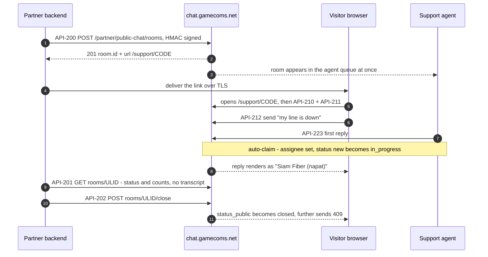
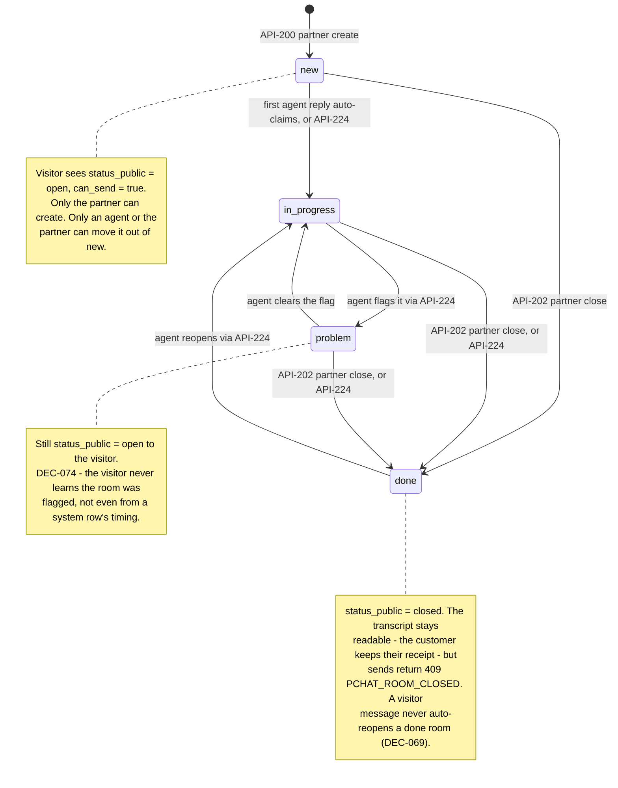
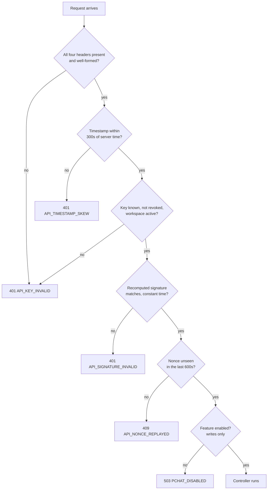
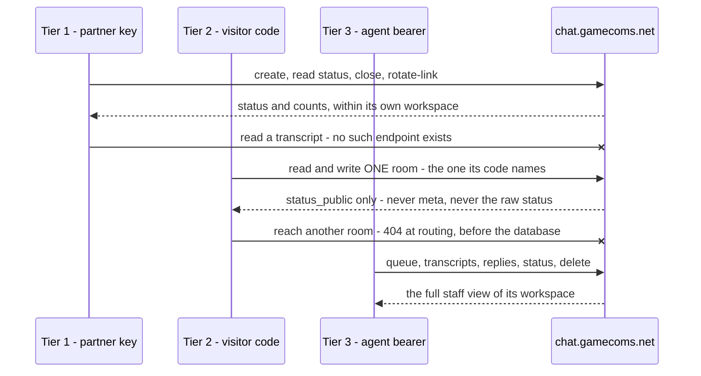

# Public Chat — partner integration guide

Customer-facing live support rooms on Banana Chat. This document is everything a
partner needs to go from "we have an API key" to a live conversation. It is
written against the shipped code, not against a plan.

**Production base URL:** `https://chat.gamecoms.net`
Every path below is absolute and already includes the `/api/v1` prefix.

---

## 1. What this is

Your backend calls one signed endpoint and gets back a URL. You deliver that URL
to your customer. They open it in any browser and talk to a human on the support
team, who sees the conversation in their agent queue. You poll the room's status
and close it when your ticket closes.

**What it is not:**

- **No calls, no meetings.** Chat, files and video *attachments* only. There is
  no audio endpoint, no video-call endpoint, no meeting join.
- **Exactly one visitor per room.** A room is one conversation with one
  customer. There is no group mode and no second participant slot.
- **The partner never reads the transcript.** There is deliberately no partner
  endpoint that returns message bodies, and no partner endpoint that sends a
  message. You get status and counts. That bound is structural, not a
  permission you can be granted.
- **Not a browser API.** Tier 1 is signed with a secret. Sign server-side only.
  Putting the secret in browser JavaScript hands every visitor the ability to
  create rooms in your name.

---

## 2. Quickstart

### 2.1 Get the feature switched on and get a key

Public Chat **ships disabled** (`publicchat.enabled = false`, DEC-071). Two
things have to happen in the Banana Chat Filament admin, both by an admin on the
provider side, not by you:

1. **Settings → `publicchat.enabled` → on.** While it is off, every *write*
   returns `503 PCHAT_DISABLED`. Reads keep working.
2. **Public Chat API Keys → issue a key.** Issuance returns two values:

   | | Shape | Notes |
   |---|---|---|
   | `key_id` | `pck_` + 28 lowercase hex (32 chars) | Public. Safe to log, safe to put in a config file, safe to paste in a support ticket. |
   | `secret` | `pcs_` + 64 lowercase hex (68 chars) | **Shown exactly once, at issuance.** It is stored encrypted under the server's `APP_KEY` (DEC-062) and no endpoint, export or admin screen can read it back — the admin table shows `****` plus the last 4 characters and nothing more. Lose it and the only remedy is to revoke the key and issue a new one. |

   Put the secret straight into your secret manager. Do not email it to
   yourself on the way.

### 2.2 Sign one request

Copy-pasteable, uses only `openssl` and `curl`. Substitute your own key and
secret.

```sh
BASE=https://chat.gamecoms.net
KEY_ID=pck_3f9c2a71b804e6d5c1a97f23bd41
SECRET=pcs_9b6f0c47a2e18d35fb70c91a4e6d28b3f5417ca09de6238b1f0a7c45d9e3b620
PATHINFO=/api/v1/partner/public-chat/rooms

# Write the body ONCE, to a file. Everything downstream uses these exact bytes.
printf '%s' '{"customer_name":"Somchai Jaidee","provider_name":"Siam Fiber","external_ref":"TCK-48213","locale":"th"}' > body.json

TS=$(date +%s)
NONCE=$(openssl rand -hex 12)
BODYHASH=$(openssl dgst -sha256 -hex < body.json | awk '{print $NF}')
CANON=$(printf 'v1\nPOST\n%s\n%s\n%s\n%s' "$PATHINFO" "$TS" "$NONCE" "$BODYHASH")
SIG=v1=$(printf '%s' "$CANON" | openssl dgst -sha256 -hmac "$SECRET" -hex | awk '{print $NF}')

curl -sS -X POST "$BASE$PATHINFO" \
  -H 'Content-Type: application/json' \
  -H "X-PChat-Key: $KEY_ID" \
  -H "X-PChat-Timestamp: $TS" \
  -H "X-PChat-Nonce: $NONCE" \
  -H "X-PChat-Signature: $SIG" \
  --data-binary @body.json
```

`--data-binary @body.json` is not a style choice: it sends the file's bytes
unmodified, which is what you just hashed. (If your editor added a trailing
newline to `body.json`, that newline is part of the body and part of the hash —
which is fine here, because both sides read the same file. It stops being fine
the moment you hash one string and send a different one.)

### 2.3 Read the response, open the link

```json
{
  "room": {
    "id": "01JQ8Z3M9WCT7XK2F5B6H4NRDV",
    "code": "30d6e93bd780a33e5382928166a8c46836b0d7cc01557caed354790fd4c5d1da",
    "status": "new",
    "customer_name": "Somchai Jaidee",
    "provider_name": "Siam Fiber",
    "external_ref": "TCK-48213",
    "locale": "th",
    "assigned_display_name": null,
    "created_at": "2026-09-12T22:00:01+00:00",
    "last_message_at": null,
    "closed_at": null,
    "expires_at": "2026-10-12T22:00:01+00:00"
  },
  "url": "https://chat.gamecoms.net/support/30d6e93bd780a33e5382928166a8c46836b0d7cc01557caed354790fd4c5d1da"
}
```

Store `room.id` — **every later partner call addresses the room by that ULID**,
never by the code. Deliver `url` to your customer over TLS. They open it; the
hosted page does the rest.

### 2.4 Smoke-test your signing *before* the feature is switched on

You do not need the feature enabled to prove your HMAC implementation works.
`GET /api/v1/partner/public-chat/rooms/{id}` (API-201) is a read, and reads
answer while the feature is off. Sign a GET against any well-formed ULID you
made up:

```
GET /api/v1/partner/public-chat/rooms/01JQ8Z3M9WCT7XK2F5B6H4NRDV
```

- `404 PCHAT_ROOM_NOT_FOUND` → **your signature verified.** The request got past
  the HMAC middleware and into the controller, which simply found no such room.
  You are done; wait for the feature to be enabled.
- `401 API_SIGNATURE_INVALID` → your canonical string is wrong. Go to §9.
- `503 PCHAT_DISABLED` on a *create* is also proof the signature verified — the
  feature gate runs inside the controller, after HMAC verification. A bad
  signature never reaches it.
- `401 API_KEY_INVALID` → **your key is not live yet** (not issued, revoked, or
  its workspace is inactive). This says *nothing* about your signature, right or
  wrong: key lookup is step 3 and the signature check is step 4, so an unknown
  key is rejected *before* the MAC is ever computed. Until the admin has issued
  you a key, this is the only answer you can get — a correct canonical string
  and a deliberately corrupted one both come back `API_KEY_INVALID`, and you
  cannot tell them apart from the outside. Get the key first, then use this
  smoke test to prove your signing.

> **The smoke test above only discriminates once you hold an issued key.** If
> you want to validate your canonical string before then, do it offline against
> a known-good vector — see `examples/README.md` §"Proving it yourself", which
> pins a timestamp, nonce and body and gives you the exact expected signature.

---

## 3. How it fits together

### 3.1 Happy path, end to end



### 3.2 Room lifecycle

Internal status is one of `new`, `in_progress`, `done`, `problem`. The visitor
**never sees it** — they see a projected `status_public` of `open` or `closed`.



A room cannot sit in any status other than `new` with a null assignee. That is
the one transition guard, and violating it is `422 PCHAT_INVALID_TRANSITION`
(agent surface only — you cannot hit it from Tier 1).

### 3.3 HMAC verification order — also your 401 debugging guide

Checks run fail-closed, cheapest first. The **first** one that fails is the code
you get back, so read your error code against this chart top-down.



Two consequences worth internalising:

- **The nonce check runs *after* the signature check.** A nonce burned by a
  failed-signature attempt is still usable. Retrying with a corrected signature
  and the *same* nonce works. (This ordering exists so that an attacker
  observing your traffic cannot pre-consume your nonces with unsigned garbage
  and turn all your real requests into 409s.)
- **The feature gate runs last, inside the controller.** So a `503` is positive
  evidence your credentials are good, and a `401` is never "the feature is off".

### 3.4 Three tiers, three trust models



---

## 4. Authentication (Tier 1)

### 4.1 Headers

Exact spelling matters; all four are required on every Tier 1 request.

| Header | Value |
|---|---|
| `X-PChat-Key` | your `key_id`, `pck_` + 28 lowercase hex |
| `X-PChat-Timestamp` | unix seconds, integer, no milliseconds, no ISO strings |
| `X-PChat-Nonce` | unique per request. **16–64 characters from `[A-Za-z0-9_-]`** — `openssl rand -hex 12` is a good generator. A nonce outside that character set or length is rejected as `401 API_KEY_INVALID`, not as a nonce error. |
| `X-PChat-Signature` | `v1=` followed by the lowercase hex HMAC-SHA256 |

### 4.2 The canonical string

Exactly **six lines**, joined with a single `\n`. No trailing newline.

```
line 1   v1                     the literal version tag
line 2   HTTP METHOD            uppercase: POST, GET
line 3   request path           leading slash, INCLUDES /api/v1, EXCLUDES the query string
line 4   the X-PChat-Timestamp value, verbatim
line 5   the X-PChat-Nonce value, verbatim
line 6   lowercase hex sha256 of the RAW request body bytes
```

For a request with no body, line 6 is `sha256("")`:

```
e3b0c44298fc1c149afbf4c8996fb92427ae41e4649b934ca495991b7852b855
```

Then:

```
signature = "v1=" + hex(hmac_sha256(key = secret, message = canonical_string))
```

The secret is used as the HMAC key **as an ASCII string** — `pcs_` prefix
included. Do not hex-decode it, do not strip the prefix.

> ### ⚠️ Sign the exact bytes you put on the wire
>
> Hash the request body **once**, as the byte buffer you are about to send.
> Never re-serialise your JSON between signing and sending.
>
> Key order, whitespace and unicode escaping all change the body hash, and most
> JSON libraries do not promise to produce identical bytes twice. The same
> object serialised two ways:
>
> ```
> {"customer_name":"Somchai Jaidee","provider_name":"Siam Fiber","external_ref":"TCK-48213","locale":"th"}
>   sha256 = 76f721874531c582990e31488c22e4aa9af0a9dfcb016f5f6001c56ce6f9c088
>
> {"external_ref": "TCK-48213", "customer_name": "Somchai Jaidee", "locale": "th", "provider_name": "Siam Fiber"}
>   sha256 = 616ce47272345d8044f0cd3246e8115e7ed2a489fe73535f1806857f86ad455b
> ```
>
> Same data, different bytes, different signature, `401
> API_SIGNATURE_INVALID`. Because most HTTP clients happen to be deterministic
> most of the time, this failure is usually *intermittent* — which is exactly
> what makes it the single most common integration bug in this class of API.
> Build the byte buffer first; hash that buffer; send that buffer.
>
> The same applies to non-ASCII text. `"ใจดี"` sent as raw UTF-8 and the same
> string sent as `"ใจดี"` are different bytes and hash
> differently. Whichever your client emits is fine — as long as you hashed the
> bytes it emitted.

### 4.3 A fully worked example

Every value below is real and cross-checked against the server's own signing
routine. You can reproduce it exactly.

**Credentials** (example only — not live):

```
key_id  pck_3f9c2a71b804e6d5c1a97f23bd41
secret  pcs_9b6f0c47a2e18d35fb70c91a4e6d28b3f5417ca09de6238b1f0a7c45d9e3b620
```

**Request**

```http
POST /api/v1/partner/public-chat/rooms HTTP/1.1
Host: chat.gamecoms.net
Content-Type: application/json
X-PChat-Key: pck_3f9c2a71b804e6d5c1a97f23bd41
X-PChat-Timestamp: 1789250400
X-PChat-Nonce: b7f3c1a94e2d80561f7a3c9d
X-PChat-Signature: v1=c07bbb0302aa48cb885544f979bddb2cc17b4dbb2958ccd1174b767d88bde3d7

{"customer_name":"Somchai Jaidee","provider_name":"Siam Fiber","external_ref":"TCK-48213","locale":"th"}
```

The body is 104 bytes. Its sha256:

```
76f721874531c582990e31488c22e4aa9af0a9dfcb016f5f6001c56ce6f9c088
```

**The canonical string**, as literal bytes:

```
v1
POST
/api/v1/partner/public-chat/rooms
1789250400
b7f3c1a94e2d80561f7a3c9d
76f721874531c582990e31488c22e4aa9af0a9dfcb016f5f6001c56ce6f9c088
```

and the same thing with the separators made visible, so there is no ambiguity
about the trailing byte:

```
v1\nPOST\n/api/v1/partner/public-chat/rooms\n1789250400\nb7f3c1a94e2d80561f7a3c9d\n76f721874531c582990e31488c22e4aa9af0a9dfcb016f5f6001c56ce6f9c088
```

**Resulting signature**

```
v1=c07bbb0302aa48cb885544f979bddb2cc17b4dbb2958ccd1174b767d88bde3d7
```

A second worked example, this time a GET with no body — note line 3 carries the
full path with the ULID, and line 6 is the empty-string hash:

```
v1
GET
/api/v1/partner/public-chat/rooms/01JQ8Z3M9WCT7XK2F5B6H4NRDV
1789250461
4d9a02f7c6b13e85a0d47f21
e3b0c44298fc1c149afbf4c8996fb92427ae41e4649b934ca495991b7852b855
```

```
v1=e9f6811c80019df55825a8670ba6058b8d0575fd691c1dfc4f60216f8a99535d
```

> **Do not replay these examples against production.** `1789250400` is
> 2026-09-12 22:00:00 UTC. Sent today it is far outside the ±300s window and
> will return `401 API_TIMESTAMP_SKEW`. Use them to unit-test your signing
> function offline, with the timestamp pinned; use `date +%s` on the wire.

### 4.4 Reference implementations

**Node.js**

```js
const crypto = require('node:crypto');

function signedHeaders({ keyId, secret, method, pathInfo, rawBody }) {
  const ts = Math.floor(Date.now() / 1000).toString();
  const nonce = crypto.randomBytes(12).toString('hex');   // 24 chars, in [a-f0-9]
  const bodyHash = crypto.createHash('sha256').update(rawBody).digest('hex');
  const canonical = ['v1', method.toUpperCase(), pathInfo, ts, nonce, bodyHash].join('\n');
  const sig = crypto.createHmac('sha256', secret).update(canonical).digest('hex');
  return {
    'X-PChat-Key': keyId,
    'X-PChat-Timestamp': ts,
    'X-PChat-Nonce': nonce,
    'X-PChat-Signature': `v1=${sig}`,
  };
}

// Serialise ONCE. Sign this buffer, send this buffer, never JSON.stringify twice.
const rawBody = Buffer.from(JSON.stringify({
  customer_name: 'Somchai Jaidee',
  provider_name: 'Siam Fiber',
  external_ref: 'TCK-48213',
}), 'utf8');

async function createRoom() {
  const pathInfo = '/api/v1/partner/public-chat/rooms';
  return fetch('https://chat.gamecoms.net' + pathInfo, {
    method: 'POST',
    headers: {
      'Content-Type': 'application/json',
      ...signedHeaders({ keyId: KEY_ID, secret: SECRET, method: 'POST', pathInfo, rawBody }),
    },
    body: rawBody,     // the SAME buffer that was hashed
  });
}
```

**PHP**

```php
$pathInfo = '/api/v1/partner/public-chat/rooms';
$rawBody  = json_encode([
    'customer_name' => 'Somchai Jaidee',
    'provider_name' => 'Siam Fiber',
    'external_ref'  => 'TCK-48213',
], JSON_UNESCAPED_UNICODE);           // serialise once, into a variable

$ts    = (string) time();
$nonce = bin2hex(random_bytes(12));

$canonical = implode("\n", [
    'v1', 'POST', $pathInfo, $ts, $nonce, hash('sha256', $rawBody),
]);

$headers = [
    'Content-Type: application/json',
    'X-PChat-Key: '.$keyId,
    'X-PChat-Timestamp: '.$ts,
    'X-PChat-Nonce: '.$nonce,
    'X-PChat-Signature: v1='.hash_hmac('sha256', $canonical, $secret),
];
// ... then send $rawBody verbatim. Do NOT json_encode the array a second time.
```

**Python**

```python
import hashlib, hmac, json, secrets, time, requests

path_info = "/api/v1/partner/public-chat/rooms"
raw = json.dumps({
    "customer_name": "Somchai Jaidee",
    "provider_name": "Siam Fiber",
    "external_ref": "TCK-48213",
}, separators=(",", ":")).encode("utf-8")      # bytes, built once

ts = str(int(time.time()))
nonce = secrets.token_hex(12)
canonical = "\n".join(
    ["v1", "POST", path_info, ts, nonce, hashlib.sha256(raw).hexdigest()]
)
sig = hmac.new(SECRET.encode(), canonical.encode(), hashlib.sha256).hexdigest()

requests.post(
    "https://chat.gamecoms.net" + path_info,
    data=raw,                                   # data=, never json=
    headers={
        "Content-Type": "application/json",
        "X-PChat-Key": KEY_ID,
        "X-PChat-Timestamp": ts,
        "X-PChat-Nonce": nonce,
        "X-PChat-Signature": "v1=" + sig,
    },
)
```

Note the Python example uses `data=raw`, not `json=`. `json=` would re-serialise
the dict and produce different bytes from the ones you hashed.

---

## 5. Endpoint reference

### 5.1 Tier 1 — partner (HMAC)

All four routes are under `/api/v1/partner/public-chat`. **`{id}` must be a
ULID** — the room's `id`, never its 64-hex `code`. A code in `{id}` is a plain
`404 NOT_FOUND` from the router. That restriction is deliberate: a `{code}`
route would put the visitor's credential into your outbound HTTP logs, every
intermediate proxy and our own access logs on every status poll.

Responses are top-level objects (`{"room": …}`), not wrapped in a `data` envelope.
All four send `Cache-Control: no-store`.

---

#### API-200 · `POST /api/v1/partner/public-chat/rooms`

Create a conversation. Rate limit: `pchat-create`, 60/min per key.

Request body:

| Field | Type | Required | Rules |
|---|---|---|---|
| `customer_name` | string | yes | 1–120 chars. Your customer's name, shown to them and to the agent. |
| `provider_name` | string | yes | 1–120 chars. Your brand, as it appears to the customer. |
| `external_ref` | string | no | ≤120 chars. Your own ticket id. **Supplying it makes create idempotent.** |
| `locale` | string | no | Exactly `th` or `en`. Omitted or `null` defaults to `th`; **any other value is `422 VALIDATION_FAILED`**, not a silent fallback. |
| `meta` | object | no | Free-form. ≤8192 bytes once JSON-encoded. Partner-private: stored, visible to support staff and admins, **never served to the visitor**. |

`customer_name`, `provider_name` and `external_ref` are sanitised at ingest:
control characters, zero-width characters and bidi overrides are stripped, runs
of whitespace collapse to a single space, and the result is truncated to 120
characters. A `customer_name` or `provider_name` that is empty or whitespace-only
after that is `422 VALIDATION_FAILED`. Note the truncation is silent — send names
that already fit.

Responses:

- **`201`** — created. Body as shown in §2.3: `{room, url}`.
- **`200`** — *idempotent replay*. You sent an `external_ref` that already
  exists in this workspace. Same room id, same code, same url. **This is a
  success, not an error** — retry your create freely. (The unique index
  deliberately ignores which API key created the room, so a retry after a key
  rotation still replays instead of creating a duplicate.)
- **`422 VALIDATION_FAILED`** — a field failed validation, or `meta` exceeded
  8 KB. `details.fields` names the offenders. **One exception:** when
  `customer_name` or `provider_name` is rejected for being empty *after*
  sanitisation, the failure is reported under the literal key `name` rather
  than the real field name — do not assume every `details.fields` key matches
  a field you sent.
- **`503 PCHAT_DISABLED`** — feature switched off. Carries `Retry-After: 60`.
  Checked **before** body validation, so a disabled feature returns 503 even if
  your body is also malformed.
- **`401` / `409` / `429`** — see §6 and §7.

`meta` is capped at 8192 bytes of PHP's `json_encode` output, which escapes
non-ASCII as `\uXXXX`. Thai text therefore costs roughly 6 bytes per character
against that budget, not 3.

---

#### API-201 · `GET /api/v1/partner/public-chat/rooms/{id}`

Status read. Rate limit: `pchat-partner`, 120/min per key.

**No request body** (line 6 of the canonical string is the empty-string hash).
**Answers even while the feature is disabled** — a partner polling ticket status
must not break because an admin paused new conversations.

`200` response:

```json
{
  "room": {
    "id": "01JQ8Z3M9WCT7XK2F5B6H4NRDV",
    "code": "30d6e93bd780a33e5382928166a8c46836b0d7cc01557caed354790fd4c5d1da",
    "status": "in_progress",
    "customer_name": "Somchai Jaidee",
    "provider_name": "Siam Fiber",
    "external_ref": "TCK-48213",
    "locale": "th",
    "assigned_display_name": "Siam Fiber (napat)",
    "created_at": "2026-09-12T22:00:01+00:00",
    "last_message_at": "2026-09-12T22:04:38+00:00",
    "closed_at": null,
    "expires_at": "2026-10-12T22:00:01+00:00",
    "message_count": 11
  }
}
```

- `status` is the **raw** status: `new`, `in_progress`, `done` or `problem`. You
  own the ticket, so you get the real value, including `problem`. Your customer
  never does.
- `assigned_display_name` is the external form only — `"provider name
  (username)"` — or `null` while unassigned. No user id, no internal display
  name.
- `message_count` counts non-deleted messages, and is returned **only here** —
  API-200, 202 and 203 omit it.
- **No message bodies, ever.** There is no query parameter that adds them.

Errors: `404 PCHAT_ROOM_NOT_FOUND` (unknown id, *or* a room belonging to another
workspace — indistinguishable on purpose), `410 PCHAT_LINK_EXPIRED` (the room
was deleted; `details.expires_at` is included), `401`/`409`/`429`.

---

#### API-202 · `POST /api/v1/partner/public-chat/rooms/{id}/close`

Close the ticket. Rate limit: `pchat-partner`, 120/min per key. No request body.

Sets `status = done`, stamps `closed_at`, and appends a system row to the
transcript. The visitor keeps **read-only** access: the page still loads and the
full transcript is still there — they keep their receipt — but any send returns
`409 PCHAT_ROOM_CLOSED`.

`200` returns `{"room": {...}}` with the same field set as API-200 (no
`message_count`).

Errors: `409 PCHAT_ROOM_CLOSED` if it is already `done` — a double-close is
treated as a partner bug worth reporting, not a silent no-op; `404`, `410`,
`503 PCHAT_DISABLED`, `401`/`429`.

---

#### API-203 · `POST /api/v1/partner/public-chat/rooms/{id}/rotate-link`

Mint a new visitor code. Rate limit: `pchat-partner`, 120/min per key. No
request body.

This is the remedy for a leaked link short of ending the conversation. `200`
returns `{"room": {...}, "url": "..."}` with the **new** code and url.

Three bounds stated plainly:

1. **The old code stops resolving immediately.** Every Tier 2 route 404s for it
   at once.
2. **You must re-deliver the new URL.** A rotation the customer never receives
   just locks them out.
3. **An already-connected socket is not evicted.** The realtime channel is keyed
   by the room ULID, not by the code — which is the same property that keeps the
   credential out of every WebSocket frame. Rotation stops all *new* access with
   the old link; it does not kill a live one. If you need the conversation to
   end, close it (API-202).

Rotation also resets `expires_at` to now + the configured link TTL. Messages,
status and assignment are untouched.

Errors: `409 PCHAT_ROOM_CLOSED` (you cannot rotate a closed room), `404`, `410`,
`503 PCHAT_DISABLED`, `401`/`429`.

---

#### 5.1.1 · Expiry, and the customer who never opens the link

Not every room gets used. A link you deliver may simply never be clicked, and
the behaviour then is asymmetric in a way worth planning for.

`expires_at` is stamped at create as now + the link TTL (a provider-admin
setting, **30 days** by default) and is reset by API-203 rotate-link. It is
enforced **lazily, at request time** — nothing runs on a schedule to sweep
expired rooms — which produces two different views of the same room:

| | Once `expires_at` has passed |
|---|---|
| **Visitor** (Tier 2) | *Every* route returns `410 PCHAT_LINK_EXPIRED`, channel auth included, so a live socket cannot outlive the link. The link is dead. |
| **You** (API-201) | Still `200`. The room is **not** auto-closed, auto-deleted or moved out of `new`. `status` stays exactly what it was and `closed_at` stays `null`. |

So a room whose customer never showed up sits at `status: "new"`,
`last_message_at: null`, `message_count: 0` **forever**, with an `expires_at` in
the past. Nothing will ever change it on its own.

**What that means for your integration:**

- **Do not wait for a status change that will never come.** If you drive your
  ticket off `status`, add your own timeout. Compare `expires_at` against now,
  or age the room off `created_at` with `last_message_at: null` as the "never
  engaged" signal.
- **`expires_at` in the past + `status: "new"` is the signature of an unused
  link.** Treat it as abandoned, and call **API-202 close** yourself to reconcile
  your ticket and stop polling. (Close still works on an expired room — the
  partner tier does not enforce expiry.)
- **A `410` on API-201 means something different**: the room was *deleted* on
  the provider side, not merely expired. Expiry alone never changes what API-201
  returns. Stop polling that id; it is gone.
- **To give a late customer another chance**, call API-203 rotate-link — it
  mints a new code *and* pushes `expires_at` out by a fresh TTL — then
  re-deliver. Rotating is cheaper and keeps the ticket's history; creating a
  second room with the same `external_ref` will just replay the first one.

---

### 5.2 Tier 2 — visitor (unauthenticated)

**The hosted page at `https://chat.gamecoms.net/support/<code>` is the supported
path.** It is a finished chat UI with realtime, uploads, typing indicators and
localisation, and it calls exactly the endpoints below. Document them here so
you *can* build your own widget — but if you do, you own every future change to
this tier.

There is **no API key and no bearer token** on this tier. The 64-hex `code` is
the credential. Every route is constrained to `[a-f0-9]{64}`, so a malformed
code is a `404 NOT_FOUND` from the router before it reaches the database.
Every response carries `Cache-Control: no-store` and `Referrer-Policy:
no-referrer`.

| ID | Method | Path (under `/api/v1/public-chat/{code}`) | Limit |
|---|---|---|---|
| API-210 | GET | *(root)* | 120/min |
| API-211 | GET | `/messages` | 120/min |
| API-212 | POST | `/messages` | 20/min |
| API-213 | POST | `/uploads` | 10/min |
| API-214 | POST | `/uploads/{attachment}/complete` | 10/min |
| API-215 | POST | `/broadcasting/auth` | 120/min |
| API-216 | POST | `/typing` | 20/min |

**API-210 — room state.** Answers `200` even while the feature is off, so the
page can show a calm "support is temporarily unavailable" banner over a still
readable transcript rather than an error page.

```json
{
  "room": {
    "id": "01JQ8Z3M9WCT7XK2F5B6H4NRDV",
    "customer_name": "Somchai Jaidee",
    "provider_name": "Siam Fiber",
    "status_public": "open",
    "locale": "th",
    "created_at": "...", "expires_at": "...", "last_seq": 11
  },
  "viewer": null,
  "feature_enabled": true,
  "can_send": true,
  "closed_reason": null
}
```

- `status_public` is `open` or `closed` only. `new`, `in_progress` **and
  `problem`** all project to `open`; only `done` is `closed`.
- `room.id` is returned because the page needs the ULID to subscribe to the
  realtime channel `private-public-chat.{id}`. Note the channel is keyed by the
  ULID, never by the code.
- `viewer` is `null` for a real visitor, or `{"kind":"member","display_name":…}`
  if a signed-in staff member opened the link.
- `can_send` = feature enabled **and** not expired **and** `status_public` is
  `open` **and** the viewer is not signed in.
- `closed_reason` is `"disabled"`, `"done"`, or `null`.
- `meta` and the raw `status` are **not present and never will be**.

**API-211 — transcript / catch-up.** Query: `after_seq` (integer ≥0),
`limit` (1–100, default 100). Returns `{"messages": [...], "last_seq": N}`.
Also a read; answers while the feature is off. Poll it every ~5s as a fallback
when the socket will not connect.

Each message: `id`, `seq`, `sender_kind` (`visitor` | `agent` | `system`),
`display_name`, `type`, `body`, `system_event`, `system_meta`, `reply_to`,
`attachments`, `deleted`, `created_at`. Agent messages carry `display_name` in
the form `"provider name (username)"`, snapshotted at write time so a later
rename does not rewrite history. Deleted messages stay in the list as tombstones
with `deleted: true` and a null body.

Advance your cursor from the highest `seq` you have **received**; do not compare
against `room.last_seq`. Permanent gaps in the visitor's `seq` sequence are
normal and expected — some internal transitions are deliberately not shown.

**API-212 — send.** Body: `client_message_id` (**required**, must be a UUID —
it is the idempotency key), `body` (optional string), `reply_to_message_id`
(optional ULID, must be in this room), `attachment_ids` (optional array of
ULIDs, max 10). `201` on write, `200` on an idempotent replay of the same
`client_message_id`. Returns `{"message": {...}}`.
Errors: `422 MSG_EMPTY` (no body and no attachments), `422 MSG_TOO_LONG`
(`details.max_length`), `422 MSG_REPLY_INVALID`, `422 MSG_ATTACHMENT_INVALID`
(unknown, foreign, already-used or duplicated attachment id),
`409 PCHAT_ROOM_CLOSED`, `403 PCHAT_SIGNED_IN`, `410 PCHAT_LINK_EXPIRED`,
`503 PCHAT_DISABLED`.

**API-213 / API-214 — uploads.** Two steps. `POST /uploads` with `kind`
(`image` | `video` | `file` — `avatar` is rejected), `filename`, `mime_type`,
`size_bytes`, optional `sha256`. `201` returns
`{"attachment": {"id", "status"}, "upload_url": "..."}`, or for large files
`{"attachment": {...}, "multipart": {"upload_id", "part_size", "part_urls"}}`
instead of `upload_url`. PUT the bytes to the presigned URL(s), then
`POST /uploads/{attachment}/complete` — with `parts: [{part_number, etag}]` for
a multipart session, or an empty body for a single PUT. Then pass the attachment
id in `attachment_ids` on API-212.
Errors include `422 MEDIA_TYPE_BLOCKED`, `422 MEDIA_TOO_LARGE`,
`422 MEDIA_MIME_MISMATCH`, `422 MEDIA_UPLOAD_MISSING`, `422 MEDIA_SIZE_MISMATCH`.
The public-chat surface additionally refuses the whole HTML/markup family by
name, regardless of admin settings.

**API-215 — realtime channel auth.** `POST` with `socket_id` and `channel_name`.
The **only** channel name it will sign is `private-public-chat.{room.id}` for
the room that code names; anything else is `404 PCHAT_ROOM_NOT_FOUND`.

**API-216 — typing.** No body. `202 {"ok": true}`.

**One trap if you build your own widget:** do not attach an `Authorization`
header to Tier 2 requests. If a valid staff bearer is present, writes return
`403 PCHAT_SIGNED_IN` (reads are served normally); if an *invalid or expired*
bearer is present, you get `401 AUTH_TOKEN_INVALID` on every call, including
reads. A missing header is the correct state for a visitor.

### 5.3 Tier 3 — agent

Support staff only. Existing bearer authentication plus an `X-Workspace-Id`
header; a partner cannot call these and does not need to. Listed for
completeness:

`GET /public-chat/rooms` (API-220, the queue) · `GET /public-chat/summary`
(API-227) · `GET /public-chat/rooms/{id}` (API-221) ·
`PATCH /public-chat/rooms/{id}` (API-224, status and assignment) ·
`GET /public-chat/rooms/{id}/messages` (API-222) ·
`POST /public-chat/rooms/{id}/messages` (API-223) ·
`POST /public-chat/rooms/{id}/uploads` (API-225) ·
`POST /public-chat/rooms/{id}/read` (API-228) ·
`POST /public-chat/rooms/{id}/typing` ·
`DELETE /public-chat/messages/{id}` (API-226).

The one Tier 3 behaviour that shows up in your data: **the first agent reply
auto-claims the room** — assignee is set, `claimed_at` and `first_response_at`
are stamped, and `status` moves `new → in_progress`. You will observe that
through API-201 without anyone calling API-224.

---

## 6. Errors

Every error uses the standard envelope:

```json
{
  "error": {
    "code": "API_SIGNATURE_INVALID",
    "message": "ลายเซ็นคำขอไม่ถูกต้อง",
    "details": {},
    "request_id": "01JQ8Z3M9WCT7XK2F5B6H4NRDV"
  }
}
```

> **Branch on `code`. Never on `message`.**
> `message` is human-facing copy and **is frequently Thai**. It is not part of
> the contract and can change without notice. `code` is stable.

`request_id` is also returned as the `X-Request-Id` response header, and is
echoed if you send your own. Quote it when you report a problem.

| Code | HTTP | What it means | What to do |
|---|---|---|---|
| `API_KEY_INVALID` | 401 | A header is missing or malformed, the `key_id` is unknown, the key is revoked, or its workspace is inactive. One code for all of them, deliberately — a prober must not be able to enumerate key ids. | Check all four headers are present and correctly spelled; check `key_id` matches `pck_` + 28 hex; check your nonce is 16–64 chars of `[A-Za-z0-9_-]`; check the key has not been revoked. |
| `API_TIMESTAMP_SKEW` | 401 | `\|now − timestamp\| > 300s`. `details` carries `skew_seconds`, `max_skew_seconds` and `server_time`. | Fix your clock (NTP). Use `server_time` to measure the offset. Never hardcode a timestamp. |
| `API_SIGNATURE_INVALID` | 401 | The recomputed HMAC did not match. Also what you get for a malformed signature header. | §9.2. Almost always the body hash or the path line. |
| `API_NONCE_REPLAYED` | 409 | This nonce was already used with this key inside the last 600s. | Generate a fresh nonce per request. Never retry with the same nonce after a *success* — but retrying after a 401 signature failure is fine, that nonce was not burned. |
| `PCHAT_DISABLED` | 503 | The feature is switched off. Write paths only. `Retry-After: 60` and `details.retry_after_seconds`. | Retry on that schedule. Ask the provider's admin to enable it. Your credentials are fine — this code proves it. |
| `PCHAT_ROOM_NOT_FOUND` | 404 | No such room for this key's workspace. Also returned for another workspace's room, and by API-215 for a channel name that is not this room's. | Check you are sending `room.id` (a ULID) and not the code. |
| `PCHAT_ROOM_CLOSED` | 409 | The room is `done`. Returned by API-202 on a double close, by API-203 on a closed room, and by visitor sends. | Treat a double-close as already-closed. To reopen, an agent uses API-224. |
| `PCHAT_LINK_EXPIRED` | 410 | Past `expires_at`, or soft-deleted. `details.expires_at`. Every Tier 2 route answers this, including channel auth, so a socket cannot outlive its link. (A *rotated-away* code is **not** this — it is `404 PCHAT_ROOM_NOT_FOUND`, because the old code no longer matches any room.) | Create a new room (API-200) or rotate (API-203) and re-deliver. |
| `PCHAT_INVALID_TRANSITION` | 422 | A room may not leave `new` while unassigned, and may not be unassigned while not `new`. Agent surface (API-224) only. | Not reachable from Tier 1. |
| `PCHAT_SIGNED_IN` | 403 | A signed-in Banana Chat member tried to **write** on the visitor tier. | Open the room from the staff Public Chat queue instead. If your own widget hit this, stop sending an `Authorization` header. |
| `VALIDATION_FAILED` | 422 | A field failed validation. `details.fields` is a map of field → messages. Also covers `meta` over 8 KB. | Fix the field named in `details.fields`. |
| `MSG_EMPTY` / `MSG_TOO_LONG` / `MSG_REPLY_INVALID` / `MSG_ATTACHMENT_INVALID` | 422 | Visitor/agent message problems (§5.2, API-212). | — |
| `MEDIA_TYPE_BLOCKED` / `MEDIA_TOO_LARGE` / `MEDIA_MIME_MISMATCH` / `MEDIA_UPLOAD_MISSING` / `MEDIA_SIZE_MISMATCH` | 422 | Upload problems (§5.2, API-213/214). | — |
| `AUTH_TOKEN_INVALID` | 401 | An `Authorization` header was present on Tier 2 but the token is invalid or expired. | Remove the header. A visitor sends no bearer. |
| `RATE_LIMITED` | 429 | A named limiter tripped. `details.retry_after_seconds` and the `Retry-After` header. | §7. |
| `NOT_FOUND` | 404 | **Routing** 404 — the URL never matched a route. A 64-hex code where a ULID belongs, a non-64-hex code on a Tier 2 path, or a typo'd path. | Note this is *not* `PCHAT_ROOM_NOT_FOUND`. Getting `NOT_FOUND` where you expected the `PCHAT_` code means your **URL** is wrong, not your room id. |
| `HTTP_ERROR` | various | Generic HTTP failure on an API path. | Retry; report with the `request_id`. |

---

## 7. Rate limits

Every limiter is named and independently keyed. The five below are the ones you
can reach; Tier 3 has two more of its own, keyed per agent user, which only
support staff can trip. Exceeding one returns `429` with
`RATE_LIMITED`, a `Retry-After` header and `details.retry_after_seconds`.

| Limiter | Applies to | Limit | Keyed by |
|---|---|---|---|
| `pchat-create` | API-200 | **60 / min** | the `X-PChat-Key` header value |
| `pchat-partner` | API-201, 202, 203 | **120 / min** | the `X-PChat-Key` header value |
| `pchat-visitor-read` | API-210, 211, 215 | **120 / min** | the room `code` |
| `pchat-visitor-write` | API-212, 216 | **20 / min** | the room `code` |
| `pchat-visitor-upload` | API-213, 214 | **10 / min** | the room `code` |

Tier 1 limits are **per key**, not per IP — so calling from a fleet of servers
behind one key shares one budget, and one busy partner cannot exhaust another's.
Tier 2 limits are **per room code**, so one noisy visitor cannot affect anyone
else's conversation.

One sharp edge worth knowing: the rate limiter runs **before** signature
verification, and keys on the `X-PChat-Key` header exactly as sent. Requests
that fail with a 401 therefore still consume your per-key budget. A broken
signing loop will produce 401s that eventually turn into 429s — fix the 401s
and the 429s go away.

There is no documented burst allowance. Poll API-201 on a schedule — once every
30–60 seconds per open ticket is ample — rather than in a tight loop.

---

## 8. Security

**The visitor link is a bearer capability.** Anyone holding
`https://chat.gamecoms.net/support/<code>` *is* the visitor for that one
conversation: they can read the whole transcript and write to it. There is no
device binding and no second factor — deliberately, so the customer can forward
the link from desktop to phone or open it from their own email. Treat the URL
exactly like a password:

- Deliver it over TLS, to the customer, directly.
- **Never** put it in an email *subject*, an SMS preview, an analytics URL, a
  referrer, a query string, a JS error report, or any log you keep. (Our own
  edge does not log it: `/support/` and `/api/v1/public-chat/` run with access
  logging off, `no-store` and `no-referrer`.)
- The code never appears in a query string or a channel name on our side. Keep
  it that way on yours — it belongs in the URL **path** only.
- Its exposure is bounded by `expires_at` (the link TTL, set by the provider's
  admin, 30 days by default) and by your ability to rotate it.
- If you suspect a leak, call **API-203 rotate-link** and re-deliver. Remember
  it does not evict an already-connected socket — close the room (API-202) if
  you need the conversation to stop now.

**The secret is shown once.** At issuance, and never again — it is encrypted at
rest under the server's `APP_KEY` and no endpoint or admin screen can read it
back. Store it in a secret manager, not in source control, not in a CI log.
If you lose it, or it leaks, ask the provider's admin to **revoke** the key and
issue a new one; a revoked key returns `401 API_KEY_INVALID` immediately.
Rotating keys is safe mid-flight: `external_ref` idempotency deliberately
ignores which key created a room, so a retry across a rotation replays rather
than duplicating.

**`key_id` is public.** `pck_…` is safe to log, safe to put in config, safe to
quote in a support ticket. Only `pcs_…` is sensitive.

**Sign server-side only.** Tier 1 must never be called from browser JavaScript,
a mobile app binary, or anything else a customer can inspect. There is no CORS
allowance for it and no browser-safe variant.

**Choose what goes in `meta`.** It is partner-private and never served to the
visitor — but it *is* visible to support staff and to provider admins in the
admin panel, and it is retained with the room. Put a ticket id and a plan code
in it; do not put a national ID number or a card number in it.

**`customer_name` and `provider_name` are attacker-controlled** from our side's
point of view — they come from your system. They are sanitised at ingest and
rendered as plain text everywhere. Do not rely on them carrying markup.

---

## 9. Troubleshooting

### 9.1 Every single request returns 401

Work the chart in §3.3 top-down; the code tells you how far you got.

- **`API_KEY_INVALID` on everything** — you are failing at step 1 or 3. Check,
  in this order: all four headers present and spelled exactly
  (`X-PChat-Key`, `X-PChat-Timestamp`, `X-PChat-Nonce`, `X-PChat-Signature`);
  `key_id` is `pck_` + exactly 28 lowercase hex characters; timestamp is bare
  integer seconds (not milliseconds, not ISO-8601); **nonce is 16–64 characters
  of `[A-Za-z0-9_-]`** — a UUID *with* dashes is fine, a base64 nonce with `+`,
  `/` or `=` is not, and this is a surprisingly common cause; the key has not
  been revoked.
- **`API_SIGNATURE_INVALID` on everything** — you got past the key lookup, so
  the key is good and the clock is good. It is the canonical string. See §9.2.
- **`AUTH_TOKEN_INVALID`** — you are on Tier 2 and sending a stale
  `Authorization` header. Remove it.

### 9.2 Signature failures — the four usual causes

In rough order of how often they happen:

1. **The body hash is over different bytes than you sent.** You serialised your
   JSON twice, or your HTTP client re-encoded it. Fix: build a byte buffer once,
   hash *that buffer*, send *that buffer*. See the call-out in §4.2.
2. **Line 3 is wrong.** It is `getPathInfo()`: leading slash, **includes
   `/api/v1`**, **excludes** the query string, no host, no trailing slash. It is
   `/api/v1/partner/public-chat/rooms`, not
   `partner/public-chat/rooms`, not
   `https://chat.gamecoms.net/api/v1/partner/public-chat/rooms`, and not
   `/api/v1/partner/public-chat/rooms?foo=bar`.
3. **A GET signed with the wrong body hash.** No body means line 6 is
   `sha256("")` = `e3b0c442…7852b855`, not an empty string and not omitted.
   The canonical string always has exactly six lines.
4. **The joiner or the case.** Single `\n` between lines (not `\r\n`), no
   trailing newline, method uppercase, signature hex lowercase, prefixed with
   `v1=`. The secret is the HMAC key as an ASCII string including its `pcs_`
   prefix.

**How to isolate it:** unit-test your signing function against §4.3 with the
timestamp and nonce pinned. If you reproduce
`v1=c07bbb0302aa48cb885544f979bddb2cc17b4dbb2958ccd1174b767d88bde3d7`, your
signer is correct and the bug is between signing and sending — i.e. cause #1.

### 9.3 Intermittent 401s — most requests work, some do not

This is cause #1 above, nearly every time. A serialiser whose key order or
unicode escaping varies with input (a hash map with non-deterministic iteration,
a field that is sometimes absent, a name that sometimes contains Thai) produces
a body hash that only sometimes matches. It looks like a flaky network and is
not.

Second possibility: **clock drift**. If your host's clock is wandering near the
±300s boundary, requests fail as the drift crosses it. `API_TIMESTAMP_SKEW`
rather than `API_SIGNATURE_INVALID` identifies this, and `details.server_time`
lets you measure the offset exactly. Run NTP.

### 9.4 503 PCHAT_DISABLED

The feature is switched off by the provider's admin. **Your credentials are
fine** — this response is only reachable *after* the signature verified, so
treat it as a successful authentication.

Writes stop; reads survive. API-201 keeps answering, so your status polling
should not break. Honour `Retry-After: 60` rather than hot-looping, and ask the
provider's admin to enable `publicchat.enabled` in the Filament admin Settings
page. Nothing is lost while it is off: no conversation is closed, expired,
reassigned or deleted, and re-enabling resumes mid-conversation.

### 9.5 409

Two very different causes — check the `code`:

- **`API_NONCE_REPLAYED`** — you reused a nonce with this key within 600
  seconds. Usually a retry loop that regenerates the timestamp but not the
  nonce, or a nonce derived from something non-unique (a ticket id, a
  request-per-second counter). Generate 12 random bytes per *attempt*. Note that
  a 401-signature failure does **not** burn the nonce, so retrying a
  signature-corrected request with the same nonce is safe.
- **`PCHAT_ROOM_CLOSED`** — the room is already `done`. Closing twice, or trying
  to rotate a closed link. Both are no-ops you can safely treat as success for
  the close case.

### 9.6 429

Check `details.retry_after_seconds` and back off. Then check which limiter you
are hitting (§7): 60/min for creates, 120/min for everything else on Tier 1,
keyed by your `key_id` across your whole fleet.

If you see 429s alongside 401s, look at the 401s first — failed-signature
requests consume the per-key budget before verification, so a broken signer can
present as a rate-limit problem.

### 9.7 404 where you expected a room

- **`"code": "NOT_FOUND"`** — the URL did not match any route. On Tier 1 the
  usual cause is putting the 64-hex `code` into `{id}`, which only accepts a
  ULID. On Tier 2 it is a code that is not exactly 64 lowercase hex characters.
- **`"code": "PCHAT_ROOM_NOT_FOUND"`** — the route matched but no such room
  exists for your key's workspace. Another workspace's room id looks identical
  to a non-existent one, on purpose. Also what a *rotated-away* visitor code
  returns on Tier 2 — the old link simply does not exist any more.

### 9.8 The visitor says the page says "temporarily unavailable"

`feature_enabled: false` — see §9.4. The transcript is still readable; only
sending is blocked.

---

## Reference

The `DEC-xxx` and `FR-PCHAT-xxx` markers throughout this document are our
internal decision and requirement ids. Quote them — along with the `request_id`
from the failing response — when you raise anything with us, and we can go
straight to the relevant code and tests.

An OpenAPI description of these endpoints is available on request. Where it and
this document disagree, **this document matches the running service**; see the
notes in §5.1 about response envelopes.
